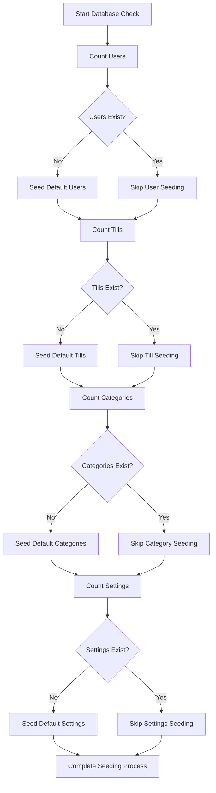

# Conditional Seeding Mechanism Documentation

## Table of Contents
1. [Introduction](#introduction)
2. [Problem Statement](#problem-statement)
3. [Solution Overview](#solution-overview)
4. [Conditional Seeding Implementation](#conditional-seeding-implementation)
5. [Environment-Specific Behaviors](#environment-specific-behaviors)
6. [Migration Procedures](#migration-procedures)
7. [Best Practices](#best-practices)
8. [Troubleshooting](#troubleshooting)

## Introduction

This document explains the new conditional seeding mechanism implemented in the TotalEVO POS system. The mechanism ensures that essential data is preserved during schema updates while still allowing for proper initialization in new environments.

## Problem Statement

Previously, the POS system faced challenges during schema updates and deployments:

1. **Data Loss Risk**: Full database seeding during deployments could overwrite existing user data, transactions, and custom configurations
2. **Production Safety**: Schema updates in production environments risked wiping out real business data
3. **Inconsistent States**: Different environments had inconsistent approaches to data seeding
4. **Deployment Failures**: Inability to safely apply schema changes without disrupting existing data

## Solution Overview

The implemented solution introduces a conditional seeding approach that:

- Checks for existing essential data before seeding
- Preserves existing data during schema updates
- Provides different behaviors for development and production environments
- Ensures consistent deployment experiences across environments

### Key Components

1. **Conditional Logic**: Checks existing record counts before seeding
2. **Essential Data Detection**: Identifies critical entities that must exist
3. **Environment-Aware Deployment**: Different behavior based on NODE_ENV
4. **Safe Migration Process**: Integrates with Prisma migration system

## Conditional Seeding Implementation

### Core Logic

The seeding logic is implemented in [`backend/prisma/seed.ts`](backend/prisma/seed.ts):

```typescript
async function seedDatabase() {
  try {
    console.log('Checking for essential data in database...');

    // Check if essential data already exists
    const userCount = await prisma.user.count();
    const tillCount = await prisma.till.count();
    const categoryCount = await prisma.category.count();
    const settingsCount = await prisma.settings.count();

    // Only seed essential data if none exists
    if (userCount === 0) {
      console.log('Seeding users...');
      // Create users logic
    } else {
      console.log(`Users already exist (${userCount}), skipping user seeding`);
    }

    // Similar checks for tills, categories, and settings...
  } catch (error) {
    console.error('Error checking/seeding database:', error);
    process.exit(1);
  } finally {
    await prisma.$disconnect();
  }
}
```

### Essential Data Entities

The system identifies these as essential data that must exist for proper operation:

- **Users**: Authentication and authorization (at least one admin user)
- **Tills**: Point-of-sale terminals for transactions
- **Categories**: Product categorization system
- **Settings**: Application-wide configuration

### Conditional Logic Flow



## Environment-Specific Behaviors

### Production Environment

When `NODE_ENV=production`, the docker entrypoint executes:

```bash
# Run pending migrations only once
npx prisma migrate deploy

# Only seed essential data in production (won't overwrite existing data)
npx prisma db seed
```

Key characteristics:
- Only essential data is checked/seeded
- Existing user data is never overwritten
- Focus on ensuring critical system functionality
- Safe for live business operations

### Development Environment

When `NODE_ENV != production` (or undefined), the docker entrypoint executes:

```bash
# Run pending migrations only once
npx prisma migrate deploy

# Seed the database with default data in development
npx prisma db seed
```

Key characteristics:
- More comprehensive seeding for development purposes
- Fresh data set for testing and development
- Includes sample data for realistic development experience
- Reset-friendly for iterative development

## Migration Procedures

### For Existing Production Systems

When upgrading existing production systems to use the new seeding mechanism:

#### Step 1: Backup Your Database
```bash
# Create a backup before applying changes
pg_dump your_database > backup_before_seeding_update.sql
```

#### Step 2: Deploy Updated Application
```bash
# Pull the new version with conditional seeding
git pull origin main
# Build and deploy with new seeding logic
docker-compose up -d --build
```

#### Step 3: Verify Seeding Behavior
```bash
# Check logs to ensure conditional seeding worked correctly
docker-compose logs backend
```

#### Step 4: Validate Data Integrity
- Verify existing users, transactions, and custom data remain intact
- Confirm that essential missing data (if any) was properly seeded

### Migration Path for Legacy Systems

For systems that previously used unconditional seeding:

1. **Identify Current State**: Determine what data currently exists
2. **Update Seeding Logic**: Replace old seeding mechanism with conditional approach
3. **Test Thoroughly**: Validate in staging environment before production
4. **Deploy Gradually**: Apply to production with careful monitoring

## Best Practices

### For Schema Updates

1. **Always Use Conditional Seeding**: Never hard-code seeding that overwrites existing data
2. **Identify Essential Entities**: Clearly define what data is critical for system operation
3. **Preserve User Data**: Ensure customer data, transactions, and custom configurations are never affected
4. **Test Both Scenarios**: Verify seeding works correctly for both fresh installs and existing databases

### For Future Schema Changes

1. **Add New Defaults Safely**: When adding new required fields, provide safe default values
2. **Maintain Backward Compatibility**: Ensure schema changes don't break existing data
3. **Document Dependencies**: Clearly document which entities depend on others
4. **Use Migration Scripts**: For complex changes, use dedicated migration scripts rather than seeding

### For Development Workflow

1. **Use Separate Seeds**: Different seeding strategies for development vs production
2. **Include Sample Data**: Add realistic sample data for development environments
3. **Automate Testing**: Include seeding behavior in automated tests
4. **Monitor Logs**: Track seeding operations in application logs

## Troubleshooting

### Common Issues and Solutions

#### Issue: Seeding Still Overwrites Data
**Symptoms**: Existing data disappears after deployment
**Causes**: 
- Incorrect conditional logic
- Wrong entity checks
- Missing environment detection

**Solution**: 
1. Review the conditional checks in [`seed.ts`](backend/prisma/seed.ts)
2. Verify that counts are performed correctly
3. Ensure environment variables are properly set

#### Issue: Essential Data Not Seeded in New Installations
**Symptoms**: Fresh installations lack required data
**Causes**: 
- Overly restrictive conditional logic
- Incorrect count thresholds
- Logic errors in condition evaluation

**Solution**:
1. Check that count conditions properly detect absence of data
2. Verify that seeding occurs when counts are zero
3. Test with completely empty database

#### Issue: Environment Detection Fails
**Symptoms**: Production behavior occurs in development or vice versa
**Causes**:
- Missing NODE_ENV variable
- Incorrect variable assignment
- Docker environment misconfiguration

**Solution**:
1. Verify NODE_ENV is set correctly in environment files
2. Check docker-compose.yml environment configuration
3. Confirm backend container receives correct environment variables

### Debugging Steps

1. **Enable Detailed Logging**
   ```bash
   # Add logging to see what data exists
   DEBUG=prisma:* npm run seed
   ```

2. **Check Current Database State**
   ```bash
   # Run the test seeding behavior script
   npx tsx test-seeding-behavior.ts
   ```

3. **Review Application Logs**
   ```bash
   docker-compose logs backend
   ```

4. **Validate Environment Variables**
   ```bash
   docker-compose exec backend env | grep NODE_ENV
   ```

### Verification Commands

To verify the seeding behavior is working correctly:

```bash
# Check current data state
npx tsx test-seeding-behavior.ts

# Run seeding manually (for testing)
npx prisma db seed

# Verify after seeding
npx tsx test-seeding-behavior.ts
```

## Conclusion

The conditional seeding mechanism provides a safe and reliable approach to managing database initialization during schema updates. By checking for existing essential data before seeding, the system preserves valuable business data while ensuring proper application functionality across all environments.

This approach balances the need for consistent application state with the critical requirement to protect existing data in production environments.