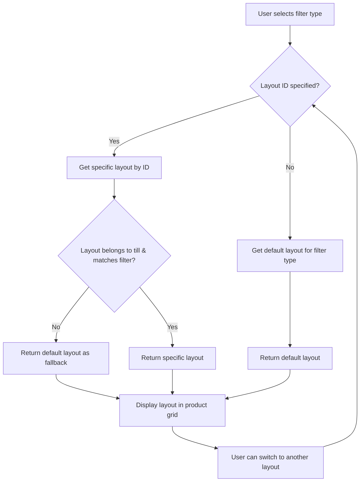

# Multiple Layouts Per Filter Type - Technical Specification

## Overview

This document outlines the technical specification for implementing multiple non-default layouts per filter type with a selection mechanism. The solution will allow users to create and switch between multiple layouts for the same filter type (all, favorites, category) while maintaining backward compatibility with existing default layout behavior.

## Current System Analysis

### Database Schema
- `ProductGridLayout` table exists with columns: `id`, `tillId`, `name`, `layout`, `isDefault`, `createdAt`, `updatedAt`, `categoryId`, `filterType`
- Currently, each till can have multiple layouts per filter type, but only one can be marked as default (`isDefault` field)
- The system retrieves the default layout for a specific filter type with fallback to the first layout if no default exists

### API Endpoints
- `GET /api/tills/:tillId/grid-layouts` - Get all layouts for a specific till
- `POST /api/tills/:tillId/grid-layouts` - Create a new layout for a till
- `GET /api/tills/:tillId/current-layout` - Get the default layout for a till with filter type support
- `PUT /api/grid-layouts/:layoutId/set-default` - Set a layout as default for its till
- `GET /api/tills/:tillId/layouts-by-filter/:filterType` - Get layouts for a specific filter type

### Frontend Components
- `ProductGridLayoutManagement.tsx` - Management interface for layouts
- `gridLayoutService.ts` - Service functions for layout operations

## Requirements

1. **Layout Selection Interface**: Implement a user interface to choose between different layouts for the same filter type
2. **Modified Layout Retrieval Logic**: Update the system to support retrieving non-default layouts
3. **Backward Compatibility**: Maintain existing default layout behavior for existing installations
4. **Storage and Management**: Store and manage multiple layouts per filter type without disrupting current functionality

## Solution Design

### 1. Database Schema Enhancement

The current schema already supports multiple layouts per filter type. No schema changes are needed since we can have multiple layouts with the same `filterType` for a `tillId`, with only one being marked as default.

### 2. Layout Selection Interface Design

#### A. Component Structure
```
LayoutSelectionComponent
├── LayoutSelectorButton (shows current layout name)
├── LayoutSelectorModal/Popover
│   ├── Search Input
│   ├── Layout List (with preview)
│   ├── Default Layout Indicator
│   └── Action Buttons (New, Edit, Apply)
└── Current Layout Context Provider
```

#### B. Visual Design
- **Compact Mode**: Small dropdown button next to filter type selector showing current layout name
- **Expanded Mode**: Modal or popover showing all available layouts for the current filter type
- **Layout Preview**: Visual representation of layout grid (if feasible) or at least grid configuration info
- **Status Indicators**:
  - Default layout indicator
  - Currently selected layout indicator
  - Custom vs shared layout indicators

#### C. User Interaction Flow
1. User selects a filter type (All, Favorites, Category)
2. System loads all layouts for that filter type
3. User can see current layout selection and switch to another
4. Layout switch happens immediately without page reload
5. Selection is stored in session context and optionally persisted

#### D. Component Implementation Details

##### LayoutSelectorButton Component
```tsx
interface LayoutSelectorButtonProps {
  currentLayout: ProductGridLayoutData | null;
  filterType: string;
  categoryId?: number | null;
  onLayoutSelect: (layout: ProductGridLayoutData) => void;
  tillId: number;
}

// Shows current layout name and opens selection modal
```

##### LayoutSelectorModal Component
```tsx
interface LayoutSelectorModalProps {
  isOpen: boolean;
  onClose: () => void;
  filterType: string;
  categoryId?: number | null;
  tillId: number;
  onSelectLayout: (layout: ProductGridLayoutData) => void;
  currentLayoutId: string | null;
}

// Displays all available layouts for the filter type with search and preview
```

#### E. Integration Points
- Integrate with `ProductGrid.tsx` component where the filter type is selected
- Connect with existing layout management functionality
- Ensure accessibility compliance for keyboard navigation
- Maintain responsive design for different screen sizes

### 3. New API Endpoints

#### A. Get All Layouts for a Filter Type
```
GET /api/tills/:tillId/layouts-by-filter/:filterType
```
This endpoint already exists and returns all layouts for a specific filter type.

#### B. Get Layout by ID
```
GET /api/grid-layouts/:layoutId
```
This endpoint already exists and returns a specific layout by ID.

#### C. New Endpoint for Current Layout with Specific Layout ID
```
GET /api/tills/:tillId/current-layout-by-id/:layoutId
```
This new endpoint will allow retrieving a specific layout by ID while maintaining context of the till.

### 3. Enhanced Layout Retrieval Logic

#### Current Logic
- System looks for default layout for specific filter type
- If no default exists, returns first layout for that filter type
- If no layouts exist, returns a default/fallback layout

#### Proposed Logic
- System maintains current default behavior as fallback
- New functionality allows specifying a specific layout ID to use instead of default
- New session-based layout preference that can override default behavior
- Maintain backward compatibility by defaulting to existing behavior

### 4. Modified Layout Retrieval Logic

#### A. Enhanced API Endpoints
The following endpoints need to be enhanced to support layout selection:

1. **Enhanced Current Layout Endpoint**:
   ```typescript
   // GET /api/tills/:tillId/current-layout?filterType=:filterType&categoryId=:categoryId&layoutId=:layoutId
   layoutRouter.get('/tills/:tillId/current-layout', async (req: Request, res: Response) => {
     const { tillId } = req.params;
     const { filterType = 'all', categoryId, layoutId } = req.query;
     
     // If a specific layoutId is provided, return that layout (if it belongs to the till and matches filter type)
     if (layoutId) {
       const specificLayout = await prisma.productGridLayout.findUnique({
         where: { id: parseInt(layoutId as string, 10) }
       });
       
       if (specificLayout &&
           specificLayout.tillId === parseInt(tillId, 10) &&
           specificLayout.filterType === filterType) {
         return res.json(specificLayout);
       }
     }
     
     // Otherwise, use existing default logic
     // First try to get the default layout for the specific filter type
     const filterTypeStr = filterType as string || 'all';
     const categoryIdParam = categoryId ? parseInt(categoryId as string, 10) : null;
     
     let whereClauseForDefault: any = {
       tillId: parseInt(tillId, 10),
       isDefault: true,
       filterType: filterTypeStr
     };
     
     if (filterTypeStr === 'category' && categoryIdParam !== null && !isNaN(categoryIdParam)) {
       whereClauseForDefault.categoryId = categoryIdParam;
     }
     
     let layout = await prisma.productGridLayout.findFirst({
       where: whereClauseForDefault
     });

     // If no default layout exists for the filter type, get the first layout for that filter type
     if (!layout) {
       let whereClauseForFirst: any = {
         tillId: parseInt(tillId, 10),
         filterType: filterTypeStr
       };
       
       if (filterTypeStr === 'category' && categoryIdParam !== null && !isNaN(categoryIdParam)) {
         whereClauseForFirst.categoryId = categoryIdParam;
       }
       
       layout = await prisma.productGridLayout.findFirst({
         where: whereClauseForFirst,
         orderBy: { createdAt: 'asc' }
       });
     }

     // If no layouts exist for the filter type, return a default/fallback layout
     if (!layout) {
       const categoryIdParam = categoryId ? parseInt(categoryId as string, 10) : null;
       const parsedCategoryId = (categoryIdParam !== null && !isNaN(categoryIdParam)) ? categoryIdParam : null;
       
       res.json({
         id: null,
         tillId: parseInt(tillId, 10),
         name: `Default ${filterType} Layout`,
         layout: {
           columns: 4,
           gridItems: [],
           version: '1.0'
         },
         isDefault: true,
         filterType: filterType as string || 'all',
         categoryId: parsedCategoryId,
         createdAt: new Date(),
         updatedAt: new Date()
       });
       return;
     }

     res.json(layout);
   });
   ```

#### B. Frontend Service Enhancements
Update the grid layout service to support layout selection:

```typescript
// Function to get current layout for a till with specific filter type and optional layout ID
export const getCurrentLayoutForTillWithFilterAndLayoutId = async (
 tillId: number,
  filterType: string,
  categoryId?: number | null,
  layoutId?: string | null
): Promise<ProductGridLayoutData> => {
  let url = `${apiUrl(`/api/grid-layouts/tills/${tillId}/current-layout?filterType=${filterType}`)}`;
  if (filterType === 'category' && categoryId !== undefined && categoryId !== null) {
    url += `&categoryId=${categoryId}`;
  }
 if (layoutId) {
    url += `&layoutId=${layoutId}`;
  }
  
  const response = await fetch(url, {
    method: 'GET',
    headers: {
      'Content-Type': 'application/json',
    },
  });

  if (!response.ok) {
    throw new Error(`Failed to get current layout: ${response.statusText}`);
  }

  return response.json();
};
```

#### C. Layout Selection State Management
Implement a context or state management system to track the currently selected layout for each filter type:

```tsx
// LayoutSelectionContext.tsx
interface LayoutSelectionState {
  selectedLayouts: Record<string, string>; // Key: `${tillId}-${filterType}`, Value: layoutId
 setSelectedLayout: (tillId: number, filterType: string, layoutId: string) => void;
  getSelectedLayout: (tillId: number, filterType: string) => string | undefined;
}

const LayoutSelectionContext = createContext<LayoutSelectionState | undefined>(undefined);
```

#### D. Product Grid Integration
The product grid component will need to be updated to:
1. Check the layout selection context for the current layout ID for the active filter type
2. Fetch the specific layout if one is selected
3. Fall back to default behavior if no specific layout is selected
4. Update the context when the user selects a different layout

### 5. Frontend Implementation

#### A. Layout Selection Dropdown/Modal
- Add a layout selection mechanism in the product grid area
- Show available layouts for the current filter type
- Allow users to switch between layouts on the fly
- Store user preference in session or local state

#### B. Updated Layout Management
- Enhance `ProductGridLayoutManagement.tsx` to better show and manage multiple layouts per filter type
- Add visual indicators for which layout is currently selected
- Improve filtering and organization of layouts

### 5. Session/Context Management

#### A. Current Layout Context
- Implement a context or state management system to track the currently selected layout for each filter type
- Store user's layout preference per filter type in memory/session
- Allow switching without losing other filter type preferences

#### B. Layout Preference Persistence
- Option to persist layout preferences per till/filter type combination
- Use browser storage for temporary preferences
- Consider server-side storage for persistent preferences across sessions

## Storage and Management of Multiple Layouts

### A. Database Storage Strategy
The current database schema already supports multiple layouts per filter type. Each `ProductGridLayout` record has:
- `tillId`: Links the layout to a specific till
- `filterType`: Specifies the filter type ('all', 'favorites', 'category')
- `categoryId`: For category filter type, specifies the category
- `isDefault`: Indicates if this is the default layout for the filter type
- `name`: Descriptive name for the layout
- `layout`: The actual grid configuration data

This structure allows multiple layouts per filter type without disrupting current functionality.

### B. Layout Selection Storage
#### 1. Client-Side Session Storage
- Store the currently selected layout for each filter type in the browser session
- Use a key pattern like `selectedLayout_${tillId}_${filterType}` to organize preferences
- This approach provides immediate access without server round-trips
- Preferences are tied to the current browser session

#### 2. Client-Side Persistent Storage
- For persistent preferences across sessions, use localStorage
- Implement a cleanup mechanism for outdated preferences
- Allow users to clear their layout preferences when needed

#### 3. Server-Side Storage (Optional Enhancement)
- In future enhancements, consider storing user preferences on the server
- Associate preferences with user accounts for cross-device consistency
- Implement API endpoints to manage user layout preferences

### C. Layout Management Interface Enhancements
#### 1. Improved Layout Organization
- Group layouts by filter type in the management interface
- Add visual indicators for default layouts
- Show which layouts are currently in use
- Implement search and filtering capabilities

#### 2. Layout Metadata
- Enhance layout records with additional metadata:
  - Creation date
  - Last used date
  - Usage statistics
 - Layout description field

#### 3. Layout Validation
- Implement validation to ensure layout integrity
- Check for duplicate names within the same till/filter type
- Validate grid configuration structure
- Ensure all referenced products/variants exist

### D. Performance Optimization
#### 1. Caching Strategy
- Cache layout lists to reduce database queries
- Implement smart caching that invalidates when layouts change
- Consider caching at both application and component levels

#### 2. Data Loading Optimization
- Load only necessary layout data for the current view
- Implement pagination for layouts lists with many items
- Use lazy loading for layout previews

### E. Conflict Resolution
#### 1. Default Layout Management
- Prevent deletion of the last layout for a filter type if it's marked as default
- Implement clear rules for default layout assignment when the current default is deleted
- Handle cases where multiple layouts could be considered default

#### 2. Concurrent Access
- Implement optimistic locking or similar mechanisms for concurrent layout editing
- Provide clear feedback when conflicts occur
- Allow users to resolve conflicts when detected

### F. Migration and Data Integrity
#### 1. Existing Layout Handling
- No migration needed for existing layouts as the schema already supports multiple layouts
- Maintain existing `isDefault` flags and relationships
- Ensure all existing functionality continues to work

#### 2. Data Validation
- Implement validation for new layout creation
- Ensure layout names are unique within the same till/filter type
- Validate that layout configurations are properly structured

## Implementation Plan

### Phase 1: Backend API Enhancement

1. **Add new endpoint for getting specific layout by ID with filter context**:
   ```typescript
   // GET /api/tills/:tillId/current-layout-with-id/:layoutId
   layoutRouter.get('/tills/:tillId/current-layout-with-id/:layoutId', async (req: Request, res: Response) => {
     // Validate layout belongs to the till
     // Return the specific layout
   });
   ```

2. **Enhance existing endpoints to support layout selection parameters**:
   - Update `GET /api/tills/:tillId/current-layout` to accept optional layoutId parameter
   - If layoutId is provided, return that specific layout (if it belongs to the till and matches filter type)

### Phase 2: Frontend Implementation

1. **Create layout selection component**:
   - Dropdown or modal to select from available layouts for current filter type
   - Visual preview of layout (if feasible)
   - Integration with existing filter system

2. **Update layout service functions**:
   - Add function to get specific layout by ID
   - Update `getCurrentLayoutForTillWithFilter` to accept optional layoutId

3. **Update product grid component**:
   - Integrate layout selection UI
   - Handle layout switching
   - Maintain state of current layout selection

### Phase 3: User Interface Enhancement

1. **Enhanced layout management interface**:
   - Better visualization of multiple layouts per filter type
   - Clear indication of which layout is currently active
   - Improved organization and filtering

2. **Layout selection indicator**:
   - Show which layout is currently active
   - Quick access to switch layouts
   - Visual feedback when switching

## Backward Compatibility Strategy

### 1. Default Behavior Preservation
- Maintain existing default layout behavior as fallback
- If no specific layout is selected, continue using default layout logic
- No changes to existing API contracts

### 2. Migration Path
- No database migration needed as schema already supports multiple layouts
- Existing installations continue to work without changes
- New functionality is opt-in

### 3. API Compatibility
- All existing endpoints maintain same behavior
- New optional parameters don't break existing functionality
- New endpoints are additive

### 4. Backward Compatibility Implementation

#### A. API Endpoint Compatibility
- The enhanced `GET /api/tills/:tillId/current-layout` endpoint maintains backward compatibility
- When no `layoutId` parameter is provided, it behaves exactly as before
- All existing query parameters (`filterType`, `categoryId`) continue to work as before
- Response format remains the same for existing use cases

#### B. Frontend Service Compatibility
- Existing service functions continue to work without changes
- New service functions are added as supplements, not replacements
- The `getCurrentLayoutForTillWithFilter` function continues to work as before
- New functions with additional parameters provide enhanced functionality

#### C. Component Integration
- The layout selection component is optional and only appears when multiple layouts exist
- Existing filter type selection continues to work as before
- Default layout behavior remains unchanged when no specific layout is selected

#### D. Database Schema Compatibility
- No changes to the database schema are required
- The existing `ProductGridLayout` table structure remains unchanged
- The `isDefault` field continues to function as before
- All existing indexes and constraints remain valid

#### E. Data Migration Strategy
- No data migration is required as the schema already supports multiple layouts per filter type
- Existing default layouts continue to function as the default
- New functionality simply adds the ability to override the default when needed
- All existing layout data remains intact and functional

#### F. Graceful Degradation
- If new features are disabled or unavailable, system reverts to original behavior
- Error handling ensures fallback to default behavior in case of issues
- Frontend components gracefully handle cases where new API features are not available

## Data Flow Diagram



## Security Considerations

1. **Authorization**: Ensure users can only access layouts belonging to their assigned tills
2. **Validation**: Validate that requested layout IDs belong to the correct till and match the filter type
3. **Access Control**: Maintain existing permission system for layout operations

## Performance Considerations

1. **Caching**: Consider caching layout lists to avoid repeated database queries
2. **Optimization**: Optimize queries to fetch only necessary layout data
3. **Memory**: Manage memory usage for storing layout preferences in session

## Testing Strategy

1. **Unit Tests**: Test new API endpoints and service functions
2. **Integration Tests**: Test layout selection flow end-to-end
3. **Regression Tests**: Ensure existing functionality remains intact
4. **UI Tests**: Test layout selection interface and state management

## Deployment Considerations

1. **Zero Downtime**: New functionality is additive, no breaking changes
2. **Rollback Plan**: New endpoints can be removed without affecting existing functionality
3. **Database**: No schema changes required, no migration needed

## Future Enhancements

1. **Layout Templates**: Allow sharing layouts across tills
2. **User Preferences**: Save user's preferred layout per filter type
3. **Layout Synchronization**: Sync layout preferences across devices
4. **Advanced Layout Types**: Support for more filter types in the future

## Risks and Mitigation

| Risk | Impact | Mitigation |
|------|--------|------------|
| Breaking existing functionality | High | Maintain backward compatibility, thorough testing |
| Performance degradation | Medium | Optimize queries, implement caching |
| User confusion | Medium | Clear UI indicators, intuitive layout switching |
| Data inconsistency | Low | Proper validation and error handling |

## Conclusion

This specification outlines a comprehensive approach to implementing multiple layouts per filter type while maintaining backward compatibility. The solution leverages the existing database schema and enhances the API and frontend to provide flexible layout selection capabilities. The implementation can be phased to minimize risk and ensure smooth adoption.

## Summary of Implementation Requirements

### 1. How to implement a layout selection interface for users to choose between different layouts for the same filter type
- Create a `LayoutSelectorButton` component that shows the current layout name
- Implement a `LayoutSelectorModal` component that displays all available layouts for the current filter type
- Add search and preview functionality to help users identify layouts
- Integrate the selection component with the existing filter type selector in the product grid
- Provide visual indicators for default and currently selected layouts

### 2. How to modify the current layout retrieval logic to support this new functionality
- Enhance the `GET /api/tills/:tillId/current-layout` endpoint to accept an optional `layoutId` parameter
- When `layoutId` is provided, return that specific layout if it belongs to the till and matches the filter type
- Maintain existing default behavior when no specific layout is requested
- Update frontend service functions to support the new parameter
- Implement context/state management to track selected layouts per filter type

### 3. How to maintain backward compatibility with existing default layout behavior
- All existing API endpoints maintain the same behavior when new parameters are not used
- Default layout selection logic remains unchanged when no specific layout is selected
- No database schema changes required
- Existing installations continue to work without any modifications
- New functionality is opt-in and does not affect existing workflows

### 4. How to store and manage multiple layouts per filter type without disrupting current functionality
- Leverage existing database schema which already supports multiple layouts per filter type
- Use client-side session storage to track current layout selections
- Implement proper validation to ensure layout integrity
- Provide enhanced management interface with better organization and filtering
- Maintain all existing relationships and constraints

The implementation approach ensures that all requirements are met while maintaining system stability and providing a smooth user experience.