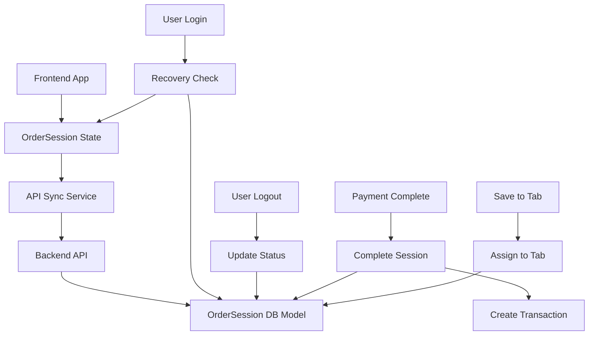

# OrderSession System - Technical Specification

## Overview
This document outlines the technical specification for implementing an OrderSession system that will store current orders in the database for consistency in case of crashes. The system ensures that order data is always in the database and can be recovered after crashes or app reloads, while allowing users to continue orders across different tills.

## Current System Analysis

### Current State Management
- Orders are currently stored in frontend memory using React state (`orderItems` in App.tsx)
- When a user logs out, any active order is cleared without being saved to the database
- No persistence of active orders exists between sessions
- Tabs are separate from active orders and stored in the database

### Issues Identified
1. Order data is lost on application crashes/reloads
2. Users cannot continue orders after logging out and back in
3. No mechanism to recover orders if the device crashes
4. No cross-till order continuity

## Proposed Solution: OrderSession Model

### Database Schema Design

#### OrderSession Model (Prisma Schema)
```prisma
model OrderSession {
  id          Int      @id @default(autoincrement())
  userId      Int      // References the user who owns the session
  items       Json     // Stores the order items as JSON
  status      String   // Enum: 'active', 'assigned_to_tab', 'completed', 'pending_logout'
  createdAt   DateTime @default(now())
  updatedAt   DateTime @updatedAt
  logoutTime  DateTime? // Timestamp when user logged out with active order
  tabId       Int?     // Optional: if session was assigned to a tab
 user        User     @relation(fields: [userId], references: [id], onDelete: Cascade)
  tab         Tab?     @relation(fields: [tabId], references: [id])
  
  @@map("order_sessions")
}
```

#### Status Values
- `active`: Current active order session
- `assigned_to_tab`: Session was converted to a tab and saved
- `completed`: Session was completed as a transaction
- `pending_logout`: User logged out with active order (recovery state)

### API Endpoints Design

#### 1. Get User's Active OrderSession
- **Endpoint**: `GET /api/order-sessions/active`
- **Description**: Retrieves the current active order session for the authenticated user
- **Response**: `OrderSession` object or null if no active session

#### 2. Get OrderSession by ID
- **Endpoint**: `GET /api/order-sessions/:id`
- **Description**: Retrieves a specific order session by ID
- **Response**: `OrderSession` object

#### 3. Create/Update OrderSession
- **Endpoint**: `POST /api/order-sessions`
- **Description**: Creates a new order session or updates existing one for the user
- **Request Body**: `{ userId: number, items: OrderItem[], status: string }`
- **Response**: Saved `OrderSession` object

#### 4. Update OrderSession
- **Endpoint**: `PUT /api/order-sessions/:id`
- **Description**: Updates an existing order session
- **Request Body**: Partial update of `OrderSession` fields
- **Response**: Updated `OrderSession` object

#### 5. Complete OrderSession as Transaction
- **Endpoint**: `POST /api/order-sessions/:id/complete`
- **Description**: Completes the session by creating a transaction and updating status
- **Response**: Completed transaction object

#### 6. Assign OrderSession to Tab
### Frontend Integration Plan

#### 1. Session State Management
- Replace in-memory order state with database-synced OrderSession
- Implement automatic synchronization with backend on state changes
- Add loading states for sync operations

#### 2. Login/Recovery Flow
- On login, check for existing 'active' or 'pending_logout' OrderSession
- If found, load the session into the frontend state
- Update status from 'pending_logout' to 'active'

#### 3. Logout Flow
- On logout, update OrderSession status to 'pending_logout'
- Set logoutTime to current timestamp
- Preserve order items in database for recovery

#### 4. Order Operations
- Update OrderSession whenever items are added/removed/modified
- Debounce updates to minimize API calls
- Implement error handling for sync failures

#### 5. Payment Flow
- Complete OrderSession when payment is processed
- Update status to 'completed'
- Create transaction record from OrderSession data

#### 6. Tab Operations
- Assign OrderSession to tab when user saves to tab
- Update status to 'assigned_to_tab'
- Clear local order state after assignment

### Recovery Mechanism

#### 1. Login Recovery
- When user logs in, query for OrderSession with status 'active' or 'pending_logout'
- If found, load items into frontend state and update status to 'active'

#### 2. Cross-Till Recovery
- OrderSessions are tied to users, not tills
- When user logs into any till, their session is available
- Implement warning if user has active session on another till

#### 3. Crash Recovery
- On app initialization, check for any 'active' sessions for the device's assigned till
- Implement a cleanup process for stale sessions (older than X minutes without update)

### Implementation Steps

#### Phase 1: Database Schema and Backend API
1. Add OrderSession model to Prisma schema
2. Generate Prisma client
3. Create OrderSession handler with all required endpoints
4. Register OrderSession routes in the router

#### Phase 2: Backend Business Logic
1. Implement session validation and cleanup logic
2. Add session synchronization with existing tabs/transactions
3. Ensure proper error handling and validation

#### Phase 3: Frontend Integration
1. Update App.tsx to use OrderSession instead of local state
2. Implement sync logic for order modifications
3. Update login/logout flows to handle session recovery
4. Modify payment and tab assignment flows

#### Phase 4: Testing and Validation
1. Test crash recovery scenarios
2. Test cross-till session continuity
3. Test concurrent session handling
4. Validate data integrity during transitions

### Data Migration Strategy

#### For Existing Active Orders
- No migration needed for truly active orders (they exist only in memory)
- For any orders that need to be preserved, users should save them as tabs before implementing this feature

#### For Future Compatibility
- Maintain backward compatibility during transition period
- Add OrderSession records for any new orders created during transition

### Security Considerations

#### Access Control
- Users can only access their own OrderSessions
- Admins can view all OrderSessions for management purposes
- Proper authentication required for all endpoints

#### Data Privacy
- OrderSession data contains only order items and metadata
- No sensitive information beyond what's already stored in the system
- Follow same privacy policies as existing data

### Performance Considerations

#### Database Performance
- Add indexes on userId and status for efficient querying
- Implement proper pagination for session history
- Optimize update operations with selective field updates

#### Network Performance
- Debounce API calls to prevent excessive requests
- Implement optimistic updates where appropriate
- Add caching for frequently accessed sessions

### Error Handling

#### Sync Failures
- Implement retry logic for failed sync operations
- Show user-friendly messages when sync fails
- Provide option to continue with local state if sync fails

#### Conflict Resolution
- Handle cases where multiple devices try to modify the same session
- Implement last-write-wins or merge strategies
- Alert users to potential conflicts

## Architecture Diagram



## Expected Benefits

1. **Data Persistence**: Orders are preserved across crashes and reloads
2. **Cross-Till Continuity**: Users can continue orders on different tills
3. **Improved Reliability**: Reduced data loss due to application crashes
4. **Better User Experience**: Seamless order continuity across sessions
5. **Audit Trail**: Complete history of order sessions for analysis
- **Endpoint**: `POST /api/order-sessions/:id/assign-to-tab`
- **Description**: Assigns the session to a tab and updates status
- **Request Body**: `{ tabId: number }`
- **Response**: Updated `OrderSession` object

#### 7. Delete/Clear OrderSession
- **Endpoint**: `DELETE /api/order-sessions/:id`
- **Description**: Deletes an order session
- **Response**: Success confirmation