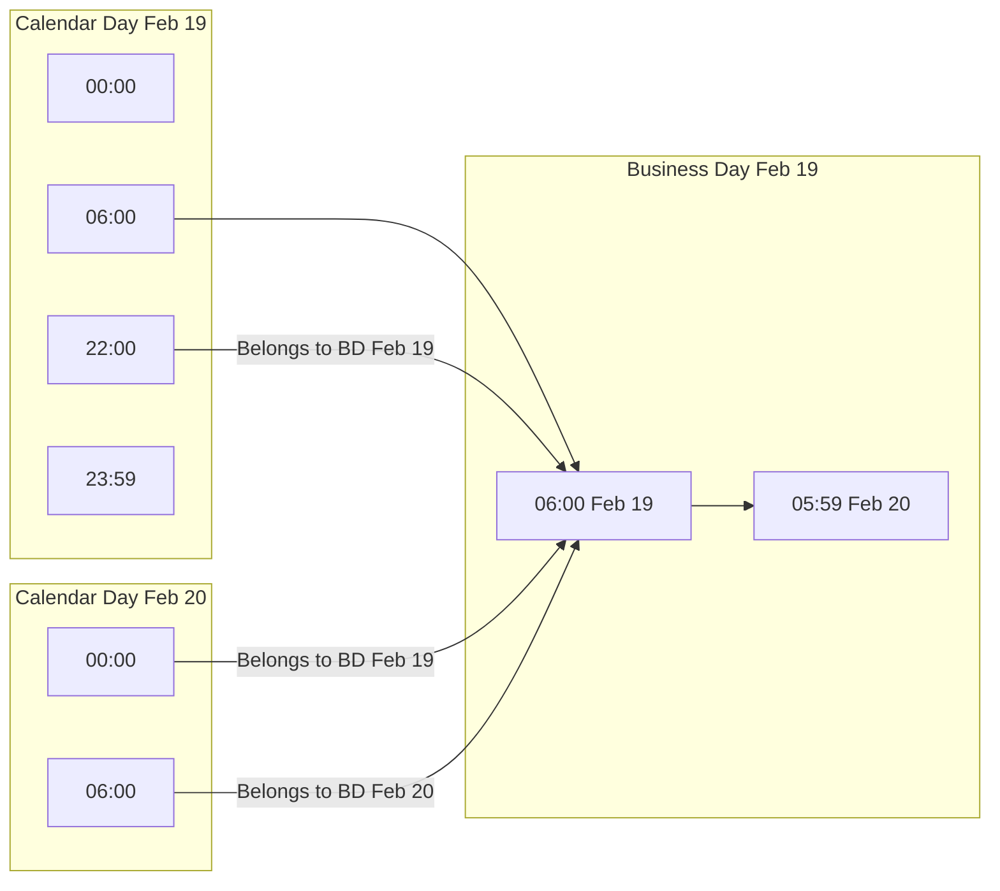

# Analytics Hourly Enhancement Implementation Plan

## Executive Summary

This document provides a detailed implementation plan for enhancing the analytics panel with:
1. **Hourly graph for past days** - Date picker to select any single day and view hourly breakdown
2. **Midnight-crossing business hours** - Business day ends at 6:00 AM (transactions from 22:00-05:59 belong to the previous calendar day's business day)
3. **Time range comparison** - Compare same time ranges across different days

---

## Current State Analysis

### Database Schema

**Settings Model** ([`backend/prisma/schema.prisma:213-220`](backend/prisma/schema.prisma:213)):
```prisma
model Settings {
  id              Int       @id @default(autoincrement())
  taxMode         String
  autoStartTime   String    // e.g., "06:00"
  lastManualClose DateTime?
}
```

**Missing**: `businessDayEndHour` field does not exist. The migration folder `20260219130000_add_business_day_end_hour` exists but is empty.

### Backend Services

**analyticsService.ts** ([`backend/src/services/analyticsService.ts`](backend/src/services/analyticsService.ts)):
- Only has `aggregateProductPerformance()` function
- No hourly aggregation capability
- No business day calculation helpers

**analytics.ts handler** ([`backend/src/handlers/analytics.ts`](backend/src/handlers/analytics.ts)):
- Two endpoints: `/product-performance` and `/top-performers`
- No hourly sales endpoint

### Frontend Components

**AnalyticsPanel.tsx** ([`frontend/components/AnalyticsPanel.tsx`](frontend/components/AnalyticsPanel.tsx)):
- Fixed date range buttons: today, week, month, year
- `HourlySalesChart` only renders when `dateRange === 'today'` (line 75)
- No date picker for custom date selection

**HourlySalesChart.tsx** ([`frontend/components/analytics/HourlySalesChart.tsx`](frontend/components/analytics/HourlySalesChart.tsx)):
- Hardcoded to current business day only
- Uses `getBusinessDayStart()` from time.ts
- All processing is client-side

**time.ts** ([`frontend/utils/time.ts`](frontend/utils/time.ts)):
- `getBusinessDayStart()` calculates business day start based on `autoStartTime`
- No function for calculating business day end
- No function for arbitrary date business day calculation

---

## Technical Architecture

### Data Flow Diagram

```mermaid
flowchart TB
    subgraph Frontend
        AP[AnalyticsPanel.tsx]
        DP[DatePicker Component]
        HSC[HourlySalesChart.tsx]
        CC[ComparisonChart.tsx]
    end
    
    subgraph Backend
        AH[/api/analytics/hourly-sales]
        AC[/api/analytics/compare]
        AS[analyticsService.ts]
        BD[businessDayUtils.ts]
    end
    
    subgraph Database
        T[(transactions)]
        S[(settings)]
    end
    
    DP --> AP
    AP --> HSC
    AP --> CC
    HSC --> AH
    CC --> AC
    AH --> AS
    AC --> AS
    AS --> BD
    AS --> T
    BD --> S
```

### Business Day Logic



---

## Implementation Plan

### Phase 1: Database and Backend Foundation

#### 1.1 Database Migration

**File**: `backend/prisma/migrations/20260219130000_add_business_day_end_hour/migration.sql`

```sql
-- Add businessDayEndHour to Settings table
ALTER TABLE "settings" ADD COLUMN "businessDayEndHour" TEXT;

-- Set default value for existing records
UPDATE "settings" SET "businessDayEndHour" = '06:00' WHERE "businessDayEndHour" IS NULL;
```

#### 1.2 Update Prisma Schema

**File**: [`backend/prisma/schema.prisma`](backend/prisma/schema.prisma:213)

```prisma
model Settings {
  id                Int       @id @default(autoincrement())
  taxMode           String
  autoStartTime     String
  businessDayEndHour String?  @default("06:00")  // NEW: Business day end hour
  lastManualClose   DateTime?

  @@map("settings")
}
```

#### 1.3 Create Business Day Utility Module

**File**: `backend/src/utils/businessDay.ts` (NEW)

```typescript
/**
 * Business Day Utility Functions
 * 
 * Handles the logic for business days that can cross midnight.
 * Example: A bar open from 22:00 to 05:00 has a "business day" that spans
 * two calendar days. Transactions at 02:00 on Wednesday belong to Tuesday's
 * business day.
 */

interface BusinessDayConfig {
  autoStartTime: string;    // Format: "HH:MM" - when business day starts
  businessDayEndHour?: string; // Format: "HH:MM" - when business day ends
}

interface BusinessDayRange {
  start: Date;
  end: Date;
}

/**
 * Parses a time string "HH:MM" into hours and minutes
 */
export function parseTimeString(timeStr: string): { hours: number; minutes: number } {
  const [hours, minutes] = timeStr.split(':').map(Number);
  return { hours, minutes };
}

/**
 * Calculates the business day range for a given date
 * 
 * @param date - The date to calculate business day for
 * @param config - Business day configuration
 * @returns The start and end dates of the business day
 */
export function getBusinessDayRange(date: Date, config: BusinessDayConfig): BusinessDayRange {
  const { hours: startHours, minutes: startMinutes } = parseTimeString(config.autoStartTime);
  
  // Default end hour is 24 hours after start (next day same time)
  const endHours = config.businessDayEndHour 
    ? parseTimeString(config.businessDayEndHour).hours 
    : startHours;
  const endMinutes = config.businessDayEndHour 
    ? parseTimeString(config.businessDayEndHour).minutes 
    : startMinutes;
  
  // Create start of business day
  const start = new Date(date);
  start.setHours(startHours, startMinutes, 0, 0);
  
  // Create end of business day
  // If end hour is less than start hour, it means the business day crosses midnight
  const end = new Date(date);
  if (endHours < startHours || (endHours === startHours && endMinutes <= startMinutes)) {
    // Business day ends on the next calendar day
    end.setDate(end.getDate() + 1);
  }
  end.setHours(endHours, endMinutes, 59, 999);
  
  return { start, end };
}

/**
 * Gets the business day for a specific transaction timestamp
 * 
 * @param timestamp - The transaction timestamp
 * @param config - Business day configuration
 * @returns The business day start date (used as the business day identifier)
 */
export function getTransactionBusinessDay(timestamp: Date, config: BusinessDayConfig): Date {
  const { hours: startHours, minutes: startMinutes } = parseTimeString(config.autoStartTime);
  
  // Create the potential business day starts
  const transactionDate = new Date(timestamp);
  
  // Business day start for the same calendar day
  const sameDayStart = new Date(transactionDate);
  sameDayStart.setHours(startHours, startMinutes, 0, 0);
  
  // Business day start for the previous calendar day
  const prevDayStart = new Date(transactionDate);
  prevDayStart.setDate(prevDayStart.getDate() - 1);
  prevDayStart.setHours(startHours, startMinutes, 0, 0);
  
  // If transaction is before today's business day start, it belongs to yesterday's business day
  if (transactionDate < sameDayStart) {
    return prevDayStart;
  }
  
  return sameDayStart;
}

/**
 * Gets all business day ranges within a date range
 * Useful for generating comparison data
 */
export function getBusinessDaysInRange(
  startDate: Date, 
  endDate: Date, 
  config: BusinessDayConfig
): BusinessDayRange[] {
  const ranges: BusinessDayRange[] = [];
  const current = new Date(startDate);
  
  while (current <= endDate) {
    ranges.push(getBusinessDayRange(current, config));
    current.setDate(current.getDate() + 1);
  }
  
  return ranges;
}
```

#### 1.4 Extend Analytics Service

**File**: [`backend/src/services/analyticsService.ts`](backend/src/services/analyticsService.ts) (MODIFY)

Add the following functions:

```typescript
import { getBusinessDayRange, parseTimeString } from '../utils/businessDay';

export interface HourlyDataPoint {
  hour: string;           // Format: "HH:MM"
  total: number;
  transactionCount: number;
  averageTransaction: number;
}

export interface HourlySalesResult {
  date: string;
  businessDayStart: Date;
  businessDayEnd: Date;
  hourlyData: HourlyDataPoint[];
  summary: {
    totalSales: number;
    totalTransactions: number;
    peakHour: string;
    peakHourTotal: number;
    averageHourly: number;
  };
}

/**
 * Aggregates hourly sales data for a specific business day
 */
export const aggregateHourlySales = async (
  date: string,  // ISO date string "YYYY-MM-DD"
  settings: { autoStartTime: string; businessDayEndHour?: string }
): Promise<HourlySalesResult> => {
  // Get business day range
  const targetDate = new Date(date);
  const { start, end } = getBusinessDayRange(targetDate, {
    autoStartTime: settings.autoStartTime,
    businessDayEndHour: settings.businessDayEndHour,
  });
  
  // Fetch transactions within the business day
  const transactions = await prisma.transaction.findMany({
    where: {
      createdAt: {
        gte: start,
        lte: end,
      },
    },
  });
  
  // Calculate hourly buckets
  const { hours: startHours, minutes: startMinutes } = parseTimeString(settings.autoStartTime);
  const { hours: endHours, minutes: endMinutes } = parseTimeString(
    settings.businessDayEndHour || settings.autoStartTime
  );
  
  // Determine number of hours in business day
  let hoursInDay = endHours - startHours;
  if (hoursInDay <= 0) {
    hoursInDay += 24; // Crosses midnight
  }
  
  // Initialize hourly buckets
  const hourlyBuckets: Map<string, { total: number; count: number }> = new Map();
  for (let i = 0; i < hoursInDay; i++) {
    const hour = (startHours + i) % 24;
    const label = `${hour.toString().padStart(2, '0')}:00`;
    hourlyBuckets.set(label, { total: 0, count: 0 });
  }
  
  // Aggregate transactions into hourly buckets
  let totalSales = 0;
  let totalTransactions = 0;
  
  for (const transaction of transactions) {
    const transactionDate = new Date(transaction.createdAt);
    const transactionHour = transactionDate.getHours();
    
    // Calculate which hour bucket this belongs to
    let hoursSinceStart = transactionHour - startHours;
    if (hoursSinceStart < 0) {
      hoursSinceStart += 24; // Crosses midnight
    }
    
    const bucketHour = (startHours + hoursSinceStart) % 24;
    const label = `${bucketHour.toString().padStart(2, '0')}:00`;
    
    const bucket = hourlyBuckets.get(label);
    if (bucket) {
      bucket.total += transaction.total;
      bucket.count += 1;
    }
    
    totalSales += transaction.total;
    totalTransactions += 1;
  }
  
  // Convert to array and calculate summary
  const hourlyData: HourlyDataPoint[] = [];
  let peakHour = '';
  let peakHourTotal = 0;
  
  for (const [hour, data] of hourlyBuckets) {
    hourlyData.push({
      hour,
      total: data.total,
      transactionCount: data.count,
      averageTransaction: data.count > 0 ? data.total / data.count : 0,
    });
    
    if (data.total > peakHourTotal) {
      peakHour = hour;
      peakHourTotal = data.total;
    }
  }
  
  return {
    date,
    businessDayStart: start,
    businessDayEnd: end,
    hourlyData,
    summary: {
      totalSales,
      totalTransactions,
      peakHour,
      peakHourTotal,
      averageHourly: totalSales / hoursInDay,
    },
  };
};

export interface ComparisonResult {
  period1: HourlySalesResult;
  period2: HourlySalesResult;
  comparison: {
    hourlyDifferences: {
      hour: string;
      difference: number;
      percentChange: number;
    }[];
    summaryDifference: {
      totalSalesDifference: number;
      totalSalesPercentChange: number;
      transactionCountDifference: number;
      transactionCountPercentChange: number;
    };
  };
}

/**
 * Compares hourly sales between two business days
 */
export const compareHourlySales = async (
  date1: string,
  date2: string,
  settings: { autoStartTime: string; businessDayEndHour?: string }
): Promise<ComparisonResult> => {
  const [period1, period2] = await Promise.all([
    aggregateHourlySales(date1, settings),
    aggregateHourlySales(date2, settings),
  ]);
  
  // Calculate hourly differences
  const hourlyDifferences = period1.hourlyData.map((hour1, index) => {
    const hour2 = period2.hourlyData[index];
    const difference = hour1.total - hour2.total;
    const percentChange = hour2.total > 0 
      ? ((hour1.total - hour2.total) / hour2.total) * 100 
      : (hour1.total > 0 ? 100 : 0);
    
    return {
      hour: hour1.hour,
      difference,
      percentChange,
    };
  });
  
  // Calculate summary differences
  const totalSalesDifference = period1.summary.totalSales - period2.summary.totalSales;
  const totalSalesPercentChange = period2.summary.totalSales > 0
    ? ((period1.summary.totalSales - period2.summary.totalSales) / period2.summary.totalSales) * 100
    : (period1.summary.totalSales > 0 ? 100 : 0);
  
  const transactionCountDifference = period1.summary.totalTransactions - period2.summary.totalTransactions;
  const transactionCountPercentChange = period2.summary.totalTransactions > 0
    ? ((period1.summary.totalTransactions - period2.summary.totalTransactions) / period2.summary.totalTransactions) * 100
    : (period1.summary.totalTransactions > 0 ? 100 : 0);
  
  return {
    period1,
    period2,
    comparison: {
      hourlyDifferences,
      summaryDifference: {
        totalSalesDifference,
        totalSalesPercentChange,
        transactionCountDifference,
        transactionCountPercentChange,
      },
    },
  };
};
```

#### 1.5 Add Analytics Endpoints

**File**: [`backend/src/handlers/analytics.ts`](backend/src/handlers/analytics.ts) (MODIFY)

```typescript
import { aggregateHourlySales, compareHourlySales } from '../services/analyticsService';
import { prisma } from '../prisma';

// GET /api/analytics/hourly-sales - Get hourly sales for a specific business day
analyticsRouter.get('/hourly-sales', async (req: Request, res: Response) => {
  try {
    const { date } = req.query;
    
    if (!date || typeof date !== 'string') {
      res.status(400).json({ error: i18n.t('errors.analytics.hourlySales.dateRequired') });
      return;
    }
    
    // Get settings for business day configuration
    const settings = await prisma.settings.findFirst();
    
    if (!settings) {
      res.status(500).json({ error: i18n.t('errors.settings.notFound') });
      return;
    }
    
    const result = await aggregateHourlySales(date, {
      autoStartTime: settings.autoStartTime,
      businessDayEndHour: settings.businessDayEndHour || undefined,
    });
    
    res.json(result);
  } catch (error) {
    logError(error instanceof Error ? error : 'Error fetching hourly sales', {
      correlationId: (req as any).correlationId,
    });
    res.status(500).json({ error: i18n.t('errors.analytics.hourlySales.fetchFailed') });
  }
});

// GET /api/analytics/compare - Compare hourly sales between two days
analyticsRouter.get('/compare', async (req: Request, res: Response) => {
  try {
    const { date1, date2 } = req.query;
    
    if (!date1 || !date2 || typeof date1 !== 'string' || typeof date2 !== 'string') {
      res.status(400).json({ error: i18n.t('errors.analytics.compare.datesRequired') });
      return;
    }
    
    // Get settings for business day configuration
    const settings = await prisma.settings.findFirst();
    
    if (!settings) {
      res.status(500).json({ error: i18n.t('errors.settings.notFound') });
      return;
    }
    
    const result = await compareHourlySales(date1, date2, {
      autoStartTime: settings.autoStartTime,
      businessDayEndHour: settings.businessDayEndHour || undefined,
    });
    
    res.json(result);
  } catch (error) {
    logError(error instanceof Error ? error : 'Error comparing hourly sales', {
      correlationId: (req as any).correlationId,
    });
    res.status(500).json({ error: i18n.t('errors.analytics.compare.fetchFailed') });
  }
});
```

---

### Phase 2: Frontend Implementation

#### 2.1 Update Settings Types

**File**: `frontend/shared/types.ts` (MODIFY)

```typescript
export interface Settings {
  tax: {
    mode: 'inclusive' | 'exclusive' | 'none';
  };
  businessDay: {
    autoStartTime: string;
    businessDayEndHour?: string;  // NEW
    lastManualClose: string | null;
  };
}
```

#### 2.2 Create Date Picker Component

**File**: `frontend/components/analytics/DatePicker.tsx` (NEW)

```tsx
import React, { useState } from 'react';
import { useTranslation } from 'react-i18next';
import { format, subDays, startOfDay } from 'date-fns';

interface DatePickerProps {
  selectedDate: Date;
  onDateChange: (date: Date) => void;
  maxDate?: Date;
  minDate?: Date;
}

export const DatePicker: React.FC<DatePickerProps> = ({
  selectedDate,
  onDateChange,
  maxDate = new Date(),
  minDate,
}) => {
  const { t } = useTranslation('admin');
  const [isOpen, setIsOpen] = useState(false);
  
  // Quick select options
  const quickSelectOptions = [
    { label: t('analytics.today'), days: 0 },
    { label: t('analytics.yesterday'), days: 1 },
    { label: t('analytics.daysAgo', { count: 7 }), days: 7 },
    { label: t('analytics.daysAgo', { count: 30 }), days: 30 },
  ];
  
  const handleQuickSelect = (days: number) => {
    const date = subDays(new Date(), days);
    onDateChange(startOfDay(date));
    setIsOpen(false);
  };
  
  const handleDateInput = (e: React.ChangeEvent<HTMLInputElement>) => {
    const date = new Date(e.target.value);
    if (!isNaN(date.getTime())) {
      onDateChange(date);
    }
  };
  
  return (
    <div className="relative">
      <button
        onClick={() => setIsOpen(!isOpen)}
        className="flex items-center gap-2 px-4 py-2 bg-slate-700 hover:bg-slate-600 rounded-md text-white transition"
      >
        <svg className="w-5 h-5" fill="none" stroke="currentColor" viewBox="0 0 24 24">
          <path strokeLinecap="round" strokeLinejoin="round" strokeWidth={2} 
            d="M8 7V3m8 4V3m-9 8h10M5 21h14a2 2 0 002-2V7a2 2 0 00-2-2H5a2 2 0 00-2 2v12a2 2 0 002 2z" />
        </svg>
        <span>{format(selectedDate, 'MMM d, yyyy')}</span>
      </button>
      
      {isOpen && (
        <div className="absolute top-full left-0 mt-2 bg-slate-800 border border-slate-600 rounded-lg shadow-xl z-50 p-4 min-w-[280px]">
          {/* Quick select buttons */}
          <div className="grid grid-cols-2 gap-2 mb-4">
            {quickSelectOptions.map((option) => (
              <button
                key={option.days}
                onClick={() => handleQuickSelect(option.days)}
                className="px-3 py-2 text-sm bg-slate-700 hover:bg-slate-600 rounded transition"
              >
                {option.label}
              </button>
            ))}
          </div>
          
          {/* Native date input for precise selection */}
          <div className="border-t border-slate-600 pt-4">
            <label className="block text-sm text-slate-400 mb-2">
              {t('analytics.selectDate')}
            </label>
            <input
              type="date"
              value={format(selectedDate, 'yyyy-MM-dd')}
              onChange={handleDateInput}
              max={format(maxDate, 'yyyy-MM-dd')}
              min={minDate ? format(minDate, 'yyyy-MM-dd') : undefined}
              className="w-full px-3 py-2 bg-slate-700 border border-slate-600 rounded text-white focus:outline-none focus:ring-2 focus:ring-amber-500"
            />
          </div>
        </div>
      )}
    </div>
  );
};
```

#### 2.3 Create Comparison Mode Toggle

**File**: `frontend/components/analytics/ComparisonToggle.tsx` (NEW)

```tsx
import React from 'react';
import { useTranslation } from 'react-i18next';

interface ComparisonToggleProps {
  isComparisonMode: boolean;
  onToggle: (enabled: boolean) => void;
}

export const ComparisonToggle: React.FC<ComparisonToggleProps> = ({
  isComparisonMode,
  onToggle,
}) => {
  const { t } = useTranslation('admin');
  
  return (
    <div className="flex items-center gap-3">
      <span className="text-sm text-slate-400">{t('analytics.comparisonMode')}</span>
      <button
        onClick={() => onToggle(!isComparisonMode)}
        className={`relative inline-flex h-6 w-11 items-center rounded-full transition-colors ${
          isComparisonMode ? 'bg-amber-500' : 'bg-slate-600'
        }`}
      >
        <span
          className={`inline-block h-4 w-4 transform rounded-full bg-white transition-transform ${
            isComparisonMode ? 'translate-x-6' : 'translate-x-1'
          }`}
        />
      </button>
    </div>
  );
};
```

#### 2.4 Create Comparison Date Picker

**File**: `frontend/components/analytics/ComparisonDatePicker.tsx` (NEW)

```tsx
import React from 'react';
import { useTranslation } from 'react-i18next';
import { format, subDays } from 'date-fns';

interface ComparisonDatePickerProps {
  primaryDate: Date;
  comparisonDate: Date;
  onPrimaryDateChange: (date: Date) => void;
  onComparisonDateChange: (date: Date) => void;
}

export const ComparisonDatePicker: React.FC<ComparisonDatePickerProps> = ({
  primaryDate,
  comparisonDate,
  onPrimaryDateChange,
  onComparisonDateChange,
}) => {
  const { t } = useTranslation('admin');
  
  // Suggest common comparison dates
  const suggestions = [
    { label: t('analytics.previousDay'), getDate: (d: Date) => subDays(d, 1) },
    { label: t('analytics.sameDayLastWeek'), getDate: (d: Date) => subDays(d, 7) },
    { label: t('analytics.sameDayLastMonth'), getDate: (d: Date) => subDays(d, 30) },
  ];
  
  return (
    <div className="flex flex-col sm:flex-row gap-4 items-start sm:items-center">
      {/* Primary Date */}
      <div className="flex items-center gap-2">
        <label className="text-sm text-slate-400">{t('analytics.primaryDate')}</label>
        <input
          type="date"
          value={format(primaryDate, 'yyyy-MM-dd')}
          onChange={(e) => onPrimaryDateChange(new Date(e.target.value))}
          className="px-3 py-2 bg-slate-700 border border-slate-600 rounded text-white"
        />
      </div>
      
      {/* VS indicator */}
      <span className="text-slate-500 font-bold">VS</span>
      
      {/* Comparison Date */}
      <div className="flex items-center gap-2">
        <label className="text-sm text-slate-400">{t('analytics.compareWith')}</label>
        <input
          type="date"
          value={format(comparisonDate, 'yyyy-MM-dd')}
          onChange={(e) => onComparisonDateChange(new Date(e.target.value))}
          className="px-3 py-2 bg-slate-700 border border-slate-600 rounded text-white"
        />
      </div>
      
      {/* Quick suggestions */}
      <div className="flex gap-2">
        {suggestions.map((suggestion) => (
          <button
            key={suggestion.label}
            onClick={() => onComparisonDateChange(suggestion.getDate(primaryDate))}
            className="px-2 py-1 text-xs bg-slate-700 hover:bg-slate-600 rounded transition"
          >
            {suggestion.label}
          </button>
        ))}
      </div>
    </div>
  );
};
```

#### 2.5 Create Comparison Chart Component

**File**: `frontend/components/analytics/ComparisonChart.tsx` (NEW)

```tsx
import React from 'react';
import { useTranslation } from 'react-i18next';
import { formatCurrency } from '../../utils/formatting';
import type { ComparisonResult } from '../../../shared/types';

interface ComparisonChartProps {
  data: ComparisonResult;
}

export const ComparisonChart: React.FC<ComparisonChartProps> = ({ data }) => {
  const { t } = useTranslation('admin');
  
  const maxSales = Math.max(
    ...data.period1.hourlyData.map(h => h.total),
    ...data.period2.hourlyData.map(h => h.total),
    1
  );
  
  return (
    <div className="bg-slate-800 p-6 rounded-lg">
      {/* Summary Cards */}
      <div className="grid grid-cols-2 gap-4 mb-6">
        <div className="bg-slate-700 p-4 rounded-lg">
          <h4 className="text-sm text-slate-400">{data.period1.date}</h4>
          <p className="text-2xl font-bold text-white">
            {formatCurrency(data.period1.summary.totalSales)}
          </p>
          <p className="text-sm text-slate-400">
            {data.period1.summary.totalTransactions} {t('analytics.transactions')}
          </p>
        </div>
        <div className="bg-slate-700 p-4 rounded-lg">
          <h4 className="text-sm text-slate-400">{data.period2.date}</h4>
          <p className="text-2xl font-bold text-white">
            {formatCurrency(data.period2.summary.totalSales)}
          </p>
          <p className="text-sm text-slate-400">
            {data.period2.summary.totalTransactions} {t('analytics.transactions')}
          </p>
        </div>
      </div>
      
      {/* Difference Summary */}
      <div className={`p-4 rounded-lg mb-6 ${
        data.comparison.summaryDifference.totalSalesDifference >= 0 
          ? 'bg-green-900/30 border border-green-700' 
          : 'bg-red-900/30 border border-red-700'
      }`}>
        <div className="flex justify-between items-center">
          <span className="text-slate-300">{t('analytics.difference')}</span>
          <span className={`text-xl font-bold ${
            data.comparison.summaryDifference.totalSalesDifference >= 0 
              ? 'text-green-400' 
              : 'text-red-400'
          }`}>
            {data.comparison.summaryDifference.totalSalesDifference >= 0 ? '+' : ''}
            {formatCurrency(Math.abs(data.comparison.summaryDifference.totalSalesDifference))}
            {' '}({data.comparison.summaryDifference.totalSalesPercentChange >= 0 ? '+' : ''}
            {data.comparison.summaryDifference.totalSalesPercentChange.toFixed(1)}%)
          </span>
        </div>
      </div>
      
      {/* Hourly Comparison Bars */}
      <h3 className="text-xl font-bold text-slate-300 mb-4">{t('analytics.hourlyComparison')}</h3>
      <div className="space-y-2">
        {data.period1.hourlyData.map((hour1, index) => {
          const hour2 = data.period2.hourlyData[index];
          const diff = data.comparison.hourlyDifferences[index];
          
          return (
            <div key={hour1.hour} className="flex items-center gap-4">
              <span className="w-12 text-sm text-slate-400">{hour1.hour}</span>
              
              {/* Period 1 Bar */}
              <div className="flex-1 h-6 bg-slate-700 rounded relative">
                <div
                  className="absolute left-0 top-0 h-full bg-sky-500 rounded transition-all"
                  style={{ width: `${(hour1.total / maxSales) * 100}%` }}
                />
              </div>
              
              {/* Period 2 Bar */}
              <div className="flex-1 h-6 bg-slate-700 rounded relative">
                <div
                  className="absolute left-0 top-0 h-full bg-amber-500 rounded transition-all"
                  style={{ width: `${(hour2.total / maxSales) * 100}%` }}
                />
              </div>
              
              {/* Difference indicator */}
              <span className={`w-20 text-right text-sm ${
                diff.difference >= 0 ? 'text-green-400' : 'text-red-400'
              }`}>
                {diff.difference >= 0 ? '+' : ''}{diff.percentChange.toFixed(0)}%
              </span>
            </div>
          );
        })}
      </div>
      
      {/* Legend */}
      <div className="flex justify-center gap-6 mt-4 pt-4 border-t border-slate-600">
        <div className="flex items-center gap-2">
          <div className="w-4 h-4 bg-sky-500 rounded" />
          <span className="text-sm text-slate-400">{data.period1.date}</span>
        </div>
        <div className="flex items-center gap-2">
          <div className="w-4 h-4 bg-amber-500 rounded" />
          <span className="text-sm text-slate-400">{data.period2.date}</span>
        </div>
      </div>
    </div>
  );
};
```

#### 2.6 Update AnalyticsPanel Component

**File**: [`frontend/components/AnalyticsPanel.tsx`](frontend/components/AnalyticsPanel.tsx) (MODIFY)

```tsx
import React, { useState, useMemo, useEffect } from 'react';
import { useTranslation } from 'react-i18next';
import { format, startOfDay, subDays } from 'date-fns';
import type { Transaction, Product, Category, Settings } from '../shared/types';

import { HourlySalesChart } from './analytics/HourlySalesChart';
import { SalesTrendChart } from './analytics/SalesTrendChart';
import { TopPerformers } from './analytics/TopPerformers';
import { DatePicker } from './analytics/DatePicker';
import { ComparisonToggle } from './analytics/ComparisonToggle';
import { ComparisonDatePicker } from './analytics/ComparisonDatePicker';
import { ComparisonChart } from './analytics/ComparisonChart';

interface AnalyticsPanelProps {
  transactions: Transaction[];
  products: Product[];
  categories: Category[];
  settings: Settings;
}

type DateRange = 'today' | 'week' | 'month' | 'year' | 'custom';

export const AnalyticsPanel: React.FC<AnalyticsPanelProps> = ({ 
  transactions, 
  products, 
  categories, 
  settings 
}) => {
  const { t } = useTranslation('admin');
  const [dateRange, setDateRange] = useState<DateRange>('today');
  const [selectedDate, setSelectedDate] = useState<Date>(new Date());
  const [isComparisonMode, setIsComparisonMode] = useState(false);
  const [comparisonDate, setComparisonDate] = useState<Date>(subDays(new Date(), 7));
  const [hourlyData, setHourlyData] = useState<any>(null);
  const [comparisonData, setComparisonData] = useState<any>(null);
  const [isLoading, setIsLoading] = useState(false);
  
  // Fetch hourly data when date changes
  useEffect(() => {
    if (dateRange === 'custom' || dateRange === 'today') {
      fetchHourlyData();
    }
  }, [selectedDate, dateRange]);
  
  // Fetch comparison data when in comparison mode
  useEffect(() => {
    if (isComparisonMode && selectedDate && comparisonDate) {
      fetchComparisonData();
    }
  }, [isComparisonMode, selectedDate, comparisonDate]);
  
  const fetchHourlyData = async () => {
    setIsLoading(true);
    try {
      const dateStr = format(selectedDate, 'yyyy-MM-dd');
      const response = await fetch(`/api/analytics/hourly-sales?date=${dateStr}`);
      const data = await response.json();
      setHourlyData(data);
    } catch (error) {
      console.error('Failed to fetch hourly data:', error);
    } finally {
      setIsLoading(false);
    }
  };
  
  const fetchComparisonData = async () => {
    setIsLoading(true);
    try {
      const date1 = format(selectedDate, 'yyyy-MM-dd');
      const date2 = format(comparisonDate, 'yyyy-MM-dd');
      const response = await fetch(`/api/analytics/compare?date1=${date1}&date2=${date2}`);
      const data = await response.json();
      setComparisonData(data);
    } catch (error) {
      console.error('Failed to fetch comparison data:', error);
    } finally {
      setIsLoading(false);
    }
  };
  
  const filteredTransactions = useMemo(() => {
    // ... existing filtering logic ...
  }, [transactions, dateRange, settings]);
  
  const DateRangeButton: React.FC<{range: DateRange, label: string}> = ({range, label}) => (
    <button
      onClick={() => setDateRange(range)}
      className={`text-center px-4 py-2 text-sm font-semibold rounded-md transition ${
        dateRange === range ? 'bg-amber-500 text-white' : 'bg-slate-700 hover:bg-slate-600'
      }`}
    >
      {label}
    </button>
  );

  return (
    <div className="space-y-6">
      {/* Header with Date Range Buttons */}
      <div className="flex flex-col sm:flex-row justify-between items-center gap-4">
        <h2 className="text-2xl font-bold text-slate-300 self-start sm:self-center">
          {t('analytics.title')}
        </h2>
        
        <div className="flex flex-wrap items-center gap-4">
          {/* Date Range Buttons */}
          <div className="grid grid-cols-2 sm:grid-cols-5 gap-2">
            <DateRangeButton range="today" label={t('analytics.today')} />
            <DateRangeButton range="week" label={t('analytics.last7Days')} />
            <DateRangeButton range="month" label={t('analytics.last30Days')} />
            <DateRangeButton range="year" label={t('analytics.last12Months')} />
            <DateRangeButton range="custom" label={t('analytics.custom')} />
          </div>
          
          {/* Comparison Toggle */}
          {(dateRange === 'today' || dateRange === 'custom') && (
            <ComparisonToggle 
              isComparisonMode={isComparisonMode}
              onToggle={setIsComparisonMode}
            />
          )}
        </div>
      </div>
      
      {/* Custom Date Picker */}
      {dateRange === 'custom' && !isComparisonMode && (
        <div className="flex items-center gap-4">
          <DatePicker
            selectedDate={selectedDate}
            onDateChange={setSelectedDate}
          />
        </div>
      )}
      
      {/* Comparison Date Pickers */}
      {isComparisonMode && (
        <ComparisonDatePicker
          primaryDate={selectedDate}
          comparisonDate={comparisonDate}
          onPrimaryDateChange={setSelectedDate}
          onComparisonDateChange={setComparisonDate}
        />
      )}
      
      {/* Loading State */}
      {isLoading && (
        <div className="text-center py-10">
          <div className="animate-spin rounded-full h-10 w-10 border-b-2 border-amber-500 mx-auto" />
          <p className="text-slate-400 mt-4">{t('analytics.loading')}</p>
        </div>
      )}
      
      {/* Content */}
      {!isLoading && (
        <>
          {/* Comparison View */}
          {isComparisonMode && comparisonData && (
            <ComparisonChart data={comparisonData} />
          )}
          
          {/* Single Day Hourly View */}
          {!isComparisonMode && (dateRange === 'today' || dateRange === 'custom') && hourlyData && (
            <HourlySalesChart 
              transactions={filteredTransactions} 
              settings={settings}
              hourlyData={hourlyData}
              targetDate={selectedDate}
            />
          )}
          
          {/* Trend View for Week/Month/Year */}
          {!isComparisonMode && dateRange !== 'today' && dateRange !== 'custom' && (
            <SalesTrendChart 
              transactions={filteredTransactions} 
              dateRange={dateRange} 
            />
          )}
          
          {/* Top Performers */}
          <TopPerformers 
            transactions={filteredTransactions} 
            products={products} 
            categories={categories} 
            includeAllProducts={true} 
          />
        </>
      )}
    </div>
  );
};
```

#### 2.7 Update HourlySalesChart Component

**File**: [`frontend/components/analytics/HourlySalesChart.tsx`](frontend/components/analytics/HourlySalesChart.tsx) (MODIFY)

```tsx
import React, { useMemo } from 'react';
import { useTranslation } from 'react-i18next';
import { format } from 'date-fns';
import type { Transaction, Settings } from '../@shared/types';
import { formatCurrency } from '../../utils/formatting';
import { getBusinessDayStart } from '../../utils/time';

interface HourlyData {
  hour: string;
  total: number;
  transactionCount: number;
}

interface HourlySalesChartProps {
  transactions: Transaction[];
  settings: Settings;
  hourlyData?: {
    hourlyData: HourlyData[];
    summary: {
      totalSales: number;
      totalTransactions: number;
      peakHour: string;
    };
    businessDayStart: string;
    businessDayEnd: string;
  };
  targetDate?: Date;
}

export const HourlySalesChart: React.FC<HourlySalesChartProps> = ({ 
  transactions, 
  settings,
  hourlyData: serverData,
  targetDate
}) => {
  const { t } = useTranslation();

  // Use server-side data if available, otherwise fall back to client-side calculation
  const hourlyData = useMemo(() => {
    if (serverData) {
      return serverData.hourlyData;
    }
    
    // Fallback to client-side calculation for backward compatibility
    const businessDayStart = getBusinessDayStart(settings);
    const startHour = businessDayStart.getHours();
    
    const hours = Array.from({ length: 24 }, (_, i) => {
      const hour = (startHour + i) % 24;
      const label = `${hour.toString().padStart(2, '0')}:00`;
      return { label, total: 0, transactionCount: 0 };
    });

    transactions.forEach(t => {
      const transactionDate = new Date(t.createdAt);
      const hoursSinceStart = Math.floor(
        (transactionDate.getTime() - businessDayStart.getTime()) / (1000 * 60 * 60)
      );
      if (hoursSinceStart >= 0 && hoursSinceStart < 24) {
        hours[hoursSinceStart].total += t.total;
        hours[hoursSinceStart].transactionCount += 1;
      }
    });

    return hours;
  }, [transactions, settings, serverData]);

  const maxSales = Math.max(...hourlyData.map(h => h.total), 1);
  
  // Calculate summary from data
  const summary = useMemo(() => {
    if (serverData?.summary) {
      return serverData.summary;
    }
    
    const totalSales = hourlyData.reduce((sum, h) => sum + h.total, 0);
    const totalTransactions = hourlyData.reduce((sum, h) => sum + h.transactionCount, 0);
    const peakHour = hourlyData.reduce((max, h) => h.total > max.total ? h : max, hourlyData[0]);
    
    return {
      totalSales,
      totalTransactions,
      peakHour: peakHour.label,
    };
  }, [hourlyData, serverData]);

  return (
    <div className="bg-slate-800 p-6 rounded-lg">
      {/* Title with date if specified */}
      <div className="flex justify-between items-center mb-4">
        <h3 className="text-xl font-bold text-slate-300">
          {t('hourlySalesChart.title')}
          {targetDate && (
            <span className="text-sm font-normal text-slate-400 ml-2">
              {format(targetDate, 'MMM d, yyyy')}
            </span>
          )}
        </h3>
        
        {/* Summary badges */}
        <div className="flex gap-4">
          <div className="text-right">
            <p className="text-xs text-slate-400">{t('analytics.totalSales')}</p>
            <p className="text-lg font-bold text-white">{formatCurrency(summary.totalSales)}</p>
          </div>
          <div className="text-right">
            <p className="text-xs text-slate-400">{t('analytics.peakHour')}</p>
            <p className="text-lg font-bold text-amber-400">{summary.peakHour}</p>
          </div>
        </div>
      </div>
      
      {/* Chart */}
      <div>
        <div className="flex justify-between items-end h-64 space-x-1">
          {hourlyData.map((hour, index) => (
            <div
              key={index}
              className="flex-1 h-full flex flex-col justify-end items-center group relative"
            >
              {/* Tooltip */}
              <div className="absolute -top-6 w-max bg-slate-900 border border-slate-600 text-white text-xs rounded py-1 px-2 pointer-events-none opacity-0 group-hover:opacity-100 transition-opacity z-10">
                <div>{hour.label}</div>
                <div className="font-bold">{formatCurrency(hour.total)}</div>
                <div className="text-slate-400">{hour.transactionCount} transactions</div>
              </div>
              
              {/* Bar */}
              <div
                className={`w-full rounded-t transition-all duration-300 ${
                  hour.label === summary.peakHour 
                    ? 'bg-amber-500 hover:bg-amber-400' 
                    : 'bg-sky-600 hover:bg-sky-500'
                }`}
                style={{ height: `${(hour.total / maxSales) * 100}%` }}
              />
              
              {/* Hour label */}
              <div className="text-xs text-slate-400 mt-1 text-center">
                {hour.label.split(':')[0]}
              </div>
            </div>
          ))}
        </div>
        <div className="border-t border-slate-600 mt-2" />
      </div>
    </div>
  );
};
```

---

### Phase 3: Settings UI Update

#### 3.1 Update Settings Panel

**File**: `frontend/components/SettingsPanel.tsx` (MODIFY - add business day end hour setting)

Add a new input field for configuring the business day end hour:

```tsx
{/* Business Day End Hour Setting */}
<div className="space-y-2">
  <label className="block text-sm font-medium text-slate-300">
    {t('settings.businessDayEndHour')}
  </label>
  <input
    type="time"
    value={settings.businessDay.businessDayEndHour || '06:00'}
    onChange={(e) => handleSettingChange('businessDay', {
      ...settings.businessDay,
      businessDayEndHour: e.target.value
    })}
    className="w-full px-3 py-2 bg-slate-700 border border-slate-600 rounded-md text-white"
  />
  <p className="text-xs text-slate-400">
    {t('settings.businessDayEndHourDescription')}
  </p>
</div>
```

---

### Phase 4: i18n Translations

#### 4.1 Add English Translations

**File**: `frontend/locales/en/admin.json` (MODIFY)

```json
{
  "analytics": {
    "title": "Analytics",
    "today": "Today",
    "yesterday": "Yesterday",
    "last7Days": "Last 7 Days",
    "last30Days": "Last 30 Days",
    "last12Months": "Last 12 Months",
    "custom": "Custom",
    "noData": "No data available for the selected period",
    "loading": "Loading analytics data...",
    "selectDate": "Select Date",
    "daysAgo": "{{count}} days ago",
    "comparisonMode": "Comparison Mode",
    "primaryDate": "Primary Date",
    "compareWith": "Compare With",
    "previousDay": "Previous Day",
    "sameDayLastWeek": "Same Day Last Week",
    "sameDayLastMonth": "Same Day Last Month",
    "hourlyComparison": "Hourly Comparison",
    "totalSales": "Total Sales",
    "peakHour": "Peak Hour",
    "transactions": "transactions",
    "difference": "Difference"
  },
  "settings": {
    "businessDayEndHour": "Business Day End Hour",
    "businessDayEndHourDescription": "The hour when the business day ends. For venues open past midnight, this determines which calendar day late-night transactions belong to."
  }
}
```

#### 4.2 Add Italian Translations

**File**: `frontend/locales/it/admin.json` (MODIFY)

```json
{
  "analytics": {
    "title": "Analisi",
    "today": "Oggi",
    "yesterday": "Ieri",
    "last7Days": "Ultimi 7 Giorni",
    "last30Days": "Ultimi 30 Giorni",
    "last12Months": "Ultimi 12 Mesi",
    "custom": "Personalizzato",
    "noData": "Nessun dato disponibile per il periodo selezionato",
    "loading": "Caricamento dati analisi...",
    "selectDate": "Seleziona Data",
    "daysAgo": "{{count}} giorni fa",
    "comparisonMode": "Modalità Confronto",
    "primaryDate": "Data Primaria",
    "compareWith": "Confronta Con",
    "previousDay": "Giorno Precedente",
    "sameDayLastWeek": "Stesso Giorno Settimana Scorso",
    "sameDayLastMonth": "Stesso Giorno Mese Scorso",
    "hourlyComparison": "Confronto Orario",
    "totalSales": "Vendite Totali",
    "peakHour": "Ora di Picco",
    "transactions": "transazioni",
    "difference": "Differenza"
  },
  "settings": {
    "businessDayEndHour": "Ora Fine Giorno Lavorativo",
    "businessDayEndHourDescription": "L'ora in cui termina il giorno lavorativo. Per locali aperti oltre la mezzanotte, determina a quale giorno solare appartengono le transazioni notturne."
  }
}
```

---

### Phase 5: Backend Error Messages

#### 5.1 Add Error Translations

**File**: `backend/locales/en/errors.json` (MODIFY)

```json
{
  "analytics": {
    "hourlySales": {
      "dateRequired": "Date parameter is required",
      "fetchFailed": "Failed to fetch hourly sales data"
    },
    "compare": {
      "datesRequired": "Both date1 and date2 parameters are required",
      "fetchFailed": "Failed to fetch comparison data"
    }
  }
}
```

**File**: `backend/locales/it/errors.json` (MODIFY)

```json
{
  "analytics": {
    "hourlySales": {
      "dateRequired": "Il parametro data è obbligatorio",
      "fetchFailed": "Impossibile recuperare i dati di vendita oraria"
    },
    "compare": {
      "datesRequired": "Entrambi i parametri date1 e date2 sono obbligatori",
      "fetchFailed": "Impossibile recuperare i dati di confronto"
    }
  }
}
```

---

## Implementation Checklist

### Phase 1: Backend Foundation
- [ ] Create database migration for `businessDayEndHour` field
- [ ] Update Prisma schema with new field
- [ ] Run migration: `npx prisma migrate dev`
- [ ] Create `backend/src/utils/businessDay.ts` utility module
- [ ] Add `aggregateHourlySales()` to analyticsService.ts
- [ ] Add `compareHourlySales()` to analyticsService.ts
- [ ] Add `/api/analytics/hourly-sales` endpoint
- [ ] Add `/api/analytics/compare` endpoint
- [ ] Add backend error translations
- [ ] Test endpoints with Postman/curl

### Phase 2: Frontend Implementation
- [ ] Update `Settings` type definition
- [ ] Create `DatePicker.tsx` component
- [ ] Create `ComparisonToggle.tsx` component
- [ ] Create `ComparisonDatePicker.tsx` component
- [ ] Create `ComparisonChart.tsx` component
- [ ] Update `AnalyticsPanel.tsx` with new features
- [ ] Update `HourlySalesChart.tsx` to accept server data
- [ ] Add frontend translations (en/it)
- [ ] Test UI components in browser

### Phase 3: Settings UI
- [ ] Add business day end hour input to Settings panel
- [ ] Update settings handler to save new field
- [ ] Test settings persistence

### Phase 4: Integration Testing
- [ ] Test hourly view for today
- [ ] Test hourly view for past dates
- [ ] Test comparison mode with same day last week
- [ ] Test comparison mode with custom dates
- [ ] Test midnight-crossing business hours
- [ ] Test with different business day end hours
- [ ] Verify peak hour calculation
- [ ] Verify transaction counts

### Phase 5: Documentation
- [ ] Update API documentation
- [ ] Update user manual
- [ ] Add developer notes for business day logic

---

## API Endpoint Specifications

### GET /api/analytics/hourly-sales

**Query Parameters:**
| Parameter | Type | Required | Description |
|-----------|------|----------|-------------|
| date | string | Yes | ISO date string (YYYY-MM-DD) |

**Response:**
```json
{
  "date": "2026-02-19",
  "businessDayStart": "2026-02-19T06:00:00.000Z",
  "businessDayEnd": "2026-02-20T05:59:59.999Z",
  "hourlyData": [
    {
      "hour": "06:00",
      "total": 150.00,
      "transactionCount": 5,
      "averageTransaction": 30.00
    }
  ],
  "summary": {
    "totalSales": 4500.00,
    "totalTransactions": 150,
    "peakHour": "14:00",
    "peakHourTotal": 650.00,
    "averageHourly": 187.50
  }
}
```

### GET /api/analytics/compare

**Query Parameters:**
| Parameter | Type | Required | Description |
|-----------|------|----------|-------------|
| date1 | string | Yes | First date to compare (YYYY-MM-DD) |
| date2 | string | Yes | Second date to compare (YYYY-MM-DD) |

**Response:**
```json
{
  "period1": { /* HourlySalesResult */ },
  "period2": { /* HourlySalesResult */ },
  "comparison": {
    "hourlyDifferences": [
      {
        "hour": "06:00",
        "difference": 50.00,
        "percentChange": 33.3
      }
    ],
    "summaryDifference": {
      "totalSalesDifference": 500.00,
      "totalSalesPercentChange": 11.1,
      "transactionCountDifference": 15,
      "transactionCountPercentChange": 10.0
    }
  }
}
```

---

## Testing Strategy

### Unit Tests

1. **Business Day Utility Tests** (`backend/src/utils/__tests__/businessDay.test.ts`)
   - Test `parseTimeString()` with valid and invalid inputs
   - Test `getBusinessDayRange()` for various configurations
   - Test `getTransactionBusinessDay()` for midnight-crossing scenarios
   - Test edge cases (midnight, end of month, leap years)

2. **Analytics Service Tests** (`backend/src/services/__tests__/analyticsService.test.ts`)
   - Test `aggregateHourlySales()` with mock data
   - Test `compareHourlySales()` with mock data
   - Test empty result handling
   - Test peak hour calculation

### Integration Tests

1. **API Endpoint Tests**
   - Test `/api/analytics/hourly-sales` with valid date
   - Test `/api/analytics/hourly-sales` with missing date
   - Test `/api/analytics/compare` with valid dates
   - Test `/api/analytics/compare` with invalid dates

### E2E Tests (Playwright MCP)

1. **Analytics Panel Tests**
   - Navigate to admin panel
   - Verify hourly chart displays for today
   - Select custom date and verify chart updates
   - Enable comparison mode and verify comparison chart
   - Test date picker quick select options

---

## Performance Considerations

### Server-Side Aggregation Benefits
- Reduces data transfer (only aggregated data sent to client)
- Leverages database indexing on `createdAt` field
- Scales better with large transaction volumes

### Caching Strategy (Future Enhancement)
- Consider caching hourly aggregations for past days (immutable data)
- Use Redis or in-memory cache for frequently accessed dates
- Implement cache invalidation on new transactions for current day

### Database Optimization
- Ensure `createdAt` index exists (migration `20260219120000_add_transaction_createdat_index`)
- Consider composite index on `(createdAt, total)` for aggregation queries

---

## Risk Assessment

| Risk | Likelihood | Impact | Mitigation |
|------|------------|--------|------------|
| Timezone handling issues | Medium | High | Use UTC for storage, convert to venue timezone for display |
| Migration failure | Low | High | Test migration on backup database first |
| Performance degradation with large datasets | Medium | Medium | Implement server-side aggregation, add pagination |
| UI complexity | Low | Medium | Follow existing component patterns, use progressive disclosure |

---

## Dependencies

### Existing Dependencies (No New Packages Required)
- `date-fns` - Already installed in frontend
- `@prisma/client` - Already installed in backend
- React hooks - Already in use

### Optional Future Enhancements
- `react-day-picker` - For enhanced date picker UI (if native input insufficient)
- `recharts` - For more sophisticated chart visualizations

---

## Conclusion

This implementation plan provides a comprehensive roadmap for enhancing the analytics panel with hourly views for past days, midnight-crossing business hours support, and time range comparison functionality. The approach prioritizes:

1. **Server-side aggregation** for better performance and scalability
2. **Backward compatibility** with existing client-side calculations
3. **Clean separation of concerns** with dedicated utility modules
4. **Comprehensive testing** at unit, integration, and E2E levels

The implementation should proceed in phases, starting with the backend foundation, followed by frontend components, and concluding with integration testing and documentation.
