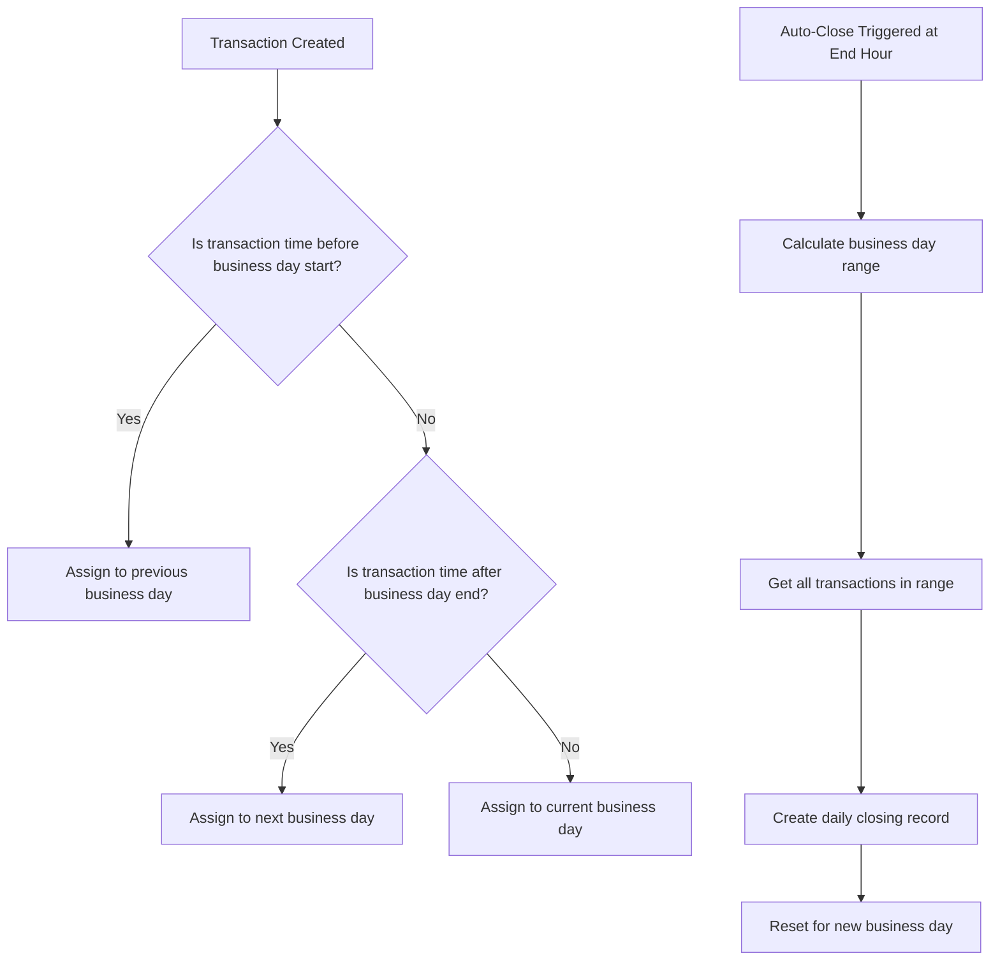

# Business Hours Automation Implementation Plan

## Executive Summary

This document outlines the implementation plan for automating business day management in the TEV2 POS system. The goal is to enable automatic business day ending based on configured business hours, with support for overnight business days (e.g., 10 PM to 4 AM for hospitality venues).

## Current State Analysis

### Database Schema

The [`Settings`](backend/prisma/schema.prisma:213) model already has the necessary fields:

```prisma
model Settings {
  id                  Int       @id @default(autoincrement())
  taxMode             String
  autoStartTime       String
  businessDayEndHour  String    @default("06:00")  // Already exists!
  lastManualClose     DateTime?
}
```

**Key Finding**: The `businessDayEndHour` column was added via migration [`20260219130000_add_business_day_end_hour`](backend/prisma/migrations/20260219130000_add_business_day_end_hour/migration.sql:1).

### Backend Utilities

The [`businessDay.ts`](backend/src/utils/businessDay.ts:1) utility already supports overnight business days:

- [`parseTimeString()`](backend/src/utils/businessDay.ts:23) - Parses "HH:MM" format
- [`getBusinessDayRange()`](backend/src/utils/businessDay.ts:35) - Calculates start/end dates handling midnight crossing
- [`getTransactionBusinessDay()`](backend/src/utils/businessDay.ts:69) - Determines which business day a transaction belongs to
- [`getHoursInBusinessDay()`](backend/src/utils/businessDay.ts:118) - Calculates hours in a business day

### Backend Services

The [`dailyClosingService.ts`](backend/src/services/dailyClosingService.ts:1) provides:

- [`calculateDailyClosingSummary()`](backend/src/services/dailyClosingService.ts:20) - Aggregates transaction data for a period
- [`createDailyClosing()`](backend/src/services/dailyClosingService.ts:80) - Creates a closing record

### Backend Handlers

The [`dailyClosings.ts`](backend/src/handlers/dailyClosings.ts:1) handler provides:

- `GET /api/daily-closings` - List all closings with filters
- `GET /api/daily-closings/:id` - Get specific closing
- `POST /api/daily-closings` - Create a closing (admin only)

The [`settings.ts`](backend/src/handlers/settings.ts:1) handler provides:

- `GET /api/settings` - Get current settings
- `PUT /api/settings` - Update settings

**Gap**: The settings handler does NOT expose `businessDayEndHour` in its responses.

### Frontend Components

The [`BusinessDaySettings.tsx`](frontend/components/BusinessDaySettings.tsx:1) component currently:

- Provides a dropdown for `autoStartTime` selection
- Has a manual close button
- Does NOT expose `businessDayEndHour` configuration

### Shared Types

The [`Settings`](shared/types.ts:70) type definition is missing `businessDayEndHour`:

```typescript
export interface Settings {
  tax: TaxSettings;
  businessDay: {
    autoStartTime: string;
    lastManualClose: string | null;
    // Missing: businessDayEndHour
  };
}
```

---

## Implementation Plan

### Phase 1: Type and API Updates

#### 1.1 Update Shared Types

**File**: [`shared/types.ts`](shared/types.ts:70)

```typescript
export interface Settings {
  tax: TaxSettings;
  businessDay: {
    autoStartTime: string;      // e.g., "22:00" for 10 PM start
    businessDayEndHour: string; // e.g., "04:00" for 4 AM end
    lastManualClose: string | null;
    autoCloseEnabled: boolean;  // New: toggle for automatic closing
  };
}
```

#### 1.2 Update Settings Handler

**File**: [`backend/src/handlers/settings.ts`](backend/src/handlers/settings.ts:1)

Update GET endpoint to include `businessDayEndHour`:

```typescript
const result: Settings = {
  tax: { 
    mode: settings.taxMode as 'inclusive' | 'exclusive' | 'none' 
  },
  businessDay: {
    autoStartTime: settings.autoStartTime,
    businessDayEndHour: settings.businessDayEndHour,  // Add this
    lastManualClose: settings.lastManualClose?.toISOString() || null,
    autoCloseEnabled: settings.autoCloseEnabled ?? false  // Add this
  }
};
```

#### 1.3 Database Migration for autoCloseEnabled

**New Migration Required**:

```sql
-- Add autoCloseEnabled to Settings table
ALTER TABLE "settings" ADD COLUMN "autoCloseEnabled" BOOLEAN NOT NULL DEFAULT false;
```

Update [`schema.prisma`](backend/prisma/schema.prisma:213):

```prisma
model Settings {
  id                  Int       @id @default(autoincrement())
  taxMode             String
  autoStartTime       String
  businessDayEndHour  String    @default("06:00")
  autoCloseEnabled    Boolean   @default(false)  // New field
  lastManualClose     DateTime?

  @@map("settings")
}
```

---

### Phase 2: Automatic Business Day End Mechanism

#### 2.1 Scheduler Service

Create a new file: `backend/src/services/businessDayScheduler.ts`

**Approach**: Use `node-cron` for scheduling automatic closings.

```typescript
// Pseudo-code structure
import cron from 'node-cron';
import { prisma } from '../prisma';
import { createDailyClosing } from './dailyClosingService';
import { getBusinessDayRange } from '../utils/businessDay';

let scheduledJob: cron.ScheduledJob | null = null;

export function initializeScheduler() {
  // Load settings and schedule job
  scheduleBusinessDayEnd();
}

export function scheduleBusinessDayEnd() {
  // Cancel existing job if any
  if (scheduledJob) {
    scheduledJob.stop();
  }

  // Get settings
  const settings = await prisma.settings.findFirst();
  if (!settings?.autoCloseEnabled) {
    return;
  }

  // Parse end hour
  const [hours, minutes] = settings.businessDayEndHour.split(':').map(Number);

  // Schedule cron job: "MM HH * * *" (runs daily at specified time)
  const cronExpression = `${minutes} ${hours} * * *`;
  
  scheduledJob = cron.schedule(cronExpression, async () => {
    await performAutomaticClosing();
  });
}

async function performAutomaticClosing() {
  // 1. Get system user for automatic closing (or use last active admin)
  // 2. Calculate business day range
  // 3. Create daily closing record
  // 4. Update lastManualClose equivalent for auto-close
}
```

#### 2.2 Integration with Server Startup

**File**: [`backend/src/index.ts`](backend/src/index.ts:117)

Add scheduler initialization:

```typescript
import { initializeScheduler } from './services/businessDayScheduler';

const startServer = async () => {
  try {
    // ... existing initialization ...
    
    // Initialize business day scheduler
    initializeScheduler();
    
    app.listen(PORT, HOST, () => {
      // ... existing logging ...
    });
  } catch (error) {
    // ... error handling ...
  }
};
```

#### 2.3 API Endpoint for Scheduler Status

Add endpoint to check scheduler status:

```typescript
// GET /api/settings/scheduler-status
// Returns: { isRunning: boolean, nextRunTime: Date | null }
```

---

### Phase 3: Frontend Updates

#### 3.1 Update BusinessDaySettings Component

**File**: [`frontend/components/BusinessDaySettings.tsx`](frontend/components/BusinessDaySettings.tsx:1)

Add UI elements for:

1. **Business Day End Hour** - Time picker dropdown
2. **Auto-Close Toggle** - Enable/disable automatic closing
3. **Current Business Day Status** - Display current business day info

```tsx
// Pseudo-code for new UI elements
<div>
  <label htmlFor="business-day-end">
    {t('settings.businessDayEndHourLabel')}
  </label>
  <p className="text-xs text-slate-400 mb-2">
    {t('settings.businessDayEndHourDescription')}
  </p>
  <select
    id="business-day-end"
    value={settings.businessDayEndHour}
    onChange={(e) => onUpdate({ ...settings, businessDayEndHour: e.target.value })}
  >
    {timeOptions.map(time => (
      <option key={time} value={time}>{time}</option>
    ))}
  </select>
</div>

<div>
  <label className="flex items-center gap-2">
    <input
      type="checkbox"
      checked={settings.autoCloseEnabled}
      onChange={(e) => onUpdate({ ...settings, autoCloseEnabled: e.target.checked })}
    />
    <span>{t('settings.autoCloseEnabledLabel')}</span>
  </label>
  <p className="text-xs text-slate-400">
    {t('settings.autoCloseEnabledDescription')}
  </p>
</div>
```

#### 3.2 Add Business Day Status Display

Create a new component or add to existing:

```tsx
// Display current business day info
<div className="bg-slate-700 p-4 rounded-md">
  <h4>{t('settings.currentBusinessDay')}</h4>
  <p>Started: {formatBusinessDayStart(settings)}</p>
  <p>Ends at: {settings.businessDayEndHour}</p>
  <p>Status: {isBusinessDayActive() ? 'Active' : 'Ended'}</p>
</div>
```

---

### Phase 4: Overnight Business Day Handling

#### 4.1 Business Day Logic Flow



#### 4.2 Example Scenarios

**Scenario 1: Bar open 22:00 - 04:00**

| Time | Business Day |
|------|--------------|
| Tuesday 21:59 | Monday's business day |
| Tuesday 22:00 | Tuesday's business day starts |
| Wednesday 02:30 | Tuesday's business day |
| Wednesday 04:00 | Tuesday's business day ends (auto-close) |
| Wednesday 04:01 | Wednesday's business day |

**Scenario 2: Auto-close disabled, manual close only**

- User manually triggers close at any time
- System calculates transactions since last close or business day start

#### 4.3 Edge Cases to Handle

1. **No transactions in business day**: Create empty closing record
2. **Manual close before auto-close time**: Respect manual close, skip auto-close
3. **Server downtime during auto-close**: Run catch-up on startup
4. **Time zone handling**: Store times in UTC, display in local time
5. **Multiple closes in one day**: Allow with warning

---

### Phase 5: Implementation Checklist

#### Backend Changes

- [ ] Add `autoCloseEnabled` field to Settings model
- [ ] Create database migration for new field
- [ ] Update settings handler to expose all business day fields
- [ ] Create `businessDayScheduler.ts` service
- [ ] Add `node-cron` dependency
- [ ] Integrate scheduler with server startup
- [ ] Add scheduler status API endpoint
- [ ] Update business day utilities for edge cases
- [ ] Add audit logging for automatic closings

#### Frontend Changes

- [ ] Update `Settings` type definition
- [ ] Add business day end hour selector
- [ ] Add auto-close toggle
- [ ] Add current business day status display
- [ ] Add i18n translations for new labels
- [ ] Add confirmation for enabling auto-close

#### Testing

- [ ] Unit tests for scheduler service
- [ ] Integration tests for auto-close flow
- [ ] E2E tests for overnight business days
- [ ] Test edge cases (no transactions, server downtime)
- [ ] Test timezone handling

---

## Technical Considerations

### Dependencies

Add to [`backend/package.json`](backend/package.json:1):

```json
{
  "dependencies": {
    "node-cron": "^3.0.3"
  },
  "devDependencies": {
    "@types/node-cron": "^3.0.11"
  }
}
```

### Security Considerations

1. **Authentication**: Auto-close runs as system user, not as a specific admin
2. **Audit Trail**: Log all automatic closings with reason "automatic"
3. **Rate Limiting**: No rate limiting on scheduler operations
4. **Error Handling**: Failed auto-close should alert admins, not crash server

### Performance Considerations

1. **Database Queries**: Optimize transaction aggregation queries with indexes
2. **Memory**: Scheduler runs in background, minimal memory impact
3. **Concurrency**: Handle case where auto-close overlaps with manual close

### Monitoring

1. Log scheduler start/stop events
2. Log each auto-close attempt with result
3. Expose scheduler status via health check or dedicated endpoint
4. Alert on consecutive failed auto-close attempts

---

## Migration Path

### For Existing Installations

1. Deploy new code with `autoCloseEnabled` defaulting to `false`
2. Migration adds new column with safe default
3. Admin must explicitly enable auto-close in settings
4. No disruption to existing manual close workflow

### Rollback Plan

1. Set `autoCloseEnabled = false` for all settings
2. Stop scheduler service
3. Revert code changes if needed
4. Database column can remain (safe default)

---

## Summary

This implementation plan enables automatic business day ending with the following key features:

1. **Configurable business hours** - Start and end times for business day
2. **Overnight support** - Handle business days crossing midnight
3. **Automatic closing** - Optional auto-close at configured time
4. **Manual override** - Manual close still available
5. **Audit trail** - All closings logged with reason

The existing codebase already has much of the foundational logic in place. The main additions are:

- Scheduler service for automatic closing
- UI for configuring end hour and auto-close
- Database field for auto-close toggle
- Integration with server lifecycle
