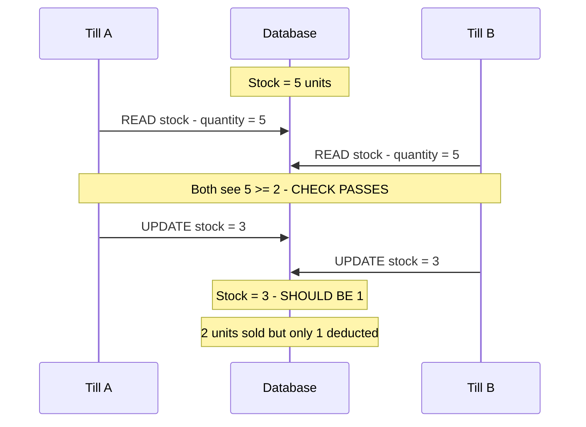
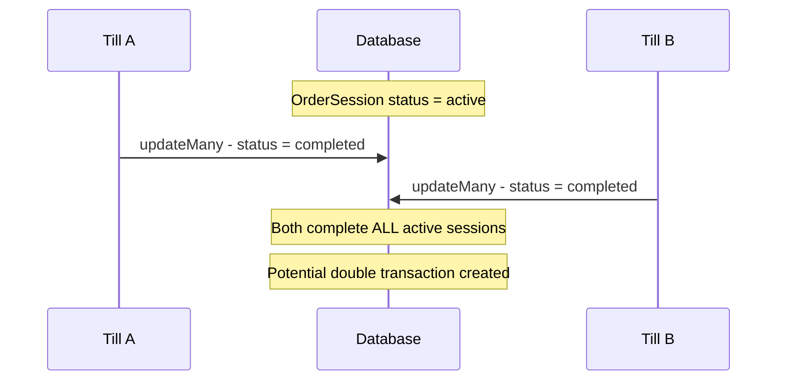
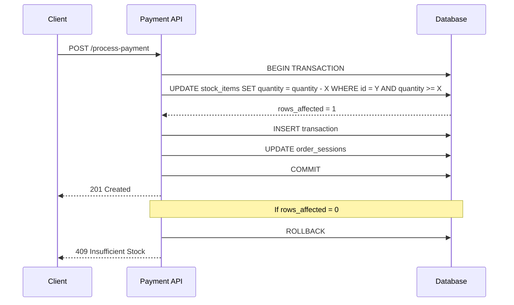
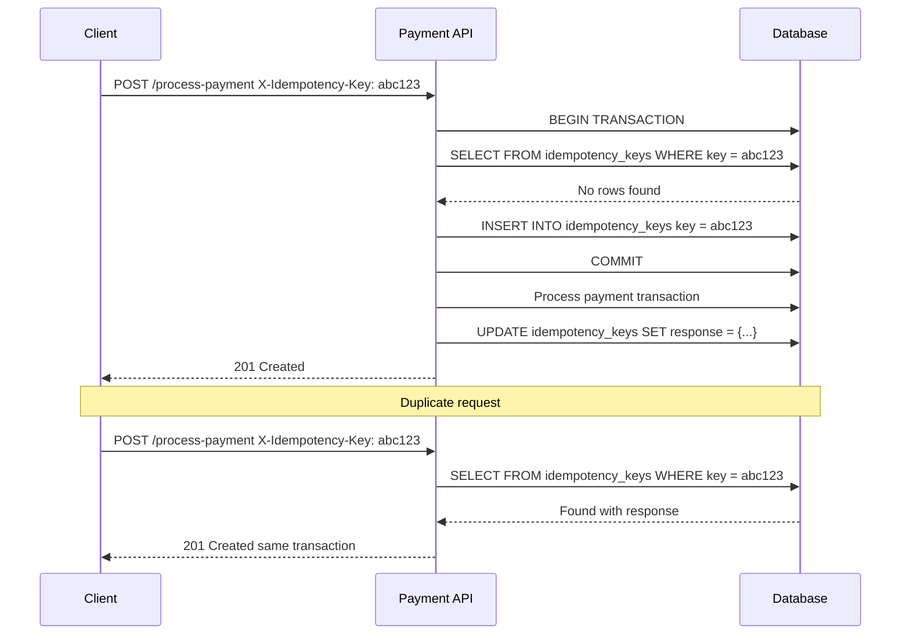

# Concurrent Payment Processing - Race Condition Fix Plan

**Document Version:** 1.0  
**Date:** 2026-03-18  
**Status:** Implementation Plan  
**Priority:** HIGH - Production Critical

---

## Executive Summary

This document provides a comprehensive implementation plan to fix all race condition issues identified in the concurrent payment processing system. The POS system's [`POST /api/transactions/process-payment`](backend/src/handlers/transactions.ts:32) endpoint contains multiple race condition vulnerabilities that can lead to:

1. **Negative stock levels** when two tills process payments simultaneously
2. **Double order session completion** causing data inconsistency
3. **Duplicate payment processing** from request retries

---

## Table of Contents

1. [Issue Analysis](#1-issue-analysis)
2. [Stock Level Race Condition Fix](#2-stock-level-race-condition-fix)
3. [Order Session Completion Fix](#3-order-session-completion-fix)
4. [Idempotency Implementation](#4-idempotency-implementation)
5. [Database Schema Enhancement](#5-database-schema-enhancement)
6. [Testing Strategy](#6-testing-strategy)
7. [Migration Strategy](#7-migration-strategy)
8. [Implementation Checklist](#8-implementation-checklist)

---

## 1. Issue Analysis

### 1.1 Current Code Analysis

The vulnerable code is located in [`backend/src/handlers/transactions.ts:176-185`](backend/src/handlers/transactions.ts:176):

```typescript
// CURRENT VULNERABLE CODE
for (const [stockItemId, quantity] of consumptions) {
  const stockItem = await tx.stockItem.findUnique({ where: { id: stockItemId } });
  if (stockItem && stockItem.quantity < quantity) {
    throw new Error(`Insufficient stock for item ${stockItem.name}`);
  }
  await tx.stockItem.update({
    where: { id: stockItemId },
    data: { quantity: { decrement: quantity } }
  });
}
```

### 1.2 Race Condition Scenarios

#### Scenario 1: Stock Level Race Condition



#### Scenario 2: Order Session Double Completion



### 1.3 Severity Assessment

| Issue | Severity | Impact | Likelihood |
|-------|----------|--------|------------|
| Stock Level Race Condition | **CRITICAL** | Stock can go negative, revenue loss | HIGH |
| Order Session Completion | MEDIUM | Data inconsistency, duplicate processing | MEDIUM |
| Double Processing | MEDIUM | Duplicate charges, customer complaints | MEDIUM |
| Missing CHECK Constraint | LOW | Database accepts invalid data | HIGH |

---

## 2. Stock Level Race Condition Fix

### 2.1 Problem Statement

The current implementation uses a **check-then-update** pattern that is not atomic:

1. Read current stock quantity
2. Check if quantity >= required
3. Decrement stock

Between steps 1-2 and 2-3, another transaction can read the same stock value.

### 2.2 Solution: Atomic Update with WHERE Clause

Replace the check-then-update pattern with a single atomic operation that includes the condition in the WHERE clause.

#### Fixed Code

```typescript
// FIXED CODE - Atomic stock decrement
if (consumptions.size > 0) {
  for (const [stockItemId, quantity] of consumptions) {
    // Atomic update - only succeeds if sufficient stock exists
    const updateResult = await tx.stockItem.updateMany({
      where: {
        id: stockItemId,
        quantity: { gte: quantity }  // Condition in WHERE clause
      },
      data: { 
        quantity: { decrement: quantity } 
      }
    });

    if (updateResult.count === 0) {
      // Either stock item doesn't exist or insufficient quantity
      const stockItem = await tx.stockItem.findUnique({ 
        where: { id: stockItemId } 
      });
      
      if (!stockItem) {
        throw new Error(`Stock item not found: ${stockItemId}`);
      }
      
      throw new Error(
        `Insufficient stock for item ${stockItem.name}. ` +
        `Available: ${stockItem.quantity}, Required: ${quantity}`
      );
    }
  }
}
```

### 2.3 Why This Works

The `updateMany` with the condition in the WHERE clause creates a single atomic database operation:

```sql
UPDATE stock_items 
SET quantity = quantity - $1 
WHERE id = $2 AND quantity >= $1
```

- If the condition is not met, **zero rows are updated**
- The `count` return value indicates success or failure
- No race condition window exists between check and update

### 2.4 Error Response Enhancement

Update the error handling to provide clear feedback:

```typescript
// Enhanced error handling
catch (error) {
  if (error instanceof Error) {
    if (error.message.includes('Insufficient stock')) {
      return res.status(409).json({ 
        error: 'INSUFFICIENT_STOCK',
        message: error.message,
        code: 'STOCK_001'
      });
    }
  }
  // ... other error handling
}
```

---

## 3. Order Session Completion Fix

### 3.1 Problem Statement

The current code at [`transactions.ts:189-192`](backend/src/handlers/transactions.ts:189):

```typescript
// CURRENT VULNERABLE CODE
await tx.orderSession.updateMany({
  where: { userId, status: 'active' },
  data: { status: 'completed', updatedAt: new Date() }
});
```

**Issues:**
- Updates ALL active sessions for a user
- No unique identifier to target specific session
- If two payments occur simultaneously, both could complete different sessions

### 3.2 Solution: Targeted Session Completion

#### Option A: Include Order Session ID in Request

Modify the payment request to include the specific order session ID:

```typescript
// Frontend sends orderSessionId with payment request
interface PaymentRequest {
  items: TransactionItem[];
  // ... other fields
  orderSessionId?: string;  // NEW: Specific session to complete
}
```

```typescript
// Backend - targeted session completion
if (orderSessionId) {
  // Complete specific session
  const updateResult = await tx.orderSession.updateMany({
    where: { 
      id: orderSessionId,
      userId,
      status: 'active'  // Only update if still active
    },
    data: { 
      status: 'completed', 
      updatedAt: new Date() 
    }
  });

  if (updateResult.count === 0) {
    // Session already completed or doesn't exist
    // This is OK for idempotency - continue with payment
    logInfo('Order session already completed or not found', {
      orderSessionId,
      userId,
      correlationId
    });
  }
} else {
  // Fallback: Complete most recent active session
  const activeSession = await tx.orderSession.findFirst({
    where: { userId, status: 'active' },
    orderBy: { createdAt: 'desc' }
  });

  if (activeSession) {
    await tx.orderSession.update({
      where: { id: activeSession.id },
      data: { status: 'completed', updatedAt: new Date() }
    });
  }
}
```

#### Option B: Use Transaction ID as Session Reference

Link the transaction to the order session:

```typescript
// Add transaction reference to order session
await tx.orderSession.update({
  where: { id: orderSessionId },
  data: { 
    status: 'completed',
    transactionId: transaction.id,  // NEW field
    updatedAt: new Date() 
  }
});
```

### 3.3 Recommended Approach

**Option A** is recommended because:
1. Explicit session targeting prevents ambiguity
2. Frontend already knows which session is being paid
3. Idempotency is easier to implement

---

## 4. Idempotency Implementation

### 4.1 Problem Statement

Without idempotency keys:
- Network timeouts can cause duplicate payments
- Browser refresh can resubmit payment
- Retry logic can create duplicate transactions

### 4.2 Solution: Idempotency Key Storage

#### Database Schema Addition

Add a new model to track idempotency keys:

```prisma
model IdempotencyKey {
  id          String   @id @default(dbgenerated("uuid_generate_v4()")) @db.Uuid
  key         String   @unique
  userId      Int
  tillId      Int
  response    Json?    // Stored response for replay
  createdAt   DateTime @default(now())
  expiresAt   DateTime @db.Index
  
  user        User     @relation(fields: [userId], references: [id])
  
  @@index([key])
  @@index([expiresAt])
  @@map("idempotency_keys")
}
```

#### Migration

```sql
-- Migration: Add idempotency_keys table
CREATE TABLE "idempotency_keys" (
    "id" UUID PRIMARY KEY DEFAULT uuid_generate_v4(),
    "key" VARCHAR(255) UNIQUE NOT NULL,
    "user_id" INTEGER NOT NULL REFERENCES "users"("id"),
    "till_id" INTEGER NOT NULL,
    "response" JSONB,
    "created_at" TIMESTAMP NOT NULL DEFAULT NOW(),
    "expires_at" TIMESTAMP NOT NULL
);

CREATE INDEX "idx_idempotency_keys_key" ON "idempotency_keys"("key");
CREATE INDEX "idx_idempotency_keys_expires_at" ON "idempotency_keys"("expires_at");
```

### 4.3 Implementation Logic

```typescript
// Idempotency middleware/handler
async function processPaymentWithIdempotency(
  req: Request, 
  res: Response
): Promise<void> {
  const idempotencyKey = req.headers['x-idempotency-key'] as string | undefined;
  const correlationId = (req as any).correlationId;

  // If no idempotency key, proceed normally (backward compatible)
  if (!idempotencyKey) {
    return processPaymentInternal(req, res);
  }

  // Validate idempotency key format
  if (!isValidIdempotencyKey(idempotencyKey)) {
    res.status(400).json({ 
      error: 'Invalid idempotency key format',
      code: 'IDEMPOTENCY_001'
    });
    return;
  }

  try {
    const result = await prisma.$transaction(async (tx) => {
      // Check if key exists
      const existing = await tx.idempotencyKey.findUnique({
        where: { key: idempotencyKey }
      });

      if (existing) {
        // Key exists - return cached response
        if (existing.response) {
          logInfo('Returning cached idempotent response', {
            key: idempotencyKey,
            correlationId
          });
          return { 
            cached: true, 
            response: existing.response as any 
          };
        }

        // Key exists but no response - request in progress
        // Wait and retry
        throw new Error('REQUEST_IN_PROGRESS');
      }

      // Create idempotency key (locks this request)
      await tx.idempotencyKey.create({
        data: {
          key: idempotencyKey,
          userId: req.user!.id,
          tillId: req.body.tillId,
          expiresAt: new Date(Date.now() + 24 * 60 * 60 * 1000) // 24 hours
        }
      });

      return { cached: false };
    });

    if (result.cached) {
      res.status(201).json(result.response);
      return;
    }

    // Process the payment
    const paymentResult = await processPaymentInternal(req, res, true);

    // Store the response
    await prisma.idempotencyKey.update({
      where: { key: idempotencyKey },
      data: { response: paymentResult }
    });

    res.status(201).json(paymentResult);

  } catch (error) {
    if (error instanceof Error && error.message === 'REQUEST_IN_PROGRESS') {
      // Return 409 Conflict - client should retry after delay
      res.status(409).json({
        error: 'Request with this idempotency key is already in progress',
        code: 'IDEMPOTENCY_002',
        retryAfter: 1000  // milliseconds
      });
      return;
    }
    throw error;
  }
}

function isValidIdempotencyKey(key: string): boolean {
  // Allow alphanumeric strings with dashes and underscores, 8-128 chars
  return /^[a-zA-Z0-9_-]{8,128}$/.test(key);
}
```

### 4.4 Frontend Integration

```typescript
// Frontend payment call with idempotency
async function processPayment(paymentData: PaymentData): Promise<Transaction> {
  // Generate idempotency key (unique per payment attempt)
  const idempotencyKey = `${userId}-${tillId}-${Date.now()}-${crypto.randomUUID()}`;
  
  const response = await fetch('/api/transactions/process-payment', {
    method: 'POST',
    headers: {
      'Content-Type': 'application/json',
      'Authorization': `Bearer ${token}`,
      'X-Idempotency-Key': idempotencyKey
    },
    body: JSON.stringify(paymentData)
  });

  if (response.status === 409) {
    // Request in progress - wait and retry
    const { retryAfter } = await response.json();
    await new Promise(resolve => setTimeout(resolve, retryAfter));
    return processPayment(paymentData);  // Retry with same key
  }

  return response.json();
}
```

### 4.5 Cleanup Strategy

```typescript
// Scheduled cleanup job - runs every hour
async function cleanupExpiredIdempotencyKeys(): Promise<void> {
  const deleted = await prisma.idempotencyKey.deleteMany({
    where: {
      expiresAt: { lt: new Date() }
    }
  });
  
  logInfo('Cleaned up expired idempotency keys', {
    count: deleted.count
  });
}
```

---

## 5. Database Schema Enhancement

### 5.1 CHECK Constraint for Non-Negative Stock

Add a database-level constraint to prevent negative stock quantities.

#### Migration File

```sql
-- Migration: Add CHECK constraint for non-negative stock quantity
-- File: backend/prisma/migrations/YYYYMMDDHHMMSS_add_stock_check_constraint/migration.sql

-- Add CHECK constraint
ALTER TABLE "stock_items" 
ADD CONSTRAINT "stock_items_quantity_non_negative" 
CHECK ("quantity" >= 0);

-- This ensures the database rejects any attempt to set quantity below 0
```

#### Prisma Schema Update

```prisma
model StockItem {
  name              String
  quantity          Int
  type              String
  baseUnit          String
  purchasingUnits   Json?
  id                String @id @default(dbgenerated("uuid_generate_v4()")) @db.Uuid
  stockAdjustments  StockAdjustment[]
  stockConsumptions StockConsumption[]

  @@map("stock_items")
  // Note: CHECK constraint is defined in migration, not in Prisma schema
  // Prisma doesn't support CHECK constraints natively yet
}
```

### 5.2 Order Session Enhancement

Add transaction reference to order session:

```prisma
model OrderSession {
  id            String    @id @default(dbgenerated("uuid_generate_v4()")) @db.Uuid
  userId        Int
  items         Json
  status        String
  transactionId Int?      // NEW: Link to completed transaction
  createdAt     DateTime  @default(now())
  updatedAt     DateTime  @updatedAt
  logoutTime    DateTime?
  
  user         User          @relation(fields: [userId], references: [id], onDelete: NoAction, onUpdate: NoAction)
  transaction  Transaction?  @relation(fields: [transactionId], references: [id])
  
  @@index([transactionId])
  @@map("order_sessions")
}
```

### 5.3 Transaction Model Update

Add reverse relation:

```prisma
model Transaction {
  id             Int           @id @default(autoincrement())
  items          Json
  subtotal       Decimal       @db.Decimal(10, 2)
  tax            Decimal       @db.Decimal(10, 2)
  tip            Decimal       @db.Decimal(10, 2)
  total          Decimal       @db.Decimal(10, 2)
  discount       Decimal       @default(0) @db.Decimal(10, 2)
  discountReason String?
  status         String        @default("completed")
  paymentMethod  String
  userId         Int
  userName       String
  tillId         Int
  tillName       String
  createdAt      DateTime      @default(now())
  
  user           User          @relation(fields: [userId], references: [id])
  orderSession   OrderSession? // NEW: Link back to order session
  
  @@map("transactions")
}
```

---

## 6. Testing Strategy

### 6.1 Unit Tests

```typescript
// backend/src/__tests__/transactions.concurrent.test.ts

describe('Concurrent Payment Processing', () => {
  
  describe('Stock Level Race Conditions', () => {
    it('should prevent stock from going negative under concurrent load', async () => {
      // Setup: Create stock item with quantity 5
      const stockItem = await prisma.stockItem.create({
        data: { name: 'Test Item', quantity: 5, type: 'ingredient', baseUnit: 'pcs' }
      });

      // Create product variant that consumes this stock
      const variant = await createVariantWithStockConsumption(stockItem.id, 2);

      // Execute: Send 3 concurrent payment requests, each requiring 2 units
      const requests = Array(3).fill(null).map(() => 
        request(app)
          .post('/api/transactions/process-payment')
          .set('Authorization', `Bearer ${adminToken}`)
          .send({
            items: [{ ...variant, quantity: 1 }],
            // ... other required fields
          })
      );

      const results = await Promise.allSettled(requests);

      // Verify: Exactly 2 should succeed, 1 should fail
      const successes = results.filter(r => r.status === 'fulfilled');
      const failures = results.filter(r => r.status === 'rejected');

      expect(successes).toHaveLength(2);
      expect(failures).toHaveLength(1);
      expect(failures[0].reason.response.body.error).toContain('Insufficient stock');

      // Verify: Stock should be exactly 1 (5 - 2 - 2)
      const finalStock = await prisma.stockItem.findUnique({ where: { id: stockItem.id } });
      expect(finalStock.quantity).toBe(1);
    });

    it('should handle atomic update correctly when stock exactly matches demand', async () => {
      // Setup: Stock = 10, demand = 10
      const stockItem = await prisma.stockItem.create({
        data: { name: 'Exact Match', quantity: 10, type: 'ingredient', baseUnit: 'pcs' }
      });

      // Execute: Request exactly 10 units
      const response = await request(app)
        .post('/api/transactions/process-payment')
        .set('Authorization', `Bearer ${adminToken}`)
        .send({
          items: [{ variantId: variant.id, quantity: 10 }],
          // ... other fields
        });

      // Verify: Should succeed
      expect(response.status).toBe(201);
      
      // Verify: Stock should be 0
      const finalStock = await prisma.stockItem.findUnique({ where: { id: stockItem.id } });
      expect(finalStock.quantity).toBe(0);
    });
  });

  describe('Order Session Completion', () => {
    it('should only complete the targeted order session', async () => {
      // Setup: Create two active order sessions for same user
      const session1 = await prisma.orderSession.create({
        data: { userId: testUser.id, items: '[]', status: 'active' }
      });
      const session2 = await prisma.orderSession.create({
        data: { userId: testUser.id, items: '[]', status: 'active' }
      });

      // Execute: Complete session1
      await request(app)
        .post('/api/transactions/process-payment')
        .set('Authorization', `Bearer ${testToken}`)
        .send({
          items: [...],
          orderSessionId: session1.id,  // Target specific session
          // ... other fields
        });

      // Verify: Session1 completed, Session2 still active
      const finalSession1 = await prisma.orderSession.findUnique({ where: { id: session1.id } });
      const finalSession2 = await prisma.orderSession.findUnique({ where: { id: session2.id } });

      expect(finalSession1.status).toBe('completed');
      expect(finalSession2.status).toBe('active');
    });
  });

  describe('Idempotency', () => {
    it('should return same response for duplicate requests with same idempotency key', async () => {
      const idempotencyKey = 'test-key-12345678';
      
      // First request
      const response1 = await request(app)
        .post('/api/transactions/process-payment')
        .set('Authorization', `Bearer ${testToken}`)
        .set('X-Idempotency-Key', idempotencyKey)
        .send(paymentData);

      expect(response1.status).toBe(201);

      // Second request with same key
      const response2 = await request(app)
        .post('/api/transactions/process-payment')
        .set('Authorization', `Bearer ${testToken}`)
        .set('X-Idempotency-Key', idempotencyKey)
        .send(paymentData);

      expect(response2.status).toBe(201);
      expect(response2.body.id).toBe(response1.body.id);  // Same transaction
    });

    it('should create different transactions for different idempotency keys', async () => {
      const response1 = await request(app)
        .post('/api/transactions/process-payment')
        .set('Authorization', `Bearer ${testToken}`)
        .set('X-Idempotency-Key', 'key-one-12345678')
        .send(paymentData);

      const response2 = await request(app)
        .post('/api/transactions/process-payment')
        .set('Authorization', `Bearer ${testToken}`)
        .set('X-Idempotency-Key', 'key-two-12345678')
        .send(paymentData);

      expect(response1.body.id).not.toBe(response2.body.id);
    });
  });
});
```

### 6.2 Load Testing with k6

```javascript
// test-files/load/concurrent-payments.js

import http from 'k6';
import { check, sleep } from 'k6';
import { randomString } from 'https://jslib.k6.io/k6-utils/1.2.0/index.js';

export const options = {
  scenarios: {
    concurrent_payments: {
      executor: 'shared-iterations',
      vus: 10,
      iterations: 100,
      maxDuration: '1m',
    },
  },
  thresholds: {
    http_req_failed: ['rate<0.05'],  // Less than 5% failures
    http_req_duration: ['p(95)<500'], // 95% under 500ms
  },
};

const BASE_URL = __ENV.BASE_URL || 'http://192.168.1.12:80';
const AUTH_TOKEN = __ENV.AUTH_TOKEN;

export default function () {
  const idempotencyKey = `k6-${randomString(8)}-${Date.now()}`;
  
  const payload = JSON.stringify({
    items: [
      { id: 1, variantId: 1, productId: 1, name: 'Test Product', price: 5.00, quantity: 1 }
    ],
    subtotal: 5.00,
    tax: 0.00,
    tip: 0.00,
    paymentMethod: 'CASH',
    userId: 1,
    userName: 'Test User',
    tillId: 1,
    tillName: 'Test Till'
  });

  const response = http.post(`${BASE_URL}/api/transactions/process-payment`, payload, {
    headers: {
      'Content-Type': 'application/json',
      'Authorization': `Bearer ${AUTH_TOKEN}`,
      'X-Idempotency-Key': idempotencyKey
    }
  });

  check(response, {
    'status is 201 or 409': (r) => [201, 409, 400].includes(r.status),
    'no server errors': (r) => r.status < 500,
  });

  sleep(0.1);
}
```

### 6.3 Integration Test Scenarios

| Test ID | Scenario | Expected Result |
|---------|----------|-----------------|
| TC-001 | 2 concurrent payments, stock=5, each needs 3 | One succeeds, one fails with insufficient stock |
| TC-002 | 5 concurrent payments, stock=10, each needs 2 | All succeed, stock=0 |
| TC-003 | Same idempotency key, 2 sequential requests | Same transaction ID returned |
| TC-004 | Same idempotency key, 2 concurrent requests | One returns 409, other completes |
| TC-005 | Payment with orderSessionId | Only that session completed |
| TC-006 | Payment without orderSessionId | Most recent session completed |

---

## 7. Migration Strategy

### 7.1 Migration Order

1. **Phase 1: Database Schema Changes**
   - Add CHECK constraint for non-negative stock
   - Add idempotency_keys table
   - Add transactionId to order_sessions

2. **Phase 2: Backend Code Changes**
   - Implement atomic stock update
   - Implement targeted session completion
   - Implement idempotency middleware

3. **Phase 3: Frontend Changes**
   - Add idempotency key generation
   - Add orderSessionId to payment requests
   - Handle 409 conflict responses

### 7.2 Backward Compatibility

```typescript
// Backward compatible implementation
async function processPayment(req: Request, res: Response) {
  // Idempotency key is optional
  const idempotencyKey = req.headers['x-idempotency-key'];
  
  // Order session ID is optional
  const { orderSessionId } = req.body;
  
  // If not provided, use legacy behavior
  if (!orderSessionId) {
    // Find most recent active session
    const activeSession = await prisma.orderSession.findFirst({
      where: { userId, status: 'active' },
      orderBy: { createdAt: 'desc' }
    });
    // ... proceed with found session
  }
}
```

### 7.3 Rollback Plan

```sql
-- Rollback: Remove CHECK constraint
ALTER TABLE "stock_items" DROP CONSTRAINT IF EXISTS "stock_items_quantity_non_negative";

-- Rollback: Drop idempotency_keys table
DROP TABLE IF EXISTS "idempotency_keys";

-- Rollback: Remove transactionId from order_sessions
ALTER TABLE "order_sessions" DROP COLUMN IF EXISTS "transaction_id";
```

---

## 8. Implementation Checklist

### Phase 1: Database Migrations

- [ ] Create migration for CHECK constraint on stock_items.quantity
- [ ] Create migration for idempotency_keys table
- [ ] Create migration for order_sessions.transactionId
- [ ] Test migrations on staging database
- [ ] Apply migrations to production

### Phase 2: Backend Implementation

- [ ] Implement atomic stock update in process-payment endpoint
- [ ] Implement targeted order session completion
- [ ] Implement idempotency key validation and storage
- [ ] Implement idempotency response caching
- [ ] Implement cleanup job for expired idempotency keys
- [ ] Add error codes for stock and idempotency errors
- [ ] Update API documentation

### Phase 3: Frontend Implementation

- [ ] Add idempotency key generation to payment flow
- [ ] Add orderSessionId to payment request payload
- [ ] Handle 409 Conflict responses with retry logic
- [ ] Update error handling for new error codes
- [ ] Test frontend with backend changes

### Phase 4: Testing

- [ ] Write unit tests for atomic stock update
- [ ] Write unit tests for idempotency
- [ ] Write integration tests for concurrent payments
- [ ] Execute load tests with k6
- [ ] Perform security review
- [ ] Conduct UAT

### Phase 5: Deployment

- [ ] Deploy to staging environment
- [ ] Execute smoke tests
- [ ] Monitor for errors
- [ ] Deploy to production
- [ ] Monitor production metrics

---

## Appendix A: Error Codes Reference

| Code | HTTP Status | Description | Client Action |
|------|-------------|-------------|---------------|
| STOCK_001 | 409 | Insufficient stock | Display error, prevent payment |
| IDEMPOTENCY_001 | 400 | Invalid idempotency key format | Generate new key |
| IDEMPOTENCY_002 | 409 | Request in progress | Wait and retry with same key |
| SESSION_001 | 404 | Order session not found | Create new session |

---

## Appendix B: Sequence Diagrams

### B.1 Atomic Stock Update Flow



### B.2 Idempotency Flow



---

## Appendix C: References

- [Prisma Transactions Documentation](https://www.prisma.io/docs/concepts/components/prisma-client/transactions)
- [Prisma updateMany API](https://www.prisma.io/docs/reference/api-reference/prisma-client-reference#updatemany)
- [PostgreSQL CHECK Constraints](https://www.postgresql.org/docs/current/ddl-constraints.html#DDL-CONSTRAINTS-CHECK-CONSTRAINTS)
- [OWASP Race Condition Guide](https://owasp.org/www-community/vulnerabilities/Race_conditions)
- [Stripe Idempotency Pattern](https://stripe.com/docs/api/idempotent_requests)
