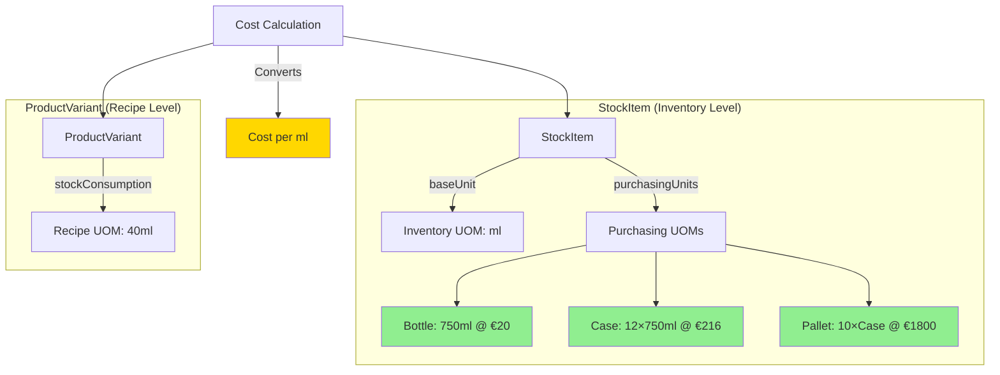
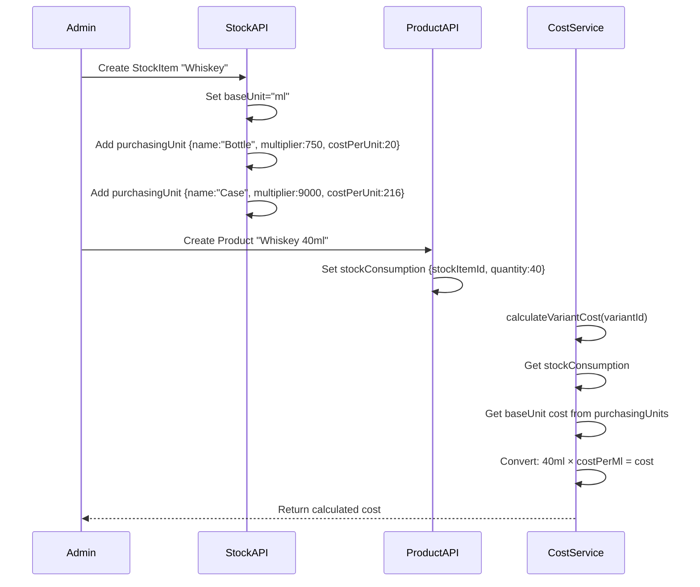

# Unit of Measure (UOM) System - Overview

## Executive Summary

This document outlines the architecture for a complete Unit of Measure (UOM) system that addresses both the unit conversion and bulk pricing requirements identified in the current consumption cost implementation.

## Problem Statement

### Current Limitations

1. **Unit Conversion Gap**: The existing `purchasingUnits` system allows defining different purchase units (Bottle, Case, Pallet) with multipliers, but:
   - Cost is stored per `baseUnit` only
   - No automatic conversion between purchase units and consumption units
   - Example: Whiskey baseUnit = "ml", but purchased in "Bottle" (750ml). Cost must be calculated manually as costPerMl × 750.

2. **Bulk Pricing Gap**: No support for tiered pricing based on purchase quantity:
   - Single bottle: €20
   - Case (12 bottles): €18/bottle = €216 total
   - Pallet (120 bottles): €15/bottle = €1,800 total

## Proposed Solution: Full UOM System

Based on research of Restaurant365 and industry best practices, we will implement a complete Unit of Measure system with three distinct unit types:

### Three Types of Units

| Unit Type | Purpose | Example (Whiskey) |
|-----------|---------|-------------------|
| **Inventory UOM** | How item is tracked in stock | ml |
| **Purchasing UOM** | How item is purchased | Bottle (750ml), Case (12×750ml), Pallet (10×Case) |
| **Recipe UOM** | How item is consumed in products | ml (or 25ml shot, 40ml dram) |

### Key Benefits

1. **Automatic Conversions**: System converts between units automatically
2. **Bulk Pricing**: Each purchasing unit can have its own cost
3. **Flexible Recipes**: Define consumption in different units (ml, shots, drams)
4. **Inventory Accuracy**: Track stock in consistent units
5. **Cost Transparency**: Clear visibility into cost breakdown

## Architecture Overview

## Use Case Examples

### Example 1: Whiskey by the Glass

**Stock Item**: "Jameson Irish Whiskey"
- Inventory UOM: ml
- Base Unit: ml

**Purchasing Units**:
| Unit | Conversion | Unit Cost | Cost per ml |
|------|------------|-----------|-------------|
| Bottle | 750 ml | €20.00 | €0.0267/ml |
| Case | 12 × 750 = 9000 ml | €216.00 | €0.0240/ml |
| Pallet | 10 × Case = 90000 ml | €1,800.00 | €0.0200/ml |

**Product Variant**: "Whiskey 40ml"
- Stock Consumption: 40 ml of Jameson Irish Whiskey
- Selling Price: €8.00
- Tax Rate: 22%

**Cost Calculation**:
- If using Bottle pricing: 40ml × €0.0267/ml = €1.07
- If using Pallet pricing (bulk): 40ml × €0.0200/ml = €0.80

### Example 2: Gin & Tonic

**Stock Items**:
1. "Gordon's Gin" - Inventory UOM: ml
   - Purchasing: Bottle (700ml @ €15)
   
2. "Tonic Water" - Inventory UOM: ml
   - Purchasing: Bottle (1000ml @ €3)

**Product Variant**: "Gin & Tonic"
- Stock Consumption:
  - 50ml Gordon's Gin
  - 200ml Tonic Water
- Selling Price: €10.00

**Cost Calculation**:
- Gin: 50ml × (€15/700ml) = €1.07
- Tonic: 200ml × (€3/1000ml) = €0.60
- Total Cost: €1.67

## Data Flow

## Backward Compatibility

The UOM system will be implemented with full backward compatibility:

1. **Existing StockItems**: Will continue to work with default UOM values
2. **Existing costPerUnit**: Will be used as the default cost when no purchasing unit is specified
3. **Existing costPrice override**: Will continue to work as before

## Scope

This implementation includes:

1. Database schema changes to support UOM structure
2. Updated cost calculation service with automatic conversions
3. Backend API endpoints for managing purchasing units with costs
4. Frontend UI for managing UOM and bulk pricing
5. Migration strategy for existing data

## Related Documents

- [Database Schema](./11-uom-database-schema.md)
- [Cost Calculation Logic](./12-uom-cost-calculation.md)
- [Backend API Changes](./13-uom-backend-api.md)
- [Frontend Changes](./14-uom-frontend-changes.md)
- [Migration Plan](./15-uom-migration-plan.md)
- [Implementation Checklist](./16-uom-implementation-checklist.md)
