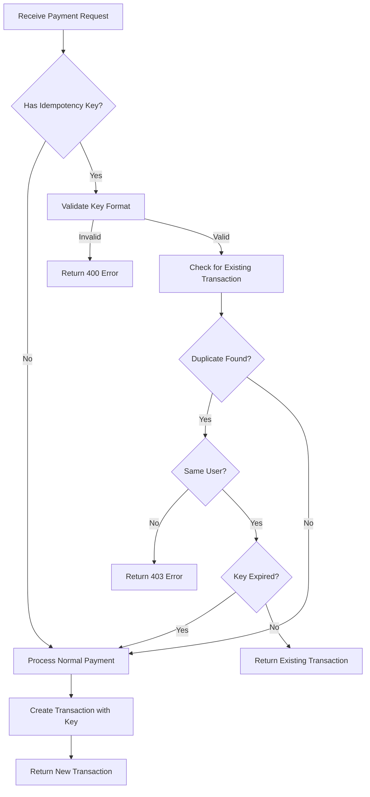

# Idempotency Protection for Duplicate Payments - Implementation Plan

## Executive Summary

This document outlines a comprehensive plan for implementing idempotency protection to prevent duplicate payments when users accidentally click "Pay" multiple times due to slow network conditions or UI lag.

---

## 1. Current State Analysis

### 1.1 Transaction Model ([`backend/prisma/schema.prisma`](backend/prisma/schema.prisma:99))

```prisma
model Transaction {
  id Int @id @default(autoincrement())
  items Json
  subtotal Decimal @db.Decimal(10, 2)
  tax Decimal @db.Decimal(10, 2)
  tip Decimal @db.Decimal(10, 2)
  total Decimal @db.Decimal(10, 2)
  discount Decimal @default(0) @db.Decimal(10, 2)
  discountReason String?
  status String @default("completed")
  paymentMethod String
  userId Int
  userName String
  tillId Int
  tillName String
  createdAt DateTime @default(now())
  version Int @default(0)
  user User @relation(fields: [userId], references: [id])

  @@map("transactions")
}
```

**Key Observations:**
- No idempotency key field exists
- `version` field exists for optimistic locking but is not used for idempotency
- No unique constraint to prevent duplicate transactions
- No expiration mechanism for detecting stale requests

### 1.2 Payment Flow Analysis

#### Backend: [`backend/src/handlers/transactions.ts`](backend/src/handlers/transactions.ts:23)

The `/process-payment` endpoint:
1. Validates request body (items, totals, user, till)
2. Recalculates and validates totals server-side
3. Executes atomic transaction with:
   - Stock consumption collection
   - Transaction record creation
   - Stock level decrement
   - Order session completion
   - Tab deletion (if exists)
   - Table status update (if assigned)

**Current Issues:**
- No check for duplicate requests
- Each request creates a new transaction
- No mechanism to return existing transaction for replayed requests

#### Frontend: [`frontend/contexts/PaymentContext.tsx`](frontend/contexts/PaymentContext.tsx:31)

The `handleConfirmPayment` function:
1. Validates user and till assignment
2. Calculates totals
3. Calls `processPayment()` API
4. Clears order and closes modal on success

**Current Issues:**
- No idempotency key generation
- No request deduplication
- Button can be clicked multiple times before response

#### PaymentModal: [`frontend/components/PaymentModal.tsx`](frontend/components/PaymentModal.tsx:203)

- Two payment buttons (Cash/Card) call `onConfirmPayment` directly
- No loading state to disable buttons during processing
- No debounce or throttle on button clicks

### 1.3 Identified Risk Scenarios

1. **Double-click**: User rapidly clicks payment button twice
2. **Network latency**: User clicks again thinking first click failed
3. **Mobile touch**: Touch events can fire multiple times
4. **Browser refresh**: User refreshes during payment processing
5. **Concurrent tabs**: User has same order open in multiple tabs

---

## 2. Proposed Database Schema Changes

### 2.1 Add Idempotency Key to Transaction Model

```prisma
model Transaction {
  id Int @id @default(autoincrement())
  idempotencyKey String? @unique // New field - unique per payment attempt
  idempotencyCreatedAt DateTime? // When the idempotency key was first used
  items Json
  subtotal Decimal @db.Decimal(10, 2)
  tax Decimal @db.Decimal(10, 2)
  tip Decimal @db.Decimal(10, 2)
  total Decimal @db.Decimal(10, 2)
  discount Decimal @default(0) @db.Decimal(10, 2)
  discountReason String?
  status String @default("completed")
  paymentMethod String
  userId Int
  userName String
  tillId Int
  tillName String
  createdAt DateTime @default(now())
  version Int @default(0)
  user User @relation(fields: [userId], references: [id])

  @@index([idempotencyKey])
  @@index([idempotencyCreatedAt])
  @@map("transactions")
}
```

### 2.2 Migration SQL

```sql
-- Add idempotency columns
ALTER TABLE "transactions" 
ADD COLUMN "idempotencyKey" TEXT,
ADD COLUMN "idempotencyCreatedAt" TIMESTAMP(3);

-- Create unique index for idempotency key
CREATE UNIQUE INDEX "transactions_idempotencyKey_key" ON "transactions"("idempotencyKey");

-- Create index for expiration queries
CREATE INDEX "transactions_idempotencyCreatedAt_idx" ON "transactions"("idempotencyCreatedAt");
```

### 2.3 Design Decisions

| Decision | Rationale |
|----------|-----------|
| `idempotencyKey` is nullable | Backward compatible with existing transactions |
| Unique constraint | Database-level guarantee against duplicates |
| Separate `idempotencyCreatedAt` | Enables key expiration without parsing `createdAt` |
| Indexed fields | Fast lookup for duplicate detection |

---

## 3. Backend Implementation Details

### 3.1 Idempotency Key Validation

```typescript
// Constants
const IDEMPOTENCY_KEY_EXPIRATION_HOURS = 24;
const IDEMPOTENCY_KEY_MIN_LENGTH = 8;
const IDEMPOTENCY_KEY_MAX_LENGTH = 128;

// Validation function
function validateIdempotencyKey(key: string | undefined): { valid: boolean; error?: string } {
  if (!key) {
    return { valid: true }; // Optional - no key means no deduplication
  }
  
  if (key.length < IDEMPOTENCY_KEY_MIN_LENGTH) {
    return { valid: false, error: 'Idempotency key too short' };
  }
  
  if (key.length > IDEMPOTENCY_KEY_MAX_LENGTH) {
    return { valid: false, error: 'Idempotency key too long' };
  }
  
  // Only allow alphanumeric, dash, underscore
  if (!/^[a-zA-Z0-9_-]+$/.test(key)) {
    return { valid: false, error: 'Invalid idempotency key format' };
  }
  
  return { valid: true };
}
```

### 3.2 Duplicate Detection Logic

```typescript
async function checkIdempotencyKey(
  tx: Prisma.TransactionClient,
  idempotencyKey: string,
  userId: number
): Promise<{ isDuplicate: boolean; existingTransaction?: Transaction }> {
  
  const existingTransaction = await tx.transaction.findUnique({
    where: { idempotencyKey }
  });
  
  if (!existingTransaction) {
    return { isDuplicate: false };
  }
  
  // Security: Only allow same user to receive duplicate result
  if (existingTransaction.userId !== userId) {
    throw new Error('IDEMPOTENCY_KEY_MISMATCH: Key belongs to different user');
  }
  
  // Check if key has expired
  const keyAge = Date.now() - existingTransaction.idempotencyCreatedAt!.getTime();
  const expirationMs = IDEMPOTENCY_KEY_EXPIRATION_HOURS * 60 * 60 * 1000;
  
  if (keyAge > expirationMs) {
    // Key expired - treat as new request
    return { isDuplicate: false };
  }
  
  return { isDuplicate: true, existingTransaction };
}
```

### 3.3 Modified Payment Handler Flow



### 3.4 Implementation in Handler

```typescript
transactionsRouter.post('/process-payment', authenticateToken, requireRole(['ADMIN', 'CASHIER']), async (req, res) => {
  const correlationId = (req as any).correlationId;
  const { idempotencyKey, ...paymentData } = req.body;
  
  // Validate idempotency key if provided
  if (idempotencyKey) {
    const validation = validateIdempotencyKey(idempotencyKey);
    if (!validation.valid) {
      return res.status(400).json({ error: validation.error });
    }
  }
  
  try {
    const result = await prisma.$transaction(async (tx) => {
      // Check for duplicate if key provided
      if (idempotencyKey) {
        const { isDuplicate, existingTransaction } = await checkIdempotencyKey(
          tx, 
          idempotencyKey, 
          paymentData.userId
        );
        
        if (isDuplicate && existingTransaction) {
          logInfo('Returning existing transaction for idempotency key', {
            correlationId,
            idempotencyKey,
            transactionId: existingTransaction.id
          });
          return { isDuplicate: true, transaction: existingTransaction };
        }
      }
      
      // Process normal payment...
      const transaction = await tx.transaction.create({
        data: {
          idempotencyKey: idempotencyKey || null,
          idempotencyCreatedAt: idempotencyKey ? new Date() : null,
          // ... rest of payment data
        }
      });
      
      // ... stock decrement, session completion, etc.
      
      return { isDuplicate: false, transaction };
    });
    
    // Return appropriate response
    const statusCode = result.isDuplicate ? 200 : 201;
    res.status(statusCode).json({
      ...result.transaction,
      _meta: { idempotent: result.isDuplicate }
    });
    
  } catch (error) {
    // Error handling...
  }
});
```

### 3.5 Response Headers

For idempotent requests, include informative headers:

```typescript
res.setHeader('X-Idempotent-Replay', 'true');
res.setHeader('X-Original-Timestamp', existingTransaction.createdAt.toISOString());
```

---

## 4. Frontend Implementation Details

### 4.1 Idempotency Key Generation

```typescript
// frontend/utils/idempotency.ts

/**
 * Generates a unique idempotency key for payment requests
 * Format: {timestamp}-{random}-{sessionId}
 */
export function generateIdempotencyKey(): string {
  const timestamp = Date.now().toString(36);
  const random = crypto.randomUUID().split('-')[0];
  return `${timestamp}-${random}`;
}

/**
 * Stores idempotency key with order items hash for validation
 */
export function createPaymentIdempotencyKey(orderItems: OrderItem[]): string {
  const baseKey = generateIdempotencyKey();
  // Include hash of items to ensure key is unique to this order
  const itemsHash = hashOrderItems(orderItems);
  return `${baseKey}-${itemsHash}`;
}

function hashOrderItems(items: OrderItem[]): string {
  // Simple hash based on item IDs and quantities
  const signature = items
    .map(i => `${i.variantId}:${i.quantity}`)
    .sort()
    .join(',');
  
  // Simple hash function (for uniqueness, not security)
  let hash = 0;
  for (let i = 0; i < signature.length; i++) {
    const char = signature.charCodeAt(i);
    hash = ((hash << 5) - hash) + char;
    hash = hash & hash;
  }
  return Math.abs(hash).toString(36);
}
```

### 4.2 Payment Button State Management

```typescript
// frontend/contexts/PaymentContext.tsx

const [isProcessingPayment, setIsProcessingPayment] = useState(false);
const [currentIdempotencyKey, setCurrentIdempotencyKey] = useState<string | null>(null);

const handleConfirmPayment = async (paymentMethod: string, tip: number, discount: number, discountReason: string) => {
  // Prevent double-clicks
  if (isProcessingPayment) {
    console.log('Payment already in progress, ignoring duplicate click');
    return;
  }
  
  setIsProcessingPayment(true);
  
  // Generate idempotency key for this payment attempt
  const idempotencyKey = createPaymentIdempotencyKey(orderItems);
  setCurrentIdempotencyKey(idempotencyKey);
  
  try {
    // ... existing payment logic
    
    await processPayment({
      ...paymentData,
      idempotencyKey
    });
    
    // ... success handling
  } catch (error) {
    // ... error handling
  } finally {
    setIsProcessingPayment(false);
    setCurrentIdempotencyKey(null);
  }
};
```

### 4.3 PaymentModal Button Disable State

```tsx
// frontend/components/PaymentModal.tsx

interface PaymentModalProps {
  isOpen: boolean;
  onClose: () => void;
  orderItems: OrderItem[];
  taxSettings: TaxSettings;
  onConfirmPayment: (paymentMethod: string, tip: number, discount: number, discountReason: string) => void;
  assignedTable?: { name: string } | null;
  isProcessing?: boolean; // New prop
}

// In the component:
<button
  onClick={() => onConfirmPayment('Cash', tip, discount, discountReason)}
  disabled={isProcessing}
  className={`flex-1 font-bold py-4 text-lg rounded-md transition ${
    isProcessing 
      ? 'bg-gray-500 cursor-not-allowed' 
      : 'bg-green-600 hover:bg-green-500'
  } text-white`}
>
  {isProcessing ? (
    <span className="flex items-center justify-center gap-2">
      <LoadingSpinner />
      {t('payment.processing')}
    </span>
  ) : (
    t('payment.payWithCash')
  )}
</button>
```

### 4.4 Transaction Service Update

```typescript
// frontend/services/transactionService.ts

export interface ProcessPaymentData {
  items: Transaction['items'];
  subtotal: number;
  tax: number;
  tip: number;
  paymentMethod: string;
  userId: number;
  userName: string;
  tillId: number;
  tillName: string;
  discount?: number;
  discountReason?: string;
  activeTabId?: number;
  tableId?: string;
  tableName?: string;
  idempotencyKey?: string; // New field
}

export const processPayment = async (paymentData: ProcessPaymentData): Promise<Transaction> => {
  try {
    const response = await fetch(apiUrl('/api/transactions/process-payment'), {
      method: 'POST',
      headers: getAuthHeaders(),
      credentials: 'include',
      body: JSON.stringify(paymentData)
    });

    if (!response.ok) {
      const errorData = await response.json().catch(() => ({}));
      const errorMessage = errorData.error || i18n.t('api.httpError', { status: response.status });
      throw new Error(errorMessage);
    }
    
    const result = await response.json();
    
    // Log if this was an idempotent replay
    if (result._meta?.idempotent) {
      console.info('Payment was deduplicated by idempotency key');
    }
    
    notifyUpdates();
    return result;
  } catch (error) {
    console.error(i18n.t('transactionService.errorProcessingPayment'), error);
    throw error;
  }
};
```

---

## 5. Security Considerations

### 5.1 Key Validation Rules

| Rule | Implementation | Purpose |
|------|----------------|---------|
| Minimum length | 8 characters | Prevent brute-force collisions |
| Maximum length | 128 characters | Prevent DoS via large keys |
| Character set | Alphanumeric, dash, underscore | Prevent injection attacks |
| User binding | Check userId matches | Prevent cross-user replay |

### 5.2 Key Expiration

- **Duration**: 24 hours
- **Rationale**: Balances user experience with storage efficiency
- **Implementation**: Query filter on `idempotencyCreatedAt`

### 5.3 Threat Mitigation

| Threat | Mitigation |
|--------|------------|
| Key enumeration | Keys are client-generated with high entropy |
| Cross-user replay | userId validation on duplicate detection |
| Key collision | UUID component + timestamp + items hash |
| Storage bloat | Automatic expiration after 24 hours |

### 5.4 Audit Logging

All idempotent replays should be logged:

```typescript
logInfo('Idempotent payment replay', {
  correlationId,
  idempotencyKey,
  transactionId: existingTransaction.id,
  originalCreatedAt: existingTransaction.createdAt,
  userId: paymentData.userId
});
```

---

## 6. Testing Strategy

### 6.1 Unit Tests

#### Backend Tests

```typescript
describe('Idempotency Key Validation', () => {
  it('should accept valid idempotency keys', () => {
    const result = validateIdempotencyKey('abc123-def456-ghi789');
    expect(result.valid).toBe(true);
  });
  
  it('should reject keys that are too short', () => {
    const result = validateIdempotencyKey('abc');
    expect(result.valid).toBe(false);
  });
  
  it('should reject keys with invalid characters', () => {
    const result = validateIdempotencyKey('key-with-spaces in it');
    expect(result.valid).toBe(false);
  });
});

describe('Duplicate Detection', () => {
  it('should return existing transaction for duplicate key', async () => {
    // Create transaction with key
    // Attempt payment with same key
    // Expect same transaction returned
  });
  
  it('should reject cross-user key reuse', async () => {
    // Create transaction for user A
    // Attempt payment with same key for user B
    // Expect 403 error
  });
  
  it('should allow new payment after key expiration', async () => {
    // Create transaction with expired key
    // Attempt payment with same key
    // Expect new transaction created
  });
});
```

#### Frontend Tests

```typescript
describe('Idempotency Key Generation', () => {
  it('should generate unique keys', () => {
    const key1 = generateIdempotencyKey();
    const key2 = generateIdempotencyKey();
    expect(key1).not.toBe(key2);
  });
  
  it('should include items hash in key', () => {
    const items = [{ variantId: 1, quantity: 2 }];
    const key = createPaymentIdempotencyKey(items);
    expect(key).toMatch(/-\w+$/); // Hash suffix
  });
});
```

### 6.2 Integration Tests

```typescript
describe('Payment Idempotency E2E', () => {
  it('should prevent duplicate transactions on double-click', async () => {
    // Setup: Create order with items
    // Action: Send two concurrent payment requests with same key
    // Assert: Only one transaction created
    // Assert: Both requests return same transaction
  });
  
  it('should handle rapid sequential payments', async () => {
    // Setup: Create order
    // Action: Send payment, immediately send another with same key
    // Assert: Second returns first transaction
  });
});
```

### 6.3 Manual Testing Checklist

- [ ] Double-click payment button - verify single transaction
- [ ] Slow network simulation - verify no duplicates
- [ ] Mobile touch events - verify no duplicates
- [ ] Browser refresh during payment - verify recovery
- [ ] Multiple browser tabs - verify isolation
- [ ] Key expiration after 24 hours - verify new transaction allowed
- [ ] Different user same key - verify rejection

### 6.4 Performance Testing

- Measure latency impact of idempotency check
- Verify database index effectiveness
- Test concurrent request handling

---

## 7. Implementation Checklist

### Phase 1: Database Changes
- [ ] Create migration for idempotency columns
- [ ] Add unique index on idempotencyKey
- [ ] Add index on idempotencyCreatedAt
- [ ] Run migration on development environment
- [ ] Verify backward compatibility

### Phase 2: Backend Implementation
- [ ] Add idempotency key validation function
- [ ] Add duplicate detection logic
- [ ] Modify process-payment handler
- [ ] Add idempotency response headers
- [ ] Add audit logging for replays
- [ ] Write unit tests

### Phase 3: Frontend Implementation
- [ ] Create idempotency utility functions
- [ ] Add isProcessing state to PaymentContext
- [ ] Update PaymentModal with loading state
- [ ] Modify transactionService to include key
- [ ] Write unit tests

### Phase 4: Integration Testing
- [ ] Write integration tests
- [ ] Perform manual testing
- [ ] Performance testing
- [ ] Security review

### Phase 5: Deployment
- [ ] Deploy database migration
- [ ] Deploy backend changes
- [ ] Deploy frontend changes
- [ ] Monitor for issues

---

## 8. Rollback Plan

If issues arise after deployment:

1. **Database**: Columns are nullable - no rollback needed
2. **Backend**: Remove idempotency logic, ignore key field
3. **Frontend**: Remove key generation, disable loading state

The implementation is designed to be backward compatible and can be safely rolled back without data loss.

---

## 9. Future Enhancements

1. **Idempotency key cleanup job**: Periodic cleanup of expired keys
2. **Metrics dashboard**: Track duplicate prevention statistics
3. **Extended expiration**: Configurable expiration per tenant
4. **Request signing**: Additional security for key validation

---

## 10. References

- [HTTP Idempotency - Stripe API](https://stripe.com/docs/api/idempotent_requests)
- [Idempotency Keys - HTTP API Design](https://developer.mozilla.org/en-US/docs/Glossary/Idempotent)
- [Designing for Idempotency - Microsoft Azure](https://docs.microsoft.com/en-us/azure/architecture/patterns/idempotency)
