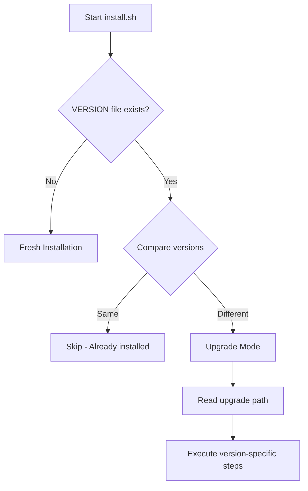
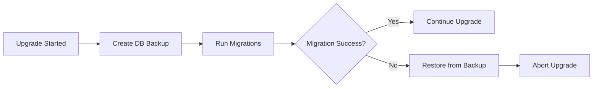
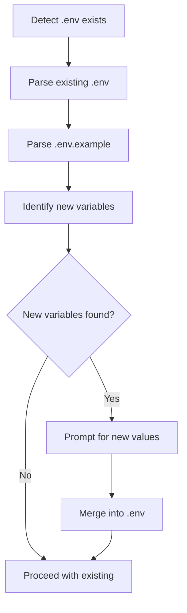
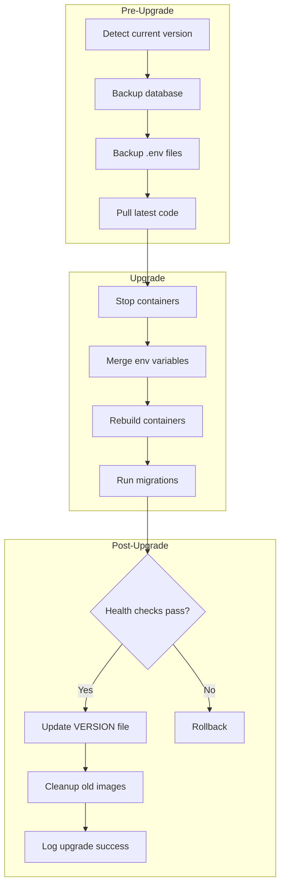

# Install.sh Upgrade Handling Analysis

## Executive Summary

This document analyzes the current [`install.sh`](../install.sh) script's capabilities for handling application upgrades and identifies gaps that need to be addressed to ensure smooth upgrades when new features are added.

---

## 1. Current State Analysis

### 1.1 Script Overview

The [`install.sh`](../install.sh) script is a comprehensive installation script (1,185 lines) designed primarily for **fresh installations**. It handles:

- Linux distribution detection (Debian, RedHat, Arch, SUSE, Alpine families)
- Docker and Docker Compose installation
- Interactive environment configuration
- Container build and deployment

### 1.2 Current Upgrade-Related Features

| Feature | Implementation | Location |
|---------|---------------|----------|
| Existing .env detection | ✅ Checks if `.env` exists and offers reconfiguration | Lines 720-733 |
| .env backup | ✅ Creates timestamped backup before reconfiguration | Line 725 |
| Container rebuild | ✅ Stops existing containers and rebuilds | Lines 993-1006 |
| Database migrations | ⚠️ Handled by docker-entrypoint.sh | [`backend/docker-entrypoint.sh`](../backend/docker-entrypoint.sh) |

### 1.3 Database Migration Handling

Migrations are handled automatically by [`backend/docker-entrypoint.sh`](../backend/docker-entrypoint.sh:11-27):

```sh
# Production mode
npx prisma migrate deploy || echo "Migration completed or failed..."

# Development mode  
npx prisma migrate deploy || echo "Migration completed or failed..."
npx prisma db seed || echo "Database seeding completed or failed"
```

**Current Migration History** (20 migrations as of analysis):
- Initial schema setup
- Stock items UUID migration
- Order sessions, tables, rooms
- Product grid layouts and variant layouts
- Token blacklist and user tokens
- Discount fields for transactions

### 1.4 Environment Variable Management

The script generates two environment files:

1. **Root [`.env`](../.env)** - Docker Compose configuration
2. **Backend [`backend/.env`](../backend/.env)** - Application configuration

Current behavior when `.env` exists:
- Prompts for reconfiguration
- Creates backup: `.env.backup.YYYYMMDDHHMMSS`
- Overwrites the file completely

---

## 2. Identified Gaps

### 2.1 Critical Gaps

#### GAP-1: No Version Tracking

**Issue**: The script has no mechanism to track which version of the application is installed.

**Impact**: 
- Cannot determine if an upgrade is needed
- Cannot make version-specific migration decisions
- No way to warn users about breaking changes

**Current State**: No `VERSION` file or version tracking in the script.

---

#### GAP-2: No Pre-Upgrade Database Backup

**Issue**: While migrations are applied automatically, there is no database backup before upgrades.

**Impact**:
- Data loss risk if migration fails
- No rollback capability for data
- Cannot recover from failed migrations

**Current State**: Migrations run via `prisma migrate deploy` without pre-backup.

---

#### GAP-3: No Environment Variable Merge Strategy

**Issue**: When new environment variables are added, the script either:
- Skips configuration (if `.env` exists and user declines reconfiguration)
- Overwrites everything (if user accepts reconfiguration)

**Impact**:
- New required variables may be missing
- User loses custom configurations if they reconfigure
- No way to add new variables while preserving existing ones

**Example Scenario**: If a new `REDIS_URL` variable is added in v2.0, existing installations won't get it.

---

#### GAP-4: No Dependency Update Verification

**Issue**: The script rebuilds containers but doesn't verify if new dependencies require additional steps.

**Impact**:
- New npm packages may require post-install scripts
- Database driver updates may need configuration changes
- Breaking dependency changes may cause runtime errors

---

### 2.2 Moderate Gaps

#### GAP-5: No Docker Image Cleanup

**Issue**: Rebuilding containers leaves old images behind.

**Impact**:
- Disk space consumption over time
- Potential confusion about which image is running

**Current State**: Uses `docker compose up -d --build` without pruning.

---

#### GAP-6: No Health Check Validation Post-Upgrade

**Issue**: The script waits for services to be healthy but doesn't validate application functionality.

**Impact**:
- Upgrade may appear successful but application may be broken
- No automated verification of critical endpoints

---

#### GAP-7: No Rollback Mechanism

**Issue**: If an upgrade fails, there is no automated way to revert.

**Impact**:
- Manual intervention required for recovery
- Extended downtime during troubleshooting

---

#### GAP-8: No Upgrade-Specific Logging

**Issue**: Upgrade operations are not logged separately from installation logs.

**Impact**:
- Difficult to diagnose upgrade issues
- No audit trail of what changed

---

### 2.3 Minor Gaps

#### GAP-9: No User Communication During Upgrade

**Issue**: Users aren't informed about what changes an upgrade will bring.

**Impact**:
- Users may not be aware of new features
- No warning about breaking changes

---

#### GAP-10: No Dry-Run Mode

**Issue**: Cannot preview what an upgrade would do without executing it.

**Impact**:
- Risk of unexpected changes
- Cannot validate upgrade plan before execution

---

## 3. Recommended Improvements

### 3.1 Version Tracking System



**Implementation**:
1. Create a `VERSION` file at project root
2. Add version comparison logic to `install.sh`
3. Maintain `UPGRADE.md` with version-specific instructions

---

### 3.2 Pre-Upgrade Database Backup



**Implementation**:
1. Add `backup_database()` function to `install.sh`
2. Use `pg_dump` before migrations
3. Store backups with version timestamp
4. Implement `restore_database()` function for rollback

---

### 3.3 Environment Variable Merge Strategy



**Implementation**:
1. Create `merge_env_files()` function
2. Compare `.env` with `.env.example`
3. Prompt only for new/changed variables
4. Preserve existing values

---

### 3.4 Upgrade Mode Architecture

Add an `--upgrade` flag that triggers specific behavior:

```bash
./install.sh --upgrade        # Interactive upgrade
./install.sh --upgrade --dry-run  # Preview changes
./install.sh --upgrade --backup-only  # Only create backup
```

**Upgrade Flow**:



---

### 3.5 Recommended New Functions

| Function | Purpose | Priority |
|----------|---------|----------|
| `detect_installed_version()` | Read VERSION file | High |
| `backup_database()` | Create pg_dump backup | High |
| `restore_database()` | Restore from backup | High |
| `merge_env_files()` | Merge new env vars | High |
| `validate_upgrade()` | Pre-upgrade checks | Medium |
| `rollback_upgrade()` | Revert to previous state | Medium |
| `cleanup_old_images()` | Docker image pruning | Low |
| `log_upgrade()` | Audit logging | Low |

---

## 4. Best Practices for Installation Scripts

### 4.1 General Principles

1. **Idempotency**: Running the script multiple times should produce the same result
2. **Atomicity**: Either complete success or complete rollback
3. **Transparency**: Clear logging of all operations
4. **Safety**: Backups before destructive operations
5. **User Control**: Allow users to review changes before applying

### 4.2 Environment Variable Best Practices

```bash
# Good: Check for required variables
required_vars=("DATABASE_URL" "JWT_SECRET" "NODE_ENV")
for var in "${required_vars[@]}"; do
    if [[ -z "${!var}" ]]; then
        print_error "Required variable $var is not set"
        exit 1
    fi
done

# Good: Provide defaults for optional variables
LOG_LEVEL="${LOG_LEVEL:-info}"
DEBUG_LOGGING="${DEBUG_LOGGING:-false}"
```

### 4.3 Database Migration Best Practices

1. **Always backup before migration**
2. **Test migrations on a copy of production data**
3. **Use transactions when possible**
4. **Have a rollback script for each migration**
5. **Log migration results**

### 4.4 Docker Best Practices

```bash
# Good: Clean build without cache for upgrades
docker compose build --no-cache

# Good: Remove orphaned containers
docker compose up -d --remove-orphans

# Good: Prune old images after successful upgrade
docker image prune -f
```

---

## 5. Implementation Priority

### Phase 1: Critical (Must Have)

| Item | Effort | Risk Reduction |
|------|--------|----------------|
| Version tracking | Low | High |
| Database backup | Medium | Critical |
| Env variable merge | Medium | High |

### Phase 2: Important (Should Have)

| Item | Effort | Value |
|------|--------|-------|
| Rollback mechanism | High | High |
| Upgrade logging | Low | Medium |
| Health check validation | Medium | High |

### Phase 3: Nice to Have

| Item | Effort | Value |
|------|--------|-------|
| Dry-run mode | Medium | Medium |
| Docker cleanup | Low | Low |
| User notifications | Medium | Medium |

---

## 6. Related Files

| File | Purpose |
|------|---------|
| [`install.sh`](../install.sh) | Main installation script |
| [`backend/docker-entrypoint.sh`](../backend/docker-entrypoint.sh) | Container startup and migrations |
| [`backend/Dockerfile`](../backend/Dockerfile) | Backend container definition |
| [`docker-compose.yml`](../docker-compose.yml) | Container orchestration |
| [`.env.example`](../.env.example) | Root environment template |
| [`backend/.env.example`](../backend/.env.example) | Backend environment template |
| [`backend/prisma/schema.prisma`](../backend/prisma/schema.prisma) | Database schema |

---

## 7. Conclusion

The current [`install.sh`](../install.sh) script is well-designed for fresh installations but lacks critical upgrade handling capabilities. The most urgent gaps are:

1. **No version tracking** - Cannot determine upgrade state
2. **No database backup** - Risk of data loss during migrations
3. **No env variable merge** - New configurations may be missing

Implementing the recommended improvements in phases will significantly reduce upgrade risks and improve the user experience for existing deployments.

---

*Document created: 2026-02-15*
*Last updated: 2026-02-15*
