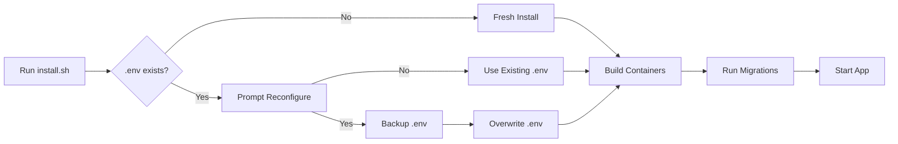
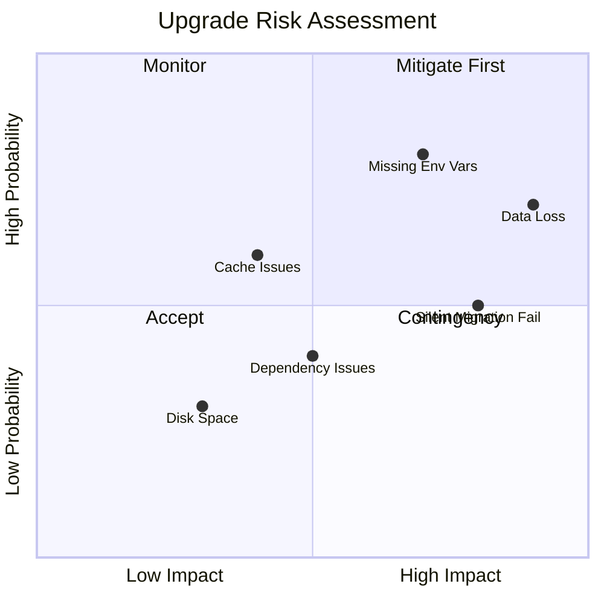
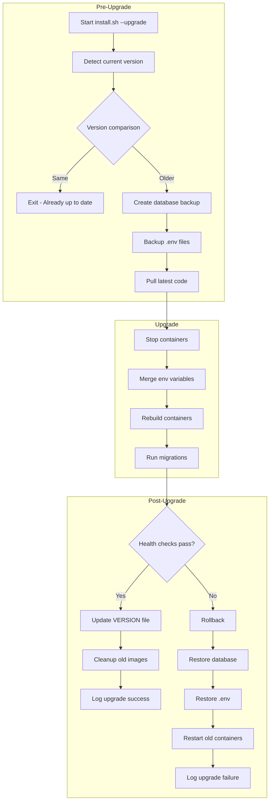

# Comprehensive Upgrade Handling Plan for install.sh

## Executive Summary

This document provides a comprehensive analysis of the [`install.sh`](../install.sh) script's upgrade handling capabilities, identifies gaps and risks, and provides detailed implementation recommendations for robust upgrade procedures.

---

## 1. Current State Analysis

### 1.1 Script Overview

The [`install.sh`](../install.sh) script (1,185 lines) is designed primarily for **fresh installations** with limited upgrade support.

| Component | Current Implementation | Location |
|-----------|----------------------|----------|
| Distribution Detection | Full support for Debian, RedHat, Arch, SUSE, Alpine families | Lines 283-362 |
| Docker Installation | Multi-distro Docker + Docker Compose installation | Lines 366-709 |
| Environment Configuration | Interactive .env generation with backup | Lines 715-957 |
| Container Management | Stop, rebuild, and start containers | Lines 963-1018 |
| Database Migrations | Delegated to [`docker-entrypoint.sh`](../backend/docker-entrypoint.sh) | External |

### 1.2 Current Upgrade-Related Features



**Existing Features:**
- .env file existence detection (Line 720)
- Timestamped .env backup before reconfiguration (Line 725)
- Container stop before rebuild (Lines 993-996)
- Health check waiting (Lines 1020-1072)

### 1.3 Database Migration Architecture

Migrations are handled by [`backend/docker-entrypoint.sh`](../backend/docker-entrypoint.sh):

```sh
# Production mode
npx prisma migrate deploy || echo "Migration completed or failed..."

# Development mode  
npx prisma migrate deploy || echo "Migration completed or failed..."
npx prisma db seed || echo "Database seeding completed or failed"
```

**Migration History Summary** (20 migrations):

| Migration | Date | Type | Risk Level |
|-----------|------|------|------------|
| `20251030152931_init` | Oct 2025 | Initial schema | N/A |
| `20251103223600_stock_items_uuid` | Nov 2025 | UUID migration | Medium |
| `20251104113759_add_order_session_table` | Nov 2025 | New table | Low |
| `20251104171000_add_tables_and_rooms` | Nov 2025 | New tables | Low |
| `20251114102600_add_product_grid_layouts` | Nov 2025 | New table | Low |
| `20260126181418_add_variant_layout_tables` | Jan 2026 | Complex schema | Medium |
| `20260207160000_add_token_blacklist` | Feb 2026 | Security table | Low |
| `20260215120000_add_discount_fields_to_transactions` | Feb 2026 | Column addition | Low |

### 1.4 Environment Variable Structure

**Root [`.env`](../.env.example)** (87 lines):
- `URL` - Application URL
- `NGINX_PORT` - External port
- `EXPOSE_DB_PORT` - Development flag
- `EXPOSE_FRONTEND_PORT` - Development flag
- `POSTGRES_USER`, `POSTGRES_PASSWORD`, `POSTGRES_DB` - Database config
- `JWT_SECRET` - Security
- `NODE_ENV` - Environment mode

**Backend [`backend/.env`](../backend/.env.example)** (25 lines):
- `DATABASE_URL` - Auto-constructed from root values
- `PORT` - Backend port
- `NODE_ENV` - Environment mode
- `JWT_SECRET` - Must match root
- `LOG_LEVEL`, `DEBUG_LOGGING` - Logging config

### 1.5 Docker Configuration

**Services** ([`docker-compose.yml`](../docker-compose.yml)):
- `db` - PostgreSQL 15 with persistent volume
- `backend` - Node.js 20 Alpine, built from source
- `frontend` - Multi-stage build with nginx
- `nginx` - Reverse proxy with security headers

**Volume Persistence:**
- `postgres_data` - Database persistence (survives upgrades)

**Network Architecture:**
- `internal-network` - Internal communication (no external access)
- `external-network` - External access via nginx only

---

## 2. Identified Gaps and Risks

### 2.1 Critical Gaps

#### GAP-C1: No Version Tracking

**Issue:** No mechanism to track installed version.

**Impact:**
- Cannot determine if upgrade is needed
- Cannot make version-specific migration decisions
- No warning system for breaking changes

**Evidence:**
- No `VERSION` file in project root
- No version comparison logic in [`install.sh`](../install.sh)

**Risk Level:** CRITICAL

---

#### GAP-C2: No Pre-Upgrade Database Backup

**Issue:** Migrations run without database backup.

**Impact:**
- Data loss risk if migration fails
- No rollback capability for data
- Extended downtime during manual recovery

**Evidence:**
- [`docker-entrypoint.sh`](../backend/docker-entrypoint.sh:13) runs migrations directly
- No `pg_dump` or backup mechanism

**Risk Level:** CRITICAL

---

#### GAP-C3: No Environment Variable Merge Strategy

**Issue:** New environment variables are not properly handled.

**Current Behavior:**
1. If `.env` exists and user declines reconfiguration: New variables are missing
2. If user accepts reconfiguration: All existing values are overwritten

**Impact:**
- New required variables may be missing (e.g., future `REDIS_URL`)
- User loses custom configurations
- Application may fail to start

**Example Scenario:**
```
Version 1.0: .env has DATABASE_URL, JWT_SECRET
Version 2.0: Adds REDIS_URL, SMTP_HOST
Result: Missing variables cause startup failure
```

**Risk Level:** HIGH

---

#### GAP-C4: Silent Migration Failures

**Issue:** Migration failures are silently ignored.

**Evidence:**
```sh
npx prisma migrate deploy || echo "Migration completed or failed..."
```

**Impact:**
- Partial migrations may leave database in inconsistent state
- Application starts with incomplete schema
- Data corruption risk

**Risk Level:** HIGH

---

### 2.2 Moderate Gaps

#### GAP-M1: No Dependency Update Verification

**Issue:** npm dependencies are reinstalled without verification.

**Impact:**
- Breaking changes in dependencies may cause runtime errors
- Post-install scripts may fail
- No audit of vulnerable packages

**Evidence:**
- [`backend/Dockerfile`](../backend/Dockerfile:19) runs `npm install` without audit
- No version pinning for critical packages

**Risk Level:** MEDIUM

---

#### GAP-M2: No Docker Image Cleanup

**Issue:** Old Docker images accumulate after upgrades.

**Impact:**
- Disk space consumption (potentially GB over time)
- Confusion about which image is running

**Evidence:**
- [`install.sh`](../install.sh:1001) uses `docker compose up -d --build`
- No `docker image prune` after successful upgrade

**Risk Level:** MEDIUM

---

#### GAP-M3: No Post-Upgrade Validation

**Issue:** No automated validation after upgrade.

**Impact:**
- Upgrade may appear successful but application may be broken
- No verification of critical endpoints
- Issues discovered only by users

**Risk Level:** MEDIUM

---

#### GAP-M4: No Rollback Mechanism

**Issue:** No automated way to revert failed upgrades.

**Impact:**
- Manual intervention required
- Extended downtime
- Risk of incorrect manual recovery

**Risk Level:** MEDIUM

---

#### GAP-M5: No Static Asset Cache Management

**Issue:** Frontend assets may be cached by browsers/CDNs.

**Impact:**
- Users may see old UI after upgrade
- JavaScript errors from API version mismatch

**Evidence:**
- [`nginx/nginx.conf`](../nginx/nginx.conf:155-156) sets `expires 1h` for static assets
- No cache-busting mechanism in build process

**Risk Level:** MEDIUM

---

### 2.3 Minor Gaps

#### GAP-M6: No Upgrade Logging

**Issue:** Upgrade operations are not logged separately.

**Impact:**
- Difficult to diagnose upgrade issues
- No audit trail

**Risk Level:** LOW

---

#### GAP-M7: No User Communication

**Issue:** Users are not informed about upgrade changes.

**Impact:**
- Users unaware of new features
- No warning about breaking changes

**Risk Level:** LOW

---

#### GAP-M8: No Dry-Run Mode

**Issue:** Cannot preview upgrade without executing.

**Impact:**
- Risk of unexpected changes
- Cannot validate upgrade plan

**Risk Level:** LOW

---

## 3. Risk Assessment Matrix



| Risk | Probability | Impact | Priority |
|------|-------------|--------|----------|
| Data Loss from Migration | Medium | Critical | P1 |
| Missing Environment Variables | High | High | P1 |
| Silent Migration Failure | Medium | High | P1 |
| Dependency Breaking Changes | Low | Medium | P2 |
| Browser Cache Issues | Medium | Low | P3 |
| Disk Space Consumption | Low | Low | P4 |

---

## 4. Recommended Implementation

### 4.1 Version Tracking System

**Implementation:**

1. Create `VERSION` file at project root:
```
2.1.0
```

2. Add version detection to [`install.sh`](../install.sh):

```bash
# Version tracking
readonly SCRIPT_VERSION="2.1.0"
VERSION_FILE="./VERSION"

detect_installed_version() {
    if [[ -f "$VERSION_FILE" ]]; then
        cat "$VERSION_FILE"
    else
        echo "0.0.0"  # Indicates fresh install needed
    fi
}

compare_versions() {
    # Returns: 0 (equal), 1 (first > second), 2 (first < second)
    local v1=$1 v2=$2
    if [[ "$v1" == "$v2" ]]; then return 0; fi
    local IFS=.
    local i ver1=($v1) ver2=($v2)
    for ((i=0; i<${#ver1[@]}; i++)); do
        if [[ -z ${ver2[i]} ]]; then ver2[i]=0; fi
        if ((10#${ver1[i]} > 10#${ver2[i]})); then return 1; fi
        if ((10#${ver1[i]} < 10#${ver2[i]})); then return 2; fi
    done
    return 0
}
```

---

### 4.2 Pre-Upgrade Database Backup

**Implementation:**

Add to [`install.sh`](../install.sh):

```bash
backup_database() {
    local backup_dir="./backups"
    local backup_file="db_backup_$(date +%Y%m%d_%H%M%S).sql"
    
    mkdir -p "$backup_dir"
    
    print_info "Creating database backup..."
    
    # Run pg_dump inside the database container
    docker exec bar_pos_backend_db pg_dump \
        -U "${POSTGRES_USER:-totalevo_user}" \
        -d "${POSTGRES_DB:-bar_pos}" \
        -F c \
        -f "/tmp/$backup_file"
    
    # Copy backup from container to host
    docker cp bar_pos_backend_db:"/tmp/$backup_file" "$backup_dir/$backup_file"
    
    # Cleanup inside container
    docker exec bar_pos_backend_db rm "/tmp/$backup_file"
    
    print_success "Database backup created: $backup_dir/$backup_file"
    echo "$backup_dir/$backup_file"
}

restore_database() {
    local backup_file=$1
    
    if [[ ! -f "$backup_file" ]]; then
        print_error "Backup file not found: $backup_file"
        return 1
    fi
    
    print_warning "Restoring database from backup..."
    
    # Copy backup to container
    docker cp "$backup_file" bar_pos_backend_db:/tmp/restore.backup
    
    # Restore database
    docker exec bar_pos_backend_db pg_restore \
        -U "${POSTGRES_USER:-totalevo_user}" \
        -d "${POSTGRES_DB:-bar_pos}" \
        --clean \
        --if-exists \
        /tmp/restore.backup
    
    print_success "Database restored from backup"
}
```

---

### 4.3 Environment Variable Merge Strategy

**Implementation:**

```bash
merge_env_files() {
    local existing_env=".env"
    local example_env=".env.example"
    local merged_env=".env.merged"
    
    if [[ ! -f "$existing_env" ]]; then
        print_info "No existing .env, creating from example"
        cp "$example_env" "$existing_env"
        return 0
    fi
    
    # Parse existing .env into associative array
    declare -A existing_vars
    while IFS='=' read -r key value; do
        # Skip comments and empty lines
        [[ "$key" =~ ^#.*$ ]] && continue
        [[ -z "$key" ]] && continue
        existing_vars["$key"]="$value"
    done < "$existing_env"
    
    # Check for new variables in .env.example
    local new_vars=()
    while IFS='=' read -r key value; do
        [[ "$key" =~ ^#.*$ ]] && continue
        [[ -z "$key" ]] && continue
        if [[ -z "${existing_vars[$key]}" ]]; then
            new_vars+=("$key")
        fi
    done < "$example_env"
    
    if [[ ${#new_vars[@]} -eq 0 ]]; then
        print_info "No new environment variables to add"
        return 0
    fi
    
    print_warning "New environment variables detected: ${new_vars[*]}"
    
    # Prompt for new variable values
    for var in "${new_vars[@]}"; do
        local default_value
        default_value=$(grep "^$var=" "$example_env" | cut -d'=' -f2-)
        local new_value
        new_value=$(prompt_input "Enter value for $var" "$default_value")
        existing_vars["$key"]="$new_value"
    done
    
    # Write merged .env
    # ... (write logic)
}
```

---

### 4.4 Migration Failure Handling

**Update [`backend/docker-entrypoint.sh`](../backend/docker-entrypoint.sh):

```sh
#!/bin/sh
set -e

run_migrations() {
    echo "Running database migrations..."
    
    # Check migration status first
    local pending_migrations
    pending_migrations=$(npx prisma migrate status --pending 2>/dev/null || echo "unknown")
    
    if [[ "$pending_migrations" != "0" ]] && [[ "$pending_migrations" != "unknown" ]]; then
        echo "Pending migrations detected: $pending_migrations"
        
        # Run migrations with proper error handling
        if ! npx prisma migrate deploy; then
            echo "ERROR: Migration failed!"
            echo "Database may be in an inconsistent state"
            exit 1
        fi
    else
        echo "No pending migrations"
    fi
}

# Main execution
if [ "$NODE_ENV" = "production" ]; then
    echo "Running in production mode"
    run_migrations
else
    echo "Running in development mode"
    run_migrations
    npx prisma db seed || echo "Seeding skipped or failed"
fi

echo "Starting the application..."
exec npm start
```

---

### 4.5 Upgrade Mode Architecture

**Add upgrade-specific command line options:**

```bash
# New command line options
--upgrade            # Run in upgrade mode
--upgrade --dry-run  # Preview changes without applying
--upgrade --backup-only  # Only create backup
--rollback FILE      # Rollback using specified backup
```

**Upgrade Flow:**



---

### 4.6 Post-Upgrade Validation

**Implementation:**

```bash
validate_upgrade() {
    print_info "Validating upgrade..."
    
    local errors=0
    
    # Check backend health
    if ! curl -sf "http://localhost:${NGINX_PORT:-80}/api/health" > /dev/null; then
        print_error "Backend health check failed"
        ((errors++))
    fi
    
    # Check frontend health
    if ! curl -sf "http://localhost:${NGINX_PORT:-80}/" > /dev/null; then
        print_error "Frontend health check failed"
        ((errors++))
    fi
    
    # Check database connectivity
    if ! docker exec bar_pos_backend_db pg_isready -U "${POSTGRES_USER:-totalevo_user}"; then
        print_error "Database connectivity check failed"
        ((errors++))
    fi
    
    # Check for pending migrations
    if docker exec bar_pos_backend npx prisma migrate status | grep -q "pending"; then
        print_error "Pending migrations detected"
        ((errors++))
    fi
    
    if [[ $errors -eq 0 ]]; then
        print_success "All validation checks passed"
        return 0
    else
        print_error "$errors validation check(s) failed"
        return 1
    fi
}
```

---

### 4.7 Static Asset Cache Management

**Update [`frontend/Dockerfile`](../frontend/Dockerfile):

```dockerfile
# Add build timestamp to force cache invalidation
ARG BUILD_TIMESTAMP
ENV VITE_BUILD_TIMESTAMP=$BUILD_TIMESTAMP
```

**Update [`nginx/nginx.conf`](../nginx/nginx.conf):

```nginx
# Add cache busting for index.html
location = /index.html {
    add_header Cache-Control "no-cache, no-store, must-revalidate";
    add_header Pragma "no-cache";
    add_header Expires "0";
}

# Versioned static assets (hashed filenames from Vite)
location /assets/ {
    expires 1y;
    add_header Cache-Control "public, immutable";
}
```

---

## 5. Upgrade Test Scenarios

### 5.1 Fresh Installation Test

**Steps:**
1. Remove all containers, volumes, and .env files
2. Run `./install.sh`
3. Verify all services start correctly
4. Verify database is seeded
5. Verify login works with default credentials

**Expected Result:** Clean installation with all features working.

---

### 5.2 Upgrade from Previous Version Test

**Steps:**
1. Install version N-1
2. Create test data (users, products, transactions)
3. Run `./install.sh --upgrade` for version N
4. Verify data integrity
5. Verify new features work
6. Verify existing features still work

**Expected Result:** All data preserved, new features available.

---

### 5.3 Environment Variable Merge Test

**Steps:**
1. Create .env with custom values
2. Add new variable to .env.example
3. Run `./install.sh --upgrade`
4. Verify existing values preserved
5. Verify new variable prompted and added

**Expected Result:** Existing values preserved, new variables added.

---

### 5.4 Migration Failure Rollback Test

**Steps:**
1. Install current version
2. Create test data
3. Introduce a migration that will fail
4. Run `./install.sh --upgrade`
5. Verify rollback occurs
6. Verify data restored from backup

**Expected Result:** Automatic rollback, data preserved.

---

### 5.5 Database Backup and Restore Test

**Steps:**
1. Install application
2. Create test data
3. Run `./install.sh --backup-only`
4. Verify backup file created
5. Delete some data
6. Run `./install.sh --rollback <backup-file>`
7. Verify data restored

**Expected Result:** Backup created, data restored successfully.

---

## 6. Rollback Procedures

### 6.1 Manual Rollback Steps

If automated rollback fails:

```bash
# 1. Stop all containers
docker compose down

# 2. Restore database from backup
docker exec -i bar_pos_backend_db pg_restore \
    -U totalevo_user \
    -d bar_pos \
    --clean \
    --if-exists < backups/db_backup_YYYYMMDD_HHMMSS.sql

# 3. Restore .env files
cp .env.backup_YYYYMMDDHHMMSS .env
cp backend/.env.backup_YYYYMMDDHHMMSS backend/.env

# 4. Checkout previous version
git checkout v1.0.0

# 5. Rebuild and start
docker compose up -d --build
```

### 6.2 Rollback Decision Matrix

| Scenario | Action | Data Loss Risk |
|----------|--------|----------------|
| Migration failed before changes | Restart containers | None |
| Migration failed mid-way | Restore from backup | Possible (since last backup) |
| Application startup failed | Check logs, fix config | None |
| Health check failed | Check logs, rollback | None |
| User-reported issues | Investigate, rollback if critical | None |

---

## 7. Implementation Priority

### Phase 1: Critical (Implement First)

| Item | Effort | Risk Reduction | Dependencies |
|------|--------|----------------|--------------|
| Version tracking | Low | High | None |
| Database backup | Medium | Critical | None |
| Migration failure handling | Medium | High | Database backup |
| Environment variable merge | Medium | High | None |

### Phase 2: Important (Implement Second)

| Item | Effort | Value | Dependencies |
|------|--------|-------|--------------|
| Post-upgrade validation | Medium | High | None |
| Rollback mechanism | High | High | Database backup |
| Upgrade logging | Low | Medium | None |

### Phase 3: Nice to Have (Implement Later)

| Item | Effort | Value | Dependencies |
|------|--------|-------|--------------|
| Dry-run mode | Medium | Medium | All Phase 1 |
| Docker cleanup | Low | Low | None |
| User notifications | Medium | Medium | Version tracking |
| Cache busting | Low | Medium | None |

---

## 8. Recommended New Functions Summary

| Function | Purpose | Priority | File |
|----------|---------|----------|------|
| `detect_installed_version()` | Read VERSION file | P1 | install.sh |
| `compare_versions()` | Semantic version comparison | P1 | install.sh |
| `backup_database()` | Create pg_dump backup | P1 | install.sh |
| `restore_database()` | Restore from backup | P1 | install.sh |
| `merge_env_files()` | Merge new env vars | P1 | install.sh |
| `validate_upgrade()` | Post-upgrade checks | P2 | install.sh |
| `rollback_upgrade()` | Revert to previous state | P2 | install.sh |
| `cleanup_old_images()` | Docker image pruning | P3 | install.sh |
| `log_upgrade()` | Audit logging | P3 | install.sh |

---

## 9. Related Files

| File | Purpose | Changes Needed |
|------|---------|----------------|
| [`install.sh`](../install.sh) | Main installation script | Major - add upgrade mode |
| [`backend/docker-entrypoint.sh`](../backend/docker-entrypoint.sh) | Container startup and migrations | Medium - improve error handling |
| [`backend/Dockerfile`](../backend/Dockerfile) | Backend container definition | Minor - add version label |
| [`frontend/Dockerfile`](../frontend/Dockerfile) | Frontend container definition | Minor - add cache busting |
| [`docker-compose.yml`](../docker-compose.yml) | Container orchestration | Minor - add version label |
| [`.env.example`](../.env.example) | Root environment template | Update as needed |
| [`backend/.env.example`](../backend/.env.example) | Backend environment template | Update as needed |
| `VERSION` (new) | Version tracking file | Create |
| `UPGRADE.md` (new) | Version-specific upgrade notes | Create |

---

## 10. Conclusion

The current [`install.sh`](../install.sh) script is well-designed for fresh installations but lacks critical upgrade handling capabilities. The most urgent gaps requiring immediate attention are:

1. **No version tracking** - Cannot determine upgrade state or make version-specific decisions
2. **No database backup** - Risk of data loss during migrations
3. **Silent migration failures** - Risk of inconsistent database state
4. **No env variable merge** - Risk of missing required configuration

Implementing the recommended improvements in phases will significantly reduce upgrade risks and improve the user experience for existing deployments. The estimated effort for Phase 1 (critical) is moderate, while providing substantial risk reduction.

---

*Document created: 2026-02-16*
*Based on analysis of install.sh v1.0.0*