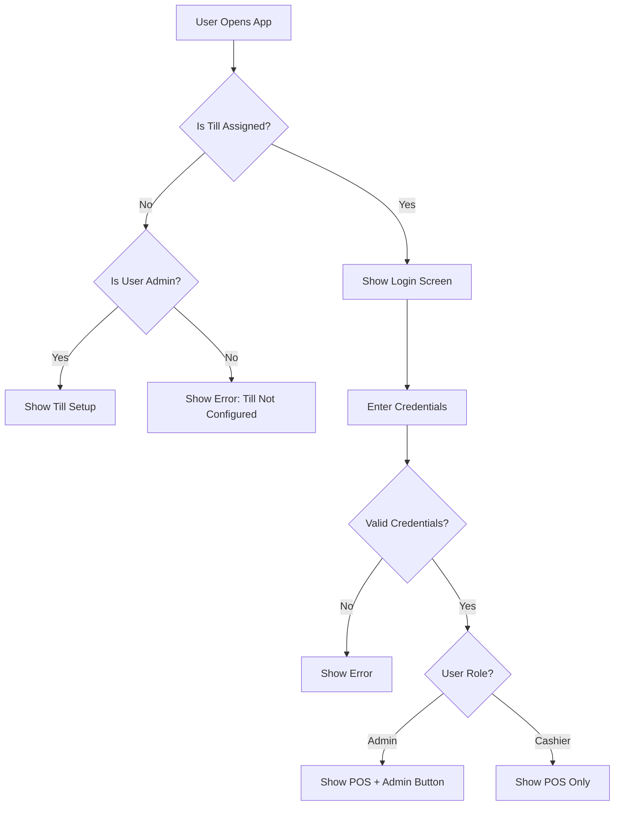
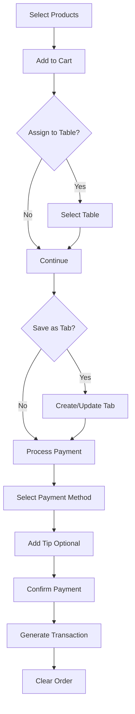
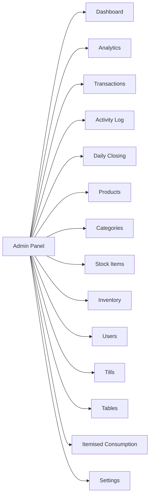
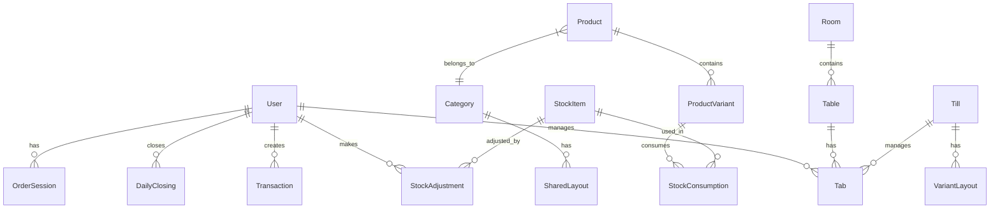

# POS Application Instruction Manual - Documentation Structure

## Overview

This document outlines the proposed structure for a comprehensive instruction manual for the POS (Point of Sale) application. The manual will be an HTML static website viewable in a browser, include visual aids and screenshots, be available in both English and Italian, and target both end users (restaurant staff) AND administrators.

---

## 1. Proposed Website Navigation Structure

```
POS Manual Homepage
├── Getting Started
│   ├── Introduction
│   ├── System Requirements
│   ├── First-Time Setup
│   └── Quick Start Guide
│
├── End User Guide (Cashier/Staff)
│   ├── Logging In
│   ├── POS Interface Overview
│   ├── Taking Orders
│   ├── Managing Tables
│   ├── Processing Payments
│   ├── Working with Tabs
│   ├── Virtual Keyboard
│   └── End of Shift
│
├── Administrator Guide
│   ├── Admin Panel Overview
│   ├── Dashboard
│   ├── Product Management
│   ├── Category Management
│   ├── Stock Items Management
│   ├── Inventory Management
│   ├── User Management
│   ├── Till Management
│   ├── Table & Room Management
│   ├── Transaction History
│   ├── Analytics
│   ├── Daily Closing
│   ├── Itemised Consumption
│   └── Settings
│
├── Reference
│   ├── Keyboard Shortcuts
│   ├── Glossary
│   ├── FAQ
│   └── Troubleshooting
│
└── Appendix
    ├── Database Schema Overview
    ├── API Endpoints Reference
    └── Release Notes
```

---

## 2. Feature List by User Role

### 2.1 End User Features (Cashier/Restaurant Staff)

| Feature | Description | Component |
|---------|-------------|-----------|
| **Login/Logout** | Secure authentication with username/password | [`LoginScreen.tsx`](frontend/components/LoginScreen.tsx) |
| **Till Assignment** | Device must be assigned to a till for operation | [`TillSetupScreen.tsx`](frontend/components/TillSetupScreen.tsx) |
| **Product Grid** | Visual grid of products organized by category | [`ProductGridLayout`](frontend/src/components/layout/ProductGridLayout.tsx) |
| **Category Navigation** | Switch between product categories | [`CategoryTabs.tsx`](frontend/src/components/CategoryTabs.tsx) |
| **Order Management** | Add items, adjust quantities, clear orders | [`OrderPanel.tsx`](frontend/components/OrderPanel.tsx) |
| **Table Assignment** | Assign orders to specific tables | [`TableAssignmentModal.tsx`](frontend/components/TableAssignmentModal.tsx) |
| **Payment Processing** | Cash and card payments with tip support | [`PaymentModal.tsx`](frontend/components/PaymentModal.tsx) |
| **Tab Management** | Create, load, and manage open tabs | [`TabManager.tsx`](frontend/components/TabManager.tsx) |
| **Item Transfer** | Transfer items between tabs | [`TransferItemsModal.tsx`](frontend/components/TransferItemsModal.tsx) |
| **Virtual Keyboard** | On-screen keyboard for touch devices | [`VirtualKeyboard.tsx`](frontend/components/VirtualKeyboard.tsx) |
| **Language Switching** | Switch between English and Italian | [`LanguageSwitcher.tsx`](frontend/components/LanguageSwitcher.tsx) |
| **Favourites** | Quick access to frequently ordered items | Product variants with `isFavourite` flag |

### 2.2 Administrator Features

| Feature | Description | Component |
|---------|-------------|-----------|
| **Dashboard** | Overview of sales, tills, and open tabs | [`ManagerDashboard.tsx`](frontend/components/ManagerDashboard.tsx) |
| **Analytics** | Sales trends, hourly charts, top performers | [`AnalyticsPanel.tsx`](frontend/components/AnalyticsPanel.tsx) |
| **Product Management** | CRUD operations for products and variants | [`ProductManagement.tsx`](frontend/components/ProductManagement.tsx) |
| **Category Management** | Create/edit categories, assign till visibility | [`CategoryManagement.tsx`](frontend/components/CategoryManagement.tsx) |
| **Stock Items** | Manage ingredients and sellable goods | [`StockItemManagement.tsx`](frontend/components/StockItemManagement.tsx) |
| **Inventory Management** | Stock adjustments and tracking | [`InventoryManagement.tsx`](frontend/components/InventoryManagement.tsx) |
| **User Management** | Create/edit users, assign roles, view reports | [`UserManagement.tsx`](frontend/components/UserManagement.tsx) |
| **Till Management** | Create tills, assign devices | [`TillManagement.tsx`](frontend/components/TillManagement.tsx) |
| **Table Management** | Rooms and tables layout editor | [`TableManagement.tsx`](frontend/components/TableManagement.tsx) |
| **Transaction History** | View and filter past transactions | [`TransactionHistory.tsx`](frontend/components/TransactionHistory.tsx) |
| **Order Activity Log** | Track removed items and cleared orders | [`OrderActivityHistory.tsx`](frontend/components/OrderActivityHistory.tsx) |
| **Daily Closing** | Close business day, generate reports | [`DailyClosingSummaryView.tsx`](frontend/components/DailyClosingSummaryView.tsx) |
| **Itemised Consumption** | View stock consumption by period | [`ItemisedConsumptionPanel.tsx`](frontend/components/itemised-consumption/ItemisedConsumptionPanel.tsx) |
| **Settings** | Tax configuration, business day settings | [`SettingsModal.tsx`](frontend/components/SettingsModal.tsx) |
| **Layout Editor** | Customize product grid layouts | [`TableLayoutEditor.tsx`](frontend/components/TableLayoutEditor.tsx) |

---

## 3. Page-by-Page Outline

### 3.1 Getting Started Section

#### 3.1.1 Introduction
- What is the POS system
- Key features and capabilities
- Target users (restaurants, cafes, bars)
- System architecture overview

#### 3.1.2 System Requirements
- Hardware requirements (touchscreen recommended)
- Browser compatibility
- Network requirements
- Database requirements (PostgreSQL)

#### 3.1.3 First-Time Setup
- Initial installation
- Database configuration
- Creating the admin account
- Setting up the first till
- Configuring business day settings

#### 3.1.4 Quick Start Guide
- 5-minute setup checklist
- Creating first product
- Taking first order
- Processing first payment

---

### 3.2 End User Guide

#### 3.2.1 Logging In
- Login screen overview
- Entering credentials
- Till assignment display
- Error handling (invalid credentials, till not configured)
- Security considerations

#### 3.2.2 POS Interface Overview
- Main screen layout
- Product grid area
- Order panel
- User information display
- Admin button (for admins only)

#### 3.2.3 Taking Orders
- Browsing products by category
- Adding items to cart
- Adjusting quantities (+/- buttons)
- Viewing subtotal
- Clearing orders
- Understanding product variants

#### 3.2.4 Managing Tables
- Assigning orders to tables
- Viewing table status
- Changing table assignments
- Table status meanings (available, occupied, reserved, unavailable)

#### 3.2.5 Processing Payments
- Opening payment modal
- Adding tips
- Selecting payment method (Cash/Card)
- Understanding tax calculation
- Completing transactions
- Receipt information

#### 3.2.6 Working with Tabs
- Creating new tabs
- Adding items to existing tabs
- Loading tabs for editing
- Closing tabs
- Transferring items between tabs

#### 3.2.7 Virtual Keyboard
- When the keyboard appears
- Numeric keypad layout
- Full keyboard layout
- Special keys (Shift, Caps, Backspace, Done)
- Positioning behavior

#### 3.2.8 End of Shift
- Logging out
- Session persistence
- Handing over to next staff member

---

### 3.3 Administrator Guide

#### 3.3.1 Admin Panel Overview
- Accessing the admin panel
- Navigation structure
- Switching between Admin and POS views
- Data refresh behavior

#### 3.3.2 Dashboard
- Total sales ticker
- Business day management
- Recent daily closings
- Till status overview
- Open tabs summary

#### 3.3.3 Product Management
- Viewing all products
- Adding new products
- Editing existing products
- Deleting products
- Managing product variants
- Setting variant prices
- Marking favourites
- Customizing button colors
- Configuring stock consumption per variant

#### 3.3.4 Category Management
- Viewing categories
- Creating new categories
- Editing category names
- Setting till visibility
- Deleting categories

#### 3.3.5 Stock Items Management
- Understanding stock item types (Ingredient vs Sellable Good)
- Adding stock items
- Setting base units
- Configuring purchasing units
- Initial quantity setup
- Editing stock items

#### 3.3.6 Inventory Management
- Viewing current stock levels
- Stock level indicators (normal, low, out)
- Making stock adjustments
- Filtering by type (ingredients/goods)
- Searching and filtering
- Viewing adjustment history

#### 3.3.7 User Management
- Viewing all users
- Adding new users
- User roles (Admin vs Cashier)
- Editing user information
- Resetting passwords
- Deleting users
- Viewing user performance reports

#### 3.3.8 Till Management
- Viewing all tills
- Adding new tills
- Assigning device to till
- Editing till names
- Deleting tills
- Understanding device-till relationship

#### 3.3.9 Table & Room Management
**Rooms Tab:**
- Adding rooms
- Editing room details
- Deleting rooms
- Room descriptions

**Tables Tab:**
- Adding tables
- Assigning tables to rooms
- Setting table positions
- Configuring table size
- Setting table status
- Table capacity

**Layout Tab:**
- Visual layout editor
- Drag and drop positioning
- View/Edit/Drag modes
- Keyboard shortcuts

#### 3.3.10 Transaction History
- Viewing transaction list
- Date range filters (today, yesterday, 7 days, 30 days, custom)
- Filtering by till
- Filtering by user
- Viewing transaction details
- Receipt information

#### 3.3.11 Analytics
- Date range selection
- Hourly sales chart (today view)
- Sales trend charts (historical)
- Top performing products
- Category performance

#### 3.3.12 Daily Closing
- Understanding business day concept
- Closing the current business day
- Viewing closing history
- Closing summary details
- Payment method breakdown
- Till breakdown

#### 3.3.13 Itemised Consumption
- Setting date filters
- Filtering by category
- Filtering by stock item type
- Viewing consumption totals
- Detailed consumption records

#### 3.3.14 Settings
**Tax Settings:**
- Tax modes (inclusive, exclusive, none)
- How tax affects pricing

**Business Day Settings:**
- Auto start time
- Manual closing

---

### 3.4 Reference Section

#### 3.4.1 Keyboard Shortcuts
| Shortcut | Action | Context |
|----------|--------|---------|
| Ctrl+R | Refresh data | Table Management |
| Ctrl+L | Switch to Layout tab | Table Management |
| Ctrl+M | Switch to Rooms tab | Table Management |
| Ctrl+T | Switch to Tables tab | Table Management |
| Ctrl++ | Add new table/room | Table Management |
| Ctrl+D | Toggle layout mode | Table Management |

#### 3.4.2 Glossary
- **Till**: A physical POS terminal/device
- **Tab**: An open order that can be saved and loaded later
- **Variant**: A specific version of a product (e.g., size options)
- **Stock Item**: An inventory item (ingredient or sellable good)
- **Category**: A group of related products
- **Business Day**: The operational period for a restaurant
- **Daily Closing**: End-of-day financial summary

#### 3.4.3 FAQ
- How do I reset a forgotten password?
- What happens if the network goes down?
- How do I transfer an order to another table?
- Can I undo a deleted item?
- How do I change the language?

#### 3.4.4 Troubleshooting
- Login issues
- Payment processing errors
- Network connectivity problems
- Data not syncing
- Touch screen calibration

---

### 3.5 Appendix

#### 3.5.1 Database Schema Overview
- Users and authentication
- Products and variants
- Categories
- Transactions
- Tables and rooms
- Tabs
- Tills
- Stock items and adjustments
- Order sessions
- Layouts

#### 3.5.2 API Endpoints Reference
| Endpoint | Methods | Description |
|----------|---------|-------------|
| `/api/products` | GET, POST, PUT, DELETE | Product management |
| `/api/users` | GET, POST, PUT, DELETE | User management |
| `/api/categories` | GET, POST, PUT, DELETE | Category management |
| `/api/settings` | GET, PUT | Application settings |
| `/api/transactions` | GET, POST | Transaction records |
| `/api/tabs` | GET, POST, PUT, DELETE | Tab management |
| `/api/tills` | GET, POST, PUT, DELETE | Till management |
| `/api/stock-items` | GET, POST, PUT, DELETE | Stock item management |
| `/api/stock-adjustments` | GET, POST | Stock adjustments |
| `/api/order-activity-logs` | GET | Activity logging |
| `/api/order-sessions` | GET, POST, PUT | Session management |
| `/api/tables` | GET, POST, PUT, DELETE | Table management |
| `/api/rooms` | GET, POST, PUT, DELETE | Room management |
| `/api/daily-closings` | GET, POST | Daily closing reports |
| `/api/consumption-reports` | GET | Consumption reports |
| `/api/analytics` | GET | Analytics data |
| `/api/layouts` | GET, POST, PUT, DELETE | Layout management |

#### 3.5.3 Release Notes
- Version history
- Feature additions
- Bug fixes
- Known issues

---

## 4. Suggested Screenshots and Visual Aids

### 4.1 Getting Started Section
| Screenshot | Description |
|------------|-------------|
| System Architecture Diagram | Visual representation of frontend, backend, database |
| Installation Flow | Step-by-step installation screenshots |
| First-Time Setup Wizard | Screenshots of initial configuration |

### 4.2 End User Guide
| Screenshot | Description |
|------------|-------------|
| Login Screen | Full login interface with till information |
| Main POS Interface | Complete view of product grid and order panel |
| Product Grid Close-up | Detailed view of product buttons and categories |
| Order Panel | Cart items, quantities, and action buttons |
| Payment Modal | Payment interface with tip and method selection |
| Tab Manager | Open tabs list with actions |
| Table Assignment Modal | Table selection interface |
| Virtual Keyboard - Numeric | Numpad layout screenshot |
| Virtual Keyboard - Full | Full keyboard layout screenshot |
| Language Switcher | Language selection dropdown |

### 4.3 Administrator Guide
| Screenshot | Description |
|------------|-------------|
| Admin Panel Navigation | Left sidebar with all admin sections |
| Dashboard Overview | Sales ticker, till status, open tabs |
| Analytics Charts | Hourly sales and trend charts |
| Product Management List | List of products with variants |
| Product Edit Modal | Form for adding/editing products |
| Variant Configuration | Stock consumption and color settings |
| Category Management | Category list with till visibility |
| Stock Items List | Inventory items with quantities |
| Stock Adjustment Modal | Form for adjusting stock |
| Inventory Dashboard | Stock levels with filters |
| User Management | User list with roles and actions |
| User Performance Report | Individual user statistics |
| Till Management | Till list with device assignment |
| Table Management - Layout | Visual layout editor |
| Table Management - Rooms | Room list and editing |
| Table Management - Tables | Table list with status |
| Transaction History | Filterable transaction list |
| Transaction Details | Receipt view |
| Daily Closing Summary | Closing reports table |
| Itemised Consumption | Consumption totals and details |
| Settings - Tax | Tax configuration options |
| Settings - Business Day | Business day timing settings |

### 4.4 Reference Section
| Visual Aid | Description |
|------------|-------------|
| Keyboard Shortcuts Diagram | Visual representation of shortcuts |
| Error Messages Reference | Common error messages and solutions |
| Status Indicators | Color-coded status meanings |

### 4.5 Appendix
| Visual Aid | Description |
|------------|-------------|
| Entity Relationship Diagram | Database schema visualization |
| API Flow Diagrams | Request/response patterns |
| Component Hierarchy | Frontend component structure |

---

## 5. Localization Notes

### 5.1 Available Languages
- English (en)
- Italian (it)

### 5.2 Translation Files Location
- Backend: [`backend/locales/en/`](backend/locales/en/) and [`backend/locales/it/`](backend/locales/it/)
- Frontend: Uses i18next with namespace organization

### 5.3 Key Translation Namespaces
- `common` - Shared buttons and labels
- `auth` - Authentication screens
- `pos` - POS interface
- `admin` - Admin panel
- `errors` - Error messages

---

## 6. Implementation Recommendations

### 6.1 Documentation Technology Stack
- Static site generator (e.g., Hugo, Jekyll, or Docusaurus)
- Markdown for content authoring
- Multi-language support via i18n plugins
- Search functionality
- Responsive design for mobile/tablet viewing

### 6.2 Screenshot Guidelines
- Use consistent window size (1920x1080 recommended)
- Include both light and dark mode if applicable
- Highlight interactive elements with callouts
- Use anonymized/demo data
- Include both English and Italian versions

### 6.3 Content Organization
- Each major section as separate page
- Breadcrumb navigation
- Previous/Next page links
- Table of contents for long pages
- Cross-references between related topics

### 6.4 Accessibility
- Alt text for all images
- Proper heading hierarchy
- Keyboard navigation support
- High contrast mode support

---

## 7. Mermaid Diagrams

### 7.1 User Authentication Flow



### 7.2 Order Processing Flow



### 7.3 Admin Panel Navigation Structure



### 7.4 Database Entity Relationships



---

## 8. Next Steps

1. **Content Creation**: Write actual documentation content for each page
2. **Screenshot Capture**: Take screenshots of all interfaces
3. **Translation**: Translate all content to Italian
4. **Website Development**: Build the static HTML website
5. **Review and Testing**: Have users test the documentation
6. **Deployment**: Deploy the documentation website

---

*Document created: February 2026*
*Last updated: February 2026*
