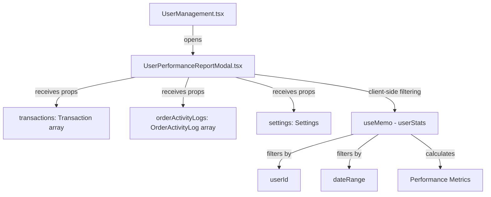

# Performance Report Filtering Enhancement Plan

## Executive Summary

This document analyzes the current Performance Report filtering implementation in the TEV2 POS system and proposes enhanced filtering options to provide more granular insights into user performance metrics.

---

## 1. Current State Analysis

### 1.1 Frontend Implementation

**Location:** [`frontend/components/UserPerformanceReportModal.tsx`](frontend/components/UserPerformanceReportModal.tsx)

The Performance Report is accessed via **Users >> Performance Report** button in the User Management panel.

#### Current Filtering Options

| Filter | Type | Options | Description |
|--------|------|---------|-------------|
| Date Range | Preset buttons | Today, This Week, This Month, All Time | Filters transactions and activity logs by time period |

#### Current Metrics Displayed

| Metric | Source | Calculation |
|--------|--------|-------------|
| Total Revenue | Transactions | Sum of transaction totals for user |
| Transaction Count | Transactions | Count of transactions for user |
| Average Sale | Transactions | Total Revenue / Transaction Count |
| Total Tips | Transactions | Sum of tip amounts |
| Top 5 Selling Items | Transaction.items | Aggregated quantity by product name |
| Top 5 Removed Items | OrderActivityLog | Aggregated removal counts from logs |
| Detailed Activity Log | OrderActivityLog | Chronological list of Item Removed and Order Cleared actions |

### 1.2 Backend Implementation

**Analytics Handler:** [`backend/src/handlers/analytics.ts`](backend/src/handlers/analytics.ts)

**Analytics Service:** [`backend/src/services/analyticsService.ts`](backend/src/services/analyticsService.ts)

The backend provides the following analytics endpoints:

| Endpoint | Purpose | Current Filters |
|----------|---------|-----------------|
| `/api/analytics/product-performance` | Product-level performance metrics | startDate, endDate, productId, categoryId, sortBy, sortOrder, page, limit |
| `/api/analytics/top-performers` | Top performing products (backward compatible) | Same as product-performance |
| `/api/analytics/hourly-sales` | Hourly sales for a business day | date |
| `/api/analytics/compare` | Compare hourly sales between two days | date1, date2 |

**Note:** The User Performance Report currently performs all filtering client-side using passed transaction and activity log data. There is no dedicated backend endpoint for user-specific performance analytics.

### 1.3 Data Flow



---

## 2. Available Data Fields for Filtering

### 2.1 Transaction Model Fields

From [`backend/prisma/schema.prisma`](backend/prisma/schema.prisma:96):

| Field | Type | Filterable | Description |
|-------|------|------------|-------------|
| `id` | Int | Yes | Transaction ID |
| `items` | Json | Partial | Array of order items with productId, name, quantity, price |
| `subtotal` | Float | Yes | Pre-tax amount |
| `tax` | Float | Yes | Tax amount |
| `tip` | Float | Yes | Tip amount |
| `total` | Float | Yes | Final total |
| `discount` | Float | Yes | Discount amount |
| `discountReason` | String? | Yes | Reason for discount |
| `status` | String | Yes | Transaction status (default: completed) |
| `paymentMethod` | String | Yes | Payment method used |
| `userId` | Int | Yes | User who processed the transaction |
| `userName` | String | Yes | User name (denormalized) |
| `tillId` | Int | Yes | Till where transaction occurred |
| `tillName` | String | Yes | Till name (denormalized) |
| `createdAt` | DateTime | Yes | Transaction timestamp |

### 2.2 OrderActivityLog Model Fields

From [`backend/prisma/schema.prisma`](backend/prisma/schema.prisma:201):

| Field | Type | Filterable | Description |
|-------|------|------------|-------------|
| `id` | Int | Yes | Log entry ID |
| `action` | String | Yes | Action type (Item Removed, Order Cleared, etc.) |
| `details` | Json | Partial | Action details (varies by action type) |
| `userId` | Int | Yes | User who performed the action |
| `userName` | String | Yes | User name (denormalized) |
| `createdAt` | DateTime | Yes | Action timestamp |

### 2.3 User Model Fields

From [`backend/prisma/schema.prisma`](backend/prisma/schema.prisma:12):

| Field | Type | Filterable | Description |
|-------|------|------------|-------------|
| `id` | Int | Yes | User ID |
| `name` | String | Yes | Display name |
| `username` | String | Yes | Login username |
| `role` | String | Yes | User role (Admin, Cashier) |

### 2.4 Till Model Fields

From [`backend/prisma/schema.prisma`](backend/prisma/schema.prisma:165):

| Field | Type | Filterable | Description |
|-------|------|------------|-------------|
| `id` | Int | Yes | Till ID |
| `name` | String | Yes | Till name |

### 2.5 Table Model Fields

From [`backend/prisma/schema.prisma`](backend/prisma/schema.prisma:128):

| Field | Type | Filterable | Description |
|-------|------|------------|-------------|
| `id` | String (UUID) | Yes | Table ID |
| `name` | String | Yes | Table name |
| `status` | String | Yes | Table status |
| `roomId` | String (UUID) | Yes | Room ID |
| `capacity` | Int? | Yes | Table capacity |

---

## 3. Proposed Enhanced Filtering Options

### 3.1 Priority 1: High Business Value Filters

#### 3.1.1 Custom Date Range Picker

**Business Justification:** Managers often need to analyze performance for specific periods (e.g., a particular shift, weekend, or promotional period) that don't align with preset options.

**Implementation:**
- Add date picker inputs for start and end dates
- Maintain preset buttons for quick access
- Validate date range (max 90 days to prevent performance issues)

**UI Location:** Replace or augment the current date range buttons in the modal header.

#### 3.1.2 Payment Method Filter

**Business Justification:** Different payment methods may have different fee structures. Understanding the mix of cash vs. card vs. other payment methods helps with financial planning and identifying training needs.

**Implementation:**
- Dropdown or checkbox filters for payment methods
- Options: Cash, Card, and any other configured payment methods
- Show filtered metrics separately

**New Metrics to Display:**
- Revenue by Payment Method
- Transaction Count by Payment Method

#### 3.1.3 Till/Station Filter

**Business Justification:** Performance may vary by till location. Some tills may be in high-traffic areas while others serve specific purposes. This helps identify if a user performs differently at different stations.

**Implementation:**
- Multi-select dropdown for till selection
- Option to compare performance across tills

**New Metrics to Display:**
- Revenue by Till
- Transaction Count by Till

### 3.2 Priority 2: Medium Business Value Filters

#### 3.2.1 Product Category Filter

**Business Justification:** In restaurants, different staff may excel at selling different categories (e.g., drinks vs. food). This filter helps identify strengths and training opportunities.

**Implementation:**
- Multi-select dropdown for categories
- Filter affects Top Selling Items and revenue calculations

**New Metrics to Display:**
- Revenue by Category
- Items Sold by Category

#### 3.2.2 Transaction Status Filter

**Business Justification:** Understanding completed vs. voided vs. refunded transactions provides insight into transaction quality and potential issues.

**Implementation:**
- Dropdown for status selection
- Default to completed transactions

**New Metrics to Display:**
- Voided/Refunded Transaction Count
- Voided/Refunded Amount

#### 3.2.3 Discount Analysis Filter

**Business Justification:** Excessive discounting can impact profitability. This filter helps identify patterns in discount usage per user.

**Implementation:**
- Toggle to include/exclude discounted transactions
- Filter by discount presence

**New Metrics to Display:**
- Total Discount Amount
- Discounted Transaction Count
- Average Discount Percentage

### 3.3 Priority 3: Nice-to-Have Filters

#### 3.3.1 Time of Day Filter

**Business Justification:** Performance during breakfast, lunch, and dinner shifts may vary. This helps with shift scheduling and identifying training needs for specific periods.

**Implementation:**
- Preset time ranges (Morning, Lunch, Afternoon, Evening, Night)
- Custom time range picker

**New Metrics to Display:**
- Revenue by Time Period
- Transaction Count by Time Period

#### 3.3.2 Transaction Size Filter

**Business Justification:** Some users may excel at small, quick transactions while others handle larger orders better. This helps optimize staff assignment.

**Implementation:**
- Range slider or preset buttons (Small: 1-3 items, Medium: 4-6 items, Large: 7+ items)
- Filter by item count or total value

**New Metrics to Display:**
- Average Items per Transaction
- Transaction Size Distribution

#### 3.3.3 Comparison Mode

**Business Justification:** Comparing performance between two periods or between two users helps identify trends and best practices.

**Implementation:**
- Toggle for comparison mode
- Select comparison period or user
- Side-by-side metrics display

---

## 4. Implementation Considerations

### 4.1 Backend API Changes

#### Option A: Client-Side Filtering (Current Approach)

**Pros:**
- No backend changes required
- Fast for small datasets
- Simple implementation

**Cons:**
- Does not scale with large transaction volumes
- All data must be loaded into memory
- Limited to data already fetched

**Recommendation:** Suitable for small venues with limited transaction history.

#### Option B: Dedicated Backend Endpoint

Create a new endpoint: `GET /api/analytics/user-performance/:userId`

**Query Parameters:**
```
startDate?: string (ISO date)
endDate?: string (ISO date)
paymentMethods?: string[] (comma-separated)
tillIds?: number[] (comma-separated)
categoryIds?: number[] (comma-separated)
status?: string
includeDiscounted?: boolean
timeOfDayStart?: string (HH:mm)
timeOfDayEnd?: string (HH:mm)
minItems?: number
maxItems?: number
```

**Response:**
```json
{
  "summary": {
    "totalRevenue": number,
    "transactionCount": number,
    "averageSale": number,
    "totalTips": number,
    "totalDiscounts": number,
    "voidedCount": number,
    "voidedAmount": number
  },
  "byPaymentMethod": [
    { "method": string, "count": number, "total": number }
  ],
  "byTill": [
    { "tillId": number, "tillName": string, "count": number, "total": number }
  ],
  "byCategory": [
    { "categoryId": number, "categoryName": string, "count": number, "total": number }
  ],
  "topSellingItems": [
    { "productId": number, "name": string, "quantity": number, "revenue": number }
  ],
  "topRemovedItems": [
    { "name": string, "count": number }
  ],
  "activityLog": [
    { "id": number, "action": string, "details": object, "createdAt": string }
  ],
  "metadata": {
    "filteredCount": number,
    "totalCount": number
  }
}
```

**Pros:**
- Scales with data growth
- Efficient database queries
- Reduced frontend memory usage
- Enables pagination for activity logs

**Cons:**
- Requires backend development
- More complex implementation

**Recommendation:** Preferred approach for production-ready solution.

### 4.2 Frontend UI Changes

#### Filter Panel Design

```
+----------------------------------------------------------+
| Performance Report - [User Name]                    [X]  |
+----------------------------------------------------------+
| Filters:                                                  |
| [Today] [Week] [Month] [All] | [Start Date] - [End Date] |
| Payment: [All v] Till: [All v] Category: [All v]         |
| Status: [Completed v] [x] Include Discounted              |
+----------------------------------------------------------+
| Summary Cards:                                            |
| +-------------+ +-------------+ +-------------+ +-------+ |
| | Revenue     | | Transactions| | Avg Sale    | | Tips  | |
| | $X,XXX.XX   | | XXX         | | $XX.XX      | | $XX.XX| |
| +-------------+ +-------------+ +-------------+ +-------+ |
+----------------------------------------------------------+
| Breakdown by Payment Method:                              |
| [Chart or Table]                                          |
+----------------------------------------------------------+
| Top Selling Items:          | Top Removed Items:          |
| 1. Item A - XX sold         | 1. Item X - XX removed      |
| 2. Item B - XX sold         | 2. Item Y - XX removed      |
+----------------------------------------------------------+
| Activity Log:                                             |
| [Expandable list with filters]                            |
+----------------------------------------------------------+
|                                              [Close]      |
+----------------------------------------------------------+
```

### 4.3 Database Performance Considerations

#### Required Indexes

Ensure the following indexes exist for optimal query performance:

```sql
-- Transactions
CREATE INDEX idx_transactions_user_created ON transactions(userId, createdAt);
CREATE INDEX idx_transactions_till ON transactions(tillId);
CREATE INDEX idx_transactions_payment ON transactions(paymentMethod);
CREATE INDEX idx_transactions_status ON transactions(status);

-- Order Activity Logs
CREATE INDEX idx_order_activity_user_created ON order_activity_logs(userId, createdAt);
CREATE INDEX idx_order_activity_action ON order_activity_logs(action);
```

Note: The `createdAt` index already exists per migration `20260219120000_add_transaction_createdat_index`.

### 4.4 Migration Path

1. **Phase 1:** Add new filters to frontend with client-side filtering
2. **Phase 2:** Create backend endpoint for user performance analytics
3. **Phase 3:** Migrate frontend to use backend endpoint
4. **Phase 4:** Add advanced features (comparison mode, export)

---

## 5. Priority Ranking Summary

| Priority | Filter | Business Value | Implementation Effort | Recommendation |
|----------|--------|----------------|----------------------|----------------|
| 1 | Custom Date Range | High | Low | Implement First |
| 2 | Payment Method | High | Medium | Implement First |
| 3 | Till/Station | High | Medium | Implement First |
| 4 | Product Category | Medium | Medium | Implement Second |
| 5 | Transaction Status | Medium | Low | Implement Second |
| 6 | Discount Analysis | Medium | Low | Implement Second |
| 7 | Time of Day | Low | Medium | Implement Third |
| 8 | Transaction Size | Low | Medium | Implement Third |
| 9 | Comparison Mode | Low | High | Future Enhancement |

---

## 6. Recommended Implementation Order

### Phase 1: Quick Wins (Client-Side)
1. Custom Date Range Picker
2. Transaction Status Filter
3. Discount Analysis Toggle

### Phase 2: Backend Endpoint
1. Create `/api/analytics/user-performance/:userId` endpoint
2. Add Payment Method filter
3. Add Till filter
4. Add Category filter

### Phase 3: Advanced Features
1. Time of Day filter
2. Transaction Size filter
3. Comparison Mode
4. Export to CSV/PDF

---

## 7. Questions for Stakeholders

Before implementation, the following questions should be clarified:

1. **Data Volume:** What is the expected maximum number of transactions per user per month? This affects the decision between client-side vs. server-side filtering.

2. **Payment Methods:** What payment methods are currently configured in the system? Are there custom payment methods beyond Cash/Card?

3. **Discount Types:** Are there different types of discounts (percentage vs. fixed amount, promotional vs. manual)?

4. **Export Requirements:** Is there a need to export performance reports to PDF or CSV?

5. **Multi-User Comparison:** Is there a need to compare multiple users side-by-side?

---

## 8. Conclusion

The current Performance Report provides basic filtering by date range presets. The proposed enhancements would significantly improve the analytical capabilities available to managers, enabling data-driven decisions about staffing, training, and operational optimization.

The recommended approach is to start with client-side filtering enhancements for quick wins, then invest in a dedicated backend endpoint for scalability and advanced features.
