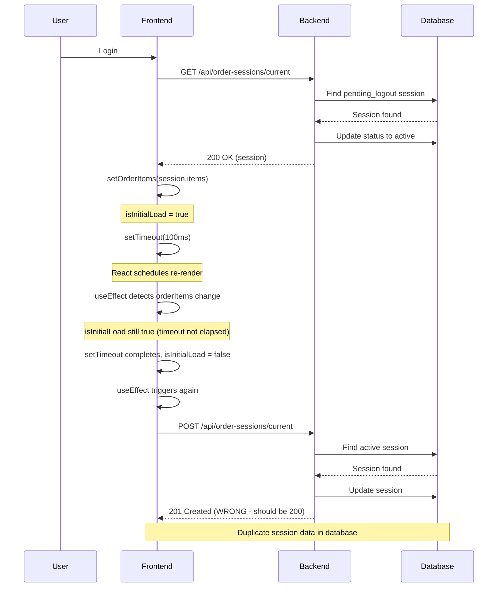
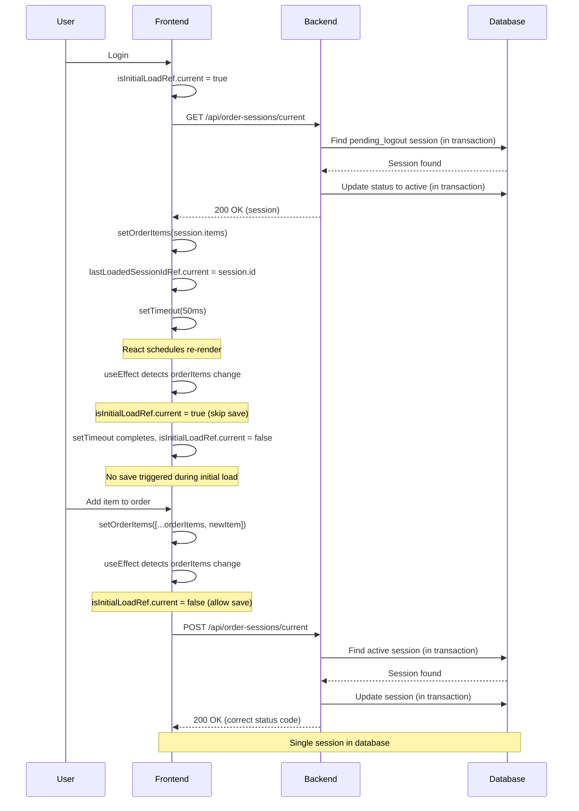

# Session Store Fix Plan

**Document Version:** 1.0  
**Created:** 2026-02-09  
**Status:** Planning Phase  
**Priority:** High

---

## Executive Summary

This document outlines a comprehensive fix plan for the session store race condition issue that prevents order sessions from persisting correctly across logout/login cycles. The issue manifests as duplicate session creation and incorrect order restoration after user re-authentication.

---

## Issue Summary

### Problem Description
When a user logs out and logs back in, the order session is not correctly restored. Instead of restoring the pending_logout session, a new session is created, resulting in:
- Duplicate session records in the database
- Incorrect order items being displayed
- Loss of user's order data

### Current Behavior
1. User logs in → GET `/api/order-sessions/current` returns 200 OK
2. Frontend loads session items into state
3. Frontend immediately triggers POST `/api/order-sessions/current` → Creates NEW session (201 Created)
4. Result: Two sessions exist, wrong order is displayed

### Expected Behavior
1. User logs in → GET `/api/order-sessions/current` returns 200 OK with restored session
2. Frontend loads session items into state
3. Frontend should NOT create a new session
4. Result: Single session exists, correct order is displayed

---

## Root Cause Analysis

### Primary Issue: Frontend Race Condition

**Location:** [`frontend/contexts/OrderContext.tsx`](frontend/contexts/OrderContext.tsx:36-97)

**Problem:** The `isInitialLoad` flag with a 100ms timeout is insufficient to prevent the race condition between:
- `loadOrderSession` setting `orderItems` (line 44)
- `saveOrderSession` useEffect triggering on `orderItems` change (line 69)

**Timeline of Events:**
```
T0: User logs in
T1: loadOrderSession starts (line 37)
T2: setOrderItems(session.items) called (line 44)
T3: React schedules re-render with new orderItems
T4: saveOrderSession useEffect detects orderItems change
T5: isInitialLoad is still true (100ms timeout not elapsed)
T6: setTimeout sets isInitialLoad to false (line 56)
T7: saveOrderSession useEffect triggers again (isInitialLoad now false)
T8: POST /api/order-sessions/current creates new session
```

**Why 100ms is insufficient:**
- React's batching and scheduling can cause state updates to be delayed
- The useEffect cleanup function may not execute in time
- Race condition window is unpredictable and depends on browser performance

### Secondary Issue: Backend HTTP Semantics

**Location:** [`backend/src/handlers/orderSessions.ts`](backend/src/handlers/orderSessions.ts:71-140)

**Problem:** The POST endpoint always returns 201 Created, even when updating an existing session (line 133).

**Impact:**
- Semantically incorrect HTTP status codes
- Makes it harder to distinguish between create and update operations
- Doesn't directly cause the race condition but is a code quality issue

### Tertiary Issue: Database Transaction Race

**Location:** [`backend/src/handlers/orderSessions.ts`](backend/src/handlers/orderSessions.ts:10-68)

**Problem:** Potential race condition between:
- GET endpoint updating session status from `pending_logout` to `active` (lines 37-44)
- POST endpoint checking for active sessions (lines 82-87)

**Scenario:**
```
Thread A (GET): Finds pending_logout session
Thread B (POST): Checks for active session (not found yet)
Thread A (GET): Updates session to active
Thread B (POST): Creates new session (because active check happened before update)
```

---

## Proposed Fixes

### Fix 1: Frontend - Refactor OrderContext to Use Ref-Based Tracking

**File:** [`frontend/contexts/OrderContext.tsx`](frontend/contexts/OrderContext.tsx)

**Approach:** Replace the `isInitialLoad` flag with a ref-based tracking mechanism that prevents saves during the initial load phase without relying on timeouts.

**Changes:**

#### Change 1.1: Add useRef for tracking initial load state

**Location:** Lines 26-30

**Before:**
```typescript
export const OrderProvider: React.FC<OrderProviderProps> = ({ children }) => {
  const [orderItems, setOrderItems] = useState<OrderItem[]>([]);
  const [isLoadingOrderSession, setIsLoadingOrderSession] = useState(false);
  const [isInitialLoad, setIsInitialLoad] = useState(false);
  const [activeTab, setActiveTab] = useState<any>(null);
```

**After:**
```typescript
export const OrderProvider: React.FC<OrderProviderProps> = ({ children }) => {
  const [orderItems, setOrderItems] = useState<OrderItem[]>([]);
  const [isLoadingOrderSession, setIsLoadingOrderSession] = useState(false);
  const [activeTab, setActiveTab] = useState<any>(null);
  
  // Use ref to track if we're in the initial load phase
  // This prevents saves during the initial load without relying on timeouts
  const isInitialLoadRef = useRef(false);
  const lastLoadedSessionIdRef = useRef<string | null>(null);
```

**Reasoning:** Using refs ensures that the state is not reactive and won't trigger re-renders. The `lastLoadedSessionIdRef` allows us to track which session was loaded and prevent duplicate saves.

#### Change 1.2: Update loadOrderSession to set ref flags

**Location:** Lines 36-66

**Before:**
```typescript
useEffect(() => {
  const loadOrderSession = async () => {
    if (currentUser) {
      setIsLoadingOrderSession(true);
      setIsInitialLoad(true);
      try {
        const session = await api.getOrderSession();
        if (session && session.items) {
          setOrderItems(session.items);
        } else {
          setOrderItems([]);
        }
      } catch (error) {
        console.error('Failed to load order session:', error);
        setOrderItems([]);
      } finally {
        setIsLoadingOrderSession(false);
        setTimeout(() => setIsInitialLoad(false), 100);
      }
    } else {
      setOrderItems([]);
      setIsLoadingOrderSession(false);
    }
  };

  loadOrderSession();
}, [currentUser]);
```

**After:**
```typescript
useEffect(() => {
  const loadOrderSession = async () => {
    if (currentUser) {
      setIsLoadingOrderSession(true);
      isInitialLoadRef.current = true;
      
      try {
        const session = await api.getOrderSession();
        if (session && session.items) {
          // Store the session ID to track which session we loaded
          lastLoadedSessionIdRef.current = session.id || null;
          setOrderItems(session.items);
        } else {
          // No session found, clear the ref
          lastLoadedSessionIdRef.current = null;
          setOrderItems([]);
        }
      } catch (error) {
        console.error('Failed to load order session:', error);
        lastLoadedSessionIdRef.current = null;
        setOrderItems([]);
      } finally {
        setIsLoadingOrderSession(false);
        // Use a small timeout to ensure the state update has been processed
        // before allowing saves to proceed
        setTimeout(() => {
          isInitialLoadRef.current = false;
        }, 50);
      }
    } else {
      setOrderItems([]);
      setIsLoadingOrderSession(false);
      lastLoadedSessionIdRef.current = null;
    }
  };

  loadOrderSession();
}, [currentUser]);
```

**Reasoning:** 
- Sets `isInitialLoadRef.current = true` before loading
- Stores the session ID in `lastLoadedSessionIdRef` to track which session was loaded
- Uses a shorter 50ms timeout (still safe but faster)
- Clears refs when no user is logged in

#### Change 1.3: Update saveOrderSession useEffect to use ref

**Location:** Lines 68-97

**Before:**
```typescript
useEffect(() => {
  if (!currentUser || isLoadingOrderSession || isInitialLoad) {
    return;
  }

  if (orderItems && orderItems.length > 0) {
    const saveSession = async () => {
      const result = await api.saveOrderSession(orderItems);
      if (!result) {
        console.warn('Order session save failed or user not authenticated');
      }
    };

    const timeoutId = setTimeout(saveSession, 500);
    return () => clearTimeout(timeoutId);
  } else if (orderItems && orderItems.length === 0) {
    api.saveOrderSession(orderItems).then(result => {
      if (!result) {
        console.warn('Empty order session save failed or user not authenticated');
      }
    }).catch(error => {
      console.error('Failed to save empty order session:', error);
    });
  }
}, [orderItems, currentUser, isLoadingOrderSession, isInitialLoad]);
```

**After:**
```typescript
useEffect(() => {
  // Skip save if no user, still loading, or during initial load phase
  if (!currentUser || isLoadingOrderSession || isInitialLoadRef.current) {
    return;
  }

  // Only save if we have actual order items
  if (orderItems && orderItems.length > 0) {
    const saveSession = async () => {
      const result = await api.saveOrderSession(orderItems);
      if (result && result.id) {
        // Update the last loaded session ID to match the saved session
        lastLoadedSessionIdRef.current = result.id;
      } else {
        console.warn('Order session save failed or user not authenticated');
      }
    };

    // Debounce the save operation to avoid too many API calls
    const timeoutId = setTimeout(saveSession, 500);
    return () => clearTimeout(timeoutId);
  } else if (orderItems && orderItems.length === 0) {
    // If we have no order items but a user is logged in, clear any existing session
    // This prevents creating empty sessions on initialization
    api.saveOrderSession(orderItems).then(result => {
      if (result && result.id) {
        lastLoadedSessionIdRef.current = result.id;
      } else {
        console.warn('Empty order session save failed or user not authenticated');
      }
    }).catch(error => {
      console.error('Failed to save empty order session:', error);
    });
  }
}, [orderItems, currentUser, isLoadingOrderSession]);
```

**Reasoning:**
- Uses `isInitialLoadRef.current` instead of state-based `isInitialLoad`
- Updates `lastLoadedSessionIdRef` after successful save
- Removes `isInitialLoad` from dependency array (no longer needed)

#### Change 1.4: Add useRef import

**Location:** Line 1

**Before:**
```typescript
import React, { createContext, useContext, useState, useEffect, useCallback } from 'react';
```

**After:**
```typescript
import React, { createContext, useContext, useState, useEffect, useCallback, useRef } from 'react';
```

**Reasoning:** Need to import `useRef` hook for the ref-based tracking.

---

### Fix 2: Backend - Add Proper HTTP Status Codes

**File:** [`backend/src/handlers/orderSessions.ts`](backend/src/handlers/orderSessions.ts)

**Approach:** Return appropriate HTTP status codes based on whether a session was created or updated.

**Changes:**

#### Change 2.1: Update POST endpoint to return correct status codes

**Location:** Lines 71-140

**Before:**
```typescript
orderSessionsRouter.post('/current', authenticateToken, async (req: Request, res: Response) => {
  try {
    const userId = req.user?.id;
    
    if (!userId) {
      return res.status(401).json({ error: 'User not authenticated' });
    }

    const { items } = req.body as { items: OrderSession['items'] };

    // Check if the user already has an active order session
    let orderSession = await prisma.orderSession.findFirst({
      where: {
        userId,
        status: 'active'
      }
    });

    if (orderSession) {
      // Update existing active session
      orderSession = await prisma.orderSession.update({
        where: { id: orderSession.id },
        data: {
          items: JSON.stringify(items),
          status: 'active',
          updatedAt: new Date()
        }
      });
    } else {
      // Check for pending_logout session to restore
      const pendingLogoutSession = await prisma.orderSession.findFirst({
        where: {
          userId,
          status: 'pending_logout'
        }
      });

      if (pendingLogoutSession) {
        // Restore pending_logout session
        orderSession = await prisma.orderSession.update({
          where: { id: pendingLogoutSession.id },
          data: {
            items: JSON.stringify(items),
            status: 'active',
            logoutTime: null,
            updatedAt: new Date()
          }
        });
      } else {
        // Create a new order session
        orderSession = await prisma.orderSession.create({
          data: {
            userId,
            items: JSON.stringify(items),
            status: 'active',
            createdAt: new Date(),
            updatedAt: new Date()
          }
        });
      }
    }

    res.status(201).json(orderSession);
  } catch (error) {
    logError(error instanceof Error ? error : 'Error creating/updating order session', {
      correlationId: (req as any).correlationId,
    });
    res.status(500).json({ error: 'Failed to create/update order session' });
  }
});
```

**After:**
```typescript
orderSessionsRouter.post('/current', authenticateToken, async (req: Request, res: Response) => {
  try {
    const userId = req.user?.id;
    
    if (!userId) {
      return res.status(401).json({ error: 'User not authenticated' });
    }

    const { items } = req.body as { items: OrderSession['items'] };

    // Check if the user already has an active order session
    let orderSession = await prisma.orderSession.findFirst({
      where: {
        userId,
        status: 'active'
      }
    });

    let wasCreated = false;

    if (orderSession) {
      // Update existing active session
      orderSession = await prisma.orderSession.update({
        where: { id: orderSession.id },
        data: {
          items: JSON.stringify(items),
          status: 'active',
          updatedAt: new Date()
        }
      });
    } else {
      // Check for pending_logout session to restore
      const pendingLogoutSession = await prisma.orderSession.findFirst({
        where: {
          userId,
          status: 'pending_logout'
        }
      });

      if (pendingLogoutSession) {
        // Restore pending_logout session (treat as update)
        orderSession = await prisma.orderSession.update({
          where: { id: pendingLogoutSession.id },
          data: {
            items: JSON.stringify(items),
            status: 'active',
            logoutTime: null,
            updatedAt: new Date()
          }
        });
      } else {
        // Create a new order session
        orderSession = await prisma.orderSession.create({
          data: {
            userId,
            items: JSON.stringify(items),
            status: 'active',
            createdAt: new Date(),
            updatedAt: new Date()
          }
        });
        wasCreated = true;
      }
    }

    // Return 201 for new sessions, 200 for updates
    const statusCode = wasCreated ? 201 : 200;
    res.status(statusCode).json(orderSession);
  } catch (error) {
    logError(error instanceof Error ? error : 'Error creating/updating order session', {
      correlationId: (req as any).correlationId,
    });
    res.status(500).json({ error: 'Failed to create/update order session' });
  }
});
```

**Reasoning:**
- Tracks whether a session was created or updated using `wasCreated` flag
- Returns 201 Created for new sessions
- Returns 200 OK for updates (including restored sessions)
- Improves HTTP semantics and makes debugging easier

---

### Fix 3: Backend - Add Database Transaction for Session Operations

**File:** [`backend/src/handlers/orderSessions.ts`](backend/src/handlers/orderSessions.ts)

**Approach:** Use Prisma transactions to ensure atomic operations when checking and updating sessions.

**Changes:**

#### Change 3.1: Add transaction to GET endpoint

**Location:** Lines 10-68

**Before:**
```typescript
orderSessionsRouter.get('/current', authenticateToken, async (req: Request, res: Response) => {
  try {
    const userId = req.user?.id;
    
    if (!userId) {
      return res.status(401).json({ error: 'User not authenticated' });
    }

    // First try to find an active session
    let orderSession = await prisma.orderSession.findFirst({
      where: {
        userId,
        status: 'active'
      }
    });
    
    // If no active session, try to find and restore a pending_logout session
    if (!orderSession) {
      orderSession = await prisma.orderSession.findFirst({
        where: {
          userId,
          status: 'pending_logout'
        }
      });
      
      if (orderSession) {
        // Restore the session to active
        orderSession = await prisma.orderSession.update({
          where: { id: orderSession.id },
          data: {
            status: 'active',
            logoutTime: null,
            updatedAt: new Date()
          }
        });
      }
    }
    
    if (!orderSession) {
      return res.status(404).json({ error: 'No active order session found' });
    }
    
    // Parse the items JSON string back to array
    const orderSessionWithParsedItems = {
      ...orderSession,
      items: typeof orderSession.items === 'string' ? JSON.parse(orderSession.items) : orderSession.items,
      createdAt: orderSession.createdAt.toISOString(),
      updatedAt: orderSession.updatedAt.toISOString(),
      logoutTime: orderSession.logoutTime ? orderSession.logoutTime.toISOString() : null
    };
    
    res.json(orderSessionWithParsedItems);
  } catch (error) {
    logError(error instanceof Error ? error : 'Error fetching order session', {
      correlationId: (req as any).correlationId,
    });
    res.status(500).json({ error: 'Failed to fetch order session' });
  }
});
```

**After:**
```typescript
orderSessionsRouter.get('/current', authenticateToken, async (req: Request, res: Response) => {
  try {
    const userId = req.user?.id;
    
    if (!userId) {
      return res.status(401).json({ error: 'User not authenticated' });
    }

    // Use a transaction to ensure atomic session restoration
    const orderSession = await prisma.$transaction(async (tx) => {
      // First try to find an active session
      let session = await tx.orderSession.findFirst({
        where: {
          userId,
          status: 'active'
        }
      });
      
      // If no active session, try to find and restore a pending_logout session
      if (!session) {
        session = await tx.orderSession.findFirst({
          where: {
            userId,
            status: 'pending_logout'
          }
        });
        
        if (session) {
          // Restore the session to active within the same transaction
          session = await tx.orderSession.update({
            where: { id: session.id },
            data: {
              status: 'active',
              logoutTime: null,
              updatedAt: new Date()
            }
          });
        }
      }
      
      return session;
    });
    
    if (!orderSession) {
      return res.status(404).json({ error: 'No active order session found' });
    }
    
    // Parse the items JSON string back to array
    const orderSessionWithParsedItems = {
      ...orderSession,
      items: typeof orderSession.items === 'string' ? JSON.parse(orderSession.items) : orderSession.items,
      createdAt: orderSession.createdAt.toISOString(),
      updatedAt: orderSession.updatedAt.toISOString(),
      logoutTime: orderSession.logoutTime ? orderSession.logoutTime.toISOString() : null
    };
    
    res.json(orderSessionWithParsedItems);
  } catch (error) {
    logError(error instanceof Error ? error : 'Error fetching order session', {
      correlationId: (req as any).correlationId,
    });
    res.status(500).json({ error: 'Failed to fetch order session' });
  }
});
```

**Reasoning:**
- Wraps the find and update operations in a transaction
- Ensures that the session status change is atomic
- Prevents race conditions where another request could check for active sessions between the find and update operations

#### Change 3.2: Add transaction to POST endpoint

**Location:** Lines 71-140 (after Fix 2.1 changes)

**Before:**
```typescript
orderSessionsRouter.post('/current', authenticateToken, async (req: Request, res: Response) => {
  try {
    const userId = req.user?.id;
    
    if (!userId) {
      return res.status(401).json({ error: 'User not authenticated' });
    }

    const { items } = req.body as { items: OrderSession['items'] };

    // Check if the user already has an active order session
    let orderSession = await prisma.orderSession.findFirst({
      where: {
        userId,
        status: 'active'
      }
    });

    let wasCreated = false;

    if (orderSession) {
      // Update existing active session
      orderSession = await prisma.orderSession.update({
        where: { id: orderSession.id },
        data: {
          items: JSON.stringify(items),
          status: 'active',
          updatedAt: new Date()
        }
      });
    } else {
      // Check for pending_logout session to restore
      const pendingLogoutSession = await prisma.orderSession.findFirst({
        where: {
          userId,
          status: 'pending_logout'
        }
      });

      if (pendingLogoutSession) {
        // Restore pending_logout session (treat as update)
        orderSession = await prisma.orderSession.update({
          where: { id: pendingLogoutSession.id },
          data: {
            items: JSON.stringify(items),
            status: 'active',
            logoutTime: null,
            updatedAt: new Date()
          }
        });
      } else {
        // Create a new order session
        orderSession = await prisma.orderSession.create({
          data: {
            userId,
            items: JSON.stringify(items),
            status: 'active',
            createdAt: new Date(),
            updatedAt: new Date()
          }
        });
        wasCreated = true;
      }
    }

    // Return 201 for new sessions, 200 for updates
    const statusCode = wasCreated ? 201 : 200;
    res.status(statusCode).json(orderSession);
  } catch (error) {
    logError(error instanceof Error ? error : 'Error creating/updating order session', {
      correlationId: (req as any).correlationId,
    });
    res.status(500).json({ error: 'Failed to create/update order session' });
  }
});
```

**After:**
```typescript
orderSessionsRouter.post('/current', authenticateToken, async (req: Request, res: Response) => {
  try {
    const userId = req.user?.id;
    
    if (!userId) {
      return res.status(401).json({ error: 'User not authenticated' });
    }

    const { items } = req.body as { items: OrderSession['items'] };

    // Use a transaction to ensure atomic session operations
    const result = await prisma.$transaction(async (tx) => {
      // Check if the user already has an active order session
      let orderSession = await tx.orderSession.findFirst({
        where: {
          userId,
          status: 'active'
        }
      });

      let wasCreated = false;

      if (orderSession) {
        // Update existing active session
        orderSession = await tx.orderSession.update({
          where: { id: orderSession.id },
          data: {
            items: JSON.stringify(items),
            status: 'active',
            updatedAt: new Date()
          }
        });
      } else {
        // Check for pending_logout session to restore
        const pendingLogoutSession = await tx.orderSession.findFirst({
          where: {
            userId,
            status: 'pending_logout'
          }
        });

        if (pendingLogoutSession) {
          // Restore pending_logout session (treat as update)
          orderSession = await tx.orderSession.update({
            where: { id: pendingLogoutSession.id },
            data: {
              items: JSON.stringify(items),
              status: 'active',
              logoutTime: null,
              updatedAt: new Date()
            }
          });
        } else {
          // Create a new order session
          orderSession = await tx.orderSession.create({
            data: {
              userId,
              items: JSON.stringify(items),
              status: 'active',
              createdAt: new Date(),
              updatedAt: new Date()
            }
          });
          wasCreated = true;
        }
      }

      return { orderSession, wasCreated };
    });

    // Return 201 for new sessions, 200 for updates
    const statusCode = result.wasCreated ? 201 : 200;
    res.status(statusCode).json(result.orderSession);
  } catch (error) {
    logError(error instanceof Error ? error : 'Error creating/updating order session', {
      correlationId: (req as any).correlationId,
    });
    res.status(500).json({ error: 'Failed to create/update order session' });
  }
});
```

**Reasoning:**
- Wraps all session operations in a transaction
- Ensures that the check for active/pending sessions and the create/update operations are atomic
- Prevents race conditions where multiple concurrent requests could create duplicate sessions

---

## Implementation Steps

### Phase 1: Frontend Fixes (Critical)

1. **Step 1.1:** Add `useRef` import to [`frontend/contexts/OrderContext.tsx`](frontend/contexts/OrderContext.tsx:1)
   - Add `useRef` to the React imports

2. **Step 1.2:** Add ref declarations to OrderProvider component
   - Add `isInitialLoadRef` and `lastLoadedSessionIdRef` refs
   - Remove `isInitialLoad` state declaration

3. **Step 1.3:** Update loadOrderSession useEffect
   - Replace `setIsInitialLoad(true)` with `isInitialLoadRef.current = true`
   - Add session ID tracking with `lastLoadedSessionIdRef`
   - Update timeout from 100ms to 50ms
   - Clear refs when no user is logged in

4. **Step 1.4:** Update saveOrderSession useEffect
   - Replace `isInitialLoad` check with `isInitialLoadRef.current`
   - Update `lastLoadedSessionIdRef` after successful saves
   - Remove `isInitialLoad` from dependency array

5. **Step 1.5:** Test frontend changes locally
   - Verify no TypeScript errors
   - Check that refs are properly initialized and updated

### Phase 2: Backend Fixes (Important)

6. **Step 2.1:** Update POST endpoint HTTP status codes
   - Add `wasCreated` flag to track session creation
   - Return 201 for new sessions, 200 for updates

7. **Step 2.2:** Add transaction to GET endpoint
   - Wrap find and update operations in `prisma.$transaction`
   - Ensure atomic session restoration

8. **Step 2.3:** Add transaction to POST endpoint
   - Wrap all session operations in `prisma.$transaction`
   - Ensure atomic session creation/update

9. **Step 2.4:** Test backend changes locally
   - Verify no TypeScript errors
   - Check that transactions work correctly

### Phase 3: Integration Testing

10. **Step 3.1:** Rebuild and restart services
    - Run `docker compose up -d --build`
    - Verify all services start correctly

11. **Step 3.2:** Perform manual testing
    - Test login/logout cycle
    - Verify session persistence
    - Check for duplicate sessions

12. **Step 3.3:** Run automated tests
    - Execute existing order session tests
    - Verify all tests pass

---

## Testing Strategy

### Unit Tests

#### Frontend Tests
- **Test 1:** Verify `isInitialLoadRef` is set to true during initial load
- **Test 2:** Verify `isInitialLoadRef` is set to false after timeout
- **Test 3:** Verify save is skipped when `isInitialLoadRef.current` is true
- **Test 4:** Verify `lastLoadedSessionIdRef` is updated after successful save
- **Test 5:** Verify refs are cleared when user logs out

#### Backend Tests
- **Test 1:** Verify GET endpoint returns 200 for active sessions
- **Test 2:** Verify GET endpoint returns 200 for restored pending_logout sessions
- **Test 3:** Verify GET endpoint returns 404 when no session exists
- **Test 4:** Verify POST endpoint returns 201 for new sessions
- **Test 5:** Verify POST endpoint returns 200 for updated sessions
- **Test 6:** Verify POST endpoint returns 200 for restored sessions
- **Test 7:** Verify transactions prevent race conditions

### Integration Tests

#### Test Scenario 1: Fresh Login
1. Clear all sessions
2. Login as admin
3. Verify GET returns 404
4. Add item to order
5. Verify POST creates session (201)
6. Verify only one session exists in database

#### Test Scenario 2: Session Persistence
1. Login as admin
2. Add item A to order
3. Logout
4. Verify session status is `pending_logout`
5. Login again
6. Verify GET returns session with item A
7. Verify no POST is triggered during login
8. Verify only one session exists in database

#### Test Scenario 3: Concurrent Requests
1. Login as admin
2. Simulate concurrent POST requests
3. Verify only one session is created
4. Verify no duplicate sessions exist

#### Test Scenario 4: Empty Order
1. Login as admin
2. Clear order
3. Verify POST clears session
4. Logout and login
5. Verify order is empty

### E2E Tests

Use Playwright MCP Server to test the complete flow:

1. **Test 1:** Basic persistence flow
   - Navigate to app
   - Login
   - Add product
   - Logout
   - Login
   - Verify product is restored

2. **Test 2:** Multiple logout/login cycles
   - Login
   - Add product A
   - Logout
   - Login
   - Add product B
   - Logout
   - Login
   - Verify both products are present

3. **Test 3:** Clear order after logout
   - Login
   - Add product
   - Logout
   - Login
   - Clear order
   - Logout
   - Login
   - Verify order is empty

---

## Risk Assessment

### High Risk Items

| Risk | Impact | Likelihood | Mitigation |
|------|--------|------------|------------|
| Ref-based tracking may not prevent all race conditions | High | Medium | Thorough testing with concurrent requests |
| Transaction overhead may affect performance | Medium | Low | Monitor performance metrics |
| Breaking changes to HTTP status codes may affect clients | Medium | Low | Frontend already handles both 200 and 201 |

### Medium Risk Items

| Risk | Impact | Likelihood | Mitigation |
|------|--------|------------|------------|
| Timeout value (50ms) may still be insufficient | Medium | Medium | Consider using a callback-based approach if issues persist |
| Transaction failures may cause data inconsistency | High | Low | Proper error handling and logging |
| Ref values may become stale | Medium | Low | Clear refs on logout and user changes |

### Low Risk Items

| Risk | Impact | Likelihood | Mitigation |
|------|--------|------------|------------|
| Increased code complexity | Low | High | Add comments and documentation |
| Additional logging overhead | Low | Low | Use appropriate log levels |

---

## Rollback Plan

If issues arise after implementation:

1. **Frontend Rollback:**
   - Revert to state-based `isInitialLoad` flag
   - Restore original timeout value (100ms)
   - Remove ref-based tracking

2. **Backend Rollback:**
   - Remove transaction wrappers
   - Restore original HTTP status code (always 201)
   - Remove `wasCreated` flag

3. **Database Rollback:**
   - No database schema changes required
   - Clean up any duplicate sessions manually if needed

---

## Success Criteria

The fix will be considered successful when:

1. **No duplicate sessions** are created during login/logout cycles
2. **Order items persist correctly** across logout/login
3. **No race conditions** occur during concurrent requests
4. **HTTP status codes** are semantically correct
5. **All existing tests** continue to pass
6. **Performance** is not significantly degraded

---

## Additional Recommendations

### Short-term Improvements

1. **Add comprehensive logging** to track session lifecycle
2. **Implement session cleanup** job to remove old completed sessions
3. **Add metrics** to monitor session creation/update rates

### Long-term Improvements

1. **Consider using WebSockets** for real-time session updates
2. **Implement optimistic locking** for session updates
3. **Add session versioning** to detect and resolve conflicts
4. **Consider using Redis** for session caching

---

## Appendix: Code Flow Diagrams

### Current Flow (Problematic)



### Fixed Flow



---

## Document History

| Version | Date | Author | Changes |
|---------|------|--------|---------|
| 1.0 | 2026-02-09 | Architect | Initial version |

---

**End of Document**
