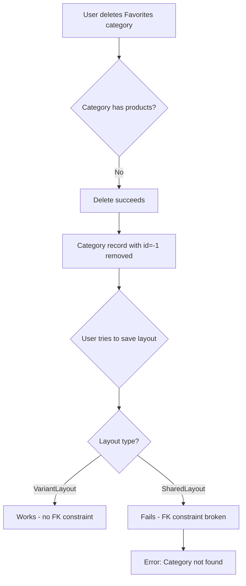
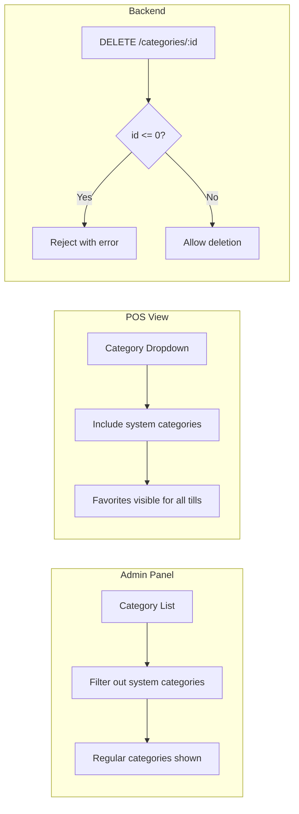

# System Categories Protection Implementation Plan

## Overview

This plan addresses the issue where deleting the "Favorites" category (a system pseudo-category with ID `-1`) causes product layout saving to fail. The solution protects system categories from deletion while hiding them from admin panel category management, but keeping them visible in the POS view.

## Problem Analysis

### Current State

1. **Favorites Category**: A pseudo-category with special ID `-1`
2. **All Products Category**: A pseudo-category with special ID `0`
3. **No Protection**: The DELETE endpoint only checks for associated products, not for system categories
4. **Architectural Inconsistency**: 
   - `VariantLayout` has no FK to Category (works without DB record)
   - `SharedLayout` has required FK to Category (breaks when record deleted)

### Root Cause



## Solution Design

### Approach: Protect + Hide from Admin + Visible in POS



## Implementation Details

### 1. Backend Changes

#### 1.1 Add Deletion Protection

**File**: [`backend/src/handlers/categories.ts`](backend/src/handlers/categories.ts:126-152)

Add validation at the start of the DELETE handler:

```typescript
// System categories (id <= 0) cannot be deleted
if (Number(id) <= 0) {
  return res.status(400).json({ 
    error: i18n.t('errors:categories.cannotDeleteSystemCategory')
  });
}
```

#### 1.2 Add Update Protection

**File**: [`backend/src/handlers/categories.ts`](backend/src/handlers/categories.ts)

Add validation at the start of the PUT/PATCH handler:

```typescript
// System categories (id <= 0) cannot be modified
if (Number(id) <= 0) {
  return res.status(400).json({ 
    error: i18n.t('errors:categories.cannotModifySystemCategory')
  });
}
```

#### 1.3 Filter System Categories from Admin List

**File**: [`backend/src/handlers/categories.ts`](backend/src/handlers/categories.ts)

Modify the GET list endpoint to support filtering:

```typescript
// Query parameter to include system categories
const includeSystem = req.query.includeSystem === 'true';

// Filter system categories from admin panel by default
const where = includeSystem 
  ? {} 
  : { id: { gt: 0 } };

const categories = await prisma.category.findMany({
  where,
  // ... rest of query
});
```

#### 1.4 Add i18n Error Messages

**File**: [`backend/locales/en/errors.json`](backend/locales/en/errors.json)

```json
{
  "categories": {
    "cannotDeleteSystemCategory": "Cannot delete system categories (Favorites, All Products)",
    "cannotModifySystemCategory": "Cannot modify system categories (Favorites, All Products)"
  }
}
```

**File**: [`backend/locales/it/errors.json`](backend/locales/it/errors.json)

```json
{
  "categories": {
    "cannotDeleteSystemCategory": "Impossibile eliminare le categorie di sistema (Preferiti, Tutti i prodotti)",
    "cannotModifySystemCategory": "Impossibile modificare le categorie di sistema (Preferiti, Tutti i prodotti)"
  }
}
```

### 2. Frontend Changes

#### 2.1 Hide Delete Button for System Categories

**File**: [`frontend/src/app/(app)/categories/page.tsx`](frontend/src/app/(app)/categories/page.tsx)

Conditionally render the delete button:

```tsx
{/* Only show delete button for non-system categories (id > 0) */}
{category.id > 0 && (
  <Button
    variant="destructive"
    onClick={() => handleDelete(category.id)}
  >
    Delete
  </Button>
)}
```

#### 2.2 Add Visual Indicator for System Categories

**File**: [`frontend/src/app/(app)/categories/page.tsx`](frontend/src/app/(app)/categories/page.tsx)

Add a badge or icon for system categories:

```tsx
<div className="flex items-center gap-2">
  <span>{category.name}</span>
  {category.id <= 0 && (
    <Badge variant="secondary" className="text-xs">
      System
    </Badge>
  )}
</div>
```

#### 2.3 Update Category Fetching for POS View

**File**: [`frontend/src/contexts/LayoutContext.tsx`](frontend/src/contexts/LayoutContext.tsx)

Ensure the POS view fetches system categories:

```typescript
// Fetch categories including system ones for POS view
const response = await fetch('/api/categories?includeSystem=true');
```

### 3. Files to Modify

| File | Changes |
|------|---------|
| `backend/src/handlers/categories.ts` | Add deletion/update protection, filter system categories |
| `backend/locales/en/errors.json` | Add error messages |
| `backend/locales/it/errors.json` | Add error messages (Italian) |
| `frontend/src/app/(app)/categories/page.tsx` | Hide delete button, add system badge |
| `frontend/src/contexts/LayoutContext.tsx` | Include system categories for POS |

### 4. Testing Plan

1. **Backend Tests**:
   - Attempt to delete Favorites (id=-1) → should fail with 400
   - Attempt to delete All Products (id=0) → should fail with 400
   - Attempt to update system categories → should fail with 400
   - GET /categories → should not include system categories
   - GET /categories?includeSystem=true → should include system categories

2. **Frontend Tests**:
   - Navigate to category management → system categories should not appear
   - Navigate to POS view → Favorites should be visible in category dropdown
   - Attempt to delete a regular category → should work

3. **Integration Tests**:
   - Create a layout with Favorites category → should work
   - Save the layout → should persist correctly
   - Verify Favorites appears in POS view for all tills

## Migration Considerations

No database migration is required for this implementation. The solution uses the existing ID convention (id <= 0 for system categories).

### Optional Future Enhancement

Consider adding an `isSystem` boolean field to the Category model for explicit marking:

```prisma
model Category {
  id            Int       @id @default(autoincrement())
  name          String
  isSystem      Boolean   @default(false)
  // ...
}
```

This would require:
1. A migration to add the field
2. Setting `isSystem = true` for categories with id <= 0
3. Updating the validation logic to use `isSystem` instead of ID check

## Summary

This implementation:
- ✅ Prevents accidental deletion of system categories
- ✅ Hides system categories from admin panel category management
- ✅ Keeps Favorites visible in POS view for all tills
- ✅ Maintains data integrity
- ✅ Provides clear error messages in both English and Italian
- ✅ No database migration required
