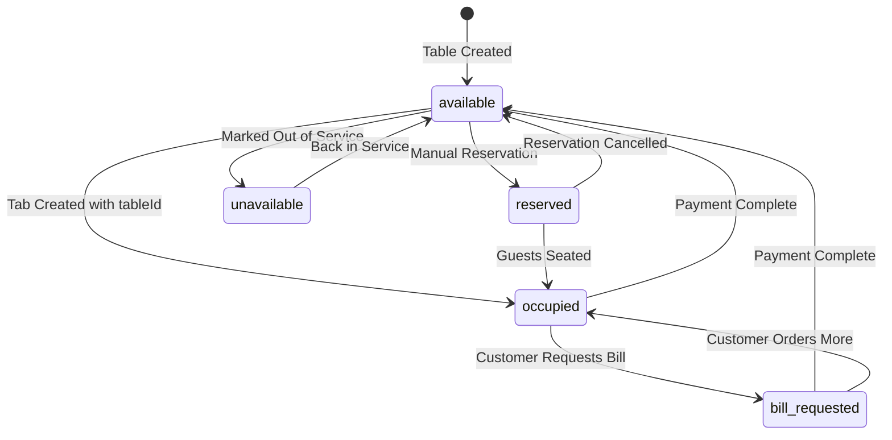
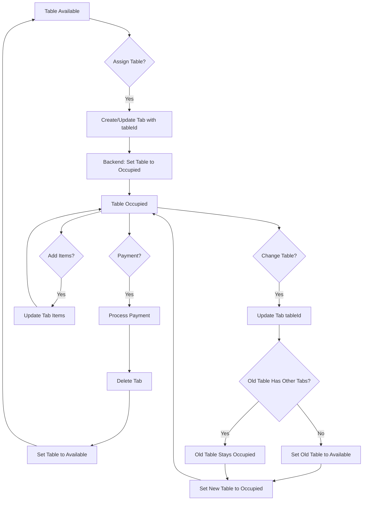
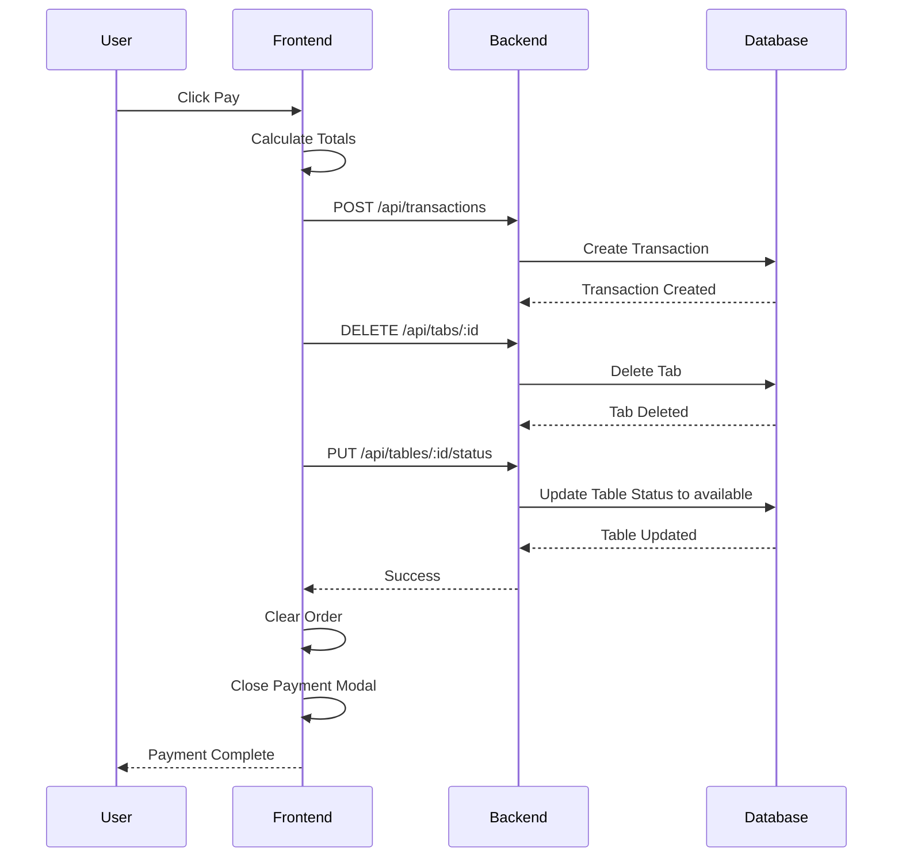
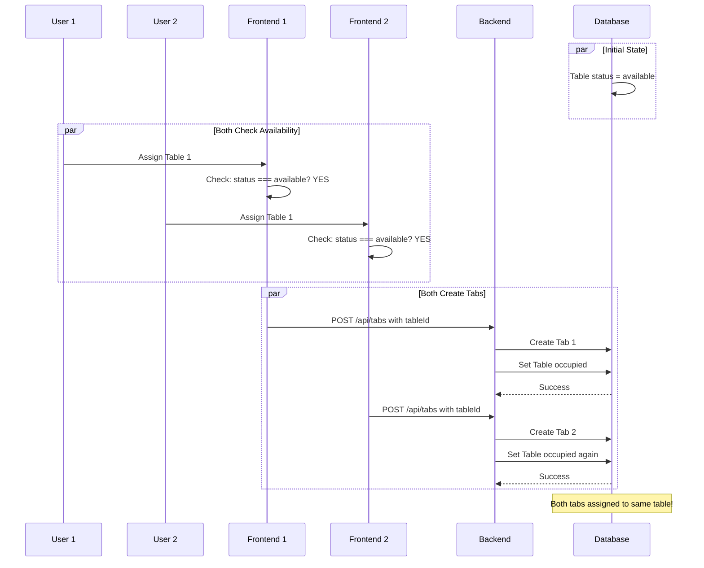

# Tables Feature Logic Analysis

**Document Version:** 1.0  
**Date:** 2026-02-17  
**Author:** Architecture Analysis  

---

## Table of Contents

1. [Executive Summary](#executive-summary)
2. [Data Model Analysis](#data-model-analysis)
3. [Table Status Workflow](#table-status-workflow)
4. [API Endpoints Analysis](#api-endpoints-analysis)
5. [Frontend Flow Analysis](#frontend-flow-analysis)
6. [Edge Cases and Scenarios](#edge-cases-and-scenarios)
7. [Potential Issues and Improvements](#potential-issues-and-improvements)
8. [Mermaid Diagrams](#mermaid-diagrams)

---

## Executive Summary

The Tables feature in this POS application manages the lifecycle of restaurant tables, tracking their status and associating them with customer orders (tabs). The feature implements:

- **5 table statuses**: `available`, `occupied`, `reserved`, `unavailable`, `bill_requested`
- **Status transition validation**: Enforces valid state transitions
- **Automatic status management**: Table status updates automatically via tab operations
- **Ownership verification**: Tables can have owners for access control

---

## Data Model Analysis

### Table Model

Location: [`backend/prisma/schema.prisma`](backend/prisma/schema.prisma:128-149)

```prisma
model Table {
  id        String   @id @default(dbgenerated("uuid_generate_v4()")) @db.Uuid
  name      String
  x         Float    @default(0)
  y         Float    @default(0)
  width     Float    @default(100)
  height    Float    @default(100)
  status    String   @default("available")
  roomId    String   @db.Uuid
  capacity  Int?     // Optional field to store table capacity
  items     Json?    // Added for storing order items directly on tables
  ownerId   Int?     @map("owner_id") // Optional owner field for ownership verification
  createdAt DateTime @default(now())
  updatedAt DateTime @updatedAt
  room      Room     @relation(fields: [roomId], references: [id], onDelete: Cascade)
  owner     User?    @relation(fields: [ownerId], references: [id])
  tabs      Tab[]

  @@index([roomId])
  @@index([ownerId])
  @@map("tables")
}
```

### Field Purposes

| Field | Type | Purpose |
|-------|------|---------|
| `id` | UUID | Unique identifier (PostgreSQL uuid_generate_v4()) |
| `name` | String | Display name (e.g., "Table 1", "Patio 5") |
| `x`, `y` | Float | Position coordinates for visual layout |
| `width`, `height` | Float | Dimensions for visual representation |
| `status` | String | Current table state (default: "available") |
| `roomId` | UUID | Foreign key to Room entity |
| `capacity` | Int? | Optional seating capacity |
| `items` | Json? | Order items stored directly on table (currently unused in main flow) |
| `ownerId` | Int? | Optional owner for access control |

### Relationships

```
Table --> Room (many-to-one, cascade delete)
Table --> User (many-to-one, optional owner)
Table --> Tab (one-to-many)
```

### Tab Model

Location: [`backend/prisma/schema.prisma`](backend/prisma/schema.prisma:151-163)

```prisma
model Tab {
  id        Int      @id @default(autoincrement())
  name      String
  items     Json
  createdAt DateTime @default(now())
  tillId    Int
  tillName  String
  tableId   String?  @db.Uuid
  table     Table?   @relation(fields: [tableId], references: [id])

  @@index([tableId])
  @@map("tabs")
}
```

**Key Insight**: A Tab can exist without a table (`tableId` is nullable), but when associated, it drives the table's status.

---

## Table Status Workflow

### Valid Statuses

Defined in [`backend/src/utils/tableValidation.ts`](backend/src/utils/tableValidation.ts:48):

```typescript
const validStatuses = ['available', 'occupied', 'reserved', 'unavailable', 'bill_requested'];
```

### Status Definitions

| Status | Meaning | Visual Color |
|--------|---------|--------------|
| `available` | Table is free for new customers | Green |
| `occupied` | Table has active orders/tabs | Red |
| `reserved` | Table is reserved for future guests | Yellow |
| `unavailable` | Table is out of service | Gray |
| `bill_requested` | Customer has requested the bill | Yellow |

### Status Transition Matrix

Defined in [`backend/src/utils/tableValidation.ts`](backend/src/utils/tableValidation.ts:68-74):

```typescript
export const TABLE_STATUS_TRANSITIONS: Record<string, string[]> = {
  'available': ['occupied', 'reserved', 'unavailable'],
  'occupied': ['available', 'bill_requested'],
  'bill_requested': ['available', 'occupied'],
  'reserved': ['occupied', 'available'],
  'unavailable': ['available']
};
```

**Transition Rules**:

- From `available`: Can go to `occupied`, `reserved`, or `unavailable`
- From `occupied`: Can go to `available` (payment) or `bill_requested` (customer request)
- From `bill_requested`: Can go to `available` (payment) or back to `occupied` (order more)
- From `reserved`: Can go to `occupied` (guests seated) or `available` (reservation cancelled)
- From `unavailable`: Can only go to `available` (back in service)

### Validation Functions

Location: [`backend/src/utils/tableValidation.ts`](backend/src/utils/tableValidation.ts:76-100)

```typescript
export function isValidStatusTransition(
  currentStatus: string,
  newStatus: string
): boolean {
  const allowedTransitions = TABLE_STATUS_TRANSITIONS[currentStatus];
  return allowedTransitions?.includes(newStatus) ?? false;
}

export function validateTableStatusUpdate(
  currentStatus: string,
  newStatus: string
): { isValid: boolean; error?: string } {
  if (currentStatus === newStatus) {
    return { isValid: true }; // No change needed
  }
  
  if (!isValidStatusTransition(currentStatus, newStatus)) {
    return {
      isValid: false,
      error: `Invalid status transition from '${currentStatus}' to '${newStatus}'`
    };
  }
  
  return { isValid: true };
}
```

---

## API Endpoints Analysis

### Tables API

Location: [`backend/src/handlers/tables.ts`](backend/src/handlers/tables.ts)

#### `GET /api/tables`

**Purpose**: Retrieve all tables with room information.

**Authentication**: Required (authenticateToken)

**Response**: Array of table objects with room relations.

```typescript
const tables = await prisma.table.findMany({
  include: { room: true },
  orderBy: { id: 'asc' }
});
```

---

#### `GET /api/tables/:id`

**Purpose**: Retrieve a specific table.

**Authentication**: Required

**Response**: Single table object with room relation.

---

#### `POST /api/tables`

**Purpose**: Create a new table.

**Authentication**: Required

**Request Body**:
```json
{
  "name": "Table 1",
  "roomId": "uuid",
  "x": 100,
  "y": 100,
  "width": 100,
  "height": 100,
  "status": "available",
  "capacity": 4
}
```

**Key Logic**:
1. Validates required fields (name, roomId)
2. Sanitizes name (prevents XSS)
3. Verifies room exists
4. Validates table data
5. Sets `ownerId` from authenticated user

---

#### `PUT /api/tables/:id`

**Purpose**: Update a table.

**Authentication**: Required + Ownership verification (verifyTableOwnership)

**Key Logic**:
1. Verifies table exists
2. Sanitizes name if provided
3. Validates room exists if roomId changed
4. Validates table data
5. Updates only provided fields

---

#### `DELETE /api/tables/:id`

**Purpose**: Delete a table.

**Authentication**: Required + Ownership verification

**Key Logic**:
1. Verifies table exists
2. **Checks for associated tabs** - prevents deletion if tabs exist
3. Deletes table

```typescript
// Check if table is associated with any tabs
const tabs = await prisma.tab.findMany({
  where: { tableId: id }
});

if (tabs.length > 0) {
  return res.status(400).json({
    error: i18n.t('errors:tables.cannotDeleteWithTabs'),
    tabCount: tabs.length
  });
}
```

---

#### `PUT /api/tables/:id/position`

**Purpose**: Update only table position (for drag/drop in layout editor).

**Authentication**: Required + Ownership verification

**Request Body**:
```json
{
  "x": 150.5,
  "y": 200.0
}
```

---

#### `PUT /api/tables/:id/status`

**Purpose**: Update only table status.

**Authentication**: Required + Ownership verification

**Request Body**:
```json
{
  "status": "occupied"
}
```

**Key Logic**:
1. Validates status is provided
2. Validates status is one of the 5 valid values
3. Validates status transition using `validateTableStatusUpdate()`
4. Updates table status

---

### Tabs API (Table-Related Logic)

Location: [`backend/src/handlers/tabs.ts`](backend/src/handlers/tabs.ts)

#### Helper Functions

**`updateTableStatus()`** - Lines 18-31:
```typescript
async function updateTableStatus(tableId: string | null, status: string): Promise<void> {
  if (!tableId) return;
  
  try {
    await prisma.table.update({
      where: { id: tableId },
      data: { status }
    });
  } catch (error) {
    logError(error instanceof Error ? error : 'Error updating table status', {});
  }
}
```

**`tableHasOtherTabs()`** - Lines 34-41:
```typescript
async function tableHasOtherTabs(tableId: string, excludeTabId?: number): Promise<boolean> {
  const where: any = { tableId };
  if (excludeTabId) {
    where.id = { not: excludeTabId };
  }
  const count = await prisma.tab.count({ where });
  return count > 0;
}
```

---

#### `POST /api/tabs`

**Purpose**: Create a new tab.

**Table Status Impact**: Sets table to `occupied` if `tableId` provided.

**Key Logic** (Lines 170-173):
```typescript
// Update table status to occupied if tableId is provided
if (tableId) {
  await updateTableStatus(tableId, TABLE_STATUS.OCCUPIED);
}
```

---

#### `PUT /api/tabs/:id`

**Purpose**: Update a tab.

**Table Status Impact**: Handles table reassignment.

**Key Logic** (Lines 257-270):
```typescript
// Handle table status changes
if (existingTab?.tableId !== tableId) {
  // If table was unassigned, check if it has other tabs
  if (existingTab?.tableId) {
    const hasOtherTabs = await tableHasOtherTabs(existingTab.tableId, Number(id));
    if (!hasOtherTabs) {
      await updateTableStatus(existingTab.tableId, TABLE_STATUS.AVAILABLE);
    }
  }
  // If new table assigned, set to occupied
  if (tableId) {
    await updateTableStatus(tableId, TABLE_STATUS.OCCUPIED);
  }
}
```

---

#### `DELETE /api/tabs/:id`

**Purpose**: Delete a tab.

**Authentication**: Required + Admin role

**Table Status Impact**: Sets table to `available` if no other tabs.

**Key Logic** (Lines 295-301):
```typescript
// Update table status if this was the last tab for the table
if (tab?.tableId) {
  const hasOtherTabs = await tableHasOtherTabs(tab.tableId);
  if (!hasOtherTabs) {
    await updateTableStatus(tab.tableId, TABLE_STATUS.AVAILABLE);
  }
}
```

---

## Frontend Flow Analysis

### TableAssignmentContext

Location: [`frontend/contexts/TableAssignmentContext.tsx`](frontend/contexts/TableAssignmentContext.tsx)

#### State Management

```typescript
const [assignedTable, setAssignedTable] = useState<Table | null>(null);
```

#### `handleTableAssign(tableId: string)`

**Purpose**: Assign a table to the current order.

**Key Logic**:

1. **Validates table exists** in appData
2. **Checks table availability** - prevents assigning non-available tables
3. **Shows error toast** if table is occupied/unavailable
4. **Updates or creates tab** with tableId

```typescript
// Check if table is available before allowing assignment
if (table.status !== 'available') {
  const statusMessage = table.status === 'occupied' 
    ? 'This table is currently occupied. Please select another table.'
    : `This table is currently ${table.status.replace('_', ' ')}. Please select another table.`;
  addToast(statusMessage, 'error');
  return;
}
```

**Tab Creation Logic**:
```typescript
if (activeTab && assignedTillId) {
  // Update existing tab with tableId
  await api.saveTab({ ...activeTab, tableId });
} else if (!activeTab && assignedTillId) {
  // Create new tab with tableId
  const newTab = {
    name: `Table ${table.name}`,
    items: [],
    createdAt: new Date().toISOString(),
    tillId: assignedTillId,
    tillName: tillName,
    tableId
  };
  await api.saveTab(newTab);
}
```

---

#### `handleTableUnassign()`

**Purpose**: Remove table assignment from current order.

**Key Logic**:
1. Clears local state (`setAssignedTable(null)`)
2. Updates tab with `tableId: undefined`

---

#### `syncTableWithActiveTab(tableId: string | null)`

**Purpose**: Sync table assignment with active tab.

**Use Case**: Called when switching between tabs to ensure table assignment is consistent.

---

### PaymentContext

Location: [`frontend/contexts/PaymentContext.tsx`](frontend/contexts/PaymentContext.tsx)

#### `handleConfirmPayment()`

**Purpose**: Process payment and clean up.

**Table Status Impact**: Sets table to `available` after payment.

**Key Logic** (Lines 151-155):
```typescript
// Update table status to available after payment
if (assignedTable) {
  await api.updateTableStatus(assignedTable.id, 'available');
  clearTableAssignment();
}
```

**Complete Payment Flow**:
1. Calculate totals (subtotal, tax, tip, discount)
2. Save transaction
3. Decrease stock levels
4. Delete active tab
5. Update order session status
6. **Update table status to available**
7. Clear order and close modal

---

## Edge Cases and Scenarios

### Scenario 1: Multiple Tabs on One Table

**Current Behavior**: 
- A table can have multiple tabs associated with it
- Table status remains `occupied` as long as at least one tab exists
- Only when the **last** tab is deleted/paid does the table become `available`

**Code Reference** ([`backend/src/handlers/tabs.ts:34-41`](backend/src/handlers/tabs.ts:34)):
```typescript
async function tableHasOtherTabs(tableId: string, excludeTabId?: number): Promise<boolean> {
  const where: any = { tableId };
  if (excludeTabId) {
    where.id = { not: excludeTabId };
  }
  const count = await prisma.tab.count({ where });
  return count > 0;
}
```

**Implications**:
- Supports "split check" scenarios where multiple parties at one table pay separately
- Each party can have their own tab
- Table stays occupied until all parties have paid

---

### Scenario 2: Tab Deletion vs Payment

**Tab Deletion** (Admin only):
- Requires admin role (`requireAdmin` middleware)
- Table status updated to `available` only if no other tabs exist
- Tab is completely removed from database

**Tab Payment**:
- Any authenticated user can process payment
- Tab is deleted after transaction is saved
- Table status explicitly set to `available` via `updateTableStatus()` API call
- Transaction record is preserved

**Key Difference**: Payment creates a transaction record; deletion does not.

---

### Scenario 3: Table Reassignment

**When a tab's tableId changes**:

1. **Old Table**: 
   - Check if other tabs exist
   - If no other tabs, set to `available`

2. **New Table**:
   - Set to `occupied`

**Code Reference** ([`backend/src/handlers/tabs.ts:257-270`](backend/src/handlers/tabs.ts:257)):
```typescript
if (existingTab?.tableId !== tableId) {
  if (existingTab?.tableId) {
    const hasOtherTabs = await tableHasOtherTabs(existingTab.tableId, Number(id));
    if (!hasOtherTabs) {
      await updateTableStatus(existingTab.tableId, TABLE_STATUS.AVAILABLE);
    }
  }
  if (tableId) {
    await updateTableStatus(tableId, TABLE_STATUS.OCCUPIED);
  }
}
```

---

### Scenario 4: Concurrent Table Assignment

**Current Implementation**: No locking mechanism.

**Potential Race Condition**:
1. User A and User B both see Table 1 as `available`
2. Both try to assign Table 1 simultaneously
3. Both requests could succeed, causing confusion

**Mitigation in Frontend**:
- Frontend checks `table.status !== 'available'` before assignment
- Shows error toast if table is not available

**Remaining Risk**:
- Race condition between frontend check and backend update
- Two users could pass the frontend check before either updates the backend

**Recommendation**: Implement database-level locking or atomic operations.

---

### Scenario 5: Table with Items Field

**Current State**: The `items` Json field exists on Table model but is not actively used in the main order flow.

**Potential Use Cases**:
- Storing items directly on table (without tab)
- Quick order scenarios
- Temporary item storage

**Current Flow**: Items are stored on Tab, not directly on Table.

---

### Scenario 6: Orphaned Tables

**Scenario**: What happens if a table's room is deleted?

**Database Constraint**: `onDelete: Cascade` on room relation
- Tables are automatically deleted when their room is deleted
- This prevents orphaned tables

---

### Scenario 7: Table Ownership

**Purpose**: Access control for table modifications.

**Implementation** ([`backend/src/middleware/authorization.ts:14-57`](backend/src/middleware/authorization.ts:14)):
```typescript
export const verifyTableOwnership = async (req: Request, res: Response, next: NextFunction) => {
  const isOwner = table.ownerId !== null && table.ownerId === userId;
  const isAdmin = userRole === 'ADMIN' || userRole === 'Admin';

  if (!isOwner && !isAdmin && table.ownerId !== null) {
    return res.status(403).json({ error: i18n.t('errors.authorization.tableAccessDenied') });
  }
  // ...
};
```

**Rules**:
- If `ownerId` is `null`: Any authenticated user can modify
- If `ownerId` is set: Only owner or admin can modify
- Admins can always modify any table

---

## Potential Issues and Improvements

### Issue 1: Race Condition on Table Assignment

**Problem**: No transaction/locking when assigning tables.

**Scenario**:
1. Two cashiers simultaneously assign the same table
2. Both pass the frontend availability check
3. Both create tabs with the same tableId
4. Table status is set to `occupied` twice
5. Both cashiers believe they have the table

**Solution**: Use Prisma transactions with optimistic locking:
```typescript
const result = await prisma.$transaction(async (tx) => {
  const table = await tx.table.findUnique({ where: { id: tableId } });
  if (table.status !== 'available') {
    throw new Error('Table not available');
  }
  const tab = await tx.tab.create({ data: { ...tabData, tableId } });
  await tx.table.update({ where: { id: tableId }, data: { status: 'occupied' } });
  return tab;
});
```

---

### Issue 2: Status Bypass via Direct API Call

**Problem**: Status transitions are validated in `PUT /api/tables/:id/status`, but `PUT /api/tables/:id` allows status update without transition validation.

**Code Reference** ([`backend/src/handlers/tables.ts:180-196`](backend/src/handlers/tables.ts:180)):
```typescript
const updatedTable = await prisma.table.update({
  where: { id },
  data: {
    // ... other fields
    ...(status !== undefined && { status }), // No transition validation here!
  }
});
```

**Solution**: Add transition validation to the general update endpoint:
```typescript
if (status !== undefined) {
  const validation = validateTableStatusUpdate(table.status, status);
  if (!validation.isValid) {
    return res.status(400).json({ error: validation.error });
  }
}
```

---

### Issue 3: Silent Failure in `updateTableStatus()`

**Problem**: The helper function catches errors but only logs them.

**Code Reference** ([`backend/src/handlers/tabs.ts:18-31`](backend/src/handlers/tabs.ts:18)):
```typescript
async function updateTableStatus(tableId: string | null, status: string): Promise<void> {
  if (!tableId) return;
  try {
    await prisma.table.update({ where: { id: tableId }, data: { status } });
  } catch (error) {
    logError(error instanceof Error ? error : 'Error updating table status', {});
    // Error is swallowed - no rethrow!
  }
}
```

**Impact**: Tab operation succeeds but table status update fails silently.

**Solution**: Either rethrow the error or return a result object indicating success/failure.

---

### Issue 4: No Real-time Synchronization

**Problem**: Table status changes are not broadcast to other clients.

**Scenario**:
1. Cashier A assigns Table 1
2. Cashier B's screen still shows Table 1 as available
3. Cashier B tries to assign Table 1
4. Frontend shows error, but user experience is poor

**Solution**: Implement WebSocket or SSE for real-time updates:
```typescript
// On table status change
io.emit('table:status:changed', { tableId, status });
```

---

### Issue 5: Missing `bill_requested` Status Usage

**Problem**: The `bill_requested` status exists but is not automatically set anywhere in the codebase.

**Current Usage**: Only defined in status lists and transition matrix.

**Potential Implementation**:
- Add a "Request Bill" button in the UI
- Create an endpoint to set status to `bill_requested`
- Notify kitchen/service staff

---

### Issue 6: Tab Name Uniqueness

**Problem**: Tab names must be globally unique, which can cause issues.

**Error**: `tabs.duplicateName` when creating a tab with an existing name.

**Scenario**: Creating a tab named "Table 1" when another "Table 1" tab exists (even for a different table).

**Recommendation**: Consider making tab names unique per table or per till, not globally.

---

## Mermaid Diagrams

### Table Status State Machine



### Table-Tab Relationship Flow



### Payment Flow with Table Status



### Concurrent Assignment Race Condition



---

## Summary

The Tables feature implements a comprehensive table management system with:

1. **Well-defined status states** with transition validation
2. **Automatic status management** through tab operations
3. **Ownership-based access control** for table modifications
4. **Frontend validation** to prevent invalid assignments

**Key Areas for Improvement**:
1. Add transaction support for atomic operations
2. Implement real-time synchronization
3. Validate status transitions in all update paths
4. Handle errors more gracefully in helper functions
5. Implement the `bill_requested` status workflow

The feature is functional but would benefit from the suggested improvements to handle edge cases and concurrent operations more robustly.