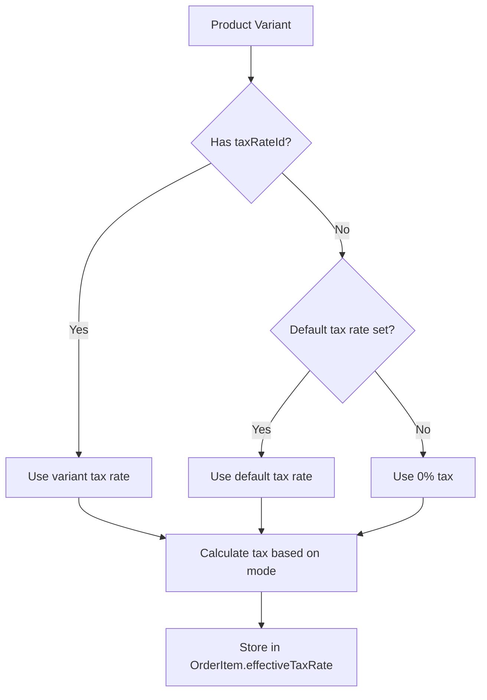

# Variable Tax Rates Implementation Analysis

## Executive Summary

This document provides a comprehensive analysis of the codebase for implementing variable tax rates (VAT) functionality. The analysis covers the current state, identifies gaps, and provides recommendations for implementation.

## Requirements Recap

1. At least 4 different tax rates manageable by admin users
2. One tax rate can be optionally selected as default
3. Tax rates can have an optional description
4. When a product is created or modified, a tax rate can be applied
5. Existing features must be maintained
6. Admin panel Settings frontend can be optimized for new settings

---

## 1. Database Schema Analysis

### Current State

#### Settings Model ([`schema.prisma`](backend/prisma/schema.prisma:213))
```prisma
model Settings {
  id                  Int       @id @default(autoincrement())
  taxMode             String    // 'inclusive', 'exclusive', or 'none'
  autoStartTime       String
  businessDayEndHour  String    @default("06:00")
  autoCloseEnabled    Boolean   @default(false)
  lastManualClose     DateTime?
}
```

**Current Tax Handling:**
- Only stores a single `taxMode` (inclusive/exclusive/none)
- No tax rate percentage stored anywhere
- No support for multiple tax rates

#### ProductVariant Model ([`schema.prisma`](backend/prisma/schema.prisma:57))
```prisma
model ProductVariant {
  id               Int                @id @default(autoincrement())
  productId        Int
  name             String
  price            Float
  isFavourite      Boolean?           @default(false)
  backgroundColor  String
  textColor        String
  product          Product            @relation(fields: [productId], references: [id])
  stockConsumption StockConsumption[]
  // ... other relations
}
```

**Gap:** No `taxRateId` field to link to a tax rate.

#### Transaction Model ([`schema.prisma`](backend/prisma/schema.prisma:96))
```prisma
model Transaction {
  id            Int      @id @default(autoincrement())
  items         Json     // Contains OrderItem[] with effectiveTaxRate
  subtotal      Float
  tax           Float    // Total tax amount
  tip           Float
  total         Float
  // ... other fields
}
```

**Note:** Tax is stored as a calculated total; individual item tax rates are stored in the JSON `items` field.

### Recommended Schema Changes

#### New TaxRate Model
```prisma
model TaxRate {
  id          Int       @id @default(autoincrement())
  name        String    // e.g., "Standard Rate", "Reduced Rate", "Zero Rate"
  rate        Float     // e.g., 0.19 for 19%, 0.07 for 7%
  description String?   // Optional description
  isDefault   Boolean   @default(false)
  isActive    Boolean   @default(true)
  createdAt   DateTime  @default(now())
  updatedAt   DateTime  @updatedAt
  variants    ProductVariant[]
  
  @@map("tax_rates")
}
```

#### Modified ProductVariant Model
```prisma
model ProductVariant {
  id               Int                @id @default(autoincrement())
  productId        Int
  name             String
  price            Float
  isFavourite      Boolean?           @default(false)
  backgroundColor  String
  textColor        String
  taxRateId        Int?               // Optional link to tax rate
  product          Product            @relation(fields: [productId], references: [id])
  taxRate          TaxRate?           @relation(fields: [taxRateId], references: [id])
  stockConsumption StockConsumption[]
  // ... other relations
  
  @@map("product_variants")
}
```

#### Modified Settings Model
```prisma
model Settings {
  id                  Int       @id @default(autoincrement())
  taxMode             String
  defaultTaxRateId    Int?      // Optional default tax rate
  autoStartTime       String
  businessDayEndHour  String    @default("06:00")
  autoCloseEnabled    Boolean   @default(false)
  lastManualClose     DateTime?
  defaultTaxRate      TaxRate?  @relation(fields: [defaultTaxRateId], references: [id])
  
  @@map("settings")
}
```

---

## 2. Backend Settings Handler Analysis

### Current State ([`settings.ts`](backend/src/handlers/settings.ts))

**GET /api/settings:**
- Returns settings with tax mode only
- No tax rate information included

**PUT /api/settings:**
- Updates tax mode only
- No tax rate management

### Gaps

1. No CRUD endpoints for tax rates
2. No endpoint to set default tax rate
3. Settings response doesn't include available tax rates

### Recommended API Endpoints

#### New Tax Rates Endpoints
```
GET    /api/tax-rates           - List all tax rates
GET    /api/tax-rates/:id       - Get single tax rate
POST   /api/tax-rates           - Create tax rate (admin only)
PUT    /api/tax-rates/:id       - Update tax rate (admin only)
DELETE /api/tax-rates/:id       - Delete tax rate (admin only)
PUT    /api/tax-rates/:id/default - Set as default tax rate
```

#### Modified Settings Endpoints
```
GET /api/settings - Include defaultTaxRateId and tax rates list
PUT /api/settings - Support defaultTaxRateId update
```

---

## 3. Backend Products Handler Analysis

### Current State ([`products.ts`](backend/src/handlers/products.ts))

**Product Creation (POST /api/products):**
- Accepts: name, categoryId, variants
- Variants include: name, price, isFavourite, backgroundColor, textColor, stockConsumption
- No tax rate field

**Product Update (PUT /api/products/:id):**
- Same fields as creation
- No tax rate field

### Gaps

1. No `taxRateId` in product variant creation/update
2. No validation that taxRateId references a valid tax rate
3. No default tax rate fallback logic

### Recommended Changes

1. Add `taxRateId` to variant validation
2. Add tax rate validation in product creation/update
3. Include tax rate in product response
4. Implement fallback to default tax rate when not specified

---

## 4. Frontend Settings Page Analysis

### Current State

#### TaxSettings Component ([`TaxSettings.tsx`](frontend/components/TaxSettings.tsx))
- Simple radio button group for tax mode selection
- Three options: exclusive, inclusive, none
- No tax rate management UI

#### SettingsModal Component ([`SettingsModal.tsx`](frontend/components/SettingsModal.tsx))
- Container for settings sections
- Currently shows: LanguageSettings, TaxSettings, BusinessDaySettings

#### BusinessDaySettings Component ([`BusinessDaySettings.tsx`](frontend/components/BusinessDaySettings.tsx))
- Complex component with auto-start time, business day end hour, auto-close toggle
- Shows scheduler status
- Good reference for UI patterns

### Gaps

1. No UI for managing tax rates (CRUD)
2. No UI for setting default tax rate
3. Settings page may need reorganization for additional settings

### Recommended Frontend Changes

#### New TaxRateManagement Component
```
Location: frontend/components/TaxRateManagement.tsx
Features:
- List all tax rates with name, rate, description, default indicator
- Add new tax rate form
- Edit existing tax rate
- Delete tax rate (with confirmation)
- Set default tax rate toggle
```

#### Modified TaxSettings Component
```
- Keep tax mode selection (inclusive/exclusive/none)
- Add default tax rate dropdown
- Link to TaxRateManagement section
```

#### Settings Page Reorganization
```
Consider organizing settings into tabs or collapsible sections:
1. General Settings (Language)
2. Tax Settings (Mode + Tax Rates Management)
3. Business Day Settings
```

---

## 5. Frontend Product Management Analysis

### Current State

#### ProductManagement Component ([`ProductManagement.tsx`](frontend/components/ProductManagement.tsx))
- ProductModal for create/edit
- VariantForm subcomponent for variant management
- Fields: name, price, isFavourite, backgroundColor, stockConsumption

#### VariantForm Component (lines 21-104)
- Handles variant-specific fields
- Stock consumption management
- Color picker for button appearance

### Gaps

1. No tax rate dropdown in VariantForm
2. No display of tax rate in product list
3. No default tax rate indicator

### Recommended Frontend Changes

#### Modified VariantForm Component
```
Add tax rate selection:
- Dropdown populated with available tax rates
- Show "(Default)" indicator next to default rate
- Optional field - if not selected, uses default
```

#### Modified Product List Display
```
Show tax rate for each variant:
- Display tax rate name/percentage
- Indicate if using default rate
```

---

## 6. Shared Types Analysis

### Current State ([`shared/types.ts`](shared/types.ts))

```typescript
export interface TaxSettings {
  mode: 'inclusive' | 'exclusive' | 'none';
}

export interface ProductVariant {
  id: number;
  productId: number;
  name: string;
  price: number;
  isFavourite?: boolean;
  stockConsumption: { stockItemId: string; quantity: number; }[];
  backgroundColor: string;
  textColor: string;
  // Missing: taxRateId
}

export interface OrderItem {
  id: string;
  variantId: number;
  productId: number;
  name: string;
  price: number;
  quantity: number;
  effectiveTaxRate: number;  // Currently hardcoded to 0.19
}
```

### Gaps

1. No `TaxRate` interface
2. `ProductVariant` missing `taxRateId` and `taxRate` relation
3. `Settings` missing `defaultTaxRateId`
4. `OrderItem.effectiveTaxRate` is hardcoded in [`OrderContext.tsx`](frontend/contexts/OrderContext.tsx:131)

### Recommended Type Additions

```typescript
export interface TaxRate {
  id: number;
  name: string;
  rate: number;  // e.g., 0.19 for 19%
  description?: string;
  isDefault: boolean;
  isActive: boolean;
  createdAt: string;
  updatedAt: string;
}

export interface ProductVariant {
  // ... existing fields
  taxRateId?: number;
  taxRate?: TaxRate;
}

export interface Settings {
  tax: TaxSettings;
  defaultTaxRateId?: number;
  defaultTaxRate?: TaxRate;
  businessDay: { ... };
}
```

---

## 7. Tax Calculation Flow Analysis

### Current Flow

1. Item added to order in [`OrderContext.tsx`](frontend/contexts/OrderContext.tsx:131):
   ```typescript
   effectiveTaxRate: 0.19, // Hardcoded!
   ```

2. Tax calculated in [`PaymentModal.tsx`](frontend/components/PaymentModal.tsx:36):
   ```typescript
   if (taxSettings.mode === 'inclusive') {
     const itemSubtotal = itemTotal / (1 + item.effectiveTaxRate);
     subtotal += itemSubtotal;
     tax += itemTotal - itemSubtotal;
   } else { // exclusive
     subtotal += itemTotal;
     tax += itemTotal * item.effectiveTaxRate;
   }
   ```

3. Transaction saved with calculated tax

### Gaps

1. Tax rate is hardcoded (0.19 = 19%)
2. No per-product tax rate consideration
3. No fallback to default tax rate

### Recommended Flow



---

## 8. Implementation Plan

### Phase 1: Database Schema

1. Create `TaxRate` model
2. Add `taxRateId` to `ProductVariant` model
3. Add `defaultTaxRateId` to `Settings` model
4. Create migration
5. Update seed data with default tax rates

### Phase 2: Backend API

1. Create tax rates handler (`backend/src/handlers/taxRates.ts`)
2. Add validation for tax rate CRUD
3. Update settings handler for default tax rate
4. Update products handler for variant tax rate
5. Add tax rate to product responses

### Phase 3: Frontend Types

1. Add `TaxRate` interface to shared types
2. Update `ProductVariant` interface
3. Update `Settings` interface

### Phase 4: Frontend Settings UI

1. Create `TaxRateManagement` component
2. Update `TaxSettings` component
3. Reorganize `SettingsModal` layout

### Phase 5: Frontend Product UI

1. Update `VariantForm` with tax rate dropdown
2. Update product list display
3. Update product API service

### Phase 6: Tax Calculation

1. Update `OrderContext` to use product tax rates
2. Implement fallback to default tax rate
3. Update `PaymentModal` if needed

### Phase 7: Testing

1. Backend unit tests for tax rate endpoints
2. Frontend component tests
3. Integration tests for tax calculation
4. E2E tests for complete flow

---

## 9. Migration Strategy

### Data Migration

1. Create default tax rates (e.g., 19%, 7%, 0%)
2. Set one as default
3. Existing products will use default tax rate (null taxRateId)

### Backward Compatibility

1. `taxRateId` is optional on variants
2. Fallback to default tax rate when null
3. Existing transactions remain unchanged
4. Tax mode (inclusive/exclusive/none) still applies

---

## 10. UI/UX Considerations

### Settings Page Layout

Current layout may become cluttered. Consider:

```
+----------------------------------+
| Settings                         |
+----------------------------------+
| [Language] [Tax] [Business Day]  |  <- Tabs
+----------------------------------+
|                                  |
| Tab Content Here                 |
|                                  |
+----------------------------------+
```

### Tax Rate Management UI

```
+------------------------------------------+
| Tax Rates                                |
+------------------------------------------+
| [+ Add Tax Rate]                         |
+------------------------------------------+
| Name          | Rate  | Default | Actions|
+------------------------------------------+
| Standard Rate | 19%   | [✓]     | [Edit] |
| Reduced Rate  | 7%    | [ ]     | [Edit] |
| Zero Rate     | 0%    | [ ]     | [Edit] |
| Super Reduced | 4%    | [ ]     | [Edit] |
+------------------------------------------+
```

### Product Variant Tax Rate Selection

```
+----------------------------------+
| Variant: Standard                |
+----------------------------------+
| Name:        [Standard        ]  |
| Price:       [0.00            ]  |
| Tax Rate:    [Standard (19%) ▼]  | <- New field
|            (Uses default if not set) |
+----------------------------------+
```

---

## 11. Summary of Required Changes

### Database
- [ ] Create `TaxRate` model
- [ ] Add `taxRateId` to `ProductVariant`
- [ ] Add `defaultTaxRateId` to `Settings`
- [ ] Create migration
- [ ] Update seed data

### Backend
- [ ] Create `taxRates.ts` handler with CRUD endpoints
- [ ] Update `settings.ts` handler
- [ ] Update `products.ts` handler
- [ ] Add validation utilities for tax rates
- [ ] Update types in `backend/src/types.ts`

### Frontend Types
- [ ] Add `TaxRate` interface to `shared/types.ts`
- [ ] Update `ProductVariant` interface
- [ ] Update `Settings` interface

### Frontend Components
- [ ] Create `TaxRateManagement.tsx`
- [ ] Update `TaxSettings.tsx`
- [ ] Update `SettingsModal.tsx`
- [ ] Update `ProductManagement.tsx`
- [ ] Update `VariantForm` component

### Frontend Services
- [ ] Create `taxRateService.ts`
- [ ] Update `productService.ts`
- [ ] Update `settingService.ts`

### Frontend Contexts
- [ ] Update `OrderContext.tsx` for tax rate resolution
- [ ] Update `PaymentContext.tsx` if needed

---

## 12. Risk Assessment

| Risk | Impact | Mitigation |
|------|--------|------------|
| Breaking existing tax calculation | High | Keep taxMode logic, add tax rates as enhancement |
| Data migration issues | Medium | Test migration on copy of production data |
| UI complexity | Low | Use tabs/collapsible sections in settings |
| Performance with many tax rates | Low | Tax rates are small dataset, minimal impact |

---

## Conclusion

The implementation of variable tax rates requires changes across all layers of the application. The current architecture is well-structured and should accommodate these changes without major refactoring. The key is to make tax rates optional with a sensible default fallback to maintain backward compatibility.
