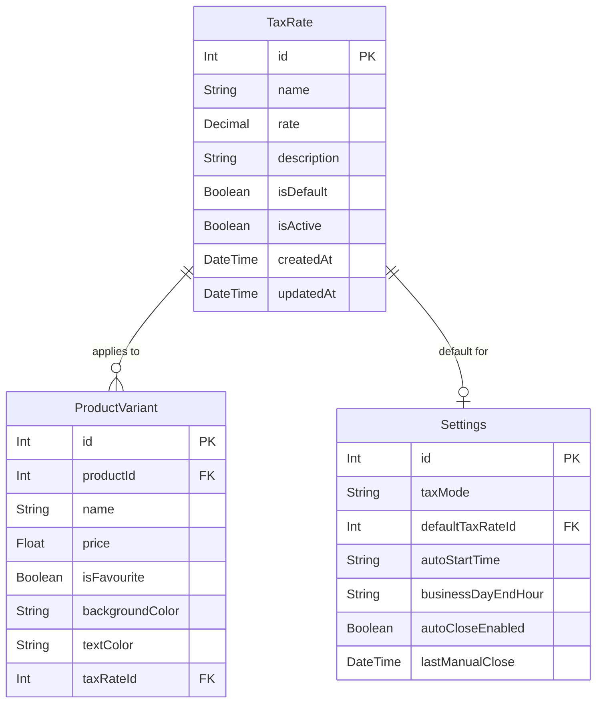

# Variable Tax Rates - Database Schema Plan

## Overview

This document provides a focused implementation plan for database schema changes to support variable tax rates (VAT) in the POS/restaurant management system.

## Current State

- Tax rate is hardcoded to 19% in [`OrderContext.tsx`](frontend/contexts/OrderContext.tsx:131)
- [`Settings`](backend/prisma/schema.prisma:213) model has `taxMode` (inclusive/exclusive/none) but no tax rate percentage
- [`ProductVariant`](backend/prisma/schema.prisma:57) model has no tax rate field
- No `TaxRate` model exists

---

## 1. New TaxRate Model

### Complete Prisma Schema

```prisma
model TaxRate {
  id          Int             @id @default(autoincrement())
  name        String          // e.g., "Standard Rate", "Reduced Rate"
  rate        Decimal         @db.Decimal(5, 4) // e.g., 0.1900 for 19%, 0.1000 for 10%
  description String?         // Optional description
  isDefault   Boolean         @default(false)
  isActive    Boolean         @default(true)
  createdAt   DateTime        @default(now())
  updatedAt   DateTime        @updatedAt
  
  // Relations
  variants    ProductVariant[]
  settings    Settings[]
  
  @@index([isActive])
  @@index([isDefault])
  @@map("tax_rates")
}
```

### Field Rationale

| Field | Type | Rationale |
|-------|------|-----------|
| `id` | Int | Auto-increment primary key, consistent with other models |
| `name` | String | Required for display in UI, e.g., "Standard Rate" |
| `rate` | Decimal(5,4) | Avoids floating-point precision issues. Max 999.9999% (5 digits total, 4 decimal places). Stored as decimal (0.19 = 19%) |
| `description` | String? | Optional field for additional context |
| `isDefault` | Boolean | Indicates the default tax rate. Must ensure only one default exists |
| `isActive` | Boolean | Soft delete support - inactive rates are hidden but preserved for historical data integrity |
| `createdAt` | DateTime | Audit trail |
| `updatedAt` | DateTime | Audit trail |

### Indexes

- `isActive` - Filter active tax rates efficiently
- `isDefault` - Quick lookup for default tax rate

---

## 2. Changes to ProductVariant Model

### Current Schema

```prisma
model ProductVariant {
  id               Int                @id @default(autoincrement())
  productId        Int
  name             String
  price            Float
  isFavourite      Boolean?           @default(false)
  backgroundColor  String
  textColor        String
  product          Product            @relation(fields: [productId], references: [id])
  stockConsumption StockConsumption[]
  variantLayouts   VariantLayout[]
  sharedLayoutPositions SharedLayoutPosition[]

  @@map("product_variants")
}
```

### Modified Schema

```prisma
model ProductVariant {
  id               Int                @id @default(autoincrement())
  productId        Int
  name             String
  price            Float
  isFavourite      Boolean?           @default(false)
  backgroundColor  String
  textColor        String
  taxRateId        Int?               // Optional - null means use default tax rate
  product          Product            @relation(fields: [productId], references: [id])
  taxRate          TaxRate?           @relation(fields: [taxRateId], references: [id], onDelete: SetNull)
  stockConsumption StockConsumption[]
  variantLayouts   VariantLayout[]
  sharedLayoutPositions SharedLayoutPosition[]

  @@index([taxRateId])
  @@map("product_variants")
}
```

### Key Changes

1. **`taxRateId` (Int?)** - Optional foreign key to TaxRate
   - `null` means the product uses the default tax rate
   - Allows per-product tax rate override

2. **`taxRate` relation** - Optional relation to TaxRate
   - `onDelete: SetNull` - If a tax rate is deleted, variants keep their data with null tax rate (fallback to default)

3. **Index on `taxRateId`** - Efficient queries filtering by tax rate

---

## 3. Changes to Settings Model

### Current Schema

```prisma
model Settings {
  id                  Int       @id @default(autoincrement())
  taxMode             String
  autoStartTime       String
  businessDayEndHour  String    @default("06:00")
  autoCloseEnabled    Boolean   @default(false)
  lastManualClose     DateTime?

  @@map("settings")
}
```

### Modified Schema

```prisma
model Settings {
  id                  Int       @id @default(autoincrement())
  taxMode             String
  defaultTaxRateId    Int?      // Optional - default tax rate for products without explicit rate
  autoStartTime       String
  businessDayEndHour  String    @default("06:00")
  autoCloseEnabled    Boolean   @default(false)
  lastManualClose     DateTime?
  defaultTaxRate      TaxRate?  @relation(fields: [defaultTaxRateId], references: [id], onDelete: SetNull)

  @@index([defaultTaxRateId])
  @@map("settings")
}
```

### Key Changes

1. **`defaultTaxRateId` (Int?)** - Optional foreign key to TaxRate
   - Points to the default tax rate used when a product variant has no explicit tax rate

2. **`defaultTaxRate` relation** - Optional relation to TaxRate
   - `onDelete: SetNull` - If the default tax rate is deleted, settings will have no default

3. **Index on `defaultTaxRateId`** - Efficient lookup

---

## 4. Migration Strategy

### Step 1: Create Migration File

```bash
npx prisma migrate dev --name add_tax_rates
```

### Step 2: Migration SQL (Generated)

The migration should:

1. Create `tax_rates` table
2. Add `taxRateId` column to `product_variants`
3. Add `defaultTaxRateId` column to `settings`
4. Create indexes

```sql
-- Create tax_rates table
CREATE TABLE "tax_rates" (
    "id" SERIAL NOT NULL,
    "name" TEXT NOT NULL,
    "rate" DECIMAL(5,4) NOT NULL,
    "description" TEXT,
    "isDefault" BOOLEAN NOT NULL DEFAULT false,
    "isActive" BOOLEAN NOT NULL DEFAULT true,
    "createdAt" TIMESTAMP(3) NOT NULL DEFAULT CURRENT_TIMESTAMP,
    "updatedAt" TIMESTAMP(3) NOT NULL,
    CONSTRAINT "tax_rates_pkey" PRIMARY KEY ("id")
);

-- Create indexes for tax_rates
CREATE INDEX "tax_rates_isActive_idx" ON "tax_rates"("isActive");
CREATE INDEX "tax_rates_isDefault_idx" ON "tax_rates"("isDefault");

-- Add taxRateId to product_variants
ALTER TABLE "product_variants" ADD COLUMN "taxRateId" INTEGER;
ALTER TABLE "product_variants" ADD CONSTRAINT "product_variants_taxRateId_fkey" 
    FOREIGN KEY ("taxRateId") REFERENCES "tax_rates"("id") 
    ON DELETE SET NULL ON UPDATE CASCADE;

-- Create index for product_variants.taxRateId
CREATE INDEX "product_variants_taxRateId_idx" ON "product_variants"("taxRateId");

-- Add defaultTaxRateId to settings
ALTER TABLE "settings" ADD COLUMN "defaultTaxRateId" INTEGER;
ALTER TABLE "settings" ADD CONSTRAINT "settings_defaultTaxRateId_fkey" 
    FOREIGN KEY ("defaultTaxRateId") REFERENCES "tax_rates"("id") 
    ON DELETE SET NULL ON UPDATE CASCADE;

-- Create index for settings.defaultTaxRateId
CREATE INDEX "settings_defaultTaxRateId_idx" ON "settings"("defaultTaxRateId");
```

### Step 3: Handling Existing Data

**Existing ProductVariants:**
- All existing variants will have `taxRateId = null`
- They will use the default tax rate (to be seeded)

**Existing Settings:**
- The single settings row will have `defaultTaxRateId = null` initially
- After seeding tax rates, update settings to point to the default rate

### Step 4: Seed Data Execution

After migration, run the seed to populate tax rates:

```bash
npx prisma db seed
```

---

## 5. Seed Data

### Default Tax Rates to Seed

| Name | Rate | Description | isDefault | isActive |
|------|------|-------------|-----------|----------|
| Zero Rate | 0.0000 | Tax-free items | false | true |
| Reduced Rate | 0.1000 | Reduced VAT rate (10%) | false | true |
| Standard Rate | 0.1900 | Standard VAT rate (19%) | true | true |
| Super Reduced | 0.2200 | Super reduced VAT rate (22%) | false | true |

### Seed Code Addition

Add to [`seed.ts`](backend/prisma/seed.ts):

```typescript
// Tax rates to seed
const DEFAULT_TAX_RATES = [
  { name: 'Zero Rate', rate: 0.0000, description: 'Tax-free items', isDefault: false, isActive: true },
  { name: 'Reduced Rate', rate: 0.1000, description: 'Reduced VAT rate (10%)', isDefault: false, isActive: true },
  { name: 'Standard Rate', rate: 0.1900, description: 'Standard VAT rate (19%)', isDefault: true, isActive: true },
  { name: 'Super Reduced', rate: 0.2200, description: 'Super reduced VAT rate (22%)', isDefault: false, isActive: true },
];

// In seedDatabase function:
const taxRateCount = await prisma.taxRate.count();

if (taxRateCount === 0) {
  console.log('Seeding tax rates...');
  
  const taxRates = await Promise.all(
    DEFAULT_TAX_RATES.map((taxRate) =>
      prisma.taxRate.create({
        data: taxRate,
      })
    )
  );
  console.log('Created tax rates:', taxRates.length);
  
  // Update settings to point to default tax rate
  const standardRate = taxRates.find((tr) => tr.isDefault);
  if (standardRate) {
    await prisma.settings.updateMany({
      data: { defaultTaxRateId: standardRate.id },
    });
    console.log('Set default tax rate in settings');
  }
} else {
  console.log(`Tax rates already exist (${taxRateCount}), skipping tax rate seeding`);
}
```

---

## 6. Constraint: Single Default Tax Rate

### Application-Level Enforcement

Since Prisma doesn't support partial indexes directly, enforce the single default constraint at the application level:

```typescript
// In tax rates handler - when setting a tax rate as default
async function setDefaultTaxRate(id: number) {
  await prisma.$transaction([
    // First, unset all defaults
    prisma.taxRate.updateMany({
      where: { isDefault: true },
      data: { isDefault: false },
    }),
    // Then, set the new default
    prisma.taxRate.update({
      where: { id },
      data: { isDefault: true },
    }),
  ]);
}
```

### Database-Level Enforcement (Optional)

For stricter enforcement, create a partial unique index via raw SQL:

```sql
-- Only one tax rate can be default among active rates
CREATE UNIQUE INDEX "tax_rates_single_default" ON "tax_rates"("isDefault") 
WHERE "isDefault" = true AND "isActive" = true;
```

---

## 7. Entity Relationship Diagram



---

## 8. Implementation Checklist

### Database Schema Changes

- [ ] Add `TaxRate` model to [`schema.prisma`](backend/prisma/schema.prisma)
- [ ] Add `taxRateId` field to `ProductVariant` model
- [ ] Add `defaultTaxRateId` field to `Settings` model
- [ ] Add indexes for new foreign keys

### Migration

- [ ] Create migration with `npx prisma migrate dev --name add_tax_rates`
- [ ] Review generated SQL
- [ ] Test migration on development database

### Seed Data

- [ ] Add tax rates to [`seed.ts`](backend/prisma/seed.ts)
- [ ] Update settings seeding to set `defaultTaxRateId`
- [ ] Run seed to verify

### Post-Migration

- [ ] Verify all existing product variants have `taxRateId = null`
- [ ] Verify settings has `defaultTaxRateId` set
- [ ] Verify tax rates are seeded correctly

---

## 9. Backward Compatibility

| Scenario | Behavior |
|----------|----------|
| Existing products | `taxRateId = null` → uses default tax rate |
| No default tax rate set | Falls back to 0% tax (safe default) |
| Tax rate deleted | Variants with that rate get `taxRateId = null` → use default |
| Tax mode (inclusive/exclusive/none) | Still applies - tax rate is just the percentage |

---

## Summary

This plan introduces a new `TaxRate` model and integrates it with the existing `ProductVariant` and `Settings` models. The design:

1. Uses `Decimal(5,4)` for precise tax rate storage
2. Supports optional tax rates on products with fallback to default
3. Implements soft deletes via `isActive` flag
4. Ensures single default via application-level constraint
5. Maintains backward compatibility with existing data
