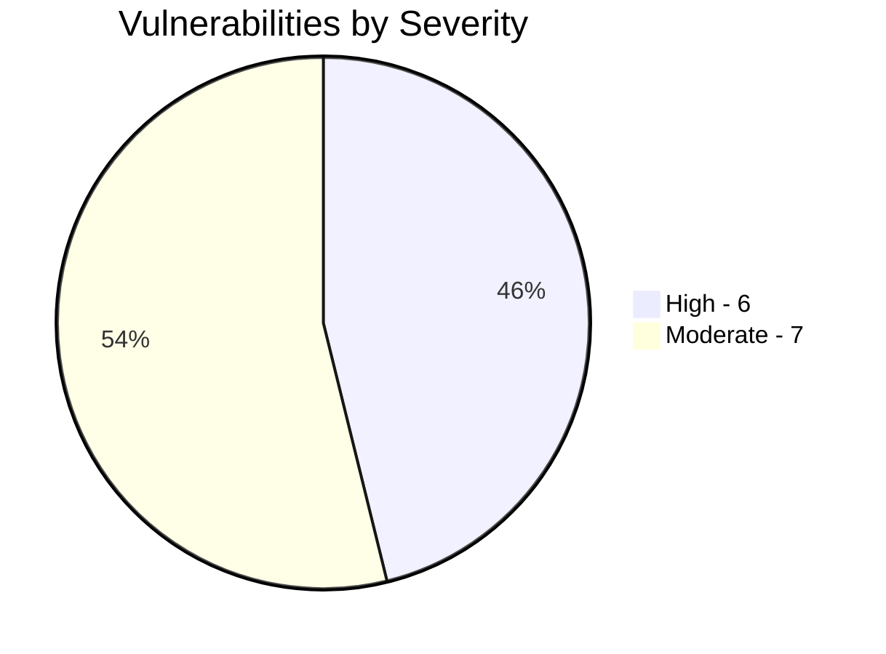
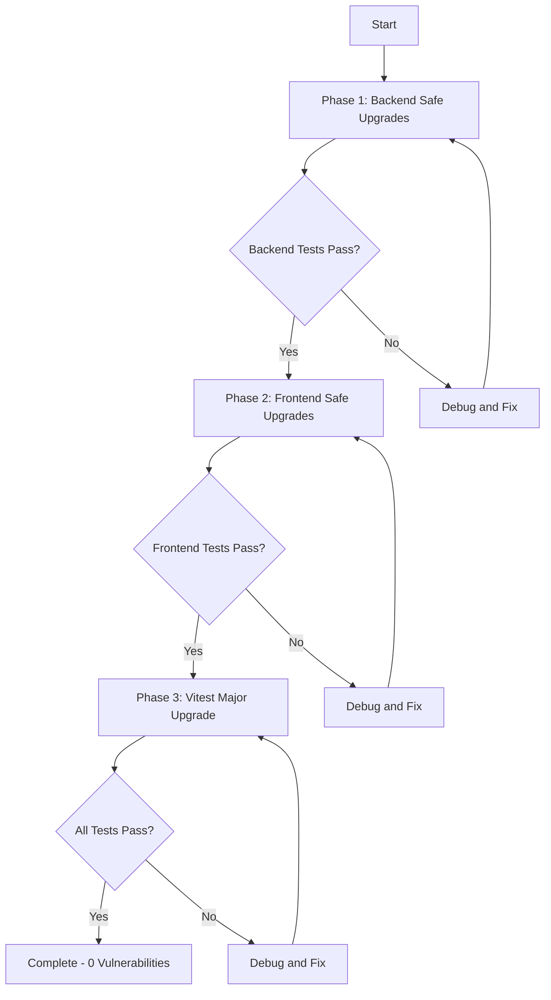

# NPM Vulnerability Remediation Plan - Overview

**Created:** 2026-02-11  
**Status:** Planning Complete  
**Related Documents:**
- [Backend Vulnerabilities Audit](../vulnerability-audit/backend-vulnerabilities.md)
- [Frontend Vulnerabilities Audit](../vulnerability-audit/frontend-vulnerabilities.md)
- [Upgrade Research](../vulnerability-audit/upgrade-research.md)

---

## Executive Summary

This document outlines a comprehensive plan to remediate npm security vulnerabilities across the TEV2 application. The plan is structured in three phases, prioritizing low-risk fixes first and carefully planning high-risk major version upgrades.

### Vulnerability Summary

| Location | Total | Critical | High | Moderate | Low |
|----------|-------|----------|------|----------|-----|
| Backend | 5 | 0 | 4 | 1 | 0 |
| Frontend | 8 | 0 | 2 | 6 | 0 |
| **Total** | **13** | **0** | **6** | **7** | **0** |

### Risk Distribution



---

## Goals

1. **Security First:** Eliminate all known security vulnerabilities
2. **Minimal Disruption:** Prioritize non-breaking updates in early phases
3. **Comprehensive Testing:** Verify application functionality after each phase
4. **Documented Rollback:** Maintain clear rollback procedures

---

## Phased Approach

### Phase 1: Backend Safe Upgrades
**Risk Level:** LOW  
**Duration:** Quick  
**Packages:** axios, express, qs, js-yaml

All backend vulnerabilities can be fixed with patch/minor version updates. No code changes required.

### Phase 2: Frontend Safe Upgrades
**Risk Level:** LOW  
**Duration:** Quick  
**Packages:** glob, jws, esbuild

Most frontend vulnerabilities are in transitive dependencies and can be fixed with `npm audit fix`.

### Phase 3: Vitest Major Upgrade
**Risk Level:** HIGH  
**Duration:** Extended  
**Packages:** vitest, @vitest/coverage-v8, @vitest/ui, vite, vite-node

The vitest ecosystem requires a major version upgrade from 1.x to 4.x. This involves:
- Breaking configuration changes
- Potential test file updates
- Coverage configuration migration

---

## Phase Dependency Diagram



---

## Task Summary by Phase

| Phase | Total Tasks | Commands | File Edits | Verifications |
|-------|-------------|----------|------------|---------------|
| Phase 1 | 15 | 8 | 0 | 7 |
| Phase 2 | 14 | 7 | 0 | 7 |
| Phase 3 | 22 | 8 | 5 | 9 |
| **Total** | **51** | **23** | **5** | **23** |

---

## Prerequisites

Before starting any phase:

1. **Clean Git State**
   - All changes committed
   - No untracked files in critical directories
   - Current branch is clean

2. **Backup Created**
   - Create a backup branch before each phase
   - Document current package versions

3. **Services Running**
   - Backend server can start
   - Frontend server can start
   - Database is accessible

4. **Environment Ready**
   - Node.js installed and working
   - npm installed and working
   - Docker containers running if applicable

---

## Success Criteria

Each phase is considered successful when:

1. `npm audit` reports 0 vulnerabilities for that phase's packages
2. All existing tests pass
3. Application starts and runs correctly
4. No new errors in logs

---

## Document Index

| File | Description |
|------|-------------|
| [00-overview.md](00-overview.md) | This document - executive summary and approach |
| [01-phase1-backend-safe-upgrades.md](01-phase1-backend-safe-upgrades.md) | Backend non-breaking upgrades |
| [02-phase2-frontend-safe-upgrades.md](02-phase2-frontend-safe-upgrades.md) | Frontend non-breaking upgrades |
| [03-phase3-vitest-major-upgrade.md](03-phase3-vitest-major-upgrade.md) | Vitest ecosystem major upgrade |
| [04-verification-checklist.md](04-verification-checklist.md) | Testing and verification steps |
| [05-rollback-procedures.md](05-rollback-procedures.md) | Rollback procedures |

---

## Quick Reference Commands

### Check Current Vulnerability Status
```bash
# Backend
cd backend && npm audit

# Frontend
cd frontend && npm audit
```

### Run Tests
```bash
# Backend
cd backend && npm test

# Frontend
cd frontend && npm test
```

### Start Development Servers
```bash
# Backend
cd backend && npm run dev

# Frontend
cd frontend && npm run dev
```

---

## Risk Assessment Matrix

| Phase | Risk | Impact if Failed | Recovery Time |
|-------|------|------------------|---------------|
| Phase 1 | LOW | Backend unavailable | Quick - revert package.json |
| Phase 2 | LOW | Frontend build fails | Quick - revert package.json |
| Phase 3 | HIGH | Tests fail, config broken | Extended - may need code changes |

---

## Next Steps

1. Review and approve this plan
2. Switch to Code mode to begin Phase 1
3. Follow the detailed task checklists in each phase document
4. Complete verification after each phase
5. Document any issues encountered
