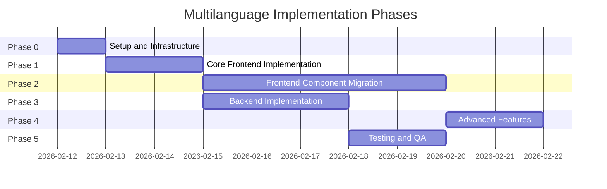
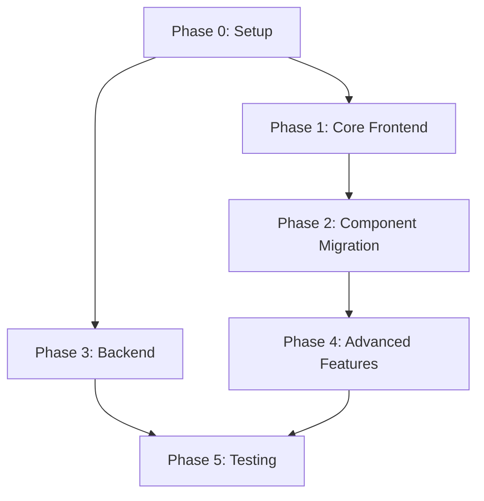

# Multilanguage Implementation Plan

**Project:** Bar POS Pro  
**Date:** February 2026  
**Status:** Planning Phase

---

## Executive Summary

This document outlines a comprehensive, phased implementation plan for adding multilanguage support to the Bar POS Pro application. The implementation will use react-i18next for the frontend and i18next-http-middleware for the backend, supporting English (base) and Italian as the initial languages.

### Key Metrics

| Metric | Value |
|--------|-------|
| Total Strings to Translate | ~755 |
| Frontend Strings | ~500 |
| Backend Strings | ~255 |
| Frontend Components to Migrate | 70+ |
| Backend Handlers to Migrate | 15+ |
| Initial Languages | English, Italian |

---

## Phase Overview



---

## Phase 0: Setup and Infrastructure

### 0.1 Install Dependencies

#### Frontend Dependencies

```bash
cd frontend
npm install i18next@^23.0.0 react-i18next@^14.0.0 i18next-browser-languagedetector@^7.0.0
```

#### Backend Dependencies

```bash
cd backend
npm install i18next@^23.0.0 i18next-fs-backend@^2.0.0 i18next-http-middleware@^3.0.0
```

### 0.2 Create Directory Structure

```
frontend/
├── src/
│   └── i18n/
│       ├── index.ts           # Main i18n configuration
│       ├── types.ts           # TypeScript declarations
│       └── resources.ts       # Type-safe resource definitions
└── public/
    └── locales/
        ├── en/
        │   ├── common.json
        │   ├── pos.json
        │   ├── errors.json
        │   ├── validation.json
        │   ├── navigation.json
        │   └── settings.json
        └── it/
            ├── common.json
            ├── pos.json
            ├── errors.json
            ├── validation.json
            ├── navigation.json
            └── settings.json

backend/
├── src/
│   └── i18n/
│       └── index.ts           # Backend i18n configuration
└── locales/
    ├── en/
    │   ├── api.json
    │   └── errors.json
    └── it/
        ├── api.json
        └── errors.json
```

### 0.3 Create Frontend i18n Configuration

**File:** [`frontend/src/i18n/index.ts`](frontend/src/i18n/index.ts)

```typescript
import i18n from 'i18next';
import { initReactI18next } from 'react-i18next';
import LanguageDetector from 'i18next-browser-languagedetector';
import resourcesToBackend from 'i18next-resources-to-backend';

i18n
  .use(LanguageDetector)
  .use(initReactI18next)
  .use(resourcesToBackend((language: string, namespace: string) => 
    import(`../../public/locales/${language}/${namespace}.json`)
  ))
  .init({
    fallbackLng: 'en',
    supportedLngs: ['en', 'it'],
    
    debug: import.meta.env.DEV,
    
    defaultNS: 'common',
    ns: ['common', 'pos', 'errors', 'validation', 'navigation', 'settings'],
    
    interpolation: {
      escapeValue: false,
    },
    
    react: {
      useSuspense: true,
      bindI18n: 'languageChanged loaded',
      bindI18nStore: 'added removed',
    },
    
    detection: {
      order: ['localStorage', 'navigator', 'htmlTag'],
      caches: ['localStorage'],
      lookupLocalStorage: 'i18nextLng',
    },
  });

// Update document attributes on language change
i18n.on('languageChanged', (lng) => {
  document.documentElement.setAttribute('lang', lng);
});

export default i18n;
```

### 0.4 Create TypeScript Type Definitions

**File:** [`frontend/src/i18n/types.ts`](frontend/src/i18n/types.ts)

```typescript
import 'i18next';
import type { resources } from './resources';

declare module 'i18next' {
  interface CustomTypeOptions {
    defaultNS: 'common';
    resources: typeof resources;
    ns: ['common', 'pos', 'errors', 'validation', 'navigation', 'settings'];
    returnNull: false;
    returnEmptyString: false;
  }
}
```

### 0.5 Create Backend i18n Configuration

**File:** [`backend/src/i18n/index.ts`](backend/src/i18n/index.ts)

```typescript
import i18next from 'i18next';
import Backend from 'i18next-fs-backend';
import i18nextMiddleware from 'i18next-http-middleware';

i18next
  .use(Backend)
  .use(i18nextMiddleware.LanguageDetector)
  .init({
    fallbackLng: 'en',
    supportedLngs: ['en', 'it'],
    preload: ['en', 'it'],
    
    ns: ['api', 'errors'],
    defaultNS: 'api',
    
    backend: {
      loadPath: './locales/{{lng}}/{{ns}}.json',
    },
    
    detection: {
      order: ['header', 'querystring', 'cookie'],
      caches: ['cookie'],
      lookupHeader: 'accept-language',
      lookupQuerystring: 'lng',
      lookupCookie: 'i18next',
    },
  });

export default i18next;
```

### 0.6 Tasks Checklist

| Task | Description | Dependencies |
|------|-------------|--------------|
| 0.1 | Install frontend dependencies | None |
| 0.2 | Install backend dependencies | None |
| 0.3 | Create frontend i18n directory structure | 0.1 |
| 0.4 | Create backend i18n directory structure | 0.2 |
| 0.5 | Create frontend i18n configuration | 0.3 |
| 0.6 | Create TypeScript type definitions | 0.5 |
| 0.7 | Create backend i18n configuration | 0.4 |
| 0.8 | Create empty translation JSON files | 0.3, 0.4 |

---

## Phase 1: Core Frontend Implementation

### 1.1 Create Base Translation Files

Create complete English translation files as the base for all other languages.

#### Common Namespace

**File:** [`frontend/public/locales/en/common.json`](frontend/public/locales/en/common.json)

```json
{
  "buttons": {
    "save": "Save",
    "cancel": "Cancel",
    "delete": "Delete",
    "edit": "Edit",
    "add": "Add",
    "confirm": "Confirm",
    "close": "Close",
    "clear": "Clear",
    "submit": "Submit",
    "back": "Back",
    "next": "Next",
    "finish": "Finish",
    "loading": "Loading...",
    "saving": "Saving...",
    "deleting": "Deleting...",
    "processing": "Processing...",
    "refresh": "Refresh",
    "reset": "Reset",
    "search": "Search",
    "filter": "Filter",
    "apply": "Apply",
    "select": "Select",
    "selectAll": "Select All",
    "deselectAll": "Deselect All"
  },
  "labels": {
    "name": "Name",
    "description": "Description",
    "price": "Price",
    "quantity": "Quantity",
    "total": "Total",
    "subtotal": "Subtotal",
    "tax": "Tax",
    "tip": "Tip",
    "date": "Date",
    "time": "Time",
    "status": "Status",
    "actions": "Actions",
    "options": "Options",
    "notes": "Notes",
    "comments": "Comments",
    "loading": "Loading...",
    "error": "Error",
    "success": "Success",
    "warning": "Warning",
    "info": "Information",
    "noData": "No data available",
    "noResults": "No results found",
    "required": "Required",
    "optional": "Optional"
  },
  "confirmation": {
    "delete": "Are you sure you want to delete this item?",
    "deleteMultiple": "Are you sure you want to delete {{count}} items?",
    "unsavedChanges": "You have unsaved changes. Are you sure you want to leave?",
    "generic": "Are you sure?"
  },
  "status": {
    "active": "Active",
    "inactive": "Inactive",
    "enabled": "Enabled",
    "disabled": "Disabled",
    "available": "Available",
    "occupied": "Occupied",
    "reserved": "Reserved",
    "open": "Open",
    "closed": "Closed",
    "pending": "Pending",
    "completed": "Completed",
    "cancelled": "Cancelled"
  }
}
```

#### POS Namespace

**File:** [`frontend/public/locales/en/pos.json`](frontend/public/locales/en/pos.json)

```json
{
  "title": "Point of Sale",
  "cart": {
    "title": "Current Order",
    "empty": "Cart is empty",
    "items_one": "{{count}} item",
    "items_other": "{{count}} items",
    "subtotal": "Subtotal",
    "tax": "Tax",
    "total": "Total",
    "addItem": "Add Item",
    "removeItem": "Remove Item",
    "clearCart": "Clear Cart",
    "quantity": "Qty"
  },
  "payment": {
    "title": "Payment",
    "methods": {
      "cash": "Cash",
      "card": "Card",
      "voucher": "Voucher"
    },
    "amountReceived": "Amount Received",
    "change": "Change",
    "process": "Process Payment",
    "success": "Payment successful!",
    "failed": "Payment failed. Please try again.",
    "insufficientFunds": "Insufficient funds received"
  },
  "products": {
    "search": "Search products...",
    "noResults": "No products found",
    "addToCart": "Add to Cart",
    "outOfStock": "Out of Stock",
    "lowStock": "Low Stock",
    "category": "Category",
    "allCategories": "All Categories"
  },
  "orders": {
    "new": "New Order",
    "inProgress": "In Progress",
    "completed": "Completed",
    "cancelled": "Cancelled",
    "orderNumber": "Order #{{number}}",
    "noOrders": "No orders"
  },
  "tables": {
    "title": "Tables",
    "selectTable": "Select Table",
    "noTable": "No Table",
    "capacity": "Capacity: {{count}}",
    "status": {
      "available": "Available",
      "occupied": "Occupied",
      "reserved": "Reserved"
    }
  }
}
```

#### Errors Namespace

**File:** [`frontend/public/locales/en/errors.json`](frontend/public/locales/en/errors.json)

```json
{
  "network": {
    "title": "Network Error",
    "message": "Unable to connect to the server. Please check your connection.",
    "retry": "Retry"
  },
  "unauthorized": {
    "title": "Unauthorized",
    "message": "You are not authorized to perform this action.",
    "login": "Please log in again."
  },
  "notFound": {
    "title": "Not Found",
    "message": "The requested resource was not found."
  },
  "server": {
    "title": "Server Error",
    "message": "An internal server error occurred. Please try again later."
  },
  "validation": {
    "title": "Validation Error",
    "message": "Please check your input and try again."
  },
  "generic": {
    "title": "Error",
    "message": "An unexpected error occurred."
  },
  "codes": {
    "INVALID_CREDENTIALS": "Invalid username or password",
    "USER_NOT_FOUND": "User not found",
    "PRODUCT_NOT_FOUND": "Product not found",
    "CATEGORY_NOT_FOUND": "Category not found",
    "TABLE_NOT_FOUND": "Table not found",
    "ORDER_NOT_FOUND": "Order not found",
    "VALIDATION_FAILED": "Validation failed",
    "ACCESS_DENIED": "Access denied",
    "RATE_LIMITED": "Too many requests. Please wait and try again.",
    "TOKEN_EXPIRED": "Your session has expired. Please log in again.",
    "TOKEN_INVALID": "Invalid session. Please log in again."
  }
}
```

#### Validation Namespace

**File:** [`frontend/public/locales/en/validation.json`](frontend/public/locales/en/validation.json)

```json
{
  "required": "This field is required",
  "email": "Please enter a valid email address",
  "minLength": "Minimum {{min}} characters required",
  "maxLength": "Maximum {{max}} characters allowed",
  "min": "Minimum value is {{min}}",
  "max": "Maximum value is {{max}}",
  "pattern": "Invalid format",
  "number": "Please enter a valid number",
  "integer": "Please enter a whole number",
  "positiveNumber": "Please enter a positive number",
  "nonNegativeNumber": "Please enter a non-negative number",
  "price": "Please enter a valid price",
  "url": "Please enter a valid URL",
  "date": "Please enter a valid date",
  "dateRange": "Start date must be before end date",
  "passwordMatch": "Passwords do not match",
  "passwordStrength": "Password must be at least 8 characters with uppercase, lowercase, and numbers",
  "username": "Username must be 3-20 characters, letters, numbers, and underscores only",
  "unique": "This value already exists",
  "fields": {
    "name": "Name is required",
    "price": "Price is required and must be non-negative",
    "quantity": "Quantity is required and must be non-negative",
    "category": "Category is required",
    "username": "Username is required",
    "password": "Password is required",
    "email": "Email is required"
  }
}
```

#### Navigation Namespace

**File:** [`frontend/public/locales/en/navigation.json`](frontend/public/locales/en/navigation.json)

```json
{
  "menu": {
    "dashboard": "Dashboard",
    "pos": "Point of Sale",
    "analytics": "Analytics",
    "products": "Products",
    "categories": "Categories",
    "stockItems": "Stock Items",
    "inventory": "Inventory",
    "users": "Users",
    "tills": "Tills",
    "tables": "Tables & Layout",
    "transactions": "Transactions",
    "activityLog": "Activity Log",
    "dailyClosing": "Daily Closing Summary",
    "consumption": "Itemised Consumption",
    "settings": "Settings"
  },
  "admin": {
    "title": "Admin Panel",
    "productManagement": "Product Management",
    "categoryManagement": "Category Management",
    "userManagement": "User Management",
    "tableManagement": "Table Management",
    "tillManagement": "Till Management",
    "stockManagement": "Stock Management",
    "layoutManagement": "Layout Management"
  },
  "user": {
    "profile": "Profile",
    "logout": "Logout",
    "login": "Login"
  }
}
```

#### Settings Namespace

**File:** [`frontend/public/locales/en/settings.json`](frontend/public/locales/en/settings.json)

```json
{
  "title": "Settings",
  "language": {
    "title": "Language",
    "description": "Select your preferred language",
    "en": "English",
    "it": "Italiano"
  },
  "currency": {
    "title": "Currency",
    "symbol": "Symbol",
    "position": "Position",
    "beforeAmount": "Before amount",
    "afterAmount": "After amount"
  },
  "receipt": {
    "title": "Receipt Settings",
    "showTax": "Show tax breakdown",
    "showTip": "Show tip line",
    "header": "Header Text",
    "footer": "Footer Text"
  },
  "display": {
    "title": "Display Settings",
    "theme": "Theme",
    "light": "Light",
    "dark": "Dark",
    "auto": "Auto"
  }
}
```

### 1.2 Create Italian Translation Files

Create corresponding Italian translation files. See [`translation-files-structure.md`](translation-files-structure.md) for complete Italian translations.

### 1.3 Create Language Switcher Component

**File:** [`frontend/components/LanguageSwitcher.tsx`](frontend/components/LanguageSwitcher.tsx)

```typescript
import React from 'react';
import { useTranslation } from 'react-i18next';

const languages = [
  { code: 'en', name: 'English', flag: '🇬🇧' },
  { code: 'it', name: 'Italiano', flag: '🇮🇹' },
];

export const LanguageSwitcher: React.FC = () => {
  const { i18n } = useTranslation();
  
  const currentLanguage = languages.find(l => l.code === i18n.language) || languages[0];
  
  const changeLanguage = (code: string) => {
    i18n.changeLanguage(code);
  };
  
  return (
    <div className="relative group">
      <button
        className="flex items-center gap-2 px-3 py-2 rounded-lg hover:bg-gray-100 dark:hover:bg-gray-800"
        aria-label="Select language"
      >
        <span>{currentLanguage.flag}</span>
        <span className="hidden sm:inline">{currentLanguage.name}</span>
      </button>
      
      <div className="absolute right-0 mt-2 w-40 bg-white dark:bg-gray-900 rounded-lg shadow-lg opacity-0 invisible group-hover:opacity-100 group-hover:visible transition-all">
        {languages.map((lang) => (
          <button
            key={lang.code}
            onClick={() => changeLanguage(lang.code)}
            className={`w-full flex items-center gap-2 px-4 py-2 text-left hover:bg-gray-100 dark:hover:bg-gray-800 first:rounded-t-lg last:rounded-b-lg ${
              i18n.language === lang.code ? 'bg-gray-50 dark:bg-gray-800' : ''
            }`}
          >
            <span>{lang.flag}</span>
            <span>{lang.name}</span>
            {i18n.language === lang.code && (
              <span className="ml-auto text-green-500">✓</span>
            )}
          </button>
        ))}
      </div>
    </div>
  );
};
```

### 1.4 Create Translation Hook Utility

**File:** [`frontend/hooks/useI18n.ts`](frontend/hooks/useI18n.ts)

```typescript
import { useTranslation } from 'react-i18next';
import { useCallback, useMemo } from 'react';

export const useI18n = (namespace?: string) => {
  const { t, i18n } = useTranslation(namespace);
  
  const currentLanguage = i18n.language;
  
  const isRTL = useMemo(() => {
    const rtlLanguages = ['ar', 'he', 'fa', 'ur'];
    return rtlLanguages.includes(currentLanguage.split('-')[0]);
  }, [currentLanguage]);
  
  const formatCurrency = useCallback((amount: number): string => {
    const localeMap: Record<string, string> = {
      en: 'en-IE',
      it: 'it-IT',
    };
    const locale = localeMap[currentLanguage] || 'it-IT';
    
    return new Intl.NumberFormat(locale, {
      style: 'currency',
      currency: 'EUR',
    }).format(amount);
  }, [currentLanguage]);
  
  const formatDate = useCallback((date: Date | string, options?: Intl.DateTimeFormatOptions): string => {
    const dateObj = typeof date === 'string' ? new Date(date) : date;
    const localeMap: Record<string, string> = {
      en: 'en-GB',
      it: 'it-IT',
    };
    const locale = localeMap[currentLanguage] || 'it-IT';
    
    return new Intl.DateTimeFormat(locale, options).format(dateObj);
  }, [currentLanguage]);
  
  const formatNumber = useCallback((value: number, options?: Intl.NumberFormatOptions): string => {
    const localeMap: Record<string, string> = {
      en: 'en-GB',
      it: 'it-IT',
    };
    const locale = localeMap[currentLanguage] || 'it-IT';
    
    return new Intl.NumberFormat(locale, options).format(value);
  }, [currentLanguage]);
  
  const changeLanguage = useCallback((lang: string) => {
    i18n.changeLanguage(lang);
  }, [i18n]);
  
  return {
    t,
    i18n,
    currentLanguage,
    isRTL,
    formatCurrency,
    formatDate,
    formatNumber,
    changeLanguage,
  };
};
```

### 1.5 Update App Entry Point

**File:** [`frontend/index.tsx`](frontend/index.tsx)

```typescript
import React, { Suspense } from 'react';
import ReactDOM from 'react-dom/client';
import App from './App';
import './i18n'; // Import i18n configuration

// Loading component for Suspense
const LoadingFallback = () => (
  <div className="min-h-screen flex items-center justify-center bg-gray-50 dark:bg-gray-900">
    <div className="text-center">
      <div className="animate-spin rounded-full h-12 w-12 border-b-2 border-blue-600 mx-auto"></div>
      <p className="mt-4 text-gray-600 dark:text-gray-400">Loading...</p>
    </div>
  </div>
);

ReactDOM.createRoot(document.getElementById('root')!).render(
  <React.StrictMode>
    <Suspense fallback={<LoadingFallback />}>
      <App />
    </Suspense>
  </React.StrictMode>
);
```

### 1.6 Tasks Checklist

| Task | Description | Dependencies |
|------|-------------|--------------|
| 1.1 | Create English common.json | Phase 0 complete |
| 1.2 | Create English pos.json | Phase 0 complete |
| 1.3 | Create English errors.json | Phase 0 complete |
| 1.4 | Create English validation.json | Phase 0 complete |
| 1.5 | Create English navigation.json | Phase 0 complete |
| 1.6 | Create English settings.json | Phase 0 complete |
| 1.7 | Create Italian common.json | 1.1 |
| 1.8 | Create Italian pos.json | 1.2 |
| 1.9 | Create Italian errors.json | 1.3 |
| 1.10 | Create Italian validation.json | 1.4 |
| 1.11 | Create Italian navigation.json | 1.5 |
| 1.12 | Create Italian settings.json | 1.6 |
| 1.13 | Create LanguageSwitcher component | 1.1-1.12 |
| 1.14 | Create useI18n hook | 1.1-1.12 |
| 1.15 | Update index.tsx with Suspense | 1.13, 1.14 |
| 1.16 | Test language switching | 1.15 |

---

## Phase 2: Frontend Component Migration

### 2.1 Migration Priority Order

Components are prioritized based on user visibility and frequency of use.

#### Priority 1: Authentication and Core UI

| Component | Strings | Complexity |
|-----------|---------|------------|
| [`LoginScreen.tsx`](frontend/components/LoginScreen.tsx) | ~15 | Low |
| [`App.tsx`](frontend/App.tsx) | ~10 | Low |
| [`ErrorBoundary.tsx`](frontend/components/ErrorBoundary.tsx) | ~5 | Low |

#### Priority 2: Main POS Interface

| Component | Strings | Complexity |
|-----------|---------|------------|
| [`MainPOSInterface.tsx`](frontend/components/MainPOSInterface.tsx) | ~20 | Medium |
| [`OrderPanel.tsx`](frontend/components/OrderPanel.tsx) | ~20 | Medium |
| [`PaymentModal.tsx`](frontend/components/PaymentModal.tsx) | ~15 | Medium |
| [`ProductGrid.tsx`](frontend/components/ProductGrid.tsx) | ~10 | Low |

#### Priority 3: Admin Panel

| Component | Strings | Complexity |
|-----------|---------|------------|
| [`AdminPanel.tsx`](frontend/components/AdminPanel.tsx) | ~25 | Medium |
| [`ProductManagement.tsx`](frontend/components/ProductManagement.tsx) | ~40 | High |
| [`CategoryManagement.tsx`](frontend/components/CategoryManagement.tsx) | ~15 | Medium |
| [`UserManagement.tsx`](frontend/components/UserManagement.tsx) | ~15 | Medium |
| [`TableManagement.tsx`](frontend/components/TableManagement.tsx) | ~80 | High |
| [`TillManagement.tsx`](frontend/components/TillManagement.tsx) | ~15 | Medium |

#### Priority 4: Supporting Components

| Component | Strings | Complexity |
|-----------|---------|------------|
| [`SettingsModal.tsx`](frontend/components/SettingsModal.tsx) | ~20 | Medium |
| [`TransactionHistory.tsx`](frontend/components/TransactionHistory.tsx) | ~20 | Medium |
| [`DailyClosingSummaryView.tsx`](frontend/components/DailyClosingSummaryView.tsx) | ~15 | Medium |
| [`TabManager.tsx`](frontend/components/TabManager.tsx) | ~10 | Low |
| [`ConfirmationModal.tsx`](frontend/components/ConfirmationModal.tsx) | ~5 | Low |
| [`LoadingOverlay.tsx`](frontend/components/LoadingOverlay.tsx) | ~2 | Low |

#### Priority 5: Dashboard and Analytics

| Component | Strings | Complexity |
|-----------|---------|------------|
| [`dashboard/TotalSalesTicker.tsx`](frontend/components/dashboard/TotalSalesTicker.tsx) | ~10 | Low |
| [`dashboard/TillStatus.tsx`](frontend/components/dashboard/TillStatus.tsx) | ~5 | Low |
| [`dashboard/LiveSalesFeed.tsx`](frontend/components/dashboard/LiveSalesFeed.tsx) | ~5 | Low |
| [`dashboard/UnifiedOpenTabs.tsx`](frontend/components/dashboard/UnifiedOpenTabs.tsx) | ~5 | Low |
| [`analytics/TopPerformers.tsx`](frontend/components/analytics/TopPerformers.tsx) | ~5 | Low |
| [`analytics/AdvancedFilter.tsx`](frontend/components/analytics/AdvancedFilter.tsx) | ~5 | Low |

#### Priority 6: Help and Documentation

| Component | Strings | Complexity |
|-----------|---------|------------|
| [`HelpSystem.tsx`](frontend/components/HelpSystem.tsx) | ~30 | Medium |
| [`HelpGuide.tsx`](frontend/components/HelpGuide.tsx) | ~20 | Medium |

### 2.2 Migration Pattern

For each component, follow this pattern:

#### Step 1: Import the hook

```typescript
import { useTranslation } from 'react-i18next';
// OR
import { useI18n } from '../hooks/useI18n';
```

#### Step 2: Initialize in component

```typescript
const MyComponent: React.FC = () => {
  const { t } = useTranslation('namespace');
  // OR for multiple namespaces
  const { t } = useTranslation(['common', 'pos']);
```

#### Step 3: Replace hardcoded strings

```typescript
// Before
<button>Save</button>

// After
<button>{t('common:buttons.save')}</button>
```

#### Step 4: Handle interpolation

```typescript
// Before
<p>Order #123</p>

// After
<p>{t('pos:orders.orderNumber', { number: order.id })}</p>
```

#### Step 5: Handle pluralization

```typescript
// Before
<span>{items.length} items</span>

// After
<span>{t('pos:cart.items', { count: items.length })}</span>
```

### 2.3 String Extraction Guidelines

#### Identifying Translatable Strings

1. **User-visible text**: Any text displayed to the user
2. **Placeholder text**: Form input placeholders
3. **Error messages**: Validation and error messages
4. **Success messages**: Confirmation messages
5. **Tooltips**: Help text and tooltips
6. **Accessibility labels**: aria-label attributes

#### Non-Translatable Items

1. **API endpoints**: URLs and paths
2. **Code identifiers**: Variable names, function names
3. **Log messages**: Developer console logs (keep in English)
4. **Database values**: Data from the database (translate separately)

### 2.4 Tasks Checklist

| Task | Description | Dependencies |
|------|-------------|--------------|
| 2.1 | Migrate LoginScreen.tsx | Phase 1 complete |
| 2.2 | Migrate App.tsx | Phase 1 complete |
| 2.3 | Migrate ErrorBoundary.tsx | Phase 1 complete |
| 2.4 | Migrate MainPOSInterface.tsx | 2.1-2.3 |
| 2.5 | Migrate OrderPanel.tsx | 2.4 |
| 2.6 | Migrate PaymentModal.tsx | 2.5 |
| 2.7 | Migrate ProductGrid.tsx | 2.4 |
| 2.8 | Migrate AdminPanel.tsx | 2.1-2.3 |
| 2.9 | Migrate ProductManagement.tsx | 2.8 |
| 2.10 | Migrate CategoryManagement.tsx | 2.8 |
| 2.11 | Migrate UserManagement.tsx | 2.8 |
| 2.12 | Migrate TableManagement.tsx | 2.8 |
| 2.13 | Migrate TillManagement.tsx | 2.8 |
| 2.14 | Migrate SettingsModal.tsx | 2.8 |
| 2.15 | Migrate remaining components | 2.1-2.14 |

---

## Phase 3: Backend Implementation

### 3.1 Integrate i18n Middleware

**File:** [`backend/src/index.ts`](backend/src/index.ts)

```typescript
import express from 'express';
import cors from 'cors';
import i18nextMiddleware from 'i18next-http-middleware';
import i18next from './i18n';

const app = express();

// ... existing middleware ...

// Add i18next middleware
app.use(i18nextMiddleware.handle(i18next));

// ... routes ...
```

### 3.2 Create Backend Translation Files

#### API Namespace

**File:** [`backend/locales/en/api.json`](backend/locales/en/api.json)

```json
{
  "products": {
    "fetched": "Successfully fetched {{count}} products",
    "created": "Product created successfully",
    "updated": "Product updated successfully",
    "deleted": "Product deleted successfully",
    "notFound": "Product not found"
  },
  "categories": {
    "fetched": "Successfully fetched {{count}} categories",
    "created": "Category created successfully",
    "updated": "Category updated successfully",
    "deleted": "Category deleted successfully",
    "notFound": "Category not found"
  },
  "users": {
    "created": "User created successfully",
    "updated": "User updated successfully",
    "deleted": "User deleted successfully",
    "notFound": "User not found",
    "usernameExists": "Username already exists"
  },
  "orders": {
    "created": "Order created successfully",
    "updated": "Order updated successfully",
    "cancelled": "Order cancelled successfully"
  },
  "tables": {
    "fetched": "Successfully fetched {{count}} tables",
    "created": "Table created successfully",
    "updated": "Table updated successfully",
    "deleted": "Table deleted successfully",
    "notFound": "Table not found"
  },
  "tills": {
    "fetched": "Successfully fetched {{count}} tills",
    "created": "Till created successfully",
    "updated": "Till updated successfully",
    "notFound": "Till not found"
  },
  "transactions": {
    "created": "Transaction recorded successfully",
    "notFound": "Transaction not found"
  }
}
```

#### Errors Namespace

**File:** [`backend/locales/en/errors.json`](backend/locales/en/errors.json)

```json
{
  "unauthorized": "You are not authorized to perform this action",
  "forbidden": "Access denied",
  "notFound": "The requested resource was not found",
  "validation": {
    "failed": "Validation failed",
    "required": "This field is required",
    "invalidFormat": "Invalid format",
    "outOfRange": "Value is out of range"
  },
  "server": {
    "internal": "An internal server error occurred",
    "database": "A database error occurred",
    "network": "A network error occurred"
  },
  "auth": {
    "invalidCredentials": "Invalid username or password",
    "tokenExpired": "Your session has expired",
    "tokenInvalid": "Invalid session token",
    "userNotFound": "User not found",
    "userDisabled": "User account is disabled"
  },
  "rateLimit": {
    "tooManyRequests": "Too many requests. Please wait and try again.",
    "retryAfter": "Please retry after {{seconds}} seconds"
  }
}
```

### 3.3 Update Error Handler

**File:** [`backend/src/middleware/errorHandler.ts`](backend/src/middleware/errorHandler.ts)

```typescript
import { Request, Response, NextFunction } from 'express';

export const errorHandler = (
  err: Error & { code?: string; statusCode?: number },
  req: Request,
  res: Response,
  _next: NextFunction
) => {
  const t = req.t;
  const statusCode = err.statusCode || 500;
  
  // Map error codes to translation keys
  const errorKeyMap: Record<string, string> = {
    'UNAUTHORIZED': 'errors:unauthorized',
    'FORBIDDEN': 'errors:forbidden',
    'NOT_FOUND': 'errors:notFound',
    'VALIDATION_ERROR': 'errors:validation.failed',
    'INVALID_CREDENTIALS': 'errors:auth.invalidCredentials',
    'TOKEN_EXPIRED': 'errors:auth.tokenExpired',
    'TOKEN_INVALID': 'errors:auth.tokenInvalid',
    'USER_NOT_FOUND': 'errors:auth.userNotFound',
    'RATE_LIMITED': 'errors:rateLimit.tooManyRequests',
  };
  
  const translationKey = errorKeyMap[err.code || ''] || 'errors:server.internal';
  const message = t(translationKey);
  
  res.status(statusCode).json({
    error: {
      message,
      code: err.code || 'INTERNAL_ERROR',
    }
  });
};
```

### 3.4 Update Validation Utilities

**File:** [`backend/src/utils/validation.ts`](backend/src/utils/validation.ts)

```typescript
import { Request } from 'express';

export const getValidationMessage = (
  req: Request,
  key: string,
  params?: Record<string, unknown>
): string => {
  return req.t(`errors:validation.${key}`, params);
};

// Example usage in validation
export const validateProduct = (req: Request, data: any) => {
  const errors: string[] = [];
  
  if (!data.name) {
    errors.push(getValidationMessage(req, 'required', { field: 'name' }));
  }
  
  if (data.price === undefined || data.price < 0) {
    errors.push(getValidationMessage(req, 'invalidFormat', { field: 'price' }));
  }
  
  return errors;
};
```

### 3.5 Tasks Checklist

| Task | Description | Dependencies |
|------|-------------|--------------|
| 3.1 | Create backend i18n configuration | Phase 0 complete |
| 3.2 | Integrate middleware in index.ts | 3.1 |
| 3.3 | Create English api.json | 3.1 |
| 3.4 | Create English errors.json | 3.1 |
| 3.5 | Create Italian api.json | 3.3 |
| 3.6 | Create Italian errors.json | 3.4 |
| 3.7 | Update errorHandler.ts | 3.2-3.6 |
| 3.8 | Update validation.ts | 3.2-3.6 |
| 3.9 | Update handlers/users.ts | 3.7, 3.8 |
| 3.10 | Update handlers/products.ts | 3.7, 3.8 |
| 3.11 | Update remaining handlers | 3.7, 3.8 |
| 3.12 | Test API with Accept-Language header | 3.9-3.11 |

---

## Phase 4: Advanced Features

### 4.1 Currency Formatting

Update the existing formatting utilities to be locale-aware.

**File:** [`frontend/utils/formatting.ts`](frontend/utils/formatting.ts)

```typescript
import i18n from '../i18n';

export const formatCurrency = (amount: number | null | undefined): string => {
  if (amount === null || amount === undefined) {
    return formatCurrency(0);
  }
  
  const localeMap: Record<string, string> = {
    en: 'en-IE',
    it: 'it-IT',
  };
  
  const locale = localeMap[i18n.language] || 'it-IT';
  
  return new Intl.NumberFormat(locale, {
    style: 'currency',
    currency: 'EUR',
  }).format(amount);
};

export const formatDate = (dateString: string, options?: Intl.DateTimeFormatOptions): string => {
  const localeMap: Record<string, string> = {
    en: 'en-GB',
    it: 'it-IT',
  };
  
  const locale = localeMap[i18n.language] || 'it-IT';
  
  return new Date(dateString).toLocaleString(locale, {
    day: '2-digit',
    month: '2-digit',
    year: 'numeric',
    hour: '2-digit',
    minute: '2-digit',
    ...options,
  });
};

export const formatNumber = (value: number, decimals: number = 2): string => {
  const localeMap: Record<string, string> = {
    en: 'en-GB',
    it: 'it-IT',
  };
  
  const locale = localeMap[i18n.language] || 'it-IT';
  
  return new Intl.NumberFormat(locale, {
    minimumFractionDigits: decimals,
    maximumFractionDigits: decimals,
  }).format(value);
};
```

### 4.2 Pluralization Support

Ensure all translation files use proper pluralization keys.

```json
{
  "items_one": "{{count}} item",
  "items_other": "{{count}} items",
  "orders_one": "{{count}} order",
  "orders_other": "{{count}} orders",
  "tables_one": "{{count}} table",
  "tables_other": "{{count}} tables"
}
```

### 4.3 RTL Support Preparation

Add CSS support for right-to-left languages (future implementation).

**File:** [`frontend/index.css`](frontend/index.css)

```css
/* RTL Support */
[dir="rtl"] {
  text-align: right;
}

[dir="rtl"] .flex-row {
  flex-direction: row-reverse;
}

[dir="rtl"] .ml-auto {
  margin-left: 0;
  margin-right: auto;
}

[dir="rtl"] .mr-auto {
  margin-right: 0;
  margin-left: auto;
}

[dir="rtl"] .text-left {
  text-align: right;
}

[dir="rtl"] .text-right {
  text-align: left;
}
```

### 4.4 Tasks Checklist

| Task | Description | Dependencies |
|------|-------------|--------------|
| 4.1 | Update formatCurrency function | Phase 2 complete |
| 4.2 | Update formatDate function | Phase 2 complete |
| 4.3 | Add formatNumber function | Phase 2 complete |
| 4.4 | Add pluralization keys to translations | Phase 1 complete |
| 4.5 | Add RTL CSS support | Phase 2 complete |
| 4.6 | Test formatting in both languages | 4.1-4.5 |

---

## Phase 5: Testing and Quality Assurance

### 5.1 Translation Completeness Verification

Create a script to verify all translation keys exist in all languages.

**File:** [`scripts/verify-translations.ts`](scripts/verify-translations.ts)

```typescript
import fs from 'fs';
import path from 'path';

const localesDir = './frontend/public/locales';
const languages = ['en', 'it'];
const namespaces = ['common', 'pos', 'errors', 'validation', 'navigation', 'settings'];

function getAllKeys(obj: any, prefix = ''): string[] {
  let keys: string[] = [];
  
  for (const key in obj) {
    const fullKey = prefix ? `${prefix}.${key}` : key;
    
    if (typeof obj[key] === 'object' && obj[key] !== null) {
      keys = keys.concat(getAllKeys(obj[key], fullKey));
    } else {
      keys.push(fullKey);
    }
  }
  
  return keys;
}

function verifyTranslations() {
  const allKeys: Record<string, Set<string>> = {};
  
  // Collect all keys from all languages
  for (const lang of languages) {
    allKeys[lang] = new Set();
    
    for (const ns of namespaces) {
      const filePath = path.join(localesDir, lang, `${ns}.json`);
      
      if (fs.existsSync(filePath)) {
        const content = JSON.parse(fs.readFileSync(filePath, 'utf-8'));
        const keys = getAllKeys(content, ns);
        keys.forEach(k => allKeys[lang].add(k));
      }
    }
  }
  
  // Compare keys
  const baseKeys = allKeys['en'];
  const missing: Record<string, string[]> = {};
  
  for (const lang of languages) {
    if (lang === 'en') continue;
    
    missing[lang] = [];
    
    for (const key of baseKeys) {
      if (!allKeys[lang].has(key)) {
        missing[lang].push(key);
      }
    }
  }
  
  // Report
  console.log('Translation Verification Report');
  console.log('==============================\n');
  
  for (const lang in missing) {
    if (missing[lang].length === 0) {
      console.log(`✅ ${lang}: All translations present`);
    } else {
      console.log(`❌ ${lang}: Missing ${missing[lang].length} translations:`);
      missing[lang].forEach(k => console.log(`   - ${k}`));
    }
  }
}

verifyTranslations();
```

### 5.2 UI Testing Checklist

#### Login Screen
- [ ] English: All labels visible and correct
- [ ] Italian: All labels visible and correct
- [ ] Language switcher functional
- [ ] Error messages display correctly

#### Main POS Interface
- [ ] Product grid displays correctly
- [ ] Cart labels correct
- [ ] Payment modal labels correct
- [ ] Currency formatting correct

#### Admin Panel
- [ ] Navigation labels correct
- [ ] Form labels correct
- [ ] Validation messages correct
- [ ] Success/error messages correct

#### Settings
- [ ] Language switcher works
- [ ] Settings labels correct
- [ ] Changes persist after reload

### 5.3 Performance Testing

- [ ] Initial load time with i18n
- [ ] Language switch response time
- [ ] Bundle size impact
- [ ] Memory usage

### 5.4 Tasks Checklist

| Task | Description | Dependencies |
|------|-------------|--------------|
| 5.1 | Create translation verification script | Phase 1-4 complete |
| 5.2 | Run translation verification | 5.1 |
| 5.3 | Fix missing translations | 5.2 |
| 5.4 | Test login screen in both languages | 5.3 |
| 5.5 | Test POS interface in both languages | 5.3 |
| 5.6 | Test admin panel in both languages | 5.3 |
| 5.7 | Test settings in both languages | 5.3 |
| 5.8 | Performance testing | 5.4-5.7 |
| 5.9 | Final review and sign-off | 5.8 |

---

## Dependencies Diagram



---

## Risk Assessment

| Risk | Impact | Mitigation |
|------|--------|------------|
| Missing translations | Medium | Verification script, fallback to English |
| Performance degradation | Low | Lazy loading, bundle analysis |
| Inconsistent formatting | Medium | Centralized formatting utilities |
| Backend/frontend mismatch | Low | Shared error codes, clear API contract |
| RTL layout issues | Low | CSS preparation, future testing |

---

## Success Criteria

1. **Functionality**
   - All UI text translatable
   - Language switcher works correctly
   - Language preference persists across sessions

2. **Quality**
   - No missing translations
   - Consistent terminology
   - Proper pluralization

3. **Performance**
   - No significant impact on load time
   - Smooth language switching

4. **Maintainability**
   - Clear translation file structure
   - Type-safe translation keys
   - Documented patterns

---

## Next Steps

1. Review and approve this implementation plan
2. Create detailed migration checklist (see [`migration-checklist.md`](migration-checklist.md))
3. Begin Phase 0: Setup and Infrastructure
4. Proceed through phases sequentially

---

*Document created as part of multilanguage implementation planning.*
