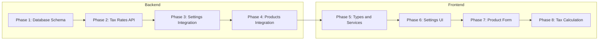

# Variable Tax Rates Implementation - Overview

## Executive Summary

This document provides a comprehensive implementation plan for adding variable tax rates (VAT) support to the POS system. The implementation enables administrators to manage multiple tax rates, assign them to products, and ensure accurate tax calculations across all transactions.

## Current State

| Aspect | Current Implementation |
|--------|----------------------|
| Tax Rate | Hardcoded to 19% in [`OrderContext.tsx`](frontend/contexts/OrderContext.tsx:131) |
| Settings Model | Only stores `taxMode` (inclusive/exclusive/none) |
| ProductVariant Model | No tax rate field |
| TaxRate Model | Does not exist |

## Requirements

1. At least 4 different tax rates manageable by admin users
2. One tax rate can be optionally selected as default
3. Tax rates can have an optional description
4. When a product is created or modified, a tax rate can be applied
5. Existing features must be maintained
6. Admin panel Settings frontend can be optimized for new settings

## Best Practices Applied

Based on research and industry standards:

| Practice | Implementation |
|----------|---------------|
| Decimal precision | Use `DECIMAL(5,4)` for tax rates - never float |
| Historical accuracy | Store tax rate snapshots in transactions |
| Single default constraint | Use partial unique indexes |
| API response format | Return rates as strings to preserve precision |
| Soft delete | Deactivate rather than delete tax rates |
| Convenience field | Include computed `ratePercent` field |

---

## Implementation Phases

### Phase Dependencies

| Phase | Depends On | Description |
|-------|------------|-------------|
| 1. Database Schema | None | Creates TaxRate model, modifies ProductVariant and Settings |
| 2. Tax Rates API | Phase 1 | CRUD endpoints for tax rate management |
| 3. Settings Integration | Phase 2 | Default tax rate in settings |
| 4. Products Integration | Phase 3 | Product variant tax rate assignment |
| 5. Types and Services | Phase 4 | Frontend types and API service |
| 6. Settings UI | Phase 5 | Admin settings page for tax rates |
| 7. Product Form | Phase 5 | Tax rate selector in product variant form |
| 8. Tax Calculation | Phase 5, 7 | OrderContext tax calculation update |

---

## Phase Overview

### Phase 1: Database Schema

**File:** [`backend/01-database-schema.md`](backend/01-database-schema.md)

**Objective:** Create the TaxRate model and integrate with existing models.

**Key Changes:**
- Add `TaxRate` model with `DECIMAL(5,4)` rate field
- Add `taxRateId` to `ProductVariant` model
- Add `defaultTaxRateId` to `Settings` model
- Create partial unique index for single default constraint
- Update seed data with default tax rates

**Subtasks:** 8

---

### Phase 2: Tax Rates API

**File:** [`backend/02-tax-rates-api.md`](backend/02-tax-rates-api.md)

**Objective:** Create CRUD endpoints for tax rate management.

**Key Changes:**
- Create `taxRates.ts` handler
- Add routes: GET, POST, PUT, DELETE
- Implement set-as-default endpoint
- Add validation and error handling
- Return rates as strings in API responses

**Subtasks:** 10

---

### Phase 3: Settings Integration

**File:** [`backend/03-settings-integration.md`](backend/03-settings-integration.md)

**Objective:** Integrate default tax rate with settings.

**Key Changes:**
- Update settings handler to include `defaultTaxRateId`
- Include tax rate details in settings response
- Add validation for default tax rate

**Subtasks:** 6

---

### Phase 4: Products Integration

**File:** [`backend/04-products-integration.md`](backend/04-products-integration.md)

**Objective:** Enable tax rate assignment to product variants.

**Key Changes:**
- Update products handler for `taxRateId` in variants
- Add tax rate validation
- Include tax rate in product responses
- Implement fallback to default tax rate

**Subtasks:** 8

---

### Phase 5: Types and Services

**File:** [`frontend/01-types-and-services.md`](frontend/01-types-and-services.md)

**Objective:** Create shared types and API service for tax rates.

**Key Changes:**
- Add `TaxRate` interface to shared types
- Update `ProductVariant` interface
- Update `Settings` interface
- Create `taxRateService.ts`
- Update `productService.ts`

**Subtasks:** 7

---

### Phase 6: Settings UI

**File:** [`frontend/02-settings-ui.md`](frontend/02-settings-ui.md)

**Objective:** Create admin UI for tax rate management.

**Key Changes:**
- Create `TaxRateManagement` component
- Update `TaxSettings` component
- Add default tax rate selector
- Implement CRUD UI with confirmation dialogs

**Subtasks:** 10

---

### Phase 7: Product Form

**File:** [`frontend/03-product-form.md`](frontend/03-product-form.md)

**Objective:** Add tax rate selector to product variant form.

**Key Changes:**
- Update `VariantForm` component
- Add tax rate dropdown
- Show default indicator
- Update product list display

**Subtasks:** 6

---

### Phase 8: Tax Calculation

**File:** [`frontend/04-tax-calculation.md`](frontend/04-tax-calculation.md)

**Objective:** Update tax calculation to use variable rates.

**Key Changes:**
- Update `OrderContext` to resolve tax rates
- Implement fallback to default tax rate
- Store tax rate snapshot in order items
- Update `PaymentModal` if needed

**Subtasks:** 7

---

## Total Subtasks Summary

| Phase | Subtasks |
|-------|----------|
| 1. Database Schema | 8 |
| 2. Tax Rates API | 10 |
| 3. Settings Integration | 6 |
| 4. Products Integration | 8 |
| 5. Types and Services | 7 |
| 6. Settings UI | 10 |
| 7. Product Form | 6 |
| 8. Tax Calculation | 7 |
| **Total** | **62** |

---

## Rollback Strategy

Each phase includes rollback considerations:

1. **Database Schema:** Migration down script to remove TaxRate table and foreign keys
2. **Backend API:** Remove routes and handlers, no data impact
3. **Frontend:** Remove components and revert to hardcoded 19% tax rate

### Critical Rollback Points

| Phase | Rollback Complexity | Notes |
|-------|---------------------|-------|
| Phase 1 | High | Requires migration down, data loss possible |
| Phase 2-4 | Low | Code removal only |
| Phase 5-8 | Low | Code removal only |

---

## Testing Strategy

### Unit Tests
- Tax rate CRUD operations
- Tax rate validation
- Default tax rate constraint enforcement
- Tax calculation with various rates

### Integration Tests
- Product creation with tax rate
- Settings update with default tax rate
- Order creation with tax rate resolution

### E2E Tests
- Admin creates tax rate
- Admin sets default tax rate
- Admin assigns tax rate to product
- Order calculation with variable tax rates

---

## Risk Assessment

| Risk | Impact | Probability | Mitigation |
|------|--------|-------------|------------|
| Breaking existing tax calculation | High | Medium | Keep taxMode logic, add tax rates as enhancement |
| Data migration issues | High | Low | Test migration on copy of production data |
| Floating-point precision | Medium | Low | Use Decimal type for rate storage |
| Multiple default tax rates | Medium | Low | Application-level enforcement with transaction |
| UI complexity | Low | Medium | Use tabs/collapsible sections in settings |

---

## Files to be Modified/Created

### Backend

| File | Action | Phase |
|------|--------|-------|
| `backend/prisma/schema.prisma` | Modify | 1 |
| `backend/prisma/seed.ts` | Modify | 1 |
| `backend/src/handlers/taxRates.ts` | Create | 2 |
| `backend/src/router.ts` | Modify | 2 |
| `backend/src/handlers/settings.ts` | Modify | 3 |
| `backend/src/handlers/products.ts` | Modify | 4 |
| `backend/src/types.ts` | Modify | 2 |

### Frontend

| File | Action | Phase |
|------|--------|-------|
| `shared/types.ts` | Modify | 5 |
| `frontend/services/taxRateService.ts` | Create | 5 |
| `frontend/components/TaxRateManagement.tsx` | Create | 6 |
| `frontend/components/TaxSettings.tsx` | Modify | 6 |
| `frontend/components/ProductManagement.tsx` | Modify | 7 |
| `frontend/contexts/OrderContext.tsx` | Modify | 8 |

---

## Success Criteria

- [ ] Admin can create, edit, and deactivate tax rates
- [ ] Admin can set a default tax rate
- [ ] Products can have specific tax rates assigned
- [ ] Products without tax rates use the default
- [ ] Tax calculations are accurate for all rates
- [ ] Historical transactions preserve their tax rate
- [ ] All existing functionality remains intact
- [ ] All tests pass
