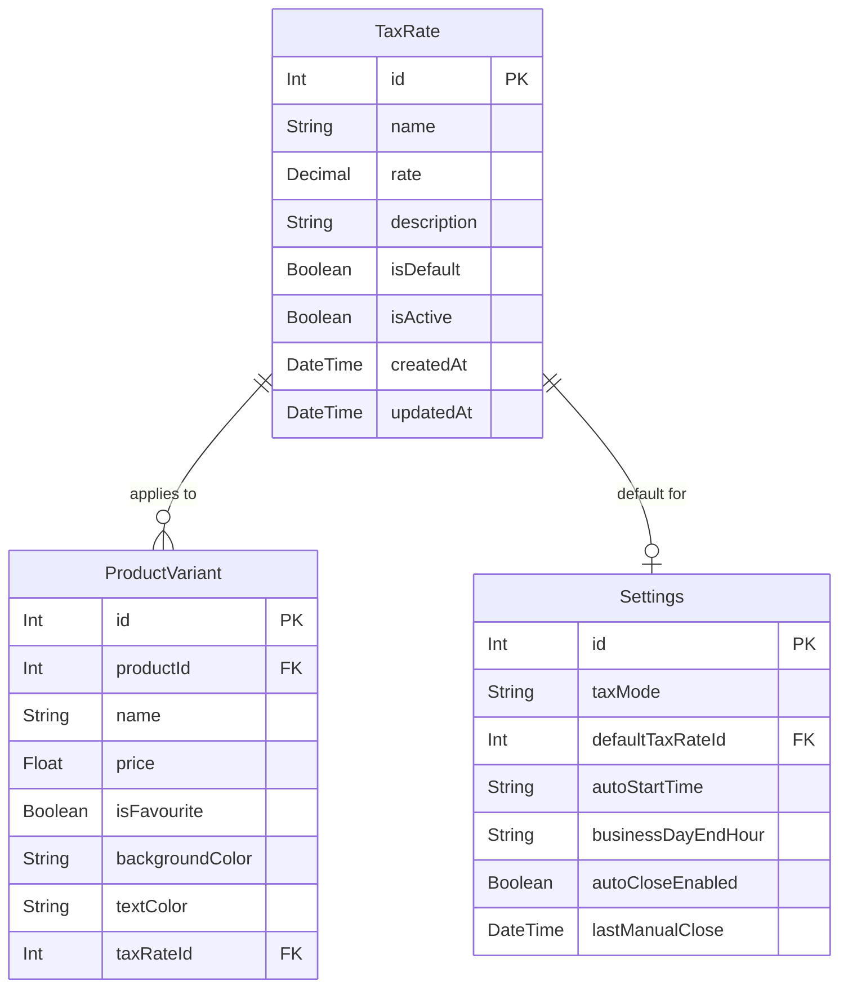

# Database Schema Plan for Variable Tax Rates

## Objective

Implement a new `TaxRate` model and integrate it with the existing `ProductVariant` and `Settings` models to support variable tax rates (VAT) in the POS system.

**Phase:** 1 of 8  
**Dependencies:** None  
**Estimated Subtasks:** 8

---

## Current State Analysis

### Existing Tax Handling

1. **Hardcoded Tax Rate**: Tax rate is hardcoded to `0.19` (19%) in [`OrderContext.tsx`](frontend/contexts/OrderContext.tsx:131)
2. **Settings Model**: Only stores `taxMode` (inclusive/exclusive/none) - no tax rate percentage
3. **ProductVariant Model**: No tax rate field exists
4. **No TaxRate Model**: Does not exist

### Current Schema (Relevant Parts)

```prisma
model ProductVariant {
  id               Int                @id @default(autoincrement())
  productId        Int
  name             String
  price            Float
  isFavourite      Boolean?           @default(false)
  backgroundColor  String
  textColor        String
  product          Product            @relation(fields: [productId], references: [id])
  stockConsumption StockConsumption[]
  variantLayouts   VariantLayout[]
  sharedLayoutPositions SharedLayoutPosition[]

  @@map("product_variants")
}

model Settings {
  id                  Int       @id @default(autoincrement())
  taxMode             String
  autoStartTime       String
  businessDayEndHour  String    @default("06:00")
  autoCloseEnabled    Boolean   @default(false)
  lastManualClose     DateTime?

  @@map("settings")
}
```

---

## Best Practices Applied

| Practice | Implementation | Rationale |
|----------|---------------|-----------|
| `DECIMAL(5,4)` | `rate Decimal @db.Decimal(5, 4)` | Avoids floating-point precision issues. Max 999.9999% |
| Soft delete | `isActive Boolean` | Preserve historical data integrity |
| Single default | Partial unique index | Database-level constraint enforcement |
| Audit fields | `createdAt`, `updatedAt` | Track changes for compliance |
| Optional relations | `Int?` with `onDelete: SetNull` | Safe deletion without breaking references |

---

## Schema Changes

### 1. New TaxRate Model

```prisma
model TaxRate {
  id          Int             @id @default(autoincrement())
  name        String          // e.g., "Standard Rate", "Reduced Rate"
  rate        Decimal         @db.Decimal(5, 4) // e.g., 0.1900 for 19%, 0.1000 for 10%
  description String?         // Optional description
  isDefault   Boolean         @default(false)
  isActive    Boolean         @default(true)
  createdAt   DateTime        @default(now())
  updatedAt   DateTime        @updatedAt
  
  // Relations
  variants    ProductVariant[]
  settings    Settings[]
  
  @@index([isActive])
  @@index([isDefault])
  @@map("tax_rates")
}
```

#### Field Rationale

| Field | Type | Rationale |
|-------|------|-----------|
| `id` | Int | Auto-increment primary key, consistent with other models |
| `name` | String | Required for display in UI, e.g., "Standard Rate" |
| `rate` | Decimal(5,4) | Avoids floating-point precision issues. Max 999.9999% (5 digits total, 4 decimal places). Stored as decimal (0.19 = 19%) |
| `description` | String? | Optional field for additional context per requirements |
| `isDefault` | Boolean | Indicates the default tax rate. Must ensure only one default exists |
| `isActive` | Boolean | Soft delete support - inactive rates are hidden but preserved for historical data integrity |
| `createdAt` | DateTime | Audit trail |
| `updatedAt` | DateTime | Audit trail |

### 2. Modified ProductVariant Model

```prisma
model ProductVariant {
  id               Int                @id @default(autoincrement())
  productId        Int
  name             String
  price            Float
  isFavourite      Boolean?           @default(false)
  backgroundColor  String
  textColor        String
  taxRateId        Int?               // Optional - null means use default tax rate
  product          Product            @relation(fields: [productId], references: [id])
  taxRate          TaxRate?           @relation(fields: [taxRateId], references: [id], onDelete: SetNull)
  stockConsumption StockConsumption[]
  variantLayouts   VariantLayout[]
  sharedLayoutPositions SharedLayoutPosition[]

  @@index([taxRateId])
  @@map("product_variants")
}
```

#### Key Changes

1. **`taxRateId` (Int?)** - Optional foreign key to TaxRate
   - `null` means the product uses the default tax rate
   - Allows per-product tax rate override

2. **`taxRate` relation** - Optional relation to TaxRate
   - `onDelete: SetNull` - If a tax rate is deleted, variants keep their data with null tax rate (fallback to default)

3. **Index on `taxRateId`** - Efficient queries filtering by tax rate

### 3. Modified Settings Model

```prisma
model Settings {
  id                  Int       @id @default(autoincrement())
  taxMode             String
  defaultTaxRateId    Int?      // Optional - default tax rate for products without explicit rate
  autoStartTime       String
  businessDayEndHour  String    @default("06:00")
  autoCloseEnabled    Boolean   @default(false)
  lastManualClose     DateTime?
  defaultTaxRate      TaxRate?  @relation(fields: [defaultTaxRateId], references: [id], onDelete: SetNull)

  @@index([defaultTaxRateId])
  @@map("settings")
}
```

#### Key Changes

1. **`defaultTaxRateId` (Int?)** - Optional foreign key to TaxRate
   - Points to the default tax rate used when a product variant has no explicit tax rate

2. **`defaultTaxRate` relation** - Optional relation to TaxRate
   - `onDelete: SetNull` - If the default tax rate is deleted, settings will have no default

3. **Index on `defaultTaxRateId`** - Efficient lookup

---

## Migration Strategy

### Migration File

```sql
-- Create tax_rates table
CREATE TABLE "tax_rates" (
    "id" SERIAL NOT NULL,
    "name" TEXT NOT NULL,
    "rate" DECIMAL(5,4) NOT NULL,
    "description" TEXT,
    "isDefault" BOOLEAN NOT NULL DEFAULT false,
    "isActive" BOOLEAN NOT NULL DEFAULT true,
    "createdAt" TIMESTAMP(3) NOT NULL DEFAULT CURRENT_TIMESTAMP,
    "updatedAt" TIMESTAMP(3) NOT NULL DEFAULT CURRENT_TIMESTAMP,
    CONSTRAINT "tax_rates_pkey" PRIMARY KEY ("id")
);

-- Create indexes for tax_rates
CREATE INDEX "tax_rates_isActive_idx" ON "tax_rates"("isActive");
CREATE INDEX "tax_rates_isDefault_idx" ON "tax_rates"("isDefault");

-- Add taxRateId to product_variants
ALTER TABLE "product_variants" ADD COLUMN "taxRateId" INTEGER;
ALTER TABLE "product_variants" ADD CONSTRAINT "product_variants_taxRateId_fkey" 
    FOREIGN KEY ("taxRateId") REFERENCES "tax_rates"("id") 
    ON DELETE SET NULL ON UPDATE CASCADE;

-- Create index for product_variants.taxRateId
CREATE INDEX "product_variants_taxRateId_idx" ON "product_variants"("taxRateId");

-- Add defaultTaxRateId to settings
ALTER TABLE "settings" ADD COLUMN "defaultTaxRateId" INTEGER;
ALTER TABLE "settings" ADD CONSTRAINT "settings_defaultTaxRateId_fkey" 
    FOREIGN KEY ("defaultTaxRateId") REFERENCES "tax_rates"("id") 
    ON DELETE SET NULL ON UPDATE CASCADE;

-- Create index for settings.defaultTaxRateId
CREATE INDEX "settings_defaultTaxRateId_idx" ON "settings"("defaultTaxRateId");

-- Note: The partial unique index below should be created in a separate migration
-- (see Subtask 1.5) because Prisma doesn't support partial indexes in schema.prisma.
-- This SQL is provided here for reference only.

-- Create partial unique index for single default constraint
-- Only one active tax rate can be default
CREATE UNIQUE INDEX "tax_rates_single_default" ON "tax_rates"("isDefault") 
WHERE "isDefault" = true AND "isActive" = true;
```

### Migration Command

```bash
npx prisma migrate dev --name add_tax_rates
```

---

## Seed Data

### Default Tax Rates

| Name | Rate | Description | isDefault | isActive |
|------|------|-------------|-----------|----------|
| Zero Rate | 0.0000 | Tax-free items | false | true |
| Reduced Rate | 0.1000 | Reduced VAT rate (10%) | false | true |
| Standard Rate | 0.1900 | Standard VAT rate (19%) | true | true |
| Luxury Rate | 0.2200 | Luxury VAT rate (22%) | false | true |

### Seed Code Addition

Add to [`seed.ts`](backend/prisma/seed.ts):

```typescript
// Tax rates to seed
const DEFAULT_TAX_RATES = [
  { name: 'Zero Rate', rate: '0.0000', description: 'Tax-free items', isDefault: false, isActive: true },
  { name: 'Reduced Rate', rate: '0.1000', description: 'Reduced VAT rate (10%)', isDefault: false, isActive: true },
  { name: 'Standard Rate', rate: '0.1900', description: 'Standard VAT rate (19%)', isDefault: true, isActive: true },
  { name: 'Luxury Rate', rate: '0.2200', description: 'Luxury VAT rate (22%)', isDefault: false, isActive: true },
];

// In seedDatabase function:
const taxRateCount = await prisma.taxRate.count();

if (taxRateCount === 0) {
  console.log('Seeding tax rates...');
  
  // Use transaction to ensure atomicity
  const taxRates = await prisma.$transaction(
    DEFAULT_TAX_RATES.map((taxRate) =>
      prisma.taxRate.create({
        data: taxRate,
      })
    )
  );
  console.log('Created tax rates:', taxRates.length);
  
  // Update settings to point to default tax rate
  const standardRate = taxRates.find((tr) => tr.isDefault);
  if (standardRate) {
    await prisma.settings.updateMany({
      data: { defaultTaxRateId: standardRate.id },
    });
    console.log('Set default tax rate in settings');
  }
} else {
  console.log(`Tax rates already exist (${taxRateCount}), skipping tax rate seeding`);
}
```

---

## Single Default Tax Rate Constraint

### Database-Level Enforcement

The partial unique index ensures only one active tax rate can be default:

```sql
CREATE UNIQUE INDEX "tax_rates_single_default" ON "tax_rates"("isDefault") 
WHERE "isDefault" = true AND "isActive" = true;
```

This constraint:
- Allows multiple inactive rates to have `isDefault = true` (historical preservation)
- Ensures only one active rate can be default
- Prevents race conditions at the database level

### Application-Level Enforcement (Backup)

Also implement in handler for better error messages:

```typescript
// In tax rates handler - when setting a tax rate as default
async function setDefaultTaxRate(id: number) {
  await prisma.$transaction([
    // First, unset all defaults
    prisma.taxRate.updateMany({
      where: { isDefault: true },
      data: { isDefault: false },
    }),
    // Then, set the new default
    prisma.taxRate.update({
      where: { id },
      data: { isDefault: true },
    }),
  ]);
}
```

---

## Entity Relationship Diagram



---

## Implementation Subtasks

### Subtask 1.1: Add TaxRate Model to Schema
- [ ] Open [`backend/prisma/schema.prisma`](backend/prisma/schema.prisma)
- [ ] Add `TaxRate` model with all fields and indexes
- [ ] Verify no syntax errors

### Subtask 1.2: Modify ProductVariant Model
- [ ] Add `taxRateId Int?` field
- [ ] Add `taxRate TaxRate?` relation with `onDelete: SetNull`
- [ ] Add index on `taxRateId`

### Subtask 1.3: Modify Settings Model
- [ ] Add `defaultTaxRateId Int?` field
- [ ] Add `defaultTaxRate TaxRate?` relation with `onDelete: SetNull`
- [ ] Add index on `defaultTaxRateId`

### Subtask 1.4: Create Migration
- [ ] Run `npx prisma migrate dev --name add_tax_rates`
- [ ] Review generated SQL migration
- [ ] Verify migration applies successfully

### Subtask 1.5: Add Partial Unique Index (Manual SQL Migration)
- [ ] Create a separate migration for the partial index (Prisma doesn't support partial indexes in schema.prisma)
- [ ] Run `npx prisma migrate dev --name add_tax_rates_single_default_constraint --create-only`
- [ ] Edit the generated migration SQL to add the partial unique index:
  ```sql
  CREATE UNIQUE INDEX "tax_rates_single_default" ON "tax_rates"("isDefault") 
  WHERE "isDefault" = true AND "isActive" = true;
  ```
- [ ] Run `npx prisma migrate deploy` to apply the migration
- [ ] Verify index creation

### Subtask 1.6: Update Seed Data
- [ ] Open [`backend/prisma/seed.ts`](backend/prisma/seed.ts)
- [ ] Add `DEFAULT_TAX_RATES` constant
- [ ] Add seeding logic with transaction
- [ ] Add settings update logic

### Subtask 1.7: Run Seed and Verify
- [ ] Run `npx prisma db seed`
- [ ] Verify tax rates are created
- [ ] Verify settings has `defaultTaxRateId` set

### Subtask 1.8: Test Constraints
- [ ] Try to create two default active tax rates (should fail)
- [ ] Try to delete a tax rate referenced by a variant (should set null)
- [ ] Verify all existing variants have `taxRateId = null`

---

## Files to Modify

| File | Changes |
|------|---------|
| [`backend/prisma/schema.prisma`](backend/prisma/schema.prisma) | Add TaxRate model, modify ProductVariant and Settings |
| [`backend/prisma/seed.ts`](backend/prisma/seed.ts) | Add tax rate seeding logic |

---

## Backward Compatibility

| Scenario | Behavior |
|----------|----------|
| Existing products | `taxRateId = null` → uses default tax rate |
| No default tax rate set | Falls back to 19% (matching current hardcoded value) |
| Tax rate deleted | Variants with that rate get `taxRateId = null` → use default |
| Tax mode (inclusive/exclusive/none) | Still applies - tax rate is just the percentage |

---

## Rollback Strategy

### Migration Down

```sql
-- Remove foreign keys and columns
ALTER TABLE "settings" DROP CONSTRAINT "settings_defaultTaxRateId_fkey";
ALTER TABLE "settings" DROP COLUMN "defaultTaxRateId";

ALTER TABLE "product_variants" DROP CONSTRAINT "product_variants_taxRateId_fkey";
ALTER TABLE "product_variants" DROP COLUMN "taxRateId";

-- Drop indexes
DROP INDEX IF EXISTS "tax_rates_single_default";
DROP INDEX IF EXISTS "tax_rates_isActive_idx";
DROP INDEX IF EXISTS "tax_rates_isDefault_idx";

-- Drop table
DROP TABLE "tax_rates";
```

### Rollback Command

```bash
npx prisma migrate rollback
```

### Rollback Considerations

- **Data Loss:** All tax rate data will be lost
- **Product Variants:** Will lose tax rate associations
- **Settings:** Will lose default tax rate setting
- **Safe:** Existing transactions are not affected (tax stored in JSON)

---

## Potential Risks and Mitigation

| Risk | Impact | Probability | Mitigation |
|------|--------|-------------|------------|
| Floating-point precision issues | High | Low | Use Decimal type for rate storage |
| Multiple default tax rates | Medium | Low | Database-level partial unique index |
| Breaking existing tax calculation | High | Medium | Keep taxMode logic, add tax rates as enhancement |
| Data migration issues | Medium | Low | Test migration on copy of production data |
| Foreign key constraint violations | Low | Low | Use `onDelete: SetNull` for safe deletion |

---

## Testing Considerations

### Unit Tests
- Verify TaxRate model creation
- Verify decimal precision is maintained
- Verify unique default constraint works

### Integration Tests
- Verify migration applies cleanly
- Verify seed data is correct
- Verify foreign key relationships work

### Manual Testing
- Check database schema after migration
- Verify indexes are created
- Verify constraint prevents multiple defaults

---

## Implementation Checklist

- [ ] Add `TaxRate` model to [`schema.prisma`](backend/prisma/schema.prisma)
- [ ] Add `taxRateId` field to `ProductVariant` model
- [ ] Add `defaultTaxRateId` field to `Settings` model
- [ ] Add indexes for new foreign keys
- [ ] Create migration with `npx prisma migrate dev --name add_tax_rates`
- [ ] Review generated SQL
- [ ] Add partial unique index for single default
- [ ] Add tax rates to [`seed.ts`](backend/prisma/seed.ts)
- [ ] Update settings seeding to set `defaultTaxRateId`
- [ ] Run seed to verify
- [ ] Verify all existing product variants have `taxRateId = null`
- [ ] Verify settings has `defaultTaxRateId` set
- [ ] Verify tax rates are seeded correctly
- [ ] Test unique default constraint
