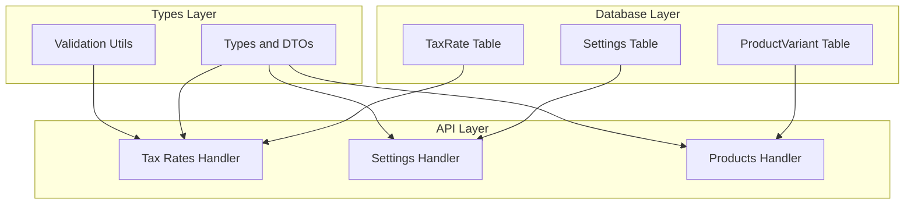

# Backend Implementation Plan: Variable Tax Rates

## Overview

This plan outlines the backend implementation for variable tax rates (VAT) functionality. The implementation is broken down into 6 manageable parts that can be executed sequentially.

**Prerequisites:** None (this is the first backend phase)  
**Depends on:** Database schema plan from [`01-database-schema.md`](01-database-schema.md)

---

## Architecture Summary



---

## Part 1: Database Schema Changes

### Objective
Add the `TaxRate` model and update `ProductVariant` and `Settings` models to support variable tax rates.

### Files to Modify
- [`backend/prisma/schema.prisma`](../../../backend/prisma/schema.prisma)

### Changes Required

#### 1.1 Add TaxRate Model

Add after the `User` model (around line 45):

```prisma
model TaxRate {
  id          Int             @id @default(autoincrement())
  name        String          // e.g., "Standard Rate", "Reduced Rate"
  rate        Decimal         @db.Decimal(5, 4) // e.g., 0.1900 for 19%
  description String?         // Optional description
  isDefault   Boolean         @default(false)
  isActive    Boolean         @default(true)
  createdAt   DateTime        @default(now())
  updatedAt   DateTime        @updatedAt
  
  // Relations
  variants    ProductVariant[]
  settings    Settings[]
  
   @@index([isActive])
   @@index([isDefault])
   @@map("tax_rates")
}
```

> **Note:** A partial unique index is required to ensure only one active default tax rate exists. This cannot be defined in Prisma schema directly and requires a separate migration. See Subtask 1.5 in [`01-database-schema.md`](01-database-schema.md) for the SQL migration to create this constraint:
> ```sql
> CREATE UNIQUE INDEX "tax_rates_one_active_default" ON "tax_rates" ("isDefault") 
> WHERE ("isDefault" = true AND "isActive" = true);
> ```

#### 1.2 Update ProductVariant Model

Modify the existing `ProductVariant` model to add tax rate relation:

```prisma
model ProductVariant {
  id               Int                @id @default(autoincrement())
  productId        Int
  name             String
  price            Float
  isFavourite      Boolean?           @default(false)
  backgroundColor  String
  textColor        String
  taxRateId        Int?               // Optional - null means use default tax rate
  product          Product            @relation(fields: [productId], references: [id])
  taxRate          TaxRate?           @relation(fields: [taxRateId], references: [id], onDelete: SetNull)
  stockConsumption StockConsumption[]
  variantLayouts   VariantLayout[]
  sharedLayoutPositions SharedLayoutPosition[]

  @@index([taxRateId])
  @@map("product_variants")
}
```

#### 1.3 Update Settings Model

Modify the existing `Settings` model to add default tax rate:

```prisma
model Settings {
  id                  Int       @id @default(autoincrement())
  taxMode             String
  defaultTaxRateId    Int?      // Optional - default tax rate for products
  autoStartTime       String
  businessDayEndHour  String    @default("06:00")
  autoCloseEnabled    Boolean   @default(false)
  lastManualClose     DateTime?
  defaultTaxRate      TaxRate?  @relation(fields: [defaultTaxRateId], references: [id], onDelete: SetNull)

  @@index([defaultTaxRateId])
  @@map("settings")
}
```

### Migration Command

```bash
cd backend && npx prisma migrate dev --name add_tax_rates
```

### Verification
- [ ] Migration creates `tax_rates` table
- [ ] `product_variants` table has new `taxRateId` column
- [ ] `settings` table has new `defaultTaxRateId` column
- [ ] Indexes are created correctly

---

## Part 2: Types and DTOs

### Objective
Add TypeScript types for tax rates and update existing types.

### Files to Modify
- [`backend/src/types.ts`](../../../backend/src/types.ts)
- [`backend/src/types/dto.ts`](../../../backend/src/types/dto.ts)

### Changes Required

#### 2.1 Add TaxRate Interface to types.ts

Add after the `Settings` interface (around line 104):

```typescript
export interface TaxRate {
  id: number;
  name: string;
  rate: string;  // Decimal as string to preserve precision
  description: string | null;
  isDefault: boolean;
  isActive: boolean;
  createdAt: string;
  updatedAt: string;
}

export interface TaxRateInput {
  name: string;
  rate: number | string;
  description?: string;
  isDefault?: boolean;
}

export interface TaxRateUpdateInput {
  name?: string;
  rate?: number | string;
  description?: string | null;
  isDefault?: boolean;
  isActive?: boolean;
}
```

#### 2.2 Update TaxSettings Interface

Modify the existing `TaxSettings` interface:

```typescript
export interface TaxSettings {
  mode: 'inclusive' | 'exclusive' | 'none';
  defaultTaxRateId: number | null;
  defaultTaxRate: TaxRate | null;
}
```

#### 2.3 Update ProductVariant Interface

Modify the existing `ProductVariant` interface:

```typescript
export interface ProductVariant {
  id: number;
  productId: number;
  name: string;
  price: number;
  isFavourite?: boolean;
  stockConsumption: {
    stockItemId: string;
    quantity: number;
  }[];
  backgroundColor: string;
  textColor: string;
  taxRateId: number | null;
  taxRate: TaxRate | null;
}
```

#### 2.4 Update Settings Interface

Modify the existing `Settings` interface:

```typescript
export interface Settings {
  tax: TaxSettings;
  businessDay: {
    autoStartTime: string;
    businessDayEndHour: string;
    lastManualClose: string | null;
    autoCloseEnabled: boolean;
  };
}
```

#### 2.5 Add TaxRateDTO to dto.ts

Add to [`backend/src/types/dto.ts`](../../../backend/src/types/dto.ts):

```typescript
/**
 * TaxRateResponseDTO - A safe representation of a tax rate for API responses
 */
export interface TaxRateResponseDTO {
  id: number;
  name: string;
  rate: string;
  ratePercent: string;  // Convenience field for display (e.g., "19.00%")
  description: string | null;
  isDefault: boolean;
  isActive: boolean;
  createdAt: Date;
  updatedAt: Date;
}

// Transform a tax rate object to a DTO
export function toTaxRateDTO(taxRate: any): TaxRateResponseDTO {
  const rateValue = parseFloat(taxRate.rate);
  return {
    id: taxRate.id,
    name: taxRate.name,
    rate: taxRate.rate.toString(),
    ratePercent: (rateValue * 100).toFixed(2) + '%',
    description: taxRate.description,
    isDefault: taxRate.isDefault,
    isActive: taxRate.isActive,
    createdAt: taxRate.createdAt,
    updatedAt: taxRate.updatedAt,
  };
}

// Transform an array of tax rates to an array of DTOs
export function toTaxRateDTOArray(taxRates: any[]): TaxRateResponseDTO[] {
  return taxRates.map(toTaxRateDTO);
}
```

### Verification
- [ ] TypeScript compiles without errors
- [ ] All types are properly exported
- [ ] DTOs transform data correctly

---

## Part 3: Tax Rates CRUD Handler

### Objective
Create a new handler for tax rate CRUD operations.

### Files to Create
- [`backend/src/handlers/taxRates.ts`](../../../backend/src/handlers/taxRates.ts) (new)

### Files to Modify
- [`backend/src/router.ts`](../../../backend/src/router.ts)
- [`backend/src/utils/validation.ts`](../../../backend/src/utils/validation.ts)

### Changes Required

#### 3.1 Add Validation Functions to validation.ts

Add to [`backend/src/utils/validation.ts`](../../../backend/src/utils/validation.ts):

```typescript
// Tax Rate validation functions
export const validateTaxRateName = (name: string, t?: TranslateFunction): string | null => {
  const translate = t || ((key: string) => key.split('.').pop() || key);
  
  if (!name || typeof name !== 'string') {
    return translate('errors:validation.required');
  }
  
  if (name.trim().length === 0) {
    return translate('errors:validation.required');
  }
  
  if (name.length > 100) {
    return translate('errors:validation.outOfRange');
  }
  
  return null;
};

export const validateTaxRateValue = (rate: number | string, t?: TranslateFunction): string | null => {
  const translate = t || ((key: string) => key.split('.').pop() || key);
  
  const rateNum = typeof rate === 'string' ? parseFloat(rate) : rate;
  
  if (isNaN(rateNum)) {
    return translate('errors:taxRates.invalidRate');
  }
  
  if (rateNum < 0 || rateNum > 1) {
    return translate('errors:taxRates.rateOutOfRange');
  }
  
  return null;
};

export const validateTaxRate = (taxRate: any, t?: TranslateFunction): { isValid: boolean; errors: string[] } => {
  const translate = t || ((key: string) => key.split('.').pop() || key);
  const errors: string[] = [];
  
  const nameError = validateTaxRateName(taxRate.name, t);
  if (nameError) {
    errors.push(nameError);
  }
  
  const rateError = validateTaxRateValue(taxRate.rate, t);
  if (rateError) {
    errors.push(rateError);
  }
  
  if (taxRate.description !== undefined && taxRate.description !== null) {
    if (typeof taxRate.description !== 'string') {
      errors.push(translate('errors:taxRates.invalidDescription'));
    } else if (taxRate.description.length > 500) {
      errors.push(translate('errors:validation.outOfRange'));
    }
  }
  
  return {
    isValid: errors.length === 0,
    errors
  };
};
```

#### 3.2 Create Tax Rates Handler

Create [`backend/src/handlers/taxRates.ts`](../../../backend/src/handlers/taxRates.ts):

```typescript
import express, { Request, Response } from 'express';
import { prisma } from '../prisma';
import { validateTaxRate } from '../utils/validation';
import { toTaxRateDTO, toTaxRateDTOArray } from '../types/dto';
import { logError, logInfo } from '../utils/logger';
import { authenticateToken } from '../middleware/auth';
import { requireAdmin } from '../middleware/authorization';
import i18n from '../i18n';

export const taxRatesRouter = express.Router();

// GET /api/tax-rates - Get all tax rates
taxRatesRouter.get('/', authenticateToken, async (req: Request, res: Response) => {
  try {
    const taxRates = await prisma.taxRate.findMany({
      orderBy: [{ isDefault: 'desc' }, { name: 'asc' }]
    });
    
    res.json(toTaxRateDTOArray(taxRates));
  } catch (error) {
    logError(error instanceof Error ? error : 'Error fetching tax rates', {
      correlationId: (req as any).correlationId,
    });
    res.status(500).json({ error: i18n.t('errors:taxRates.fetchFailed') });
  }
});

// GET /api/tax-rates/:id - Get a single tax rate
taxRatesRouter.get('/:id', authenticateToken, async (req: Request, res: Response) => {
  try {
    const { id } = req.params;
    const taxRate = await prisma.taxRate.findUnique({
      where: { id: Number(id) }
    });
    
    if (!taxRate) {
      return res.status(404).json({ error: i18n.t('errors:taxRates.notFound') });
    }
    
    res.json(toTaxRateDTO(taxRate));
  } catch (error) {
    logError(error instanceof Error ? error : 'Error fetching tax rate', {
      correlationId: (req as any).correlationId,
    });
    res.status(500).json({ error: i18n.t('errors:taxRates.fetchFailed') });
  }
});

// POST /api/tax-rates - Create a new tax rate (admin only)
taxRatesRouter.post('/', authenticateToken, requireAdmin, async (req: Request, res: Response) => {
  try {
    const { name, rate, description, isDefault } = req.body;
    
    // Validate input
    const validation = validateTaxRate({ name, rate, description });
    if (!validation.isValid) {
      return res.status(400).json({ 
        error: i18n.t('errors:taxRates.validationFailed'), 
        details: validation.errors 
      });
    }
    
    // Use transaction to handle default flag
    const taxRate = await prisma.$transaction(async (tx) => {
      // If setting as default, unset other defaults first
      if (isDefault) {
        await tx.taxRate.updateMany({
          where: { isDefault: true },
          data: { isDefault: false }
        });
      }
      
      return tx.taxRate.create({
        data: {
          name: name.trim(),
          rate: typeof rate === 'string' ? parseFloat(rate) : rate,
          description: description?.trim() || null,
          isDefault: isDefault ?? false,
          isActive: true
        }
      });
    });
    
    logInfo('Tax rate created', { taxRateId: taxRate.id, name: taxRate.name });
    res.status(201).json(toTaxRateDTO(taxRate));
  } catch (error) {
    logError(error instanceof Error ? error : 'Error creating tax rate', {
      correlationId: (req as any).correlationId,
    });
    res.status(500).json({ error: i18n.t('errors:taxRates.createFailed') });
  }
});

// PUT /api/tax-rates/:id - Update a tax rate (admin only)
taxRatesRouter.put('/:id', authenticateToken, requireAdmin, async (req: Request, res: Response) => {
  try {
    const { id } = req.params;
    const { name, rate, description, isDefault, isActive } = req.body;
    
    // Check if tax rate exists
    const existing = await prisma.taxRate.findUnique({
      where: { id: Number(id) }
    });
    
    if (!existing) {
      return res.status(404).json({ error: i18n.t('errors:taxRates.notFound') });
    }
    
    // Validate input
    const validation = validateTaxRate({ 
      name: name ?? existing.name, 
      rate: rate ?? existing.rate, 
      description: description ?? existing.description 
    });
    if (!validation.isValid) {
      return res.status(400).json({ 
        error: i18n.t('errors:taxRates.validationFailed'), 
        details: validation.errors 
      });
    }
    
    // Use transaction to handle default flag
    const taxRate = await prisma.$transaction(async (tx) => {
      // If setting as default, unset other defaults first
      if (isDefault) {
        await tx.taxRate.updateMany({
          where: { isDefault: true, id: { not: Number(id) } },
          data: { isDefault: false }
        });
      }
      
      return tx.taxRate.update({
        where: { id: Number(id) },
        data: {
          name: name !== undefined ? name.trim() : undefined,
          rate: rate !== undefined ? (typeof rate === 'string' ? parseFloat(rate) : rate) : undefined,
          description: description !== undefined ? (description?.trim() || null) : undefined,
          isDefault: isDefault !== undefined ? isDefault : undefined,
          isActive: isActive !== undefined ? isActive : undefined
        }
      });
    });
    
    logInfo('Tax rate updated', { taxRateId: taxRate.id, name: taxRate.name });
    res.json(toTaxRateDTO(taxRate));
  } catch (error) {
    logError(error instanceof Error ? error : 'Error updating tax rate', {
      correlationId: (req as any).correlationId,
    });
    res.status(500).json({ error: i18n.t('errors:taxRates.updateFailed') });
  }
});

// PUT /api/tax-rates/:id/default - Set a tax rate as default (admin only)
taxRatesRouter.put('/:id/default', authenticateToken, requireAdmin, async (req: Request, res: Response) => {
  try {
    const { id } = req.params;
    
    // Check if tax rate exists and is active
    const existing = await prisma.taxRate.findUnique({
      where: { id: Number(id) }
    });
    
    if (!existing) {
      return res.status(404).json({ error: i18n.t('errors:taxRates.notFound') });
    }
    
    if (!existing.isActive) {
      return res.status(400).json({ error: i18n.t('errors:taxRates.cannotSetInactiveAsDefault') });
    }
    
    // Use transaction to ensure only one default
    const taxRate = await prisma.$transaction([
      // Unset all defaults
      prisma.taxRate.updateMany({
        where: { isDefault: true },
        data: { isDefault: false }
      }),
      // Set the new default
      prisma.taxRate.update({
        where: { id: Number(id) },
        data: { isDefault: true }
      })
    ]);
    
    logInfo('Tax rate set as default', { taxRateId: Number(id) });
    res.json(toTaxRateDTO(taxRate[1]));
  } catch (error) {
    logError(error instanceof Error ? error : 'Error setting default tax rate', {
      correlationId: (req as any).correlationId,
    });
    res.status(500).json({ error: i18n.t('errors:taxRates.updateFailed') });
  }
});

// DELETE /api/tax-rates/:id - Deactivate a tax rate (admin only)
taxRatesRouter.delete('/:id', authenticateToken, requireAdmin, async (req: Request, res: Response) => {
  try {
    const { id } = req.params;
    
    // Check if tax rate exists
    const existing = await prisma.taxRate.findUnique({
      where: { id: Number(id) }
    });
    
    if (!existing) {
      return res.status(404).json({ error: i18n.t('errors:taxRates.notFound') });
    }
    
    // Soft delete by setting isActive to false
    const taxRate = await prisma.taxRate.update({
      where: { id: Number(id) },
      data: { isActive: false, isDefault: false }
    });
    
    logInfo('Tax rate deactivated', { taxRateId: taxRate.id, name: taxRate.name });
    res.json(toTaxRateDTO(taxRate));
  } catch (error) {
    logError(error instanceof Error ? error : 'Error deactivating tax rate', {
      correlationId: (req as any).correlationId,
    });
    res.status(500).json({ error: i18n.t('errors:taxRates.deleteFailed') });
  }
});

export default taxRatesRouter;
```

#### 3.3 Update Router

Add to [`backend/src/router.ts`](../../../backend/src/router.ts):

```typescript
// Add import at top
import { taxRatesRouter } from './handlers/taxRates';

// Add route (after other routes, around line 26)
router.use('/tax-rates', taxRatesRouter);
```

### API Endpoints Summary

| Method | Endpoint | Auth | Description |
|--------|----------|------|-------------|
| GET | `/api/tax-rates` | Any authenticated | List all tax rates |
| GET | `/api/tax-rates/:id` | Any authenticated | Get single tax rate |
| POST | `/api/tax-rates` | Admin only | Create tax rate |
| PUT | `/api/tax-rates/:id` | Admin only | Update tax rate |
| PUT | `/api/tax-rates/:id/default` | Admin only | Set as default |
| DELETE | `/api/tax-rates/:id` | Admin only | Deactivate tax rate |

### Verification
- [ ] All endpoints return correct responses
- [ ] Admin-only endpoints reject non-admin users
- [ ] Default tax rate logic works correctly
- [ ] Soft delete works correctly

---

## Part 4: Settings Handler Updates

### Objective
Update the settings handler to include default tax rate in responses and allow updating it.

### Files to Modify
- [`backend/src/handlers/settings.ts`](../../../backend/src/handlers/settings.ts)

### Changes Required

#### 4.1 Update GET /api/settings

Modify the GET endpoint to include tax rate information:

```typescript
// GET /api/settings - Get current settings
settingsRouter.get('/', authenticateToken, async (req: Request, res: Response) => {
  try {
    // Get the first (and should be only) settings record
    const settings = await prisma.settings.findFirst({
      include: {
        defaultTaxRate: true
      }
    });
    
    if (!settings) {
      // If no settings exist, return default values
      res.json({
        tax: { 
          mode: 'none',
          defaultTaxRateId: null,
          defaultTaxRate: null
        },
        businessDay: {
          autoStartTime: '06:00',
          businessDayEndHour: '06:00',
          lastManualClose: null,
          autoCloseEnabled: false
        }
      });
      return;
    }
    
    // Convert the database format to the expected format
    const result: Settings = {
      tax: { 
        mode: settings.taxMode as 'inclusive' | 'exclusive' | 'none',
        defaultTaxRateId: settings.defaultTaxRateId,
        defaultTaxRate: settings.defaultTaxRate ? {
          id: settings.defaultTaxRate.id,
          name: settings.defaultTaxRate.name,
          rate: settings.defaultTaxRate.rate.toString(),
          description: settings.defaultTaxRate.description,
          isDefault: settings.defaultTaxRate.isDefault,
          isActive: settings.defaultTaxRate.isActive,
          createdAt: settings.defaultTaxRate.createdAt.toISOString(),
          updatedAt: settings.defaultTaxRate.updatedAt.toISOString()
        } : null
      },
      businessDay: {
        autoStartTime: settings.autoStartTime,
        businessDayEndHour: settings.businessDayEndHour,
        lastManualClose: settings.lastManualClose?.toISOString() || null,
        autoCloseEnabled: settings.autoCloseEnabled ?? false
      }
    };
    
    res.json(result);
  } catch (error) {
    logError(error instanceof Error ? error : 'Error fetching settings', {
      correlationId: (req as any).correlationId,
    });
    res.status(500).json({ error: i18n.t('errors:settings.fetchFailed') });
  }
});
```

#### 4.2 Update PUT /api/settings

Modify the PUT endpoint to accept `defaultTaxRateId`:

```typescript
// PUT /api/settings - Update settings
settingsRouter.put('/', authenticateToken, requireAdmin, async (req: Request, res: Response) => {
  try {
    const { tax, businessDay } = req.body as Settings;
    
    // Validate defaultTaxRateId if provided
    if (tax.defaultTaxRateId !== undefined && tax.defaultTaxRateId !== null) {
      const taxRate = await prisma.taxRate.findUnique({
        where: { id: tax.defaultTaxRateId }
      });
      
      if (!taxRate || !taxRate.isActive) {
        return res.status(400).json({ 
          error: i18n.t('errors:settings.invalidDefaultTaxRate') 
        });
      }
    }
    
    // Get the first settings record or create one if it doesn't exist
    let settings = await prisma.settings.findFirst();
    
    if (settings) {
      // Update existing settings
      settings = await prisma.settings.update({
        where: { id: settings.id },
        data: {
          taxMode: tax.mode,
          defaultTaxRateId: tax.defaultTaxRateId,
          autoStartTime: businessDay.autoStartTime,
          businessDayEndHour: businessDay.businessDayEndHour,
          autoCloseEnabled: businessDay.autoCloseEnabled ?? false,
          lastManualClose: businessDay.lastManualClose ? new Date(businessDay.lastManualClose) : null
        },
        include: {
          defaultTaxRate: true
        }
      });
    } else {
      // Create new settings record
      settings = await prisma.settings.create({
        data: {
          taxMode: tax.mode,
          defaultTaxRateId: tax.defaultTaxRateId,
          autoStartTime: businessDay.autoStartTime,
          businessDayEndHour: businessDay.businessDayEndHour ?? '06:00',
          autoCloseEnabled: businessDay.autoCloseEnabled ?? false,
          lastManualClose: businessDay.lastManualClose ? new Date(businessDay.lastManualClose) : null
        },
        include: {
          defaultTaxRate: true
        }
      });
    }
    
    // Clear the scheduler's settings cache so it picks up the new settings
    clearSettingsCache();
    logInfo('Settings updated, scheduler cache cleared');
    
    // Convert the database format to the expected format
    const result: Settings = {
      tax: { 
        mode: settings.taxMode as 'inclusive' | 'exclusive' | 'none',
        defaultTaxRateId: settings.defaultTaxRateId,
        defaultTaxRate: settings.defaultTaxRate ? {
          id: settings.defaultTaxRate.id,
          name: settings.defaultTaxRate.name,
          rate: settings.defaultTaxRate.rate.toString(),
          description: settings.defaultTaxRate.description,
          isDefault: settings.defaultTaxRate.isDefault,
          isActive: settings.defaultTaxRate.isActive,
          createdAt: settings.defaultTaxRate.createdAt.toISOString(),
          updatedAt: settings.defaultTaxRate.updatedAt.toISOString()
        } : null
      },
      businessDay: {
        autoStartTime: settings.autoStartTime,
        businessDayEndHour: settings.businessDayEndHour,
        lastManualClose: settings.lastManualClose?.toISOString() || null,
        autoCloseEnabled: settings.autoCloseEnabled ?? false
      }
    };
    
    res.json(result);
  } catch (error) {
    logError(error instanceof Error ? error : 'Error updating settings', {
      correlationId: (req as any).correlationId,
    });
    res.status(500).json({ error: i18n.t('errors:settings.updateFailed') });
  }
});
```

### Verification
- [ ] GET /api/settings returns defaultTaxRateId and defaultTaxRate
- [ ] PUT /api/settings accepts defaultTaxRateId
- [ ] Invalid tax rate IDs are rejected

---

## Part 5: Products Handler Updates

### Objective
Update the products handler to support tax rate on product variants.

### Files to Modify
- [`backend/src/handlers/products.ts`](../../../backend/src/handlers/products.ts)
- [`backend/src/utils/validation.ts`](../../../backend/src/utils/validation.ts)

### Changes Required

#### 5.1 Add Tax Rate Validation to validation.ts

Add to the validation functions:

```typescript
export const validateTaxRateId = async (taxRateId: number | null | undefined, prisma: any, t?: TranslateFunction): Promise<string | null> => {
  const translate = t || ((key: string) => key.split('.').pop() || key);
  
  // null or undefined is valid (means use default)
  if (taxRateId === null || taxRateId === undefined) {
    return null;
  }
  
  if (typeof taxRateId !== 'number' || taxRateId <= 0) {
    return translate('errors:products.invalidTaxRateId');
  }
  
  const taxRate = await prisma.taxRate.findUnique({
    where: { id: taxRateId }
  });
  
  if (!taxRate || !taxRate.isActive) {
    return translate('errors:products.invalidTaxRateId');
  }
  
  return null;
};
```

#### 5.2 Update ProductVariant Type in types.ts

The `ProductVariant` interface was already updated in Part 2.

#### 5.3 Update Products Handler

Modify [`backend/src/handlers/products.ts`](../../../backend/src/handlers/products.ts):

**GET endpoints** - Include tax rate in response:

```typescript
// In GET /api/products and GET /api/products/:id
const products = await prisma.product.findMany({
  include: {
    variants: {
      include: {
        stockConsumption: true,
        taxRate: true  // Add this
      }
    }
  }
});
```

**POST endpoint** - Accept taxRateId on variant creation:

```typescript
// In POST /api/products, when creating variants:
variants: {
  create: variants.map(v => ({
    name: v.name,
    price: v.price,
    isFavourite: v.isFavourite || false,
    backgroundColor: v.backgroundColor,
    textColor: v.textColor,
    taxRateId: v.taxRateId ?? null,  // Add this
    stockConsumption: {
      create: v.stockConsumption.map((sc: { stockItemId: string; quantity: number }) => ({
        stockItemId: sc.stockItemId,
        quantity: sc.quantity
      }))
    }
  }))
}
```

**PUT endpoint** - Accept taxRateId on variant update:

```typescript
// In PUT /api/products/:id, when creating new variants:
variants: {
  create: variants.map(v => ({
    name: v.name,
    price: v.price,
    isFavourite: v.isFavourite || false,
    backgroundColor: v.backgroundColor,
    textColor: v.textColor,
    taxRateId: v.taxRateId ?? null,  // Add this
    stockConsumption: {
      create: v.stockConsumption.map((sc) => ({
        stockItemId: sc.stockItemId,
        quantity: sc.quantity
      }))
    }
  }))
}
```

**Add validation for taxRateId** in both POST and PUT:

```typescript
// Validate tax rate IDs if provided
if (variants && variants.length > 0) {
  const taxRateIds = variants
    .map(v => v.taxRateId)
    .filter((id): id is number => id !== null && id !== undefined);
  
  if (taxRateIds.length > 0) {
    const validTaxRates = await prisma.taxRate.findMany({
      where: { id: { in: taxRateIds }, isActive: true },
      select: { id: true }
    });
    
    const validIds = validTaxRates.map(tr => tr.id);
    const invalidIds = taxRateIds.filter(id => !validIds.includes(id));
    
    if (invalidIds.length > 0) {
      return res.status(400).json({
        error: i18n.t('errors:products.invalidTaxRateReferences', { ids: invalidIds.join(', ') })
      });
    }
  }
}
```

### Verification
- [ ] GET /api/products returns variants with tax rate info
- [ ] POST /api/products accepts taxRateId on variants
- [ ] PUT /api/products/:id accepts taxRateId on variants
- [ ] Invalid tax rate IDs are rejected

---

## Part 6: Seed Data Updates

### Objective
Add default tax rates to the seed script.

### Files to Modify
- [`backend/prisma/seed.ts`](../../../backend/prisma/seed.ts)

### Changes Required

#### 6.1 Add Tax Rates to Seed

Add to [`backend/prisma/seed.ts`](../../../backend/prisma/seed.ts):

```typescript
// Add after INITIAL_USERS definition
const DEFAULT_TAX_RATES = [
  { name: 'Zero Rate', rate: 0.0000, description: 'Tax-free items', isDefault: false, isActive: true },
  { name: 'Reduced Rate', rate: 0.1000, description: 'Reduced VAT rate (10%)', isDefault: false, isActive: true },
  { name: 'Standard Rate', rate: 0.1900, description: 'Standard VAT rate (19%)', isDefault: true, isActive: true },
  { name: 'Super Reduced', rate: 0.2200, description: 'Super reduced VAT rate (22%)', isDefault: false, isActive: true },
];
```

#### 6.2 Add Seeding Logic

Add to the `seedDatabase` function, after settings seeding:

```typescript
// Seed tax rates if none exist
const taxRateCount = await prisma.taxRate.count();

if (taxRateCount === 0) {
  console.log('Seeding tax rates...');
  
  const taxRates = await Promise.all(
    DEFAULT_TAX_RATES.map((taxRate) =>
      prisma.taxRate.create({
        data: taxRate,
      })
    )
  );
  console.log('Created tax rates:', taxRates.length);
  
  // Update settings to point to default tax rate
  const standardRate = taxRates.find((tr) => tr.isDefault);
  if (standardRate) {
    await prisma.settings.updateMany({
      data: { defaultTaxRateId: standardRate.id },
    });
    console.log('Set default tax rate in settings');
  }
} else {
  console.log(`Tax rates already exist (${taxRateCount}), skipping tax rate seeding`);
}
```

### Verification
- [ ] Running seed creates 4 tax rates
- [ ] One tax rate is marked as default
- [ ] Settings is updated with defaultTaxRateId

---

## i18n Keys Required

Add to [`backend/locales/en/errors.json`](../../../backend/locales/en/errors.json):

```json
{
  "taxRates": {
    "fetchFailed": "Failed to fetch tax rates",
    "fetchOneFailed": "Failed to fetch tax rate",
    "notFound": "Tax rate not found",
    "validationFailed": "Tax rate validation failed",
    "invalidRate": "Invalid tax rate value",
    "rateOutOfRange": "Tax rate must be between 0 and 1 (e.g., 0.19 for 19%)",
    "invalidDescription": "Description must be a string",
    "createFailed": "Failed to create tax rate",
    "updateFailed": "Failed to update tax rate",
    "deleteFailed": "Failed to delete tax rate",
    "cannotSetInactiveAsDefault": "Cannot set an inactive tax rate as default"
  },
  "products": {
    "invalidTaxRateId": "Invalid tax rate ID",
    "invalidTaxRateReferences": "Invalid tax rate references: {{ids}}",
    "cannotUseInactiveTaxRate": "Cannot use an inactive tax rate"
  },
  "settings": {
    "invalidDefaultTaxRate": "Invalid default tax rate ID"
  },
  "log": {
    "fetchError": "Error fetching tax rates",
    "createError": "Error creating tax rate",
    "updateError": "Error updating tax rate",
    "deleteError": "Error deactivating tax rate",
    "setDefaultError": "Error setting default tax rate"
  }
}
```

> **Note:** For consistency with existing handlers, use i18n keys for log messages. The `log` subsection above provides keys for error logging scenarios.

Add to [`backend/locales/it/errors.json`](../../../backend/locales/it/errors.json):

```json
{
  "taxRates": {
    "fetchFailed": "Impossibile recuperare le aliquote fiscali",
    "fetchOneFailed": "Impossibile recuperare l'aliquota fiscale",
    "notFound": "Aliquota fiscale non trovata",
    "validationFailed": "Validazione aliquota fiscale fallita",
    "invalidRate": "Valore aliquota fiscale non valido",
    "rateOutOfRange": "L'aliquota fiscale deve essere compresa tra 0 e 1 (es. 0.19 per 19%)",
    "invalidDescription": "La descrizione deve essere una stringa",
    "createFailed": "Impossibile creare l'aliquota fiscale",
    "updateFailed": "Impossibile aggiornare l'aliquota fiscale",
    "deleteFailed": "Impossibile eliminare l'aliquota fiscale",
    "cannotSetInactiveAsDefault": "Impossibile impostare un'aliquota fiscale inattiva come predefinita"
  },
  "products": {
    "invalidTaxRateId": "ID aliquota fiscale non valido",
    "invalidTaxRateReferences": "Riferimenti aliquota fiscale non validi: {{ids}}",
    "cannotUseInactiveTaxRate": "Impossibile utilizzare un'aliquota fiscale inattiva"
  },
  "settings": {
    "invalidDefaultTaxRate": "ID aliquota fiscale predefinita non valido"
  },
  "log": {
    "fetchError": "Errore nel recupero delle aliquote fiscali",
    "createError": "Errore nella creazione dell'aliquota fiscale",
    "updateError": "Errore nell'aggiornamento dell'aliquota fiscale",
    "deleteError": "Errore nella disattivazione dell'aliquota fiscale",
    "setDefaultError": "Errore nell'impostazione dell'aliquota fiscale predefinita"
  }
}
```

---

## Implementation Order

1. **Part 1: Database Schema** - Run migration first
2. **Part 2: Types and DTOs** - Update types before handlers
3. **Part 3: Tax Rates Handler** - Create new handler
4. **Part 4: Settings Handler** - Update existing handler
5. **Part 5: Products Handler** - Update existing handler
6. **Part 6: Seed Data** - Add seed data last

---

## Testing Checklist

### Unit Tests
- [ ] Tax rate validation functions
- [ ] Tax rate DTO transformations
- [ ] Settings response format

### Integration Tests
- [ ] Tax rates CRUD endpoints
- [ ] Settings with tax rate
- [ ] Products with tax rate on variants

### Manual Testing
- [ ] Create tax rate via API
- [ ] Set default tax rate
- [ ] Create product with tax rate
- [ ] Update product variant tax rate
- [ ] Verify settings returns tax rate info

---

## Rollback Plan

If issues arise:

1. **Revert migration:**
   ```bash
   npx prisma migrate rollback
   ```

2. **Remove new handler:**
   - Delete [`backend/src/handlers/taxRates.ts`](../../../backend/src/handlers/taxRates.ts)
   - Remove import from router

3. **Revert type changes:**
   - Remove TaxRate interfaces from types.ts
   - Remove taxRateId from ProductVariant interface

4. **Revert handler changes:**
   - Restore original settings.ts
   - Restore original products.ts

---

## Summary

This implementation plan provides a structured approach to adding variable tax rates to the backend. The key changes are:

1. **New `TaxRate` model** with name, rate (Decimal), description, isDefault, and isActive fields
2. **Updated `ProductVariant`** with optional `taxRateId` foreign key
3. **Updated `Settings`** with optional `defaultTaxRateId` foreign key
4. **New CRUD endpoints** for tax rate management (admin-only for modifications)
5. **Updated settings endpoint** to include default tax rate
6. **Updated products endpoint** to support tax rate on variants
7. **Seed data** with 4 default tax rates (0%, 10%, 19%, 22%)

The implementation maintains backward compatibility by making all tax rate references optional, with fallback to the default tax rate.
