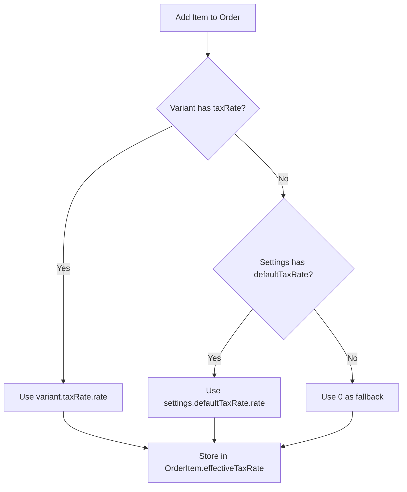

# Frontend Implementation Plan: Variable Tax Rates - Order Context Integration

## Overview

This plan covers integrating dynamic tax rate resolution into the OrderContext, replacing the hardcoded `0.19` tax rate with a proper resolution chain.

---

## Current State

### Hardcoded Tax Rate

Location: [`frontend/contexts/OrderContext.tsx:131`](../../frontend/contexts/OrderContext.tsx:131)

```typescript
const newOrderItem: OrderItem = {
  id: uuidv4(),
  variantId: variant.id,
  productId: product.id,
  name: `${product.name} - ${variant.name}`,
  price: variant.price,
  quantity: 1,
  effectiveTaxRate: 0.19, // HARDCODED - needs to be resolved dynamically
};
```

### Available Contexts

The OrderContext already has access to:
- [`useGlobalDataContext()`](../../frontend/contexts/OrderContext.tsx:39) - provides `appData.settings`
- [`useSessionContext()`](../../frontend/contexts/OrderContext.tsx:38) - provides user session info

---

## Changes Required

### 1. Add Tax Rate Resolution Function

Create a helper function to resolve the effective tax rate:

```typescript
/**
 * Resolve the effective tax rate for a variant.
 * Priority: variant.taxRate > settings.defaultTaxRate > 0
 */
const resolveEffectiveTaxRate = (
  variant: ProductVariant,
  settings: Settings | null
): number => {
  // 1. Check if variant has a specific tax rate
  if (variant.taxRate?.isActive) {
    return parseFloat(variant.taxRate.rate);
  }
  
  // 2. Fall back to default tax rate from settings
  if (settings?.tax?.defaultTaxRate?.isActive) {
    return parseFloat(settings.tax.defaultTaxRate.rate);
  }
  
  // 3. No tax rate configured - return 0
  return 0;
};
```

### 2. Update handleAddToCart Function

Modify [`handleAddToCart`](../../frontend/contexts/OrderContext.tsx:119) to use the resolution function:

```typescript
const handleAddToCart = (variant: ProductVariant, product: Product) => {
  const existingItem = orderItems.find(item => item.variantId === variant.id);
  if (existingItem) {
    handleUpdateQuantity(existingItem.id, existingItem.quantity + 1);
  } else {
    // Resolve tax rate at order creation time
    const effectiveTaxRate = resolveEffectiveTaxRate(variant, appData.settings);
    
    const newOrderItem: OrderItem = {
      id: uuidv4(),
      variantId: variant.id,
      productId: product.id,
      name: `${product.name} - ${variant.name}`,
      price: variant.price,
      quantity: 1,
      effectiveTaxRate, // Now dynamically resolved
    };
    
    // Ensure the name is not empty or undefined
    if (!newOrderItem.name || newOrderItem.name.trim() === '') {
      newOrderItem.name = t('orderContext.itemFallbackName', { variantId: newOrderItem.variantId });
    }
    setOrderItems([...orderItems, newOrderItem]);
  }
};
```

---

## Tax Rate Resolution Chain



---

## Settings Availability Check

### Current Settings Fetch

Settings are fetched in [`GlobalDataContext`](../../frontend/contexts/GlobalDataContext.tsx:105):

```typescript
const [/* ... */, settings, /* ... */] = await Promise.all([
  api.getProducts(),
  api.getCategories(),
  api.getUsers(),
  api.getTills(),
  api.getSettings(),  // Settings are loaded here
  // ...
]);
```

### Required: Ensure defaultTaxRate is Included

The backend must include `defaultTaxRate` in the settings response. Check [`backend/handlers/settings.ts`](../../backend/src/handlers/settings.ts) to ensure the response includes:

```json
{
  "tax": {
    "mode": "inclusive",
    "defaultTaxRateId": 1,
    "defaultTaxRate": {
      "id": 1,
      "name": "Standard Rate",
      "rate": "0.19",
      "ratePercent": "19.00%",
      "isActive": true
    }
  },
  "businessDay": { ... }
}
```

---

## Order Item Structure

### Current Structure

```typescript
export interface OrderItem {
  id: string;
  variantId: number;
  productId: number;
  name: string;
  price: number;
  quantity: number;
  effectiveTaxRate: number;  // Already exists - just needs proper value
}
```

### Key Design Decision: Store Resolved Rate

The `effectiveTaxRate` should store the **resolved decimal value** (e.g., `0.19`), not a reference to a tax rate ID.

**Rationale:**
1. **Historical Accuracy** - If tax rates change in the future, historical orders retain their original tax rate
2. **Simplicity** - No need to join with tax rate tables when displaying historical data
3. **Audit Trail** - The exact tax rate applied at the time of order is preserved

---

## Implementation Steps

### Step 1: Add Resolution Function

Add the `resolveEffectiveTaxRate` function inside the `OrderProvider` component, before `handleAddToCart`.

### Step 2: Update handleAddToCart

Replace the hardcoded `0.19` with the resolved rate.

### Step 3: Verify Settings Include defaultTaxRate

Ensure the backend settings handler includes the related `defaultTaxRate` object.

---

## Edge Cases to Handle

| Scenario | Resolution |
|----------|------------|
| Variant has `taxRateId` but `taxRate` is null | Fall back to default (API should include taxRate via include) |
| `taxRate.isActive` is false | Fall back to default |
| No default tax rate configured | Use `0` as fallback |
| Settings not yet loaded | The `isLoading` state should prevent adding items |

---

## Testing Checklist

- [ ] Add item with variant-specific tax rate → uses variant rate
- [ ] Add item without variant tax rate → uses default rate
- [ ] Add item when no default rate configured → uses 0
- [ ] Verify stored `effectiveTaxRate` matches expected value
- [ ] Verify historical orders retain original tax rates after rate changes

---

## Summary of Changes

| File | Change |
|------|--------|
| [`OrderContext.tsx`](../../frontend/contexts/OrderContext.tsx) | Add `resolveEffectiveTaxRate` function, update `handleAddToCart` |
| [`settings.ts`](../../backend/src/handlers/settings.ts) (Backend) | Ensure `defaultTaxRate` is included in response |

---

## Next Steps

1. **Part 6**: Transaction processing updates (tax calculation at checkout)
2. **Part 7**: Reporting updates (tax breakdown by rate)
