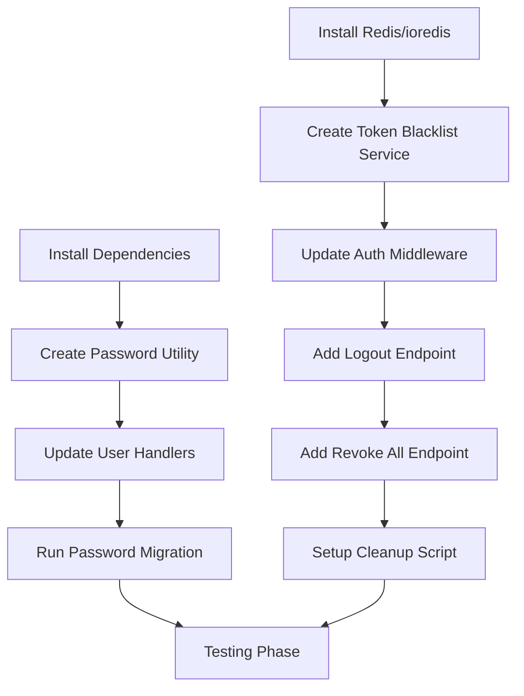

# Critical LAN Security Issues - Implementation Plan

**Document Version**: 1.0  
**Date**: 2026-02-07  
**Status**: Ready for Implementation  
**Priority**: CRITICAL

---

## Executive Summary

This document provides a detailed implementation plan for addressing two critical security vulnerabilities identified in the TEV2 POS system for LAN deployment:

1. **Weak Password Storage** - Passwords stored in plain text as `password_HACK` without hashing
2. **No Token Revocation Mechanism** - JWT tokens have 24-hour expiration with no revocation capability

These vulnerabilities enable complete system compromise from within the trusted network and must be addressed immediately. The implementation plan includes step-by-step instructions, code changes, testing procedures, and rollback strategies.

---

## Table of Contents

1. [Critical Issue 1: Weak Password Storage](#critical-issue-1-weak-password-storage)
2. [Critical Issue 2: No Token Revocation Mechanism](#critical-issue-2-no-token-revocation-mechanism)
3. [Implementation Dependencies](#implementation-dependencies)
4. [Testing Plan](#testing-plan)
5. [Rollback Plan](#rollback-plan)
6. [Timeline](#timeline)

---

## Critical Issue 1: Weak Password Storage

### Technical Description

**Location**: [`backend/src/handlers/users.ts:58`](../backend/src/handlers/users.ts:58)  
**Severity**: CRITICAL  
**Risk Level**: HIGH

Passwords are stored directly in the PostgreSQL database as plain text in the `password_HACK` field. This violates fundamental security principles and exposes all user credentials to anyone with database access.

### Current Vulnerable Code

```typescript
// backend/src/handlers/users.ts:54-60
const user = await prisma.user.create({
  data: {
    name,
    username,
    password_HACK,  // Plain text storage
    role
  }
});
```

```typescript
// backend/src/handlers/users.ts:118-123
const user = await prisma.user.findUnique({
  where: {
    username,
    password_HACK: password  // Plain text comparison
  }
});
```

### Security Impact

| Impact Category | Description |
|-----------------|-------------|
| **Insider Threat** | Employees with database access can read all passwords |
| **Database Compromise** | Any vulnerability exposing the database reveals all credentials |
| **Password Reuse** | Users may reuse passwords across systems, leading to external compromises |
| **Compliance** | Violates GDPR Article 32 and PCI-DSS Requirement 8 |
| **Backup Exposure** | Database backups contain plain text passwords |

### Affected Components

- [`backend/src/handlers/users.ts`](../backend/src/handlers/users.ts) - User creation, update, and login handlers
- [`backend/prisma/schema.prisma`](../backend/prisma/schema.prisma) - User model definition
- [`backend/src/types.ts`](../backend/src/types.ts) - User type definition
- PostgreSQL database - `users` table

---

### Implementation Strategy

#### Step 1: Install Required Dependencies

```bash
cd backend
npm install bcrypt @types/bcrypt
```

**Dependencies to Add**:
- `bcrypt` - Password hashing library
- `@types/bcrypt` - TypeScript type definitions

#### Step 2: Create Password Utility Module

Create new file: [`backend/src/utils/password.ts`](../backend/src/utils/password.ts)

```typescript
import bcrypt from 'bcrypt';

const SALT_ROUNDS = 12;

/**
 * Hash a plain text password using bcrypt
 * @param password - Plain text password
 * @returns Hashed password
 */
export async function hashPassword(password: string): Promise<string> {
  return bcrypt.hash(password, SALT_ROUNDS);
}

/**
 * Verify a plain text password against a hashed password
 * @param password - Plain text password to verify
 * @param hashedPassword - Hashed password to compare against
 * @returns True if password matches, false otherwise
 */
export async function verifyPassword(
  password: string,
  hashedPassword: string
): Promise<boolean> {
  return bcrypt.compare(password, hashedPassword);
}

/**
 * Generate a secure random password
 * @param length - Length of the password (default: 16)
 * @returns Secure random password
 */
export function generateSecurePassword(length: number = 16): string {
  const charset = 'abcdefghijklmnopqrstuvwxyzABCDEFGHIJKLMNOPQRSTUVWXYZ0123456789!@#$%^&*';
  const randomValues = new Uint32Array(length);
  crypto.getRandomValues(randomValues);
  
  let password = '';
  for (let i = 0; i < length; i++) {
    password += charset[randomValues[i] % charset.length];
  }
  
  return password;
}
```

#### Step 3: Update User Creation Handler

Modify: [`backend/src/handlers/users.ts`](../backend/src/handlers/users.ts)

```typescript
// Add import at top of file
import { hashPassword } from '../utils/password';

// POST /api/users - Create a new user (lines 40-68)
usersRouter.post('/', async (req: Request, res: Response) => {
  try {
    const { name, username, password, role } = req.body as Omit<User, 'id'>;
    
    // Validate required fields
    if (!name || !username || !password || !role) {
      return res.status(400).json({ error: 'Name, username, password, and role are required' });
    }
    
    // Validate password strength
    if (password.length < 8) {
      return res.status(400).json({ error: 'Password must be at least 8 characters long' });
    }
    
    // Check if username already exists
    const existingUser = await prisma.user.findUnique({
      where: { username }
    });
    
    if (existingUser) {
      return res.status(409).json({ error: 'Username already exists' });
    }
    
    // Hash the password before storing
    const hashedPassword = await hashPassword(password);
    
    const user = await prisma.user.create({
      data: {
        name,
        username,
        password_HACK: hashedPassword,  // Store hashed password
        role
      }
    });
    
    // Return user without password field
    const { password_HACK, ...userResponse } = user;
    res.status(201).json(userResponse);
  } catch (error) {
    console.error('Error creating user:', error);
    res.status(500).json({ error: 'Failed to create user' });
  }
});
```

#### Step 4: Update User Update Handler

Modify: [`backend/src/handlers/users.ts`](../backend/src/handlers/users.ts)

```typescript
// Add import at top of file
import { hashPassword } from '../utils/password';

// PUT /api/users/:id - Update a user (lines 70-91)
usersRouter.put('/:id', async (req: Request, res: Response) => {
  try {
    const { id } = req.params;
    const { name, username, password, role } = req.body as Omit<User, 'id'>;
    
    // Build update data object
    const updateData: any = {};
    
    if (name !== undefined) updateData.name = name;
    if (username !== undefined) updateData.username = username;
    if (role !== undefined) updateData.role = role;
    
    // Hash password if provided
    if (password !== undefined) {
      if (password.length < 8) {
        return res.status(400).json({ error: 'Password must be at least 8 characters long' });
      }
      updateData.password_HACK = await hashPassword(password);
    }
    
    const user = await prisma.user.update({
      where: { id: Number(id) },
      data: updateData
    });
    
    // Return user without password field
    const { password_HACK, ...userResponse } = user;
    res.json(userResponse);
  } catch (error) {
    console.error('Error updating user:', error);
    res.status(500).json({ error: 'Failed to update user' });
  }
});
```

#### Step 5: Update Login Handler

Modify: [`backend/src/handlers/users.ts`](../backend/src/handlers/users.ts)

```typescript
// Add import at top of file
import { verifyPassword } from '../utils/password';

// POST /api/users/login - Login endpoint (lines 109-150)
usersRouter.post('/login', async (req: Request, res: Response) => {
  try {
    const { username, password } = req.body;
    
    if (!username || !password) {
      return res.status(400).json({ error: 'Username and password are required' });
    }
    
    // Find user by username only (not password)
    const user = await prisma.user.findUnique({
      where: { username }
    });
    
    if (!user) {
      return res.status(401).json({ error: 'Invalid credentials' });
    }
    
    // Verify password using bcrypt
    const isPasswordValid = await verifyPassword(password, user.password_HACK);
    
    if (!isPasswordValid) {
      return res.status(401).json({ error: 'Invalid credentials' });
    }
    
    // Generate JWT token
    const secret = new TextEncoder().encode(JWT_SECRET);
    const token = await new SignJWT({
      id: user.id,
      username: user.username,
      role: user.role
    })
      .setProtectedHeader({ alg: 'HS256' })
      .setIssuedAt()
      .setExpirationTime('24h')
      .sign(secret);
    
    // Return user data with token (excluding password)
    const { password_HACK, ...userResponse } = user;
    res.json({
      ...userResponse,
      token
    });
  } catch (error) {
    console.error('Error during login:', error);
    res.status(500).json({ error: 'Login failed due to server error. Please try again later.' });
  }
});
```

#### Step 6: Update GET Users Endpoints

Modify: [`backend/src/handlers/users.ts`](../backend/src/handlers/users.ts)

```typescript
// GET /api/users - Get all users (lines 10-19)
usersRouter.get('/', async (req: Request, res: Response) => {
  try {
    const users = await prisma.user.findMany();
    
    // Remove password field from all users
    const usersWithoutPasswords = users.map(user => {
      const { password_HACK, ...userWithoutPassword } = user;
      return userWithoutPassword;
    });
    
    res.json(usersWithoutPasswords);
  } catch (error) {
    console.error('Error fetching users:', error);
    res.status(500).json({ error: 'Failed to fetch users' });
  }
});

// GET /api/users/:id - Get a specific user (lines 21-38)
usersRouter.get('/:id', async (req: Request, res: Response) => {
  try {
    const { id } = req.params;
    const user = await prisma.user.findUnique({
      where: { id: Number(id) }
    });
    
    if (!user) {
      return res.status(404).json({ error: 'User not found' });
    }
    
    // Remove password field from response
    const { password_HACK, ...userWithoutPassword } = user;
    res.json(userWithoutPassword);
  } catch (error) {
    console.error('Error fetching user:', error);
    res.status(500).json({ error: 'Failed to fetch user' });
  }
});
```

#### Step 7: Create Migration Script for Existing Passwords

Create new file: [`backend/src/scripts/migratePasswords.ts`](../backend/src/scripts/migratePasswords.ts)

```typescript
import { prisma } from '../prisma';
import { hashPassword } from '../utils/password';

/**
 * Migration script to hash existing plain text passwords
 * Run this after deploying the password hashing changes
 */
async function migratePasswords() {
  console.log('Starting password migration...');
  
  try {
    // Get all users
    const users = await prisma.user.findMany();
    console.log(`Found ${users.length} users to migrate`);
    
    let migratedCount = 0;
    let skippedCount = 0;
    
    for (const user of users) {
      // Check if password is already hashed (bcrypt hashes start with $2b$ or $2a$)
      if (user.password_HACK.startsWith('$2')) {
        console.log(`Skipping user ${user.username} - password already hashed`);
        skippedCount++;
        continue;
      }
      
      // Hash the plain text password
      const hashedPassword = await hashPassword(user.password_HACK);
      
      // Update user with hashed password
      await prisma.user.update({
        where: { id: user.id },
        data: { password_HACK: hashedPassword }
      });
      
      console.log(`Migrated password for user: ${user.username}`);
      migratedCount++;
    }
    
    console.log(`\nMigration complete!`);
    console.log(`- Migrated: ${migratedCount} users`);
    console.log(`- Skipped: ${skippedCount} users`);
  } catch (error) {
    console.error('Error during password migration:', error);
    process.exit(1);
  } finally {
    await prisma.$disconnect();
  }
}

// Run migration
migratePasswords();
```

#### Step 8: Update Package.json Scripts

Modify: [`backend/package.json`](../backend/package.json)

```json
{
  "scripts": {
    "dev": "tsx watch src/index.ts",
    "build": "tsc",
    "start": "node dist/index.js",
    "migrate": "prisma migrate dev",
    "db:seed": "tsx prisma/seed.ts",
    "db:reset": "prisma migrate reset",
    "migrate:passwords": "tsx src/scripts/migratePasswords.ts",
    "test": "jest",
    "test:watch": "jest --watch",
    "test:coverage": "jest --coverage"
  }
}
```

#### Step 9: Update Types

Modify: [`backend/src/types.ts`](../backend/src/types.ts)

```typescript
// Update User interface (lines 57-63)
export interface User {
  id: number;
  name: string;
  username: string;
  password_HACK: string;  // This field should never be exposed in API responses
  role: 'Admin' | 'Cashier';
}

// Add UserResponseDTO for API responses
export interface UserResponseDTO {
  id: number;
  name: string;
  username: string;
  role: 'Admin' | 'Cashier';
}
```

---

## Critical Issue 2: No Token Revocation Mechanism

### Technical Description

**Location**: [`backend/src/handlers/users.ts:138`](../backend/src/handlers/users.ts:138)  
**Severity**: CRITICAL  
**Risk Level**: HIGH

JWT tokens have a 24-hour expiration with no mechanism to revoke tokens for logged-out or compromised accounts. This means stolen devices, compromised sessions, or departing employees retain access for the full token lifetime.

### Current Vulnerable Code

```typescript
// backend/src/handlers/users.ts:129-139
const token = await new SignJWT({
  id: user.id,
  username: user.username,
  role: user.role
})
  .setProtectedHeader({ alg: 'HS256' })
  .setIssuedAt()
  .setExpirationTime('24h')  // No revocation mechanism
  .sign(secret);
```

### Security Impact

| Impact Category | Description |
|-----------------|-------------|
| **Stolen Devices** | Compromised POS terminals retain 24-hour access |
| **Employee Termination** | Cannot immediately revoke departing employee sessions |
| **Session Hijacking** | Compromised sessions remain valid until expiration |
| **Physical Theft** | Stolen tablets continue to have admin access |
| **Unattended Terminals** | Unauthorized access persists for 24 hours |

### Affected Components

- [`backend/src/handlers/users.ts`](../backend/src/handlers/users.ts) - Login endpoint
- [`backend/src/middleware/auth.ts`](../backend/src/middleware/auth.ts) - Authentication middleware
- All authenticated endpoints - All routes using `authenticateToken` middleware

---

### Implementation Strategy

#### Step 1: Install Required Dependencies

```bash
cd backend
npm install ioredis @types/ioredis
```

**Dependencies to Add**:
- `ioredis` - Redis client for token blacklist
- `@types/ioredis` - TypeScript type definitions

**Alternative**: If Redis is not available, use PostgreSQL for token blacklist (see Step 1b)

#### Step 1b: Alternative - PostgreSQL Token Blacklist

If Redis is not available, create a database table for token blacklist:

Create migration file: [`backend/prisma/migrations/XXXXXX_add_token_blacklist/migration.sql`](../backend/prisma/migrations/XXXXXX_add_token_blacklist/migration.sql)

```sql
-- Create token blacklist table
CREATE TABLE "token_blacklist" (
  "id" SERIAL PRIMARY KEY,
  "token" TEXT NOT NULL UNIQUE,
  "user_id" INTEGER NOT NULL,
  "revoked_at" TIMESTAMP NOT NULL DEFAULT NOW(),
  "expires_at" TIMESTAMP NOT NULL,
  "reason" TEXT,
  "created_at" TIMESTAMP NOT NULL DEFAULT NOW()
);

-- Create index for faster lookups
CREATE INDEX "idx_token_blacklist_token" ON "token_blacklist"("token");
CREATE INDEX "idx_token_blacklist_user_id" ON "token_blacklist"("user_id");
CREATE INDEX "idx_token_blacklist_expires_at" ON "token_blacklist"("expires_at");

-- Create index for cleanup
CREATE INDEX "idx_token_blacklist_cleanup" ON "token_blacklist"("expires_at") WHERE "expires_at" < NOW();
```

Update [`backend/prisma/schema.prisma`](../backend/prisma/schema.prisma):

```prisma
model TokenBlacklist {
  id        Int      @id @default(autoincrement())
  token     String   @unique
  userId    Int      @map("user_id")
  revokedAt DateTime @default(now()) @map("revoked_at")
  expiresAt DateTime @map("expires_at")
  reason    String?
  createdAt DateTime @default(now()) @map("created_at")
  user      User     @relation(fields: [userId], references: [id], onDelete: Cascade)

  @@index([token])
  @@index([userId])
  @@index([expiresAt])
  @@map("token_blacklist")
}

// Update User model to include relation
model User {
  id                Int                @id @default(autoincrement())
  name              String
  username          String             @unique
  password_HACK     String
  role              String
  dailyClosings     DailyClosing[]
  orderActivityLogs OrderActivityLog[]
  orderSessions     OrderSession[]
  stockAdjustments  StockAdjustment[]
  transactions      Transaction[]
  tables            Table[]
  variantLayouts    VariantLayout[]
  sharedLayouts     SharedLayout[]
  tokenBlacklist    TokenBlacklist[]   // Add this relation

  @@map("users")
}
```

#### Step 2: Create Token Blacklist Service

Create new file: [`backend/src/services/tokenBlacklistService.ts`](../backend/src/services/tokenBlacklistService.ts)

```typescript
import { prisma } from '../prisma';

/**
 * Token Blacklist Service
 * Manages revoked JWT tokens using PostgreSQL
 */

interface BlacklistedToken {
  id: number;
  token: string;
  userId: number;
  revokedAt: Date;
  expiresAt: Date;
  reason?: string;
}

/**
 * Add a token to the blacklist
 * @param token - JWT token to blacklist
 * @param userId - User ID associated with the token
 * @param expiresAt - Token expiration time
 * @param reason - Optional reason for revocation
 */
export async function addToBlacklist(
  token: string,
  userId: number,
  expiresAt: Date,
  reason?: string
): Promise<void> {
  try {
    await prisma.tokenBlacklist.create({
      data: {
        token,
        userId,
        expiresAt,
        reason
      }
    });
  } catch (error) {
    // Handle duplicate token errors gracefully
    if (error instanceof Error && error.message.includes('Unique constraint')) {
      // Token already blacklisted, ignore
      return;
    }
    throw error;
  }
}

/**
 * Check if a token is blacklisted
 * @param token - JWT token to check
 * @returns True if token is blacklisted, false otherwise
 */
export async function isTokenBlacklisted(token: string): Promise<boolean> {
  const blacklistedToken = await prisma.tokenBlacklist.findUnique({
    where: { token }
  });
  
  return blacklistedToken !== null;
}

/**
 * Remove all tokens for a specific user from the blacklist
 * @param userId - User ID
 */
export async function revokeAllUserTokens(userId: number): Promise<void> {
  await prisma.tokenBlacklist.deleteMany({
    where: { userId }
  });
}

/**
 * Clean up expired tokens from the blacklist
 * Should be run periodically (e.g., via cron job)
 */
export async function cleanupExpiredTokens(): Promise<number> {
  const result = await prisma.tokenBlacklist.deleteMany({
    where: {
      expiresAt: {
        lt: new Date()
      }
    }
  });
  
  return result.count;
}

/**
 * Get all blacklisted tokens for a user
 * @param userId - User ID
 * @returns Array of blacklisted tokens
 */
export async function getUserBlacklistedTokens(userId: number): Promise<BlacklistedToken[]> {
  return prisma.tokenBlacklist.findMany({
    where: { userId },
    orderBy: { revokedAt: 'desc' }
  });
}
```

#### Step 3: Update Authentication Middleware

Modify: [`backend/src/middleware/auth.ts`](../backend/src/middleware/auth.ts)

```typescript
import { Request, Response, NextFunction } from 'express';
import { jwtVerify } from 'jose';
import { isTokenBlacklisted } from '../services/tokenBlacklistService';
import '../types'; // Import types to extend Express Request interface

const JWT_SECRET = process.env.JWT_SECRET || 'your-secret-key-for-development-only';

export interface TokenPayload {
  id: number;
  username: string;
  role: string;
}

export const authenticateToken = async (req: Request, res: Response, next: NextFunction) => {
  try {
    // Extract token from Authorization header (Bearer token format)
    const authHeader = req.headers.authorization;
    
    if (!authHeader || !authHeader.startsWith('Bearer ')) {
      return res.status(401).json({ error: 'Access denied. No token provided.' });
    }

    const token = authHeader.substring(7); // Remove 'Bearer ' prefix

    if (!token) {
      return res.status(401).json({ error: 'Access denied. No token provided.' });
    }

    // Check if token is blacklisted
    const blacklisted = await isTokenBlacklisted(token);
    if (blacklisted) {
      return res.status(401).json({ error: 'Token has been revoked. Please login again.' });
    }

    // Verify the token using jose library
    const secret = new TextEncoder().encode(JWT_SECRET);
    const { payload } = await jwtVerify(token, secret);

    // Attach decoded user info to req.user
    req.user = {
      id: payload.id as number,
      username: payload.username as string,
      role: payload.role as string
    };

    next();
  } catch (error) {
    // Return 403 if token is invalid or expired
    return res.status(403).json({ error: 'Invalid or expired token.' });
  }
};
```

#### Step 4: Add Logout Endpoint

Modify: [`backend/src/handlers/users.ts`](../backend/src/handlers/users.ts)

```typescript
// Add import at top of file
import { addToBlacklist } from '../services/tokenBlacklistService';
import { authenticateToken, TokenPayload } from '../middleware/auth';

// POST /api/users/logout - Logout endpoint (add after login endpoint)
usersRouter.post('/logout', authenticateToken, async (req: Request, res: Response) => {
  try {
    // Extract token from Authorization header
    const authHeader = req.headers.authorization;
    
    if (!authHeader || !authHeader.startsWith('Bearer ')) {
      return res.status(400).json({ error: 'No token provided' });
    }

    const token = authHeader.substring(7);
    
    // Get user info from request (attached by authenticateToken middleware)
    const user = req.user as TokenPayload;
    
    // Calculate token expiration (24 hours from now, matching JWT expiration)
    const expiresAt = new Date(Date.now() + 24 * 60 * 60 * 1000);
    
    // Add token to blacklist
    await addToBlacklist(token, user.id, expiresAt, 'User logout');
    
    res.json({ success: true, message: 'Logged out successfully' });
  } catch (error) {
    console.error('Error during logout:', error);
    res.status(500).json({ error: 'Logout failed due to server error' });
  }
});
```

#### Step 5: Add Revoke All Tokens Endpoint (Admin Only)

Modify: [`backend/src/handlers/users.ts`](../backend/src/handlers/users.ts)

```typescript
// Add import at top of file
import { revokeAllUserTokens } from '../services/tokenBlacklistService';
import { authenticateToken, TokenPayload } from '../middleware/auth';

// POST /api/users/:id/revoke-all - Revoke all tokens for a user (admin only)
usersRouter.post('/:id/revoke-all', authenticateToken, async (req: Request, res: Response) => {
  try {
    const { id } = req.params;
    const user = req.user as TokenPayload;
    
    // Only admins can revoke other users' tokens
    if (user.role !== 'Admin') {
      return res.status(403).json({ error: 'Access denied. Admin privileges required.' });
    }
    
    // Revoke all tokens for the specified user
    await revokeAllUserTokens(Number(id));
    
    res.json({ success: true, message: 'All tokens revoked successfully' });
  } catch (error) {
    console.error('Error revoking tokens:', error);
    res.status(500).json({ error: 'Failed to revoke tokens' });
  }
});
```

#### Step 6: Add Token Cleanup Script

Create new file: [`backend/src/scripts/cleanupExpiredTokens.ts`](../backend/src/scripts/cleanupExpiredTokens.ts)

```typescript
import { cleanupExpiredTokens } from '../services/tokenBlacklistService';

/**
 * Cleanup script to remove expired tokens from the blacklist
 * Run this periodically (e.g., via cron job or scheduled task)
 */
async function runCleanup() {
  console.log('Starting token blacklist cleanup...');
  
  try {
    const deletedCount = await cleanupExpiredTokens();
    console.log(`Cleanup complete! Removed ${deletedCount} expired tokens`);
  } catch (error) {
    console.error('Error during token cleanup:', error);
    process.exit(1);
  }
}

// Run cleanup
runCleanup();
```

#### Step 7: Update Package.json Scripts

Modify: [`backend/package.json`](../backend/package.json)

```json
{
  "scripts": {
    "dev": "tsx watch src/index.ts",
    "build": "tsc",
    "start": "node dist/index.js",
    "migrate": "prisma migrate dev",
    "db:seed": "tsx prisma/seed.ts",
    "db:reset": "prisma migrate reset",
    "migrate:passwords": "tsx src/scripts/migratePasswords.ts",
    "cleanup:tokens": "tsx src/scripts/cleanupExpiredTokens.ts",
    "test": "jest",
    "test:watch": "jest --watch",
    "test:coverage": "jest --coverage"
  }
}
```

#### Step 8: Update Docker Compose for Cron Job (Optional)

Modify: [`docker-compose.yml`](../docker-compose.yml) to add a cron job for token cleanup:

```yaml
services:
  backend:
    # ... existing configuration ...
    
  # Add token cleanup service
  token-cleanup:
    build:
      context: ./backend
      dockerfile: Dockerfile
    container_name: bar_pos_token_cleanup
    environment:
      DATABASE_URL: "postgresql://${POSTGRES_USER:-totalevo_user}:${POSTGRES_PASSWORD:-totalevo_password}@db:5432/${POSTGRES_DB:-bar_pos}"
      NODE_ENV: ${NODE_ENV:-development}
    depends_on:
      db:
        condition: service_healthy
    restart: unless-stopped
    networks:
      - pos_network
    command: >
      sh -c "while true; do npm run cleanup:tokens; sleep 3600; done"
```

---

## Implementation Dependencies

### Dependency Graph



### Prerequisites

1. **Database Access**: Must have access to PostgreSQL database
2. **Backup**: Create database backup before running password migration
3. **Environment Variables**: Ensure `JWT_SECRET` is properly configured
4. **Testing Environment**: Have a test environment to validate changes

### Order of Implementation

1. **Phase 1**: Password hashing (Issue 1)
   - Install bcrypt
   - Create password utility
   - Update user handlers
   - Run password migration

2. **Phase 2**: Token revocation (Issue 2)
   - Install ioredis (or use PostgreSQL)
   - Create token blacklist service
   - Update auth middleware
   - Add logout endpoint
   - Setup cleanup script

3. **Phase 3**: Testing and validation
   - Test password hashing
   - Test token revocation
   - Test logout functionality
   - Performance testing

---

## Testing Plan

### Test Environment Setup

1. Create a test database
2. Seed with test users
3. Configure test environment variables

### Password Hashing Tests

#### Test 1: User Creation with Hashed Password

```typescript
// Test file: backend/src/__tests__/passwordHashing.test.ts
describe('Password Hashing', () => {
  test('should hash password when creating user', async () => {
    const response = await request(app)
      .post('/api/users')
      .send({
        name: 'Test User',
        username: 'testuser',
        password: 'TestPassword123!',
        role: 'Cashier'
      });
    
    expect(response.status).toBe(201);
    expect(response.body.password_HACK).toBeUndefined();
    
    // Verify password is hashed in database
    const user = await prisma.user.findUnique({
      where: { username: 'testuser' }
    });
    
    expect(user?.password_HACK).toMatch(/^\$2[aby]\$/);
  });
});
```

#### Test 2: Login with Hashed Password

```typescript
test('should authenticate with hashed password', async () => {
  const response = await request(app)
    .post('/api/users/login')
    .send({
      username: 'testuser',
      password: 'TestPassword123!'
    });
  
  expect(response.status).toBe(200);
  expect(response.body.token).toBeDefined();
  expect(response.body.password_HACK).toBeUndefined();
});
```

#### Test 3: Password Migration

```typescript
test('should migrate existing plain text passwords', async () => {
  // Create user with plain text password
  await prisma.user.create({
    data: {
      name: 'Legacy User',
      username: 'legacyuser',
      password_HACK: 'PlainPassword123',
      role: 'Cashier'
    }
  });
  
  // Run migration
  await migratePasswords();
  
  // Verify password is hashed
  const user = await prisma.user.findUnique({
    where: { username: 'legacyuser' }
  });
  
  expect(user?.password_HACK).toMatch(/^\$2[aby]\$/);
  
  // Verify login still works
  const response = await request(app)
    .post('/api/users/login')
    .send({
      username: 'legacyuser',
      password: 'PlainPassword123'
    });
  
  expect(response.status).toBe(200);
});
```

### Token Revocation Tests

#### Test 1: Logout and Token Blacklisting

```typescript
describe('Token Revocation', () => {
  test('should blacklist token on logout', async () => {
    // Login to get token
    const loginResponse = await request(app)
      .post('/api/users/login')
      .send({
        username: 'testuser',
        password: 'TestPassword123!'
      });
    
    const token = loginResponse.body.token;
    
    // Logout
    const logoutResponse = await request(app)
      .post('/api/users/logout')
      .set('Authorization', `Bearer ${token}`);
    
    expect(logoutResponse.status).toBe(200);
    
    // Try to use token after logout
    const protectedResponse = await request(app)
      .get('/api/users')
      .set('Authorization', `Bearer ${token}`);
    
    expect(protectedResponse.status).toBe(401);
    expect(protectedResponse.body.error).toContain('revoked');
  });
});
```

#### Test 2: Admin Revoke All Tokens

```typescript
test('should allow admin to revoke all user tokens', async () => {
  // Login as admin
  const adminResponse = await request(app)
    .post('/api/users/login')
    .send({
      username: 'admin',
      password: 'admin123'
    });
  
  const adminToken = adminResponse.body.token;
  
  // Revoke all tokens for user
  const revokeResponse = await request(app)
    .post('/api/users/2/revoke-all')
    .set('Authorization', `Bearer ${adminToken}`);
  
  expect(revokeResponse.status).toBe(200);
});
```

#### Test 3: Token Cleanup

```typescript
test('should cleanup expired tokens', async () => {
  // Add expired token to blacklist
  await addToBlacklist(
    'expired_token',
    1,
    new Date(Date.now() - 1000), // Already expired
    'Test'
  );
  
  // Run cleanup
  const deletedCount = await cleanupExpiredTokens();
  
  expect(deletedCount).toBeGreaterThan(0);
});
```

### Integration Tests

#### Test 1: Complete Authentication Flow

```typescript
describe('Complete Authentication Flow', () => {
  test('should handle complete user lifecycle', async () => {
    // 1. Create user
    const createResponse = await request(app)
      .post('/api/users')
      .send({
        name: 'Integration User',
        username: 'integrationuser',
        password: 'IntegrationPassword123!',
        role: 'Cashier'
      });
    
    expect(createResponse.status).toBe(201);
    
    // 2. Login
    const loginResponse = await request(app)
      .post('/api/users/login')
      .send({
        username: 'integrationuser',
        password: 'IntegrationPassword123!'
      });
    
    expect(loginResponse.status).toBe(200);
    const token = loginResponse.body.token;
    
    // 3. Access protected endpoint
    const protectedResponse = await request(app)
      .get('/api/users')
      .set('Authorization', `Bearer ${token}`);
    
    expect(protectedResponse.status).toBe(200);
    
    // 4. Logout
    const logoutResponse = await request(app)
      .post('/api/users/logout')
      .set('Authorization', `Bearer ${token}`);
    
    expect(logoutResponse.status).toBe(200);
    
    // 5. Verify token is revoked
    const afterLogoutResponse = await request(app)
      .get('/api/users')
      .set('Authorization', `Bearer ${token}`);
    
    expect(afterLogoutResponse.status).toBe(401);
  });
});
```

### Manual Testing Checklist

- [ ] Create new user and verify password is hashed in database
- [ ] Login with correct credentials and receive JWT token
- [ ] Login with incorrect credentials and receive 401 error
- [ ] Access protected endpoint with valid token
- [ ] Access protected endpoint with invalid token
- [ ] Logout and verify token is blacklisted
- [ ] Try to use blacklisted token and receive 401 error
- [ ] Admin revokes all tokens for a user
- [ ] Verify revoked tokens no longer work
- [ ] Run token cleanup script and verify expired tokens are removed
- [ ] Verify password migration script works correctly
- [ ] Verify existing users can still login after migration

---

## Rollback Plan

### Pre-Rollback Prerequisites

1. **Database Backup**: Ensure a recent database backup exists
2. **Code Backup**: Keep a copy of the original code
3. **Test Rollback**: Test rollback procedure in staging environment

### Rollback Procedure for Password Hashing

#### Step 1: Stop Application

```bash
docker compose down
```

#### Step 2: Restore Database Backup

```bash
# If using PostgreSQL backup
docker exec -i bar_pos_backend_db pg_restore -U totalevo_user -d bar_pos < backup.sql

# Or if using volume backup
docker compose down
docker volume rm tev2_postgres_data
docker volume create --name tev2_postgres_data
# Restore from backup
```

#### Step 3: Revert Code Changes

```bash
git checkout HEAD -- backend/src/handlers/users.ts
git checkout HEAD -- backend/src/utils/password.ts
git checkout HEAD -- backend/src/types.ts
```

#### Step 4: Remove Dependencies

```bash
cd backend
npm uninstall bcrypt @types/bcrypt
```

#### Step 5: Rebuild and Restart

```bash
docker compose up -d --build
```

### Rollback Procedure for Token Revocation

#### Step 1: Stop Application

```bash
docker compose down
```

#### Step 2: Remove Token Blacklist Table

```sql
DROP TABLE IF EXISTS token_blacklist CASCADE;
```

#### Step 3: Revert Code Changes

```bash
git checkout HEAD -- backend/src/middleware/auth.ts
git checkout HEAD -- backend/src/services/tokenBlacklistService.ts
git checkout HEAD -- backend/src/handlers/users.ts
```

#### Step 4: Remove Dependencies

```bash
cd backend
npm uninstall ioredis @types/ioredis
```

#### Step 5: Remove Cron Job Service

Edit [`docker-compose.yml`](../docker-compose.yml) and remove the `token-cleanup` service.

#### Step 6: Rebuild and Restart

```bash
docker compose up -d --build
```

### Rollback Verification

After rollback, verify:

- [ ] Application starts successfully
- [ ] Users can login with existing credentials
- [ ] Protected endpoints are accessible with valid tokens
- [ ] No errors in application logs
- [ ] Database schema matches original state

---

## Timeline

### Phase 1: Password Hashing Implementation

| Task | Duration | Dependencies |
|------|----------|--------------|
| Install bcrypt dependencies | 15 minutes | None |
| Create password utility module | 30 minutes | Dependencies installed |
| Update user creation handler | 30 minutes | Password utility created |
| Update user update handler | 30 minutes | Password utility created |
| Update login handler | 30 minutes | Password utility created |
| Update GET users endpoints | 30 minutes | Password utility created |
| Create password migration script | 45 minutes | All handlers updated |
| Update package.json scripts | 15 minutes | Migration script created |
| Update types | 15 minutes | None |
| **Total Phase 1** | **4 hours** | |

### Phase 2: Token Revocation Implementation

| Task | Duration | Dependencies |
|------|----------|--------------|
| Install ioredis dependencies | 15 minutes | None |
| Create token blacklist service | 1 hour | Dependencies installed |
| Update authentication middleware | 30 minutes | Token service created |
| Add logout endpoint | 30 minutes | Auth middleware updated |
| Add revoke all tokens endpoint | 30 minutes | Logout endpoint created |
| Create token cleanup script | 30 minutes | All endpoints created |
| Update package.json scripts | 15 minutes | Cleanup script created |
| Update Docker Compose (optional) | 30 minutes | Cleanup script created |
| **Total Phase 2** | **4 hours** | |

### Phase 3: Testing and Validation

| Task | Duration | Dependencies |
|------|----------|--------------|
| Create test database | 30 minutes | None |
| Write password hashing tests | 2 hours | Phase 1 complete |
| Write token revocation tests | 2 hours | Phase 2 complete |
| Write integration tests | 2 hours | Phase 1 & 2 complete |
| Run automated tests | 1 hour | All tests written |
| Manual testing | 2 hours | Automated tests passing |
| Performance testing | 1 hour | All tests passing |
| **Total Phase 3** | **10.5 hours** | |

### Phase 4: Deployment

| Task | Duration | Dependencies |
|------|----------|--------------|
| Create database backup | 30 minutes | None |
| Deploy to staging | 1 hour | All phases complete |
| Staging testing | 2 hours | Staging deployed |
| Deploy to production | 1 hour | Staging validated |
| Production verification | 1 hour | Production deployed |
| **Total Phase 4** | **5.5 hours** | |

### Total Implementation Timeline

| Phase | Duration |
|-------|----------|
| Phase 1: Password Hashing | 4 hours |
| Phase 2: Token Revocation | 4 hours |
| Phase 3: Testing and Validation | 10.5 hours |
| Phase 4: Deployment | 5.5 hours |
| **Total** | **24 hours** |

### Recommended Schedule

**Day 1**: Phase 1 - Password Hashing Implementation  
**Day 2**: Phase 2 - Token Revocation Implementation  
**Day 3**: Phase 3 - Testing and Validation  
**Day 4**: Phase 4 - Deployment

---

## Additional Considerations

### Security Best Practices

1. **Password Strength Requirements**
   - Minimum 8 characters
   - Require at least one uppercase letter
   - Require at least one lowercase letter
   - Require at least one number
   - Require at least one special character

2. **Token Lifetime**
   - Consider reducing JWT lifetime from 24 hours to 2-4 hours
   - Implement refresh token mechanism for better security

3. **Rate Limiting**
   - Implement rate limiting on login endpoint to prevent brute force attacks
   - Implement rate limiting on logout endpoint to prevent abuse

4. **Audit Logging**
   - Log all password changes
   - Log all token revocations
   - Log all failed login attempts

### Performance Considerations

1. **Password Hashing**
   - bcrypt with 12 salt rounds provides good security/performance balance
   - Consider using argon2 for even better security (slightly slower)

2. **Token Blacklist**
   - PostgreSQL-based blacklist is sufficient for most use cases
   - Consider Redis for high-traffic applications
   - Implement proper indexing for fast lookups

3. **Cleanup**
   - Run token cleanup at least once per hour
   - Consider running cleanup during low-traffic periods

### Monitoring and Alerts

1. **Monitor**
   - Failed login attempts
   - Token revocation events
   - Password change events
   - Database query performance

2. **Alert On**
   - High rate of failed logins (possible brute force attack)
   - High rate of token revocations (possible security incident)
   - Database performance degradation

---

## Conclusion

This implementation plan provides a comprehensive approach to addressing the two critical security vulnerabilities in the TEV2 POS system:

1. **Weak Password Storage** - Implement bcrypt password hashing with 12 salt rounds
2. **No Token Revocation Mechanism** - Implement token blacklist with logout functionality

The plan includes detailed step-by-step instructions, code examples, testing procedures, and rollback strategies. Following this plan will significantly improve the security posture of the system and protect against insider threats, database compromises, and session hijacking.

### Next Steps

1. Review this implementation plan with the development team
2. Schedule implementation phases
3. Set up staging environment for testing
4. Create database backup before starting implementation
5. Begin with Phase 1: Password Hashing Implementation

### Contact

For questions or clarifications about this implementation plan, please contact the security team.

---

**Document End**
